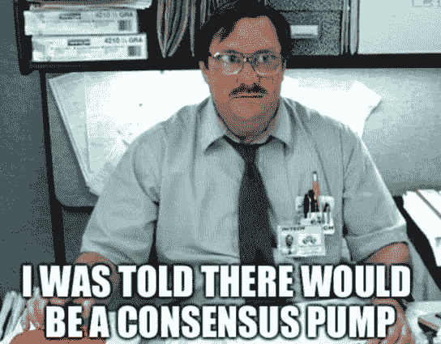
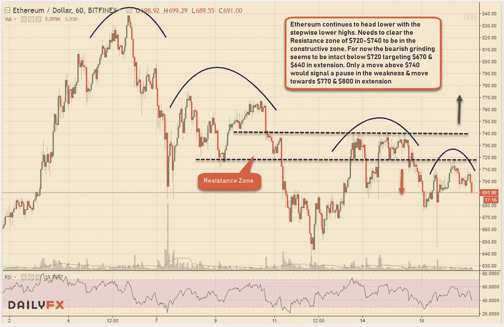

# 不可预测的密码和投机交易者

> 原文：<https://medium.datadriveninvestor.com/unpredictable-cryptos-speculative-traders-c4cee32c97ca?source=collection_archive---------10----------------------->

尽管大多数投资者仍在他们的最佳投机水平上期待着一次大的反弹，但在最近的下跌中，投机者们还是经受住了他们的不可预测性。当涉及到交易密码时，理性就消失了！至少对大多数密码交易员来说。

自诞生以来，数字硬币就以其波动性而闻名，但自从密码从历史高点回落后，价格波动有所放缓&人们的兴趣也有所减弱。尽管如此，活跃的交易者仍然在奇怪的头条新闻上运行密码&疯狂的预测，而不是基于价格运动的任何技术基础。

我想提几个事件来说明我的观点。第一个是几天前发生的比特币现金分叉，几乎所有交易 **BCH** 的人都预计它会大幅飙升，但结果令人失望，因为它实际上与其他替代硬币一起进一步下跌

第二个是备受吹捧的**纽约加密会议**，该会议本应大幅提升数字硬币，但实际上却适得其反&比特币比会议前水平下跌了 10%&替代硬币也是如此。像 Fundstrat 的 Tom Lee 这样的人，他准确预测了美国税收日之后的加密价格上涨，并在加密事件后利用过去的价格飙升预测了一次“甚至比过去几年更大”的反弹但这也是为什么它被称为预测！

我对价格预测场景的争论是，大多数 Cryptos 在这里的时间还不够长，不足以对过去的此类事件进行任何历史价格比较。只有比特币和莱特币分别在 2009 年和 2011 年出现，这不是一个足够大的时间框架来进行这样的比较。

Tweeted by Bloomberg Crypto

在最近结束的纽约共识会议之后，Cryptos 公司令人失望的价格行动之后，彭博 Crypto 在推特上发布了一条比较轻松的消息。不幸的是，即使不是所有人，这种情绪也是大多数密码交易者共有的。

另一方面，像我这样的技术交易者坚持做更无聊的工作，阅读价格图表上的技术水平来预测下一步的走势。下面举个例子，今天以太坊的小时图。现在你是法官，如果你想基于疯狂的假设交易密码，或者只是按照图表指示的价格行动。

对加密货币、金融科技行业、突破性技术感兴趣或正在寻找加密货币、外汇或股票交易思路的人—关注我[**Twitter**](https://twitter.com/trade_nut)&[**StockTwits**](https://stocktwits.com/trade_nut)**。**