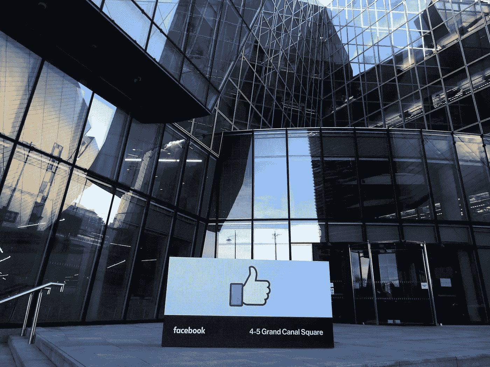

# 未受保护的伊利诺伊州面部数据——针对脸书的 350 亿美元诉讼

> 原文：<https://medium.datadriveninvestor.com/unprotected-illinois-facial-data-35-billion-suit-against-facebook-c2579886f1fd?source=collection_archive---------11----------------------->

Facebook Headquarters

通过嵌入式面部识别技术使用面部数据的指控使脸书在第九巡回法庭集体诉讼中损失了 350 亿美元。脸书驳斥了这样的说法，即其用户并没有因为映射并存储在数据库中的面部数据而受到任何伤害。但是，这场斗争失败了，中止的案件将在最高法院调解之前进行审理。伊利诺伊州公民是脸书用户中受影响最大的群体，他们的面部数据仍然没有得到保护。

一名来自脸书用户社区的律师表示，法律强烈要求脸书为未能保护用户的敏感信息负责。旧金山，律师肖恩·威廉姆斯说:

***“这种生物特征(五官信息)非常敏感。它就像指纹一样独一无二。”***

考虑到人体独特的生物特征，面部信息指的是同一个。如果以任何方式篡改或滥用这种独特的信息，可能会对相应的消费者造成伤害。

# **生物识别——人脸验证**

面部验证已经成为全球最受欢迎的生物特征验证方法之一。它用于多种[在线身份验证](https://shuftipro.com/blogs/face-verification-one-solution-for-several-identity-frauds/)目的。自动面部验证过程包括捕获每个人面部的独特面部特征。这些面部特征被绘制出来，这些信息被储存在一个数据库中。应该基于面几何形状验证的每个实体与存储的信息相匹配，然后被验证。这是伊利诺斯小组的面部几何信息，被脸书未经同意而获取。

# **脸书&预期监管成本**

首席原告 Nimesh Patesh 声称，脸书在 2015 年没有征求同意，甚至没有在获取 dace 数据时告诉用户。该诉讼称，脸书既没有征得伊利诺伊州公民的同意，通过面部识别技术上传和扫描他们的照片，也没有告知自 2011 年开始测绘以来，这些数据将使用多长时间。根据这一违规行为，脸书可能面临 700 万用户每人 1000 至 5000 美元的罚款。所有这些加起来大约是 350 亿美元。

# **案子要定了！**

脸书上诉要求驳回此案，但由三名法官组成的陪审团驳回了这一请求。自 2015 年以来，脸书一直在努力结案。它反对诉讼中的定义，反对生物信息隐私法(BIPA)。BIPA 基本上宣布，收集个人的生物特征信息而不说明收集、处理和使用数据的意图和目的是非法的。应该披露脸书没有做到的方法。集体诉讼提出了这一点，并宣布从伊利诺伊州的用户收集非法生物信息。

脸书辩称，从用户那里收集的面部数据不会给用户带来任何金钱损失或经济伤害。对此，由三名法官组成的小组回答说:

***“具体的伤害不需要有形。”***

脸书进一步辩称，伊利诺伊州的用户必须提供证据，证明他们的数据被扫描并存在于数据库中，因为法律不考虑任何发生在州外的行为。此外，它还表示，面部数据扫描已经完成，数据存储在伊利诺伊州以外的服务器上。因此，它不能被用来违反国家法律。第九巡回法院没有接受这一论点，因为它没有表明一个强有力的支持论点，澄清可能有助于案件的释放。

监管机构和脸书都准备再次投入这场战斗。直到二月，这个案子又被调整了。它似乎不会有任何进展，争论也永无止境。