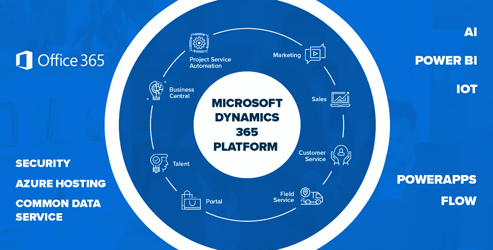

# 用 Dynamics 365-Cygnet 解开卓越客户关系管理的束缚

> 原文：<https://medium.datadriveninvestor.com/unshackling-superior-customer-relationship-management-with-dynamics-365-cygnet-3b744c1a1645?source=collection_archive---------9----------------------->

成功的企业正以令人难以置信的速度加快速度，成功的秘诀在于他们专注于提供卓越的客户体验。企业使用技术驱动的交互来与客户互动，并提供丰富、个性化和有效的业务解决方案。

但是，企业为什么要多走一步呢？只是为了从客户互动中发掘独特的见解，通过为他们提供卓越的体验来增加收入。

在充满活力的全球经济和数字化市场中，“客户需求”是任何业务增长战略的核心。集中式 CRM 系统很容易成为企业持续提供卓越客户服务的最有效工具。最新的高功能客户关系管理系统是 Microsoft Dynamics 365 客户关系套件，可促进与客户的实时无缝协作，同时提供社交参与、社交监控和个性化服务。

**为什么微软 Dynamics 365 会赢**

“到 2023 年，客户将更喜欢使用语音界面来发起 70%的自助服务客户交互，而目前这一比例为 40%。”— [Gartner 预测 2019 年:CRM 客户服务和支持](https://www.gartner.com/en/documents/3895585/predicts-2019-crm-customer-service-and-support)

技术正以闪电般的速度发展，客户服务也不例外。使用自动化和自助服务门户，企业更有可能解放创新的范围。集成的 CRM 是任何成长型企业的核心。像 Microsoft Dynamics 365 这样的 CRM 套件可以帮助企业快速了解和解决客户关注的问题。

 [## 幸福的算法？数据驱动的投资者

### 从一开始，我们就认为技术正在使我们的生活变得更好、更快、更容易和更实用。社交媒体…

www.datadriveninvestor.com](https://www.datadriveninvestor.com/2019/03/08/an-algorithm-for-happiness/) 

[**Microsoft Dynamics CRM Services**](https://www.cygnet-infotech.com/microsoft-application-development-services)的集中界面提供了多种辅助服务，如个性化消息传递、点对点支持、自助服务，如自动聊天机器人和自助服务客户门户。最终目标是提供个性化的客户服务，可以随时随地复制所有客户关注的问题，为您的业务底线带来额外收入。

**微软动态 365 如何改变企业的增长？**

考虑到每天产生的大量数据，获得关于客户需求的第一手信息是一项挑战。这就是 Dynamics 365 改变客户关系格局的地方。以下是拥有像 Microsoft Dynamics 365 这样的 CRM 套件可以为您的企业带来的好处:

*   集中的数据，深刻的推论
*   作为一个集中式数据共享平台，Dynamics 365 帮助企业使用商业智能进行有见地的推理，以获得可操作的见解。
*   轻松整合整个生态系统
*   Dynamics 365 可以与微软生态系统中的其他应用程序无缝集成。它还简化了 CRM 迁移或 CRM 从本地到在线的迁移，从而更加方便。您可以轻松实现迁移过程的自动化，从而节省时间并提高工作效率。

**了解客户的顾虑**

*   作为一个统一的系统，Dynamics 365 跟踪客户记录、在线聊天、客户历史和各种其他客户功能。这些数据是集中的，而工作流可以在单个企业内跨部门和角色轻松管理。该套件易于访问和协作，使决策者能够跨多个接触点深入了解客户，更好地为他们服务。

**驾驭每一个客户接触点**

*   社交媒体和移动应用的兴起已经超越了当今商业的力量。以前，它只限于特定的客户接触点，提供集中的客户输出。现在，技术驱动的公司正在建立一个不断扩大的消费者身份，这就需要一个像 Dynamics 365 这样的合作平台。

**缩短销售周期时间**

*   客户数据洞察加快了销售和营销机会。Dynamics 365 通过几个流程的自动化，有助于显著缩短交付周期。这有助于销售专业人员节省确认和理解销售线索标准的重要时间。因此，潜在客户转化率更快、更高。此外，Dynamics 365 还内置了流程管理功能，可以在销售生命周期的每个阶段把握机会。

**可扩展的高效客户解决方案**

*   无论客户是将数据部署在云上、内部部署还是混合部署，Dynamics 365 都允许访问多个数据平台，并提供定制的业务解决方案。从小型企业到大型企业，该系统通过了解过去和当前的客户参与计划和流程来满足企业的需求。

**客户关系管理的现代综合方法**

**Microsoft Dynamics 如何促进部门间的无缝协作**

企业中的几个流程会导致数据呈指数级增长。这使得管理访问和依赖数据库的多个利益相关者变得非常困难。因此，它在销售、营销和运营等内部团队或外部供应商访问的同一数据库的利益相关者之间造成了侵入性的混乱。最终，很难以成长型企业所需的效率为客户服务。

例如，一家领先的门安装和咨询服务提供商向 Cygnet 提出了其组织内的多种沟通和协作问题。不同的办公地点和员工访问数据的非协作软件导致订单延迟、订单管理不当、工作流程不规则以及外部供应商门户和内部代理之间缺乏集成。

小天鹅发现了潜在的问题，并提出了切实可行的解决方案。该团队交付了符合客户要求的定制 Microsoft Dynamics CRM 解决方案。它在公司的服务部门、会计部门和外部供应商之间提供了完整的客户关系管理和集成的管理任务管理。因此，该客户能够按时交付订单，与项目顾问一起维护定制工作流，并无缝管理每个项目，即使是在第三方零售商的网站上。

如果您有合适的技术合作伙伴来为您实施 Dynamics 365，它将是提高工作效率的强大动力。Cygnet 是微软认证的金牌应用程序开发合作伙伴，17 年来一直提供定制的微软技术解决方案和服务。如有任何疑问，欢迎致电 inquiry@cygnetinfotech.com[或致电+1–609–245–0971 联系我们。](mailto:inquiry@cygnetinfotech.com)

***原载于****[*【https://www.cygnet-infotech.com】*](https://www.cygnet-infotech.com/blog/superior-customer-relationship-management-with-dynamics-365)*。**