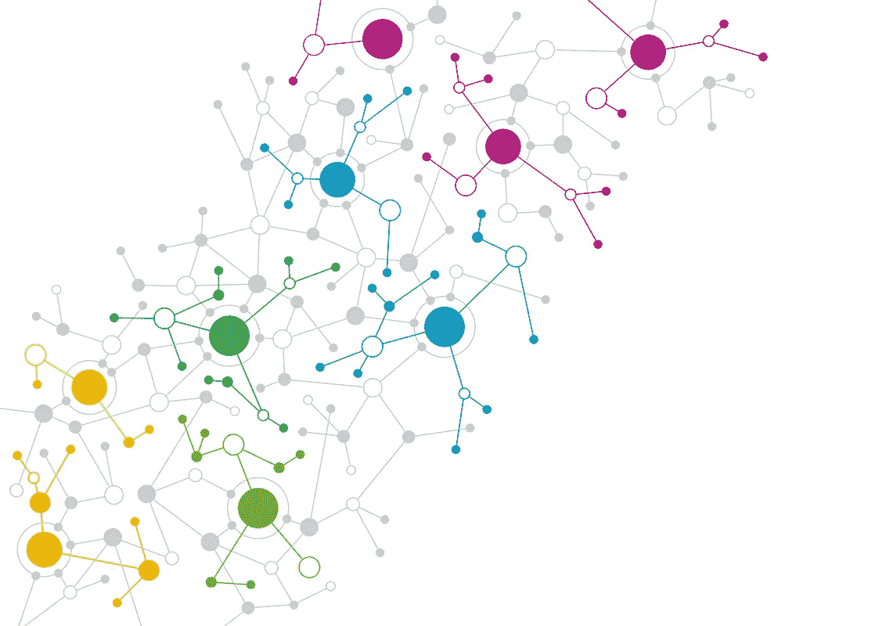

# 无监督学习:K-均值聚类

> 原文：<https://medium.datadriveninvestor.com/unsupervised-learning-k-means-clustering-a74609272666?source=collection_archive---------12----------------------->

Source: [https://www.medicaltourismtraining.com/medical-tourism-articles/dimensions-of-medical-tourism-clusters-part-2/](https://www.medicaltourismtraining.com/medical-tourism-articles/dimensions-of-medical-tourism-clusters-part-2/)

# 监督学习与非监督学习

在机器学习领域，主要有两种类型:(1)有监督的和(2)无监督的。两者的区别在于，**监督学习**有**标注的**数据——也就是有一个给定的目标 Y 变量。相比之下，**无监督学习**没有目标 Y 变量，因此**会有未标记的**数据。

这些可以进一步分解成子部分。比如在监督学习中，有回归和分类。对于无监督学习，有 K-Means 聚类和 DBSCAN 等算法。

# TL；博士；医生

在这篇博客中，我主要关注的是 K-Means，因为它是最流行的聚类算法，也是最容易理解的算法之一。

从本质上讲，K-Means 背后的想法是对我们的数据进行聚类或分组，使各个点到平均点(质心)的距离平方和尽可能小。

 [## DDI 编辑推荐:5 本让你从新手变成专家的机器学习书籍|数据驱动…

### 机器学习行业的蓬勃发展重新引起了人们对人工智能的兴趣

www.datadriveninvestor.com](https://www.datadriveninvestor.com/2019/03/03/editors-pick-5-machine-learning-books/) 

要使用这个模型，用户必须指定的事情之一是 ***k*** ，这是您希望您的模型拥有的集群数量。

# **用例:推荐系统**

由于其未标记的性质，某些现实世界的案例非常适合使用聚类。一个例子是推荐系统，其中项目(无论是音乐、电影、项目)基于相似性被分组在一起。在这些情况下，用户和零售商都受益，因为用户将获得他们可能感兴趣的推荐(基于过去的行为),并且零售商将能够更好地向用户提供产品或服务。

# 评估指标:轮廓得分

轮廓分数测量我们的集群彼此相距多远。它是一个聚类中每个点相对于其他聚类的平均值。这个分数的范围是-1 到 1。因为我们想要优化我们的分数，分数越接近 1 意味着我们创建的聚类越好。我们的聚类越好，我们的模型就越好。