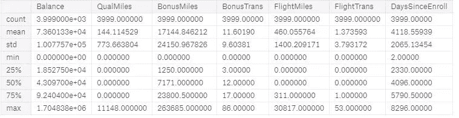
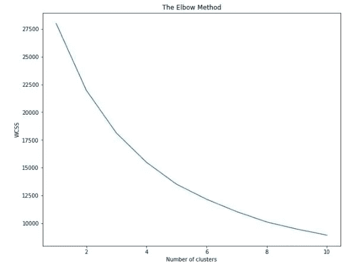
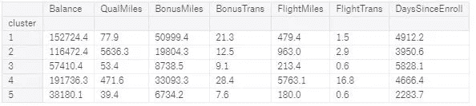
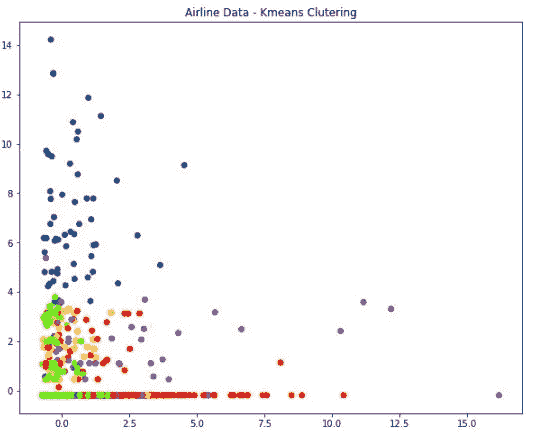
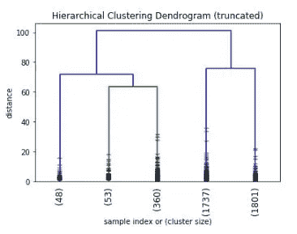
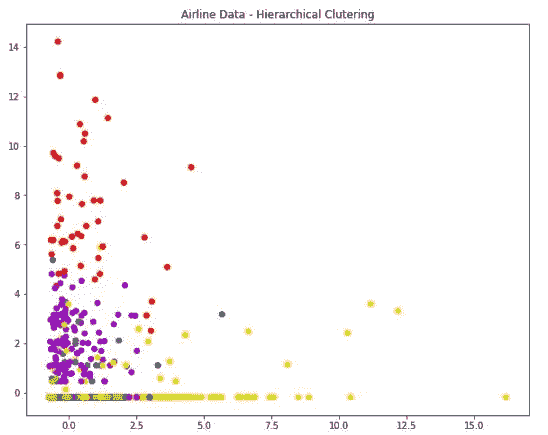
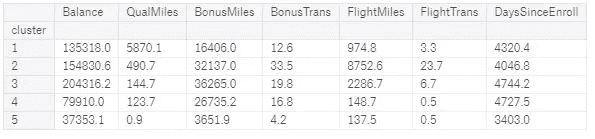

# 基于 Python-K-Means 和层次聚类的无监督学习

> 原文：<https://medium.datadriveninvestor.com/unsupervised-learning-with-python-k-means-and-hierarchical-clustering-f36ceeec919c?source=collection_archive---------0----------------------->

[](http://www.track.datadriveninvestor.com/1B9E)

机器学习可以大致分为两种类型:

*   **监督学习** —其中存在响应变量 Y。这里可能有两个目标，1。求 f(X)=Y，使得 f(X)非常接近 Y 或 2。给定 X，预测 Y 的值。通常，回归，决策树，随机森林，SVM，朴素贝叶斯等用于这类问题
*   **无监督学习** —没有响应变量 Y，目标是根据聚类成员的相似性识别数据中的聚类。不同的算法，如 K-means、分层、PCA、谱聚类、DBSCAN 聚类等。是用来解决这些问题的

在现实生活中，无监督学习更有用，因为这种数据容易获得，而且不太昂贵——因为它主要是机器生成的数据。具有响应变量的数据是昂贵的，因为它需要一些人为干预来将观察标记为属于某类或识别输出

本文的目的是将 K-means 和层次聚类应用于 Kaggle 上的 AirlinesCluster 数据集。要深入了解聚类算法是如何工作的，请参考优秀的在线资源，如由 [Gareth James](http://www-bcf.usc.edu/~gareth) 、 [Daniela Witten](http://www.biostat.washington.edu/~dwitten/) 、 [Trevor Hastie](http://www.stanford.edu/~hastie/) 和 [Robert Tibshirani](http://www-stat.stanford.edu/~tibs/) 编写的《统计学习入门》R 书和视频讲座。这本书的链接——ISLR

[](https://www-bcf.usc.edu/~gareth/ISL/) [## 统计学习导论

### 作为一名前数据科学家，我最常被问到的问题莫过于“学习统计学的最佳方法是什么?”?“我……

www-bcf.usc.edu](https://www-bcf.usc.edu/~gareth/ISL/) [](https://www.r-bloggers.com/in-depth-introduction-to-machine-learning-in-15-hours-of-expert-videos/) [## 在 15 小时的专家视频中深入介绍机器学习

### 2014 年 1 月，斯坦福大学教授特雷弗·哈斯蒂和罗布·蒂布拉尼(《传奇元素》的作者…

www.r-bloggers.com](https://www.r-bloggers.com/in-depth-introduction-to-machine-learning-in-15-hours-of-expert-videos/) 

加载和查看数据

```
PATH = "../input"
#importing the dataset
dataset = pd.read_csv(f'{PATH}/AirlinesCluster.csv')
#creating a duplicate dataset to work on
dataset1 = dataset
# peeking at the dataset
dataset1.head().T
#Descriptive stats of the variables in data
dataset1.describe()
```



Descriptive Statistics of the Airline Cluster data

标准化数据集是必不可少的，因为 K-means 和层次聚类依赖于计算观察值之间的距离。由于变量的度量尺度不同，一些变量可能对聚类输出有较高的影响

```
#standardize the data to normal distribution
from sklearn import preprocessing
dataset1_standardized = preprocessing.scale(dataset1)
dataset1_standardized = pd.DataFrame(dataset1_standardized)
```

在 K-means 中，必须在应用之前决定所需的集群数量，因此一些领域的专业知识会有所帮助。另外，我们可以使用一个 scree 图来决定基于方差减少的聚类数

```
# find the appropriate cluster number
plt.figure(figsize=(10, 8))
from sklearn.cluster import KMeans
wcss = []
for i in range(1, 11):
    kmeans = KMeans(n_clusters = i, init = 'k-means++', random_state = 42)
    kmeans.fit(dataset1_standardized)
    wcss.append(kmeans.inertia_)
plt.plot(range(1, 11), wcss)
plt.title('The Elbow Method')
plt.xlabel('Number of clusters')
plt.ylabel('WCSS')
plt.show()
```



Scree Plot for K-means

**K 均值聚类**

```
# Fitting K-Means to the dataset
kmeans = KMeans(n_clusters = 5, init = 'k-means++', random_state = 42)
y_kmeans = kmeans.fit_predict(dataset1_standardized)#beginning of  the cluster numbering with 1 instead of 0
y_kmeans1=y_kmeans
y_kmeans1=y_kmeans+1# New Dataframe called cluster
cluster = pd.DataFrame(y_kmeans1)# Adding cluster to the Dataset1
dataset1['cluster'] = cluster#Mean of clusters
kmeans_mean_cluster = pd.DataFrame(round(dataset1.groupby('cluster').mean(),1))
kmeans_mean_cluster
```



K-Means — Cluster Means of features



Airline Customer Clusters — K-means clustering

**层次聚类**

```
# Hierarchical clustering for the same dataset
# creating a dataset for hierarchical clustering
dataset2_standardized = dataset1_standardized# needed imports
from matplotlib import pyplot as plt
from scipy.cluster.hierarchy import dendrogram, linkage
import numpy as np# some setting for this notebook to actually show the graphs inline
# you probably won't need this
%matplotlib inline
np.set_printoptions(precision=5, suppress=True)  # suppress scientific float notation#creating the linkage matrix
H_cluster = linkage(dataset2_standardized,'ward')plt.title('Hierarchical Clustering Dendrogram (truncated)')
plt.xlabel('sample index or (cluster size)')
plt.ylabel('distance')
dendrogram(
    H_cluster,
    truncate_mode='lastp',  # show only the last p merged clusters
    p=5,  # show only the last p merged clusters
    leaf_rotation=90.,
    leaf_font_size=12.,
    show_contracted=True,  # to get a distribution impression in truncated branches
)
plt.show()
```



Dendogram — Hierarchical Clustering of Airline Customer

```
# Assigning the clusters and plotting the observations as per hierarchical clusteringfrom scipy.cluster.hierarchy import fcluster
k=5
cluster_2 = fcluster(H_cluster, k, criterion='maxclust')
cluster_2[0:30:,]plt.figure(figsize=(10, 8))
plt.scatter(dataset2_standardized.iloc[:,0], dataset2_standardized.iloc[:,1],c=cluster_2, cmap='prism')  # plot points with cluster dependent colors
plt.title('Airline Data - Hierarchical Clutering')
plt.show()
```



Airline Customer Cluster — Hierarchical Clustering

将分配的分级聚类数据添加到数据帧中，并计算聚类特征的平均值

```
# New Dataframe called cluster
cluster_Hierarchical = pd.DataFrame(cluster_2)# Adding the hierarchical clustering to dataset
dataset2=dataset1
dataset2['cluster'] = cluster_Hierarchicaldataset2.head()
```



Hierarchical Clustering — Means of features

**见解和行动计划:**

1.  聚类 5 被设置为最近获得的客户群，因为自从登记以来的天数是最低的，此外，他们在过去 12 个月中的航班交易以及顶级旅行的合格里程是最低的。
2.  第 3 类是拥有最多非航班奖励交易里程和最高奖励旅行里程的高端客户群
3.  第 4 类也是高端客户，但他们在过去 12 个月的飞行里程和飞行交易数量低得惊人，除非采取一些干预措施，否则他们可能会流失。激活这些客户的定制优惠是必要的
4.  第 2 类是在过去 12 个月中进行了最高数量的航班交易并获得了飞行里程的客户群。进一步调查并确定他们的需求。他们可能是婴儿潮一代，退休后开始四处旅游。

# 来自 DDI 的相关帖子:

[](https://www.datadriveninvestor.com/2019/01/23/deep-learning-explained-in-7-steps/) [## 用 7 个步骤解释深度学习——数据驱动投资者

### 在深度学习的帮助下，自动驾驶汽车、Alexa、医学成像-小工具正在我们周围变得超级智能…

www.datadriveninvestor.com](https://www.datadriveninvestor.com/2019/01/23/deep-learning-explained-in-7-steps/) [](https://www.datadriveninvestor.com/2019/01/23/which-is-more-promising-data-science-or-software-engineering/) [## 数据科学和软件工程哪个更有前途？-数据驱动型投资者

### 大约一个月前，当我坐在咖啡馆里为一个客户开发网站时，我发现了这个女人…

www.datadriveninvestor.com](https://www.datadriveninvestor.com/2019/01/23/which-is-more-promising-data-science-or-software-engineering/)