# 基于深度学习的文本语料无监督离群点检测

> 原文：<https://medium.datadriveninvestor.com/unsupervised-outlier-detection-in-text-corpus-using-deep-learning-41d4284a04c8?source=collection_archive---------0----------------------->

[](http://www.track.datadriveninvestor.com/1B9E)

基于自动编码器的方法在维基百科电影数据库中寻找最独特的电影情节。


Photo by [Noah Black](https://unsplash.com/@noahblack?utm_source=medium&utm_medium=referral) on [Unsplash](https://unsplash.com?utm_source=medium&utm_medium=referral)

你所理解的独一无二是什么？“独特性”指的是不同于其他事物的东西。用机器学习的术语来说，它只不过是一个“离群值”。现在，问题来了，在没有任何先验知识的情况下，我们如何检测那些？即通过无人监管的方式？本文将讨论一种基于无监督深度学习的文本数据离群点检测技术。

# **数据探索&问题公式化**

我们将使用 [Kaggle 数据集](https://www.kaggle.com/jrobischon/wikipedia-movie-plots)用于“维基百科电影情节”。它包含标题、导演、类型和其他信息以及情节。我们的工作将仅限于“情节”。

[](https://www.datadriveninvestor.com/2019/01/07/the-ultimate-learning-path-for-deep-learning-in-2019-more/) [## 2019 年深度学习的终极学习路径及更多...-数据驱动型投资者

### 又一个美好的一周，一些好的教育内容将会到来。我最喜欢的&最受欢迎的帖子之一…

www.datadriveninvestor.com](https://www.datadriveninvestor.com/2019/01/07/the-ultimate-learning-path-for-deep-learning-in-2019-more/) 

问题的目标是分析电影的“情节”，并找到最独特的电影，或者你可以用机器学习的术语说“离群值”。

我们将使用 Python 和像 pandas、sci-kit learn、Gensim、matplotlib 这样的库来完成我们的工作。

让我们首先探索数据集，看看它是什么样子的。

```
import pandas as pdwikipedia_movie_df = pd.read_csv('../data/wiki_movie_plots_deduped.csv', 
index_col=False, header=0)
wikipedia_movie_df.head()
```

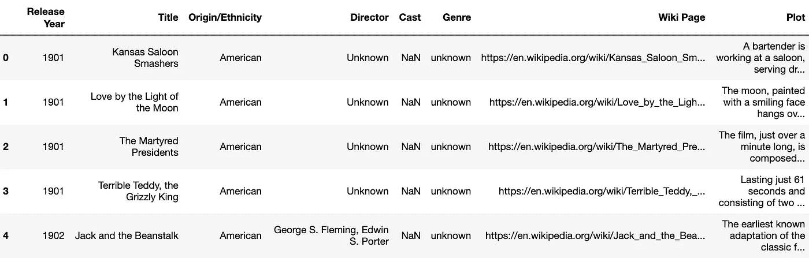

Figure 1

因为我们将只使用“Plot ”,所以将选择“Plot ”,并将保留“title”作为标识符

```
title_plot_df = wikipedia_movie_df[['Title','Plot']]
title_plot_df.head()
```

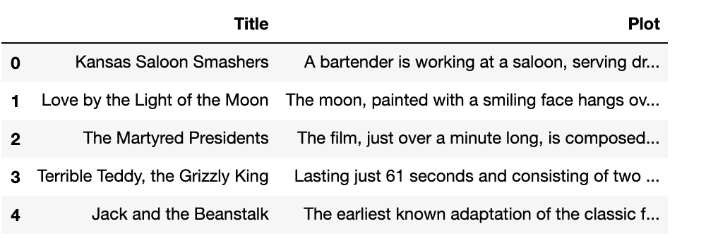

Figure 2

总共有 **34886** 条记录。

在去任何地方之前，让我们看看一部电影的完整情节是什么样的

```
title_plot_df.iloc[0,1]
```

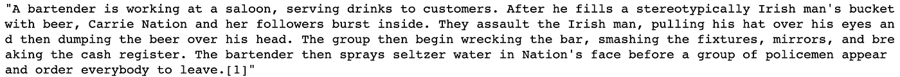

Figure 3

在进行任何进一步的数据探索并将其植入任何算法之前，我们需要清理文本。

**文字清理步骤**

文本清洗包括以下 7 个步骤:

1.  移除标签(如、

    )

2.  删除标点符号(如'，'，'.','!'等等)
3.  删除文本之间的多个空白
4.  数字的去除
5.  删除停用词(如“at”、“to”、“the”、“and”等)
6.  删除非常短的单词
7.  词干化，即将单词转换为其词根形式(如“播放”，“播放”在处理后将只有一个标记:“播放”，它是词根)

让我们创建一个完成以上所有工作的函数

现在，应用该功能来清理上述电影情节，看看结果

```
clean_text(title_plot_df.iloc[0,1])
```

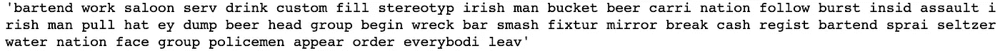

Figure 4

尽管“清理”后的文本不再保持语法正确，但它仍然拥有对进一步处理至关重要的上下文。

我们需要对所有的电影情节都这样做

```
title_plot_df['Plot'] = title_plot_df['Plot'].map(lambda x: clean_text(x))
```

对于数据探索，让我们找到在图中出现最频繁的 50 个单词/标记。

我们需要为图形表示编写一个通用函数

我们现在可以使用上面的函数来绘制数据

```
barplot(words=common_words, words_counts=common_words_counts, title='Most Frequent Words used in movie plots')
```

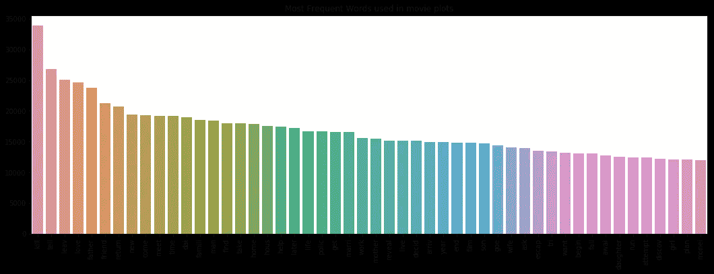

Figure 5

从上面的条形图中，我们可以很容易地看到，在所有的电影中,'杀死'是最常见的词。

在此之后，让我们做相反的事情，即找出所有电影中最不常用的 50 个单词/符号，并绘制图表

```
barplot(words=uncommon_words, words_counts=uncommon_word_counts, title='Least Frequent Words used in movie plots')
```

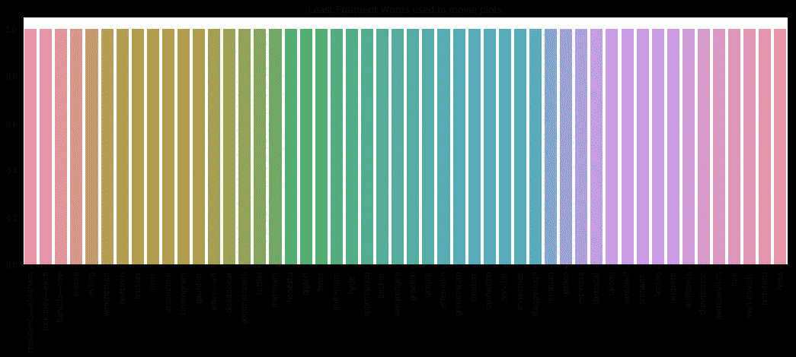

Figure 6

我们可以看到很多频率为 1 的单词/标记。

从直观的分析中，我们可以很容易地得出结论，我们的目标结果，即“最独特的电影”肯定不会包含最频繁的词，而可能包含最不频繁的词。这是一个非常高层次的观点。在实践中，我们需要实际看到电影情节的上下文含义，找出最罕见的。

# 解决方法和处理步骤

我们已经完成了清理步骤，现在我们已经将所有电影情节作为单个空格分隔的标记。对于任何文本挖掘问题，向量空间建模都是必不可少的一部分。它将文本转换为数字特征，然后这些特征可以植入任何机器学习算法。对于我们的用例，也将做同样的事情。之后，我们将使用自动编码器神经网络进行自我训练，并将其用作模型。我将逐一解释这些步骤并查看结果

**步骤 1——将文本转换成向量空间模型**

有许多用于文本分析的“向量空间模型”，如“Tf-Idf”、“CBOW”、“Word2Vec”、“Doc2Vec”等。

[Tf-Idf](https://nlp.stanford.edu/IR-book/html/htmledition/tf-idf-weighting-1.html) 是一个简单的基于频率的频率逆模型，在小文本和特定领域文本的情况下非常有用。它非常适合理解包含领域术语、写得不太好或语法不正确的文本。但是它不能理解上下文的意思，特别是对于写得非常好的语法正确的文本。同样的心情可以用不同的词来表达。

[doc 2 vec](https://kanoki.org/2019/03/07/sentence-similarity-in-python-using-doc2vec/)’&‘word 2 vec’显然是这里的赢家。“Doc2Vec”从文本中随机抽取单词，并在内部训练一个神经网络模型，该模型给出文本的数字向量表示。在我们的例子中，由于电影情节是写得很好的文本，将使用“Doc2Vec”作为我们的“向量空间模型”。

让我们编写一个转换器，将文本语料库转换成文档向量。

现在，应用到所有的电影情节，看看结果

```
doc2vec_tr = Doc2VecTransformer(vector_size=300)
doc2vec_tr.fit(title_plot_df)
doc2vec_vectors = doc2vec_tr.transform(title_plot_df)
```

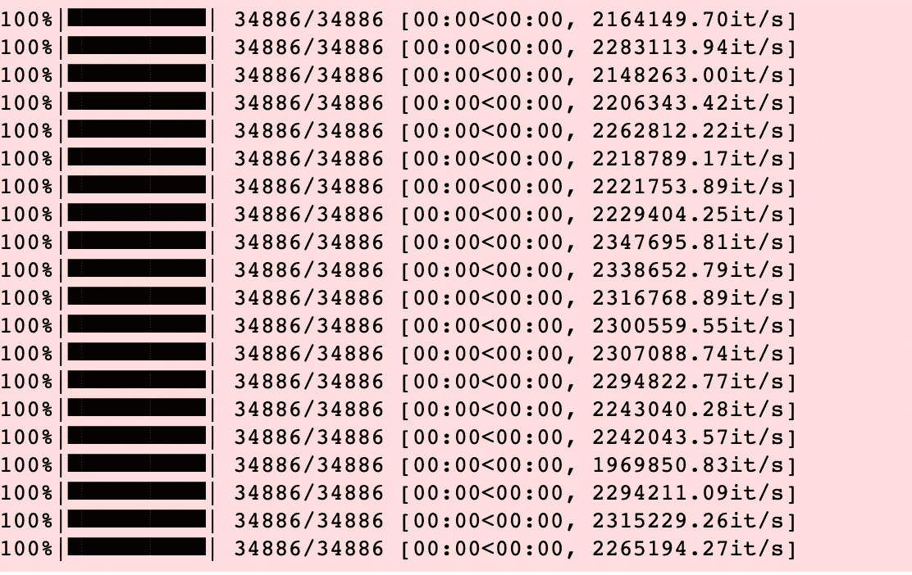

Figure 7

```
print(doc2vec_vectors)
```

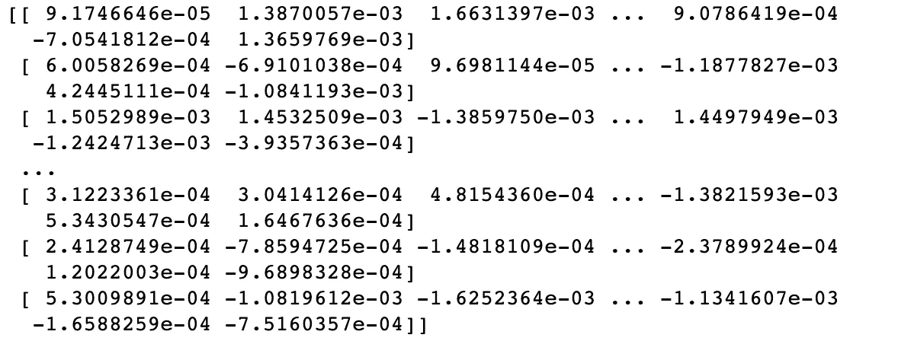

Figure 8

我们将“vector_size”保持为 300。一般来说，最好保持在 100-300 之间。所以，现在所有的电影情节都被分解成一个大小为 300 的向量，总的“doc2vec_vectors”尺寸变成了 34886x300。我们可以说，每个电影情节文本有 300 个数字特征。

**步骤 2——训练一个“自动编码器”神经网络**

由于我们的过程是完全无监督的，并且我们没有标记的数据(作为异常值/非异常值)，我们将使用 5 层深度的'[自动编码器](http://ufldl.stanford.edu/tutorial/unsupervised/Autoencoders/)神经网络来训练我们的模型。它是一种特殊类型的神经网络，将输入数据复制到输出数据。这个过程被称为“重建”。网络的“隐藏层”进行特征提取&解码工作。在整个过程的最后，肯定会产生一些损失，并且与其他数据点不同的数据点会导致更多的损失。

它的层结构将看起来像

> **300->600->150->600->300**

即第 1 层(输入层)-300 个要素、第 2 层-600 个要素、第 3 层-150 个要素、第 4 层-600 个要素、第 5 层(输出层)-300 个要素。像往常一样，第 1 层将具有从“步骤 1”生成的所有“Doc2Vec”特征。第 2 层、第 3 层和第 4 层是隐藏层，执行实际的数据消息传递(扩展和收缩)和信息提取部分。实际上，第 2 层被称为“编码层”，第 4 层被称为“解码层”。最终，输出将来自第 5 层。“自动编码器”使用与输入和输出相同的数据进行训练。因此，第 5 层输出只不过是输入的重建版本，但有一些损失。正常的数据点将平滑地通过各层，损失最小，但是“离群值”的数据损失会更多，因为那些数据点不遵循隐藏数据模式。

这是我们的 5 层“自动编码器”的图形表示

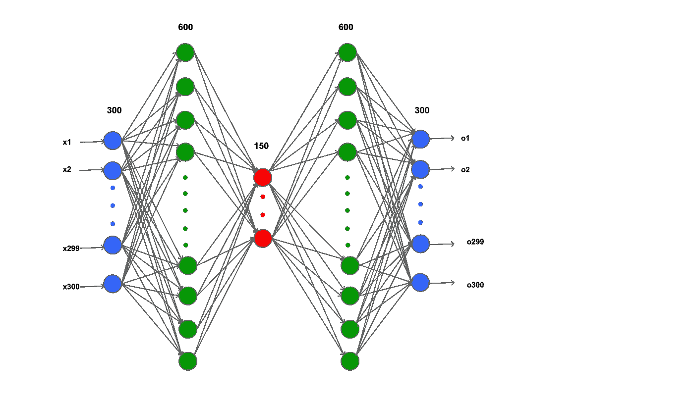

Figure 9

现在，让我们实际看看这将如何在“Doc2Vec”数据上工作

```
print(predicted_vectors)
```

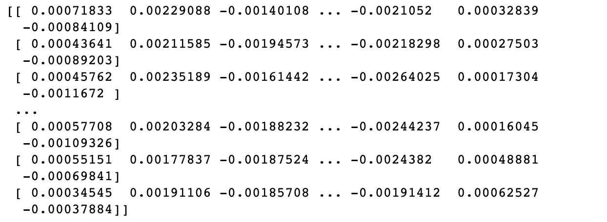

Figure 10

“预测向量”是输出向量。

实际上，这个“自动编码器”只不过是一个深度非线性回归器。我们也可以看到它的准确性。

```
auto_encoder.score(predicted_vectors, doc2vec_vectors)
```

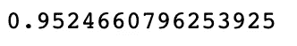

Figure 11

“得分”为 0.95，即 95%的方差由“自动编码器”根据“回归准确性”术语来维持。这也意味着 95%的输入变量信息被成功重构。

我们还可以看到整个网络的损失函数的模式

```
pd.DataFrame(auto_encoder.loss_curve_).plot()
```

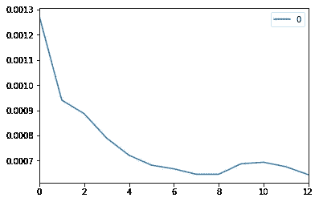

Figure 12

这里 X 轴表示迭代次数。我们可以看到，在第 12 次迭代时，损耗达到最小值。

**步骤 3——产出和实际工作的相似性度量**

一旦我们得到了输出向量，我们就可以测量损耗了。“损失”理想情况下由“异常值因子”表达式给出

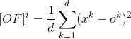

Figure 13

在哪里

[of]ᶦ=iᵗʰ数据实例的异常值因子

d =特征总数(在我们的例子中，d=300)

xᵏ =输入的 kᵗʰ特征值(1 ≤ k ≤ d)

oᵏ =输出的 kᵗʰ特征值(实际重构输入)(参见图 9)

离群值总是具有不遵循该模式的趋势，并且将给出更高的重建误差。所以，

*[OF]的较高值表示可能的“异常值”*。

当我们处理文本数据的数字向量时，如上所述的平方距离或欧几里德距离可能不会给出正确的结果。因此，我们将使用“[余弦相似度](https://www.machinelearningplus.com/nlp/cosine-similarity/)作为度量。现在[of]ᶦ]变成了 iᵗʰ数据点的输入 t12 输出向量的简单余弦度量。

但这里有一点不同:

*【of]ᶦ】的较低值表示可能的异常值，而不是较高值*。

因此，这样做的步骤是:

1.  计算 iᵗʰ数据点的输入向量和输出向量之间的“余弦相似度”。
2.  按升序对所有余弦相似值进行排序
3.  选择顶部“k”值(“k”是用户给定的输入)，可能的异常值将是相应的数据点

让我们把这个逻辑放在两个函数中

我们可以调用上面的函数来获得前“k”个异常值

```
print('Top 5 unique movies')sorted_cosine_similarities = get_computed_similarities(vectors=doc2vec_vectors, predicted_vectors=predicted_vectors)
display_top_n(sorted_cosine_similarities=sorted_cosine_similarities)
```

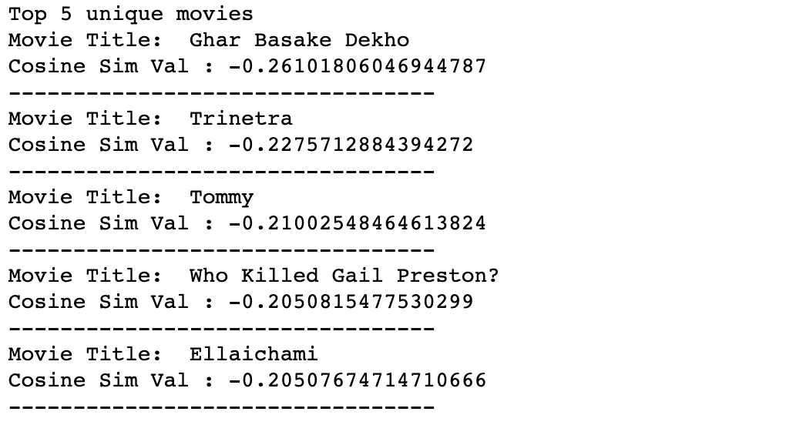

Figure 14

所以，我们得到了前五名独特的电影。

# 验证结果

对于机器学习中无监督的“离群点检测”问题，验证输出确实具有挑战性，因为我们没有标记的数据作为基准。此外，由于我们使用“Doc2Vec ”,检查上下文的有效性是困难的。因此，我们将采用一种更简单的方法，用“数据探索阶段”的观察结果来验证我们的结果。

我们将看到“最独特电影的所有处理过的单词”和“所有电影中非常频繁的单词”之间是否有交集

```
most_unique_movie_index, cosine_sim_val = sorted_cosine_similarities[0]
most_unique_movie_plot = title_plot_df.iloc[most_unique_movie_index, 1]
most_unique_movie_words_counter = Counter(preprocess_string(most_unique_movie_plot))intersected_common_word_counter = common_word_counter & most_unique_movie_words_counter
intersected_common_words = [word[0] for word in intersected_common_word_counter.items()]
intersected_common_word_counts = [word[1] for word in intersected_common_word_counter.items()]
intersected_common_word_counter
```


Figure 15

所以，没有交集。

含义:'*最独特的电影情节不包含在其他电影情节*中非常常见的词语。

这对于一部与众不同的“独特”电影来说非常重要，对吗？因此，我们的解决方案非常有效！

现在，让我们看看相反的场景——“最独特的电影是否包含语料库中最不常用的词”。

```
uncommon_word_count_items = [word for word in islice(all_word_counts, 300000)]
all_movies_uncommon_word_counter = Counter(dict(uncommon_word_count_items))
common_word_counter = Counter(aggregate_counter.most_common(1000))intersected_uncommon_word_counter = all_movies_uncommon_word_counter & most_unique_movie_words_counter
intersected_uncommon_words = [word[0] for word in intersected_uncommon_word_counter.items()]
intersected_uncommon_word_counts = [word[1] for word in intersected_uncommon_word_counter.items()]barplot(words=intersected_uncommon_words, words_counts=intersected_uncommon_word_counts,
        title='Few Common words between all words of most unique movie & least frequent words in all movies')
```

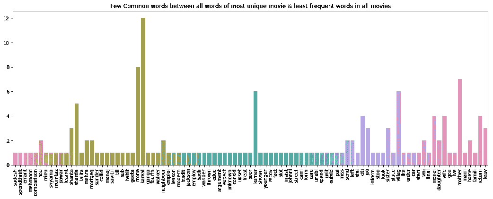

Figure 16

从情节来看，可以说——‘最独特的电影情节’确实包含了许多非常不常用的词，这些词对于其他电影情节来说是非常不常见的’

因此使其非常独特。

我们从两方面验证了我们的结果。同样的测试也可以对其他也在“k”以内的电影进行(由于余弦相似值的增加，可能会有一点变化。此外，由于“gensim — Doc2Vec”的变化性质，总体结果可能会发生变化。在每次运行中，它可能产生可能影响输出的微小不同的向量)。

因此，我们学会了如何使用“深度学习”从文本数据中发现异常值。

Jupyter notebook”项目可以在 Github 中找到。期待反馈或问题。

最近，我写了一本关于 ML([https://twitter.com/bpbonline/status/1256146448346988546](https://twitter.com/bpbonline/status/1256146448346988546))的书