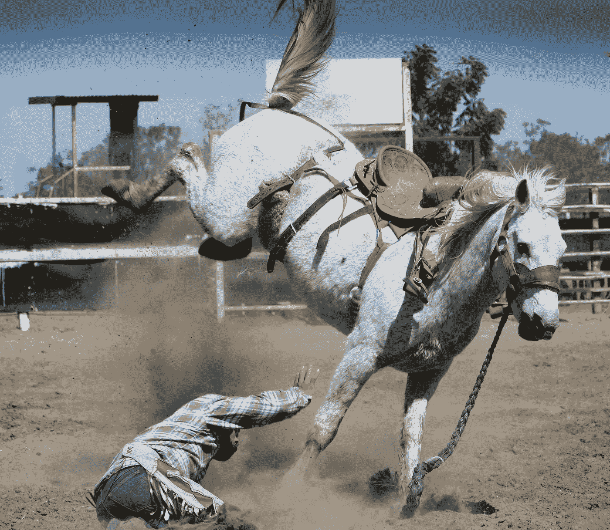

# 解放这匹马:美国的金融监管

> 原文：<https://medium.datadriveninvestor.com/untaming-the-horse-financial-regulation-in-america-1af3cdfc629e?source=collection_archive---------17----------------------->

银行和金融机构能够比监管者更快地“创新”。他们能够随心所欲地控制监管者。这些持续失败的历史表明，需要强有力和积极主动的监管。这些是其中的一些故事。

爱达荷（Idaho 的缩写）

在美联储之前有一个关于 1907 年恐慌的故事。尼克博克信托银行发生了挤兑。有人担心它会像恐慌经常发生的那样蔓延开来。摩根大通没有让一家银行的倒闭拖垮整个系统，而是让一群其他银行家呆在他位于麦迪逊大道的个人总部的图书馆里。他不让他的同行，世纪之交金融世界的狮子，离开大楼，直到他们向银行保证他们自己的资本来阻止恐慌。和平恢复了。

 [## 保护主义、政治和经济动荡——数据驱动的投资者

### 美国股市昨日出现 400 多点的大幅反转，为未来的事情发出了警告信号。市场…

www.datadriveninvestor.com](https://www.datadriveninvestor.com/2018/06/28/protectionism-politics-economic-turmoil/) 

在另一个故事中，又出现了一次恐慌，这次是股票下跌，其他银行倒闭，摩根的儿子试图做同样的事情。市场持续下跌。更多的银行倒闭，罗斯福当选，大萧条持续了十年，直到随着美国开始卷入第二次世界大战，大规模的联邦支出开始增加。

还有第三个故事，金融危机在 2008 年秋季达到临界点。伯南克、保尔森和盖特纳在一个房间里聚集了新世纪之交的主要人物。这个房间位于纽约美联储的总部，该机构创建于 1907 年的恐慌和尼克博克信托公司倒闭的阴影之下。这一次，领导人是政府雇员，为美联储或财政部工作。他们被要求不要投入自己的资金，而是接受政府的资金。一些银行家不太情愿，因为接受资本实际上是承认他们的银行资不抵债，或者至少存在流动性问题。没有人愿意承认自己有问题，或者向交易对手暴露自己的问题。但最终，每个人都做到了。他们甚至修改了一些机构的章程，这样他们就可以正式接受来自美联储的资金，因为从技术上来说，他们甚至不是银行。所以高盛变成了一家银行，它可以在美联储的审查之下，拿走美联储的钱，即使你问高盛的任何人，危机没有影响到他们，他们不应该受到指责，他们的手是干净的，非常感谢。尽管已经过去了十年，但现在判断这种干预是否有效还为时过早。我们能知道接下来会发生什么吗？

二。

两座雕像坐落在 DC 华盛顿州美国联邦贸易委员会总部的外面。在国会大厦辉煌的新古典主义和过度说教的象征主义中，这些雕像展示了一个人在与一匹马摔跤，两个主题都有荡漾的石头肌肉。它被称为“人为控制贸易”,显示了联邦贸易委员会的使命。但它也可以被视为华盛顿和纽约所有监管者的隐喻。资本主义就是这匹野马，它可以横冲直撞，但却被用于生产。工作人员有责任确保这匹愤怒的马得到控制，使其能力得到充分利用，而不是在农村肆虐，使人们失去工作和家园。

你看，人类控制贸易充其量只是一种理想。如果我们的雕塑家想要表现个体企业与其监管者之间的实际关系，那就不是一个与种马角力的人，而是一个不断追逐种马的人。资本主义非常擅长的一件事就是创新。但是创新不一定最终是为了公共利益。它是创新的，而不是被动的。它积极利用其控制下的杠杆来规避和颠覆监管。通常，追马的人和马本身并没有分离。他们不再敌对，一起工作。

三。

更多的故事，更具体。一名妇女是商品期货交易委员会的主席。她叫布鲁克斯利·e·伯恩。在克林顿执政期间，她看到衍生品可能成为经济中的一股破坏性力量。所以，她说这些工具需要在交易所交易。它们的条款和价格需要透明，这样市场才能发挥其魔力。压力来自银行和其他联邦工作人员，他们应该为美国公民的利益和整个经济的运转而工作。他们不是亲市场，而是保护他们在商业中的特定朋友。这些人你都认识:艾伦·格林斯潘、财政部长罗伯特·鲁宾和劳伦斯·萨默斯。他们毁了她的职业生涯。Brooksley Born 是对的，正如我们十年后看到的那样，这些工具是拖垮整个金融机构的关键。

交替进行。被称为储蓄和贷款的银行与监管机构斗争，被允许提供更高的存款利率，部分原因是货币市场基金在 70 年代到 80 年代期间提供了更高的利率。他们接受这些存款，并开始提供尽可能多的贷款。他们需要发放贷款来获得资金支付给储户。这种做法一直有效，直到出现局部衰退。石油市场在 80 年代走下坡路，所以人们无法偿还贷款，所以储贷社无法支付他们的储户。如此多的小银行破产，以至于为确保储户不会损失太多钱而设立的联邦保险机构自己也破产了，不得不接受救助。这花费了联邦政府数十亿美元。
一更。还是在克林顿时代。花旗银行宣布将收购出售保险和其他金融产品的旅行者集团。问题是这次合并是违法的。《格拉斯-斯蒂格尔法案》是在上次金融危机导致整个社会崩溃之后出台的。它明确地将银行和投资银行分开，这样银行就不会用储户的钱进行投机。这个想法是为了让银行业保持无聊，并坚持 3-6-3 规则，即你以 3%的利率借款，以 6%的利率放贷，并在 3 点前离开办公室。对这一交易的反应如何？他们拒绝了吗，把它的建筑师扔进了监狱？当然不是。顺从的国会通过了《格拉姆-里奇-比利雷法案》,使这种事后结合合法化。当然，十年后，经济体系再次崩溃。

四。

上个世纪左右的监管故事似乎就是这样一个循环，先是崩盘，然后规章制度出台，然后资本争斗并规避规则，为下一次崩盘埋下伏笔。他们抓住了监管机构，这些机构的大杂烩很难协调——银行和金融机构受美联储、联邦贸易委员会、司法部、证券交易委员会、财政部、旧 OTS、OCC 等机构的监管。拥有这种机构分布意味着，在设定你的章程时，有可能寻找最轻松的接触、形式或监管套利，因此最不活跃的监管者就是你的监管者。这在州一级也可以看到，因为特拉华州或南达科他州的税率低，预期的消费者保护水平低，所以很多银行都在那里注册。

这就导致了我所说的“马的雕像”,因为如果监管者对自己的工作感兴趣，并且没有完全被抓住，他们总是在背后工作。这些大型金融机构的政治权力巩固了自身，从而变得至关重要。“太大而不能倒”不仅仅是一件已经发生的事情，而是多年来集中政治和金融权力的决定的结果。下一场危机已经开始酝酿，但即使有人现在就拉响警报，监管者也会在方向盘上睡着。因为问题是崩溃然后监管然后取消监管的循环在特朗普政府下加速了，所以我们可能很难应对下一次崩溃。是什么原因造成的？

*最初发表于*[*【http://econautodidactic.blogspot.com】*](https://econautodidactic.blogspot.com/2019/06/untaming-horse-financial-regulation-in.html)*。*