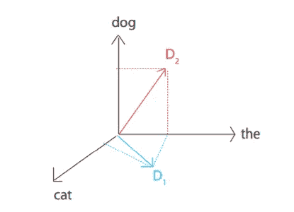

# 展开余弦相似性。

> 原文：<https://medium.datadriveninvestor.com/unwinding-cosine-similarity-5aa776d8c903?source=collection_archive---------11----------------------->

问候乡亲，我希望你做得很好。在本文中，我们将介绍机器学习的自然语言处理领域中最有用的程序之一，即余弦相似度。
余弦相似度被考虑作为解决文档距离问题的方法或算法。
在文档距离问题中，我们有两个文档 D1 和 D2，我们所要做的就是计算它们之间的距离，表示为:

```
Distance=d(D1, D2)
```

其中距离意味着两个文档的相似性，即找出它们之间的相似程度。
就机器语言而言，文档可以定义为单词序列，单词可以定义为字母数字字符序列。因此，文档距离的更精确的定义或目标可以表示为寻找两个文档之间的共有单词的思想。
让我们假设我们有两个文档。
D1 = "狗"
D2= "猫"
在三维向量空间中，它可以被可视化为:



其中 D1 和 D2 分别是文档一和文档二的向量。
现在，为了找出这两个向量之间的距离，我们可以使用向量微积分的内积，也称为两个向量的点积，它可以应用为:

```
d’(D1, D2) = D1.D2 = Σ (D1[W].D2[W])
```

然而，这种公式有一个问题，即它不是比例不变的，这意味着尽管它对于具有较少单词的文档看起来工作良好，但对于较长的文档却不工作，例如，具有 99%相同单词的长文档似乎比具有 10%相同单词的短文档更远。
通过标准化解决了这个问题，即将方法除以每个文档中的字数:

```
d’’(D1, D2) = (D1.D2)/(|D1|.|D2|)
```

其中 mod of document D，|D|表示文档中的字数。
对此的几何(重新标度)解释是:

```
d(D1, D2) = arccos(d’’(D1, D2))
```

因此，得出的结论是，文档距离是两个向量和 s 之间的角度。角度为 0♀表示两个文档相同，而角度为 90♀表示没有共同的单词。
现在的问题是如何将这些文书工作和所有的分析材料转化为机器兼容的计算。就编程而言，数学计算背后的概念是将文档 D 表示为单词 W 出现的向量，瞧，你已经准备好了。

[](https://www.datadriveninvestor.com/2019/01/23/which-is-more-promising-data-science-or-software-engineering/) [## 数据科学和软件工程哪个更有前途？数据驱动的投资者

### 大约一个月前，当我坐在咖啡馆里为一个客户开发网站时，我发现了这个女人…

www.datadriveninvestor.com](https://www.datadriveninvestor.com/2019/01/23/which-is-more-promising-data-science-or-software-engineering/) 

自从这个算法开始使用以来，它在补偿空间和时间复杂性方面已经有了很大的发展。
最快的编译时间如下:

```
import math
import string
import sys##################################
# Operation 1: read a text file ##
##################################
def read_file(filename):
  “”” 
    Read the text file with the given filename;
    return a list of the lines of text in the file.
  “””
    try:
       f = open(filename, ‘r’)
       return f.read()
 except IOError:
       print “Error opening or reading input file: “,filename
       sys.exit()#################################################
# Operation 2: split the text lines into words ##
################################################## global variables needed for fast parsing
# translation table maps upper case to lower case and punctuation to spaces
translation_table = string.maketrans(string.punctuation+string.uppercase,
 “ “*len(string.punctuation)+string.lowercase)def get_words_from_line_list(text):
  “””
    Parse the given text into words.
    Return list of all words found.
  “””
    text = text.translate(translation_table)
    word_list = text.split()
    return word_list##############################################
# Operation 3: count frequency of each word ##
##############################################def count_frequency(word_list):
  “””
    Return a dictionary mapping words to frequency.
  “””
    D = {}
    for new_word in word_list:
        if new_word in D:
            D[new_word] = D[new_word]+1
        else:
            D[new_word] =  1
    return D#############################################
## compute word frequencies for input file ##
#############################################def word_frequencies_for_file(filename):
 “””
    Return dictionary of (word,frequency) pairs for the given file.
 “”” line_list = read_file(filename)
    word_list = get_words_from_line_list(line_list)
    freq_mapping = count_frequency(word_list) print “File”,filename,”:”,
    print len(line_list),”lines,”,
    print len(word_list),”words,”,
    print len(freq_mapping),”distinct words” return freq_mappingdef inner_product(D1,D2):
 “””
    Inner product between two vectors, where vectors
    are represented as dictionaries of (word,freq) pairs. Example: inner_product({“and”:3,”of”:2,”the”:5},
    {“and”:4,”in”:1,”of”:1,”this”:2}) = 14.0 
 “””
    sum = 0.0
    for key in D1:
        if key in D2:
           sum += D1[key] * D2[key]
    return sumdef vector_angle(D1,D2):
 “””
    The input is a list of (word,freq) pairs, sorted alphabetically. Return the angle between these two vectors.
 “””
    numerator = inner_product(D1,D2)
    denominator=math.sqrt(inner_product(D1,D1)*inner_product(D2,D2))
    return math.acos(numerator/denominator)def main():
   if len(sys.argv) != 3:
      print “Usage: docdist8.py filename_1 filename_2”
 else:
     filename_1 = sys.argv[1]
     filename_2 = sys.argv[2]
     sorted_word_list_1 = word_frequencies_for_file(filename_1)
     sorted_word_list_2 = word_frequencies_for_file(filename_2)
     distance = vector_angle(sorted_word_list_1,sorted_word_list_2)
     print(“The distance between the documents is: %0.6f   (radians)”%distance)if __name__ == “__main__”:
 import profile
 profile.run(“main()”)
```

然而，感谢 Scikit Learn 和开源贡献者，他们通过提供简单的库，为我和你这样的懒人提供了所有这些硬编码的东西。

```
 sklearn.metrics.pairwise.cosine_similarity(X, Y=None, dense_output=True)
```

今天到此为止，请允许我愉快地道别。感谢您跟进这篇文章，祝您好运，学习愉快。

礼貌:麻省理工学院课程 6.006-算法导论。