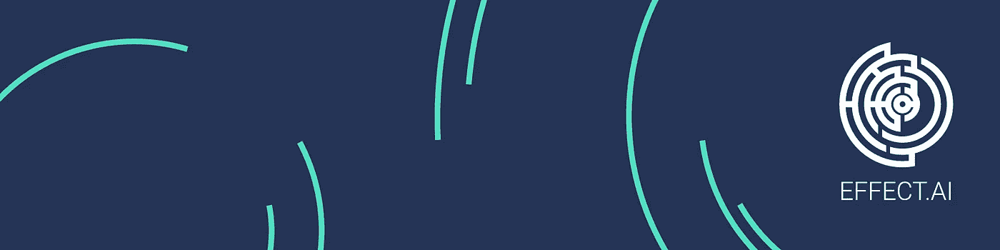

# Effect.ai 和警队的最新情况

> 原文：<https://medium.datadriveninvestor.com/update-on-the-state-of-affairs-of-effect-ai-and-the-force-5dbea65ff011?source=collection_archive---------13----------------------->

好吧！效果。AI token EFX 已经在 EOS 区块链上很好地安顿下来，看起来第一批果实即将被采摘:原力的整个更新版本将于 7 月 10 日在 EOS mainnet 上运行。那些不知道原力的人可以点击[这里](https://www.youtube.com/watch?v=sFYRujgcH0o)或者阅读我的博客[这里](https://medium.com/@markwesterweel/the-force-awakens-i-got-to-test-the-effect-ai-first-phase-beta-e9ae45d6861a)。简而言之:Effect Force 是数据科学团队“请求者”和被称为“工作者”的数据注释者之间的联系——是希望他们的人工智能算法得到训练的人和训练算法的人之间的联系。效果。AI 致力于通过 Effect Force 平台为工人提供公平的工资。

虽然任何人都可以作为一名工人加入这支队伍。AI 团队还与联合国合作，在发展中国家建立实体场所，以提供更好的机会和培训，从而提高工人的工作效率。目前，第一个中心已在格鲁吉亚建立，在未来几个月和几年里，将在几个发展中国家建立许多其他中心。佐治亚州的中心正在蓬勃发展(前几天他们出现在国家电视台上),这个项目的完整更新将很快发布。有传言说 Effect 的 CEO 克里斯。下个月 AI 将会在格鲁吉亚中心花一些时间来完成这个第一个中心。发布时我会添加一个链接。个人对此非常感兴趣。

 [## 正在改变行业的 5 个真实世界区块链应用——数据驱动的投资者

### 除非你一直生活在岩石下，否则我相信你现在已经听说过区块链了。而区块链…

www.datadriveninvestor.com](https://www.datadriveninvestor.com/2019/02/13/5-real-world-blockchain-applications/) 

原力是为了让每个人都可以做人工智能开发所必需的微任务。工人可以通过游戏化的方式升级，以证明他们有资格完成需要特定技能的任务(每获得一项资格，工人就可以获得更高报酬的任务…并获得徽章！).最近有一个团队发布的预览版视频，你可以在这里查看。不要忘记；这支部队定于 7 月 10 日出发。新的改进平台将包括:

*   开放工人注册(任何人都可以加入)
*   排行榜(带来竞争)
*   40 枚收藏徽章
*   几个资格和试验任务。
*   5 个新的请求者…也许更多
*   和一些小的系统升级

迁移到 EOS 带来的另一个问题是效果的赌注。AI token EFX。EFX 令牌是请求者和工作者进行交易的方式。引入锁定是为了允许解锁独立于 EFX 令牌的新功能。下注 EFX 有两个主要优势:

*   它减少了循环供给
*   它给予公用事业权标的持有者(EFX)未来的治理权标(NFX)

这个想法是，项目不断向分散化发展。甚至到了核心团队成员可以从日常运作中抽身出来的程度，这也不会以任何方式影响项目。业务模型允许这样做，因为在启动后，初始团队可以专注于请求者的咨询，并为创建指令和任务模板收取费用。对于这种级别的分权，将构建一个 DAC(分权自治社区)。Effect-DAC 将授权 NFX 持有者就他们认为对整个网络重要的内容进行投票。TL；尽快找到 NFX 博士。令牌本身还不可交易，但由于它对 DAC 至关重要，随着我们看到效果网络成为人工智能领域的重要组成部分，它可能会获得一些重要的价值。

当团队从一个区块链过渡到另一个(NEO 到 EOS)时，Switcheo 继续为 EFX 提供交易。这对于支持这个项目是一个很大的帮助，很高兴看到这个 DEX(分散交换)的进展和对 Effect.AI 的支持。

对于那些不知道的人来说，与集中交易相比，分散交易尊重交易者的交易数据集，因此令牌永远不会离开交易者的拥有。引用安德烈亚斯·m·安东诺普洛斯的话:“不是你的钥匙。不是你的硬币。”这实际上意味着如果你不能提供正确的文件，你就不能证明所有权。你拥有你的资产的权利是无效的，因为所有权的要求不被接受。

以我的经验(这种经验等于大多数人不关心谷歌搜索)，人们只想以最快的方式投资他们的钱，没有任何负担。很少有人关心种子记忆法或注册币安的区别——他们被困在开立银行账户和安全的舒适区。

关于账目之类的旁注。散布对于 EOS 相关的登录非常有效(因此对于效果也是如此)。AI 产品)，但是有一个小 bug:如果导入你的账号(从而导入钱包)/密钥)，你需要使用 JSON 文件的种子，并填写你的密码。然后关闭程序，输入你的密码。如果你不这样做，它会一直说你输入了一个错误的密码。

最近，Chris 在官方电报频道[t.me/effectai](https://t.me//effectai)做了一个非常广泛的 AMA，来自社区的优点是理由，Chris 以非常专业和透明的方式回答了这些问题。去年，在核加密的冬天，加密领域的事情并不容易(BTC 以残酷的方式抬高或压低价格)，所以很高兴看到效果。AI 是不仅幸存下来而且还在继续建设的项目之一，并准备向世界展示他们一直在做的事情。

克里斯取笑的一件事是一个即将发布的产品，名为“X 项目”，目前我对此一无所知。我毫不怀疑它会给这个项目带来一些伟大的东西。我个人猜测，这将与 EOS 区块链有关。或许与 EOS 将于今年晚些时候发布的新社交媒体平台 VOICE 有关。我的猜测和其他人一样好。

如果你或你认识的任何人对通过 effect.ai 平台、Effect Force 训练 AI / ML 算法感兴趣，请随时留下评论，我会让你与 Chris 或可以提供帮助的团队成员联系。

我期待着 6 月份的更新，如果博客发布了，我会及时更新。

感谢阅读！

[网页](https://effect.ai) | [电报](https://t.me/effectai) | [推特](https://twitter.com/effectaix) | [脸书](https://www.facebook.com/effectai)|[Youtube](https://www.youtube.com/c/EffectAi)|[Github](http://github.com/effectai)|[Reddit](https://reddit.com/r/effectai)|[Linkedin](https://linkedin.com/company/effectai/)|[Medium](https://medium.com/@effectai)|[ste emit](https://steemit.com/@effectai)