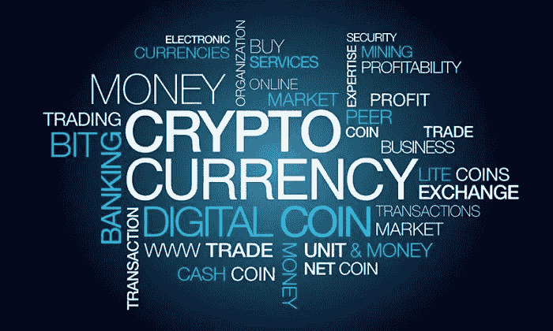
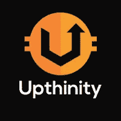

# “上升”是 Bounty 平台的一种趋势方法

> 原文：<https://medium.datadriveninvestor.com/uptheruim-as-a-trending-approach-for-bounty-platform-d88b46cf0062?source=collection_archive---------44----------------------->

随着世界各地不同的人将最新的创新带给世界，业务每天都在扩大。因此，在加密货币市场中存在建立用于投资活动的新的在线业务的良好需求。

总的来说，加密货币市场目前波动很大，影响了世界上的许多商业活动。因此，人们比以前更倾向于在密码市场寻求更多的投资机会。

> 此外，赏金活动现在在加密市场上很受欢迎，因为人们对在线商业活动感兴趣，以赚取更多的钱，这在商业世界中是一个重要的事实。

**什么是上升？**

An innovative crypto app hub

“想象一下，访问一个应用程序加密中心，满足您的日常加密需求！通过一个生态系统，在日常生活中使用各种应用程序使用 crypto 从未如此简单。例如，即使你是新手，一些应用程序也能帮助你像专业人士一样交易市场，一些应用程序能让你轻松花掉你在亚马逊、易贝、Etsy 等你最喜欢的在线商店赚来的密码，甚至能为你早上的一杯咖啡买单。

**我们为什么要依靠上升？**

加密市场上有很多区块链，但“高性能”可以弥补我们通常在其他区块链产品中观察到的重大缺陷。“Upthinity”能够将用户的所有加密需求集中到一个地方，提供五个核心应用程序，如**Joobra.com、MyTokenSwap、UpthinityPay、Ryze Alerts 和 UPZ 令牌。因此，这是一个非常重要的优势。此外，所有的升级活动现在都可以在唯一安全可信的平台上进行:bountyhive，这对所有的加密用户来说都是一个显著的优势。**

**什么是赏金战役？**

在 bountyhive 平台中有很多 upthinity bounty 活动；facebook，twitter，翻译，Reddit，视频，文章。你需要做的就是按时报名所有的赏金战役，完成分配的任务就能获得奖励。它每天为高端用户提供赢取 UPZ 代币的机会。

**问题解决**

1.  低交易费用

UPZ 代币的交易费用非常高，这是 UPZ 持有者比其他代币节省更多钱的重要优势之一。对于加密用户来说，快速兑现他们的代币是容易、舒适和负担得起的。

2.更可靠

一些赏金平台故意终止他们的赏金任务，然后让自己消失，让加密用户陷入困境。由于 Upthinity 出现在 bountyhive 平台上，所有加密用户都可以信任赏金战役。

3.强劲的区块链经济

我们想要的是实际上高效且有效的东西。Upthinity 能够为用户提供及时的加速项目，从而获得很多好处。

4.轻松支付

UPZ 提供更透明的在线支付系统，而不是使用另一个不同的钱包来存储代币，然后将其兑现。现在，为了优化您的日常交易，我们可以用优惠价支付我们的日常开支

> 根据我的经验，作为 Upthinity 的用户之一，我非常荣幸地拥有 Upthinity 提供的所有好处，以增强我的加密活动比以往任何时候都容易。由于富裕提供了巨大的区块链经济，每个人都将有一个很好的机会每天赚更多的钱。

我希望这篇文章能帮助你更好地了解区块链。祝你好运…

舍哈拉