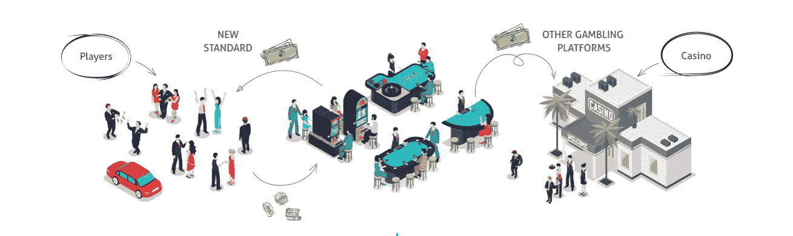
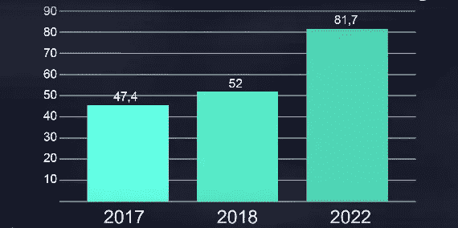
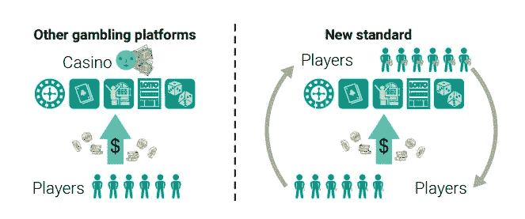
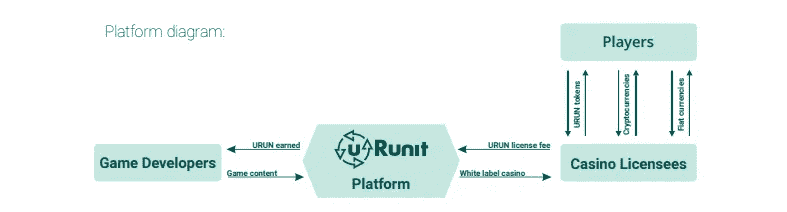
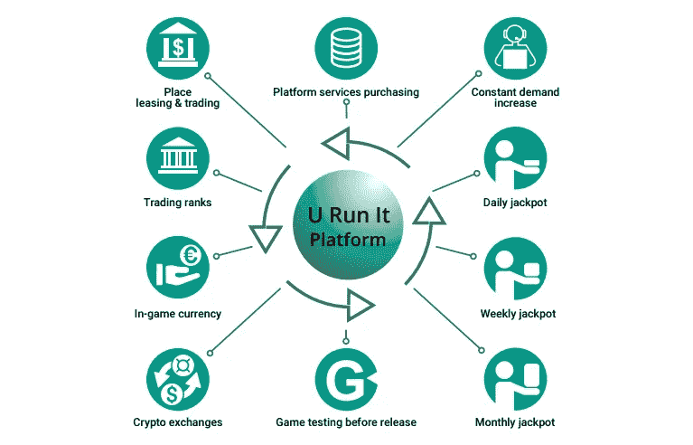
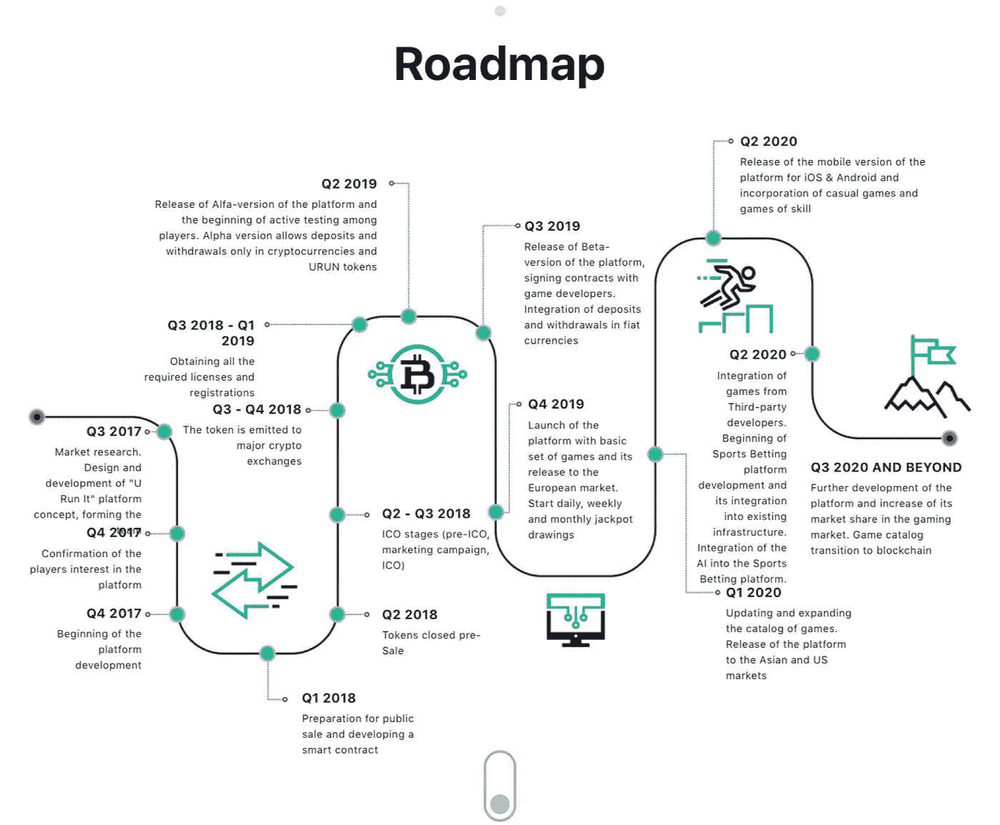

# URunIt:将加密货币融入在线赌博。

> 原文：<https://medium.datadriveninvestor.com/urunit-integration-of-blockchain-technology-and-cryptocurrency-in-online-gambling-4670393d285f?source=collection_archive---------11----------------------->

## 项目审查

Fig 1: The URunIT Platform and Others.

相对于全球经济的其他方面，如石油和天然气、运输和物流、农业、安全、水产养殖、工程、艺术、IT 和社交媒体等，博彩业无疑是世界经济馅饼中最大的经济体之一(你可以把它想象成一个比萨饼，博彩业在整个盒子中占的份额比大多数其他市场都多)。这个市场领域的增长曲线似乎正以指数速度增长。下面的图 2 显示了过去一年到未来五年博彩业的增长率，以十亿美元计，因为市场预计在此期间将达到 817 亿美元的历史最高水平。

fig 2: The Growth Rate of Gambling Industry.

## 逆潮流而动的市场困境。

Urunit 是一个在线赌博平台，就像其他所有赌博平台一样，自 20 世纪 90 年代初成立以来，该行业遇到了许多挫折，尽管赌博市场是一个非常有前途的市场，但这些特点往往会成为该行业发展的障碍。可以进一步强调这方面的一些共同原因；

Fig 3: Eradicating Casino Conglomerate Monopolies

*   **赌场老板是最大的赌徒**

由于这些赌场老板本身也是赌徒，要击败这个系统变得非常困难，因此玩家的回报并不总是有保证的。因此，无法保证持续的赞助，因为这些玩家往往会失去比他们实际计划花费更多的钱，因此他们只有在看到更好的获胜机会时才会参与，而不是相反。URunIT 平台是基于社区的，因此没有管辖权垄断，因为每个用户都可以影响平台上的其他用户，也可以被其他用户影响。

Fig 4: Platform Diagram.

*   **吸引新客户的繁琐任务**

作为顾客不满的结果，赌博世界往往被进一步限制在某些个人身上，这些人不仅拥有金钱，还拥有意志力来承受这个行业对其竞争者造成的精神和心理上的沮丧。因此，为了吸引新客户进入系统，赌博组织必须以广告投放和媒体发布的形式做大量资本密集型工作。URunIT 生态系统旨在为用户提供便利，因此它包括一些工具，以帮助促销/广告投放活动。有了平台上用户可支配的正确工具，游戏主持人只需“点击一个按钮”，就可以启动游戏并开展广告活动来吸引新用户到平台。这些活动被发送到与平台同步的第三方媒体广告应用程序。

Fig 5: Token Holder Benefits.

*   **顾客几乎总是不满意**

默认情况下，传统的赌博系统正在被操纵，以有利于托管池的赌场，留下很少的空间来满足客户的兴趣，因此，这对于赌场所有者和喜欢游戏但对这些池如何进行和运行几乎没有发言权的游戏玩家来说，都是一个重大挫折。随着 URunIT 平台的到位，玩家越来越满意，因为他们继续深入探索 URunIT 生态系统，他们往往会发现向他们开放的惊人机会，例如托管付费游戏并从中赚取利润，以及私人游戏，在私人游戏中，他授权邀请朋友，出售他作为自己托管的游戏的所有者的权利，达到可以与其他用户交易的排名水平，因为这些排名可以向用户开放某些特权，例如有资格参与平台的头奖抽奖游戏。

Fig 6: Project Roadmap.

**Urunit.io 网址:**

[T3【https://www.urunit.io/】T5](https://www.urunit.io/)

**电报通道:**

[*https://t.me/urunit*](https://t.me/urunit)

**URunIT Bitcointalk ANN 线程:**

[*https://bitcointalk.org/index.php?topic=3396208*](https://bitcointalk.org/index.php?topic=3396208)

**白皮书:**

[https://www.urunit.io/docs/whitepaper_eng.pdfT21](https://www.urunit.io/docs/whitepaper_eng.pdf)

**URunIT Bitcointalk 赏金线程:**

[*https://bitcointalk.org/index.php?topic=3548786.0*](https://bitcointalk.org/index.php?topic=3548786.0)

**作者的 Bitcointalk:**

[*https://www.bitcointalk.org/index.php?action = profileu = 2187995*](https://www.bitcointalk.org/index.php?action=profile;u=2187995)