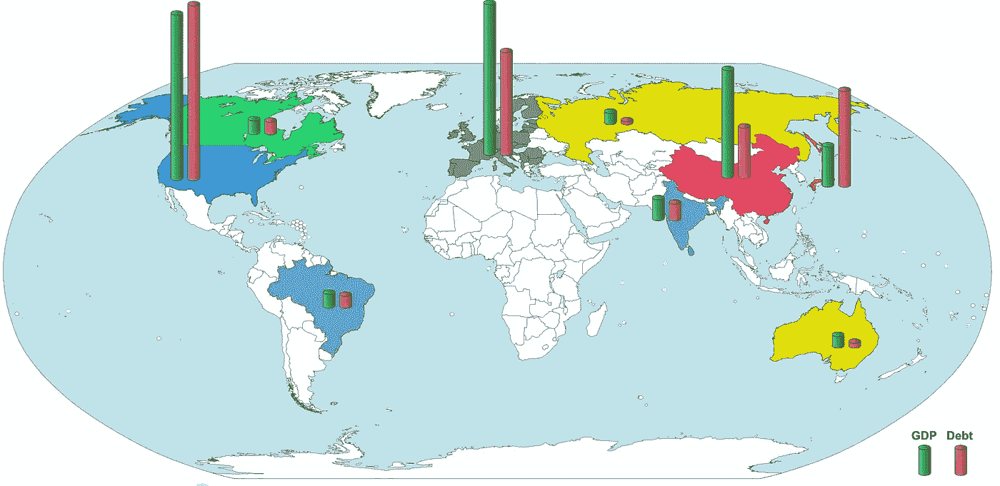

# 22 万亿美元的债务？放松点。

> 原文：<https://medium.datadriveninvestor.com/us-22-trillion-indebt-relax-e4fd948fbf6c?source=collection_archive---------1----------------------->

GDP and Debt of Major Economies ([Subscribe to get free, full A3 PDF version.](https://economicsfor.business/the-big-picture/))

政府沉迷于令人垂涎的债务，从未偿还。我坚信这是灾难性的，但这是错误的，那么是什么改变了我的想法呢？

# 在我们开始之前…

政府赤字和 T2 国债这两个术语有时会被混淆。

*   当一个政府一年的支出超过税收时，它就有赤字。(如果一个政府量入为出(哈！)，它有盈余。)
*   国债是政府多年赤字的结果，从未完全偿还其累积的贷款。

这并不陌生。也许有人只是勉强度日，遭遇了一连串的厄运。洗衣机坏了，然后汽车服务的费用比预期的要高。他或她必须把所有的钱都记在信用卡上，并且只能偿还利息。

 [## 为什么包容性财富指数比 GDP 更能衡量社会进步？|数据驱动…

### 你不需要成为一个经济奇才或金融大师就能知道 GDP 的定义。即使你从未拿过 ECON 奖…

www.datadriveninvestor.com](https://www.datadriveninvestor.com/2019/03/08/why-inclusive-wealth-index-is-a-better-measure-of-societal-progress-than-gdp/) 

新的一年从负债开始，情况变得更糟。屋顶漏了，但幸运的是他或她的信用仍然良好。贷方增加了信用额度，屋顶也修好了。然而，由于利息消耗了可支配收入，所以人们勒紧了裤腰带。

# 政府能获得抵押贷款吗？

政府债务和个人债务之间的比较很吸引人，但也有缺陷。尽管它让我们对正在发生的事情有所了解，但拼图的某些部分并不合适。

我什么意思？

首先，个人必须证明他们最终会偿还贷款。例如，如果你在 2019 年申请抵押贷款，你会被问及你的收入、每月支出和任何现有债务。

如果你像一个政府，你会说这样的话。我的收入相当稳定，但多年来我一直无法平衡预算。事实上，我从来没有，而且——不——我也不会改变我的方式。哦，是的，我债台高筑。

我想知道抵押贷款提供商会怎么说？

鉴于这种前景，令人惊讶的是，发达国家普遍存在国家赤字和债务(见上图)。这不是失常。政府是如何逃脱惩罚的？他们为什么想要逃脱呢？没有人喜欢负债。

是吗？

# 免费的钱和免费的投票

简而言之，贷款为棘手的问题提供了一个明显无痛、选民友好的解决方案。与税收不同，似乎没有人会受到伤害。

左倾政府总是乐于承担债务，将需求置于谨慎之上。他们怀疑(甚至敌视)T4 的资本主义思想。他们说，资本主义的问题在于，盲目的、非道德的市场力量决定谁赢谁输，对自然正义漠不关心。

拥有道德指南针的国家应该决定谁该得到什么。多数人的需求应该超过少数人的富裕。向富人征税(可悲的是)只能让你到此为止，所以借钱吧，因为这是正确的做法。借款带给你的是明天的问题。

# 右转左转

右翼政客曾声称他们对债务持保守态度。作为资本家，他们相信市场是令人不安的达尔文式的生活现实。人们通过努力工作和节俭获得了他们应得的份额。

在英国，玛格丽特·撒切尔明确表达了这种态度:

> 而不是积累赤字让后代来支付。我们正在偿还债务。我们的预算有盈余。我们正在卸下孩子们肩上的重担。

[*1988 年在保守党妇女大会上的演讲*](https://www.margaretthatcher.org/document/107248) *。*

然而，右翼似乎已经改变了论调。共和党总统乔治·W·布什将美国国债从 2001 年的 3.3 万亿美元增加到 2008 年底的 6.4 万亿美元。唐纳德·J·特朗普计划在其第一个任期内增加 5 万亿美元的国家债务。

我不是唐纳德·J·特朗普的崇拜者，但如果说他有什么长处的话，那就是自我保护。他不认为庞大的美国国债(2019 年为 22 万亿美元)是迫在眉睫的威胁。在池塘的另一边，鲍里斯·约翰逊(英国特朗普)正热情地向你关心的任何问题砸钱。

债务是一种新的时尚。

如此杰出的政治家怎么会错呢？将管理一个国家与管理一个家庭相提并论(就像玛格丽特·撒切尔所做的那样)对吗？我们可以肯定地说，因为大量的个人债务可以毁掉一个人的生活，巨额的国家债务会毁掉一个国家吗？

# 合适的债务

也许吧，我捏着鼻子打字(这很有挑战性)。等等，不止一种债务，不止一种债务人。

如果你读了我的文章[金钱:巨大的信心诡计](https://link.medium.com/xc2QkpjbIY)，你会发现关于资本的问题。用金融术语来说，资本是用来购买一种能产生更多钱的资产的钱，那么为什么不借资本来投资呢？如果你做对了，这些债务可能是好的。

政府(有时)借钱作为资本。例如，如果他们修建道路和桥梁，他们就会雇佣工人，反过来工人又会花钱来发展经济。这就是为什么政府支出的某些方面被计入国内生产总值(GDP)这一衡量经济表现的指标。在这种情况下，政府债务更像是公司债务，而不是个人债务。

# 偶然的资本家

与个人债务形成对比。个人很少借钱购买增加财富的东西。通常情况下，是相反的。贷款购买一辆新车，这辆车从展厅开出来的那一刻起就贬值了。

住房是个例外。一对夫妇定居下来，有了孩子，并为家庭房屋办理了抵押贷款。在未来的某个时候，孩子们离开了，这对夫妇缩小了规模。通常房价涨了，他们就赚了。这对夫妇是偶然的资本家。

就连玛格丽特撒切尔(Margaret Thatcher)也会赞赏借钱购买能创造财富的东西。债务可以是好的。

# 合适的债务人

大多数主要国家面临的明显可怕的债务水平可能并不是挥霍和不负责任的。几年、几十年、几个世纪以来，政府有时会借钱来改善长期经济。

这并不意味着我们还没有脱离险境。政府——就像个人和公司一样——必须为债务支付利息。2010 年，英国认为已经借了太多的钱，紧缩是不可避免的。联合政府削减了服务，坚称英国必须量入为出。当时，作为一名英国公民，我同意这一点，因为我不相信免费午餐。

事实证明，就国家而言，我错了，或者至少部分错了。对于控制本国货币和货币供应的政府来说，规则是不同的。政府相对于其他所有人的优势在于，它可以有效地从无到有地创造货币。

# 魔术师还是骗子？

这一点有点令人费解，所以放松点。我们会发现，政府在向自己借款，然后把利息作为利润还给自己。

真的。

当政府想借钱时，它会发行债券，这实际上是借据。他们有固定期限并支付利息。英国政府债券被称为金边债券。美国政府债券被称为国库券。(债券本身至少值一篇文章，但现在让我们保持简单。)

债券被大型机构购买。一种特殊类型的机构可以购买债券:中央银行。中央银行代表政府管理货币供应。让我们以英国为例。

英国政府需要为学校投资提供资金，因此发行了金边债券。英国央行是英格兰银行，即使没有其他人会购买金边债券，它也会购买。(实际上，有很多人会借钱给债台高筑的英国政府。)

英格兰银行从哪里获得资金来购买金边债券？它可以通过多种方式做到这一点，但一种简便的方式是。创建英国政府在英格兰银行账户的信用。政府修建学校，并向英格兰银行支付金边债券的利率。创造或保护工作。

一切都好吗？

# 这条蛇吃它的尾巴

现在等一下。英格兰银行不是英国政府的一部分吗？嗯，这是…某种程度上。英格兰银行作为一家公司成立于 1694 年。1946 年被英国政府收归国有，因此英国政府是英格兰银行的唯一股东。1988 年，议会批准该银行独立，这是时任工党财政大臣戈登·布朗的决定。

然而，它并不是完全独立的。它的管理者由英国财政大臣任命，财政大臣也制定它的目标。该银行可以自由设定利率和货币供应量，但只能实现英国政府设定的目标。

与英国其他任何人不同，政府拥有一家以信贷形式点石成金的公司。英国政府永远不会在紧要关头耗尽信贷，因为它可以发行英国央行将永远购买的金边债券。

英国央行和英国政府之间的这种相互关系可能会产生奇怪的结果。《卫报》2012 年报道称，英国央行将金边债券利息支付给政府，减少了国债。想一想。

[美国管理债务的方式也很有趣。略多于四分之一的债务(26.5%或 5.8 万亿美元)是欠联邦政府的。例如，由于之前的税收盈余，社会保障拥有 2.9 万亿美元的非交易国债。根据法律，盈余必须重新投资于国债。美国政府正在为自己支付利息。](https://www.pewresearch.org/fact-tank/2019/07/24/facts-about-the-national-debt/)

# 胃病

这一切感觉很自由，不是吗？不要担心债务。信用和金钱一样好，只需点击一下鼠标就能创造出来。每个人都有免费午餐，但也许有消化不良的风险。

首先，即使你可以随时自由借贷，你仍然需要支付利息。即使有巧妙的政府会计技术(这将把私营部门送进监狱)，仍然有利息费用，扩大了你试图缩小的赤字。

英国在 2018 年支付了 480 亿英镑的利息(占 GDP 的 4%)，美国政府预计在 2019 年支付 5930 亿美元(略高于 GDP 的 3%)。这笔钱不能用于学校或医院。

一个更大的担忧是，这种偿债方式将政府借款与一个国家的货币供应联系在一起。如果政府债务相对于一个国家的经济来说很小，那就没什么大不了的。如果一个政府持续存在巨额赤字，试图通过创造货币来弥补赤字会造成损害。

# 无价值的价值储存

供求法则适用于货币。市场上的产品越多，其价值就越低。货币是储存价值的产品。如果周围有太多的货币，它就失去了效力，通货膨胀就迫在眉睫。

津巴布韦是恶性通货膨胀的受害者。2019 年 7 月，通货膨胀率为 175.7%，高于当年 5 月的 97.9%。假设美国的通胀率约为 1.6%，英国为 2%。与 2008 年通货膨胀率高达 5000 亿%的津巴布韦相比，175.7%看起来已经不错了。这不是打字错误:5000 亿。津巴布韦是一片废墟。

截至 2019 年 7 月，通货膨胀在西方不是一个问题，尽管各国央行为解决 2008 年金融危机创造了巨额资金。事实上，央行可能会增加货币供应量。

这是为什么呢？

人们认为，货币供应量增加的正常效应被糟糕的商业和消费者信心所掩盖。人们正在偿还债务(或储蓄)，把钱从经济中拿出来。通货膨胀的定时炸弹可能仍在滴答作响。

美国和英国政府(2019 年 7 月)都致力于广泛借贷。英国国债是其 GDP 的 85.2%，美国国债是其 GDP 的 106.1%。他们负债累累。如果利率上升以应对新出现的通货膨胀，哎哟。

# 我们负债累累

政府需要债务。

即使考虑到仅仅创造货币的危险，政府债务(甚至是持续的赤字)也没有我的保守教育让我担心的那么糟糕。如果政府借钱投资，为经济注入活力，就能启动增长。

同样，公共部门雇员在大多数经济体中占据了相当大的比例。确保他们在经济上保持活跃也能提振经济。对一些国家来说，这是正确的做法。

然而，其他国家已经多次打出借款牌。难以预测的是，美国和英国等国家何时会赌太多次。

更多经济信息:

债务取决于金钱和债务，但如果金钱是一个骗局呢？

关税越来越受到美国等政府的欢迎。他们到底伤害了谁？福[在这里找到](https://medium.com/p/c39ea53ccd21/edit)。