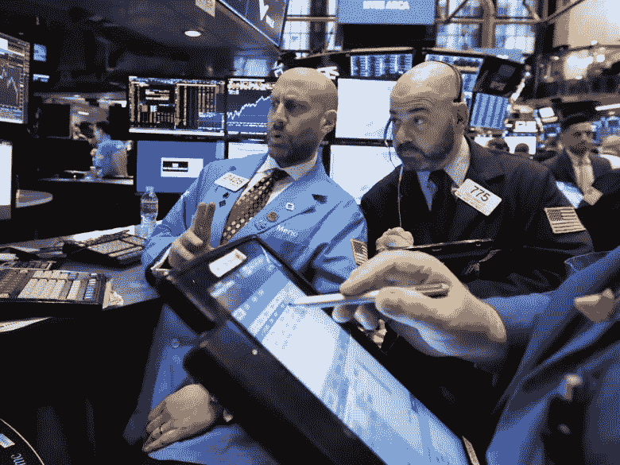
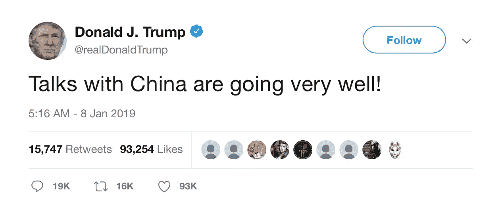

# 美中贸易谈判和乐观情绪

> 原文：<https://medium.datadriveninvestor.com/us-china-trade-talks-and-optomism-f41515cc23b4?source=collection_archive---------44----------------------->

美国股市收盘创下连续三天上涨的新高，乐观情绪扩大了美中贸易谈判。道琼斯工业平均指数上涨 1.09%，至 23787.45 点，标准普尔 500 上涨 0.97%，至 2574.41 点。纳斯达克综合指数上涨 1.08%，至 6897 点。上涨是由房地产、互联网股票和苹果等大型资本技术公司引导的。

美国总统唐纳德·特朗普(Donald Trump)周二上午在推特上发布消息称，谈判进展顺利，突显了美中贸易谈判的势头。

全球最大的智能手机和芯片制造商公司周二对收入发出警告。不到一周前，苹果公司发布了股票预警。三星警告称，第四季度营业利润将下降 29%。

苹果公司股价上涨 1.9%，至 150.75 美元。亚马逊股价上涨 1.66%，至 1656.58 美元。网飞稳步攀升 1.56%，至 320.27 点。

## 股票指数

受三星警告影响，韩国 Kospi 综合指数下跌。

日本日经 225 指数上涨。

斯托克欧洲 600 指数上涨 0.9%。

## 货币

欧元上涨 0.19%，至 1 欧元兑 1.1463 美元

日元兑美元汇率上涨 0.01%，至 108.76

英镑上涨 0.2%，每磅 1.2742 美元

韩元对美元下跌 0.27%至 1120 韩元