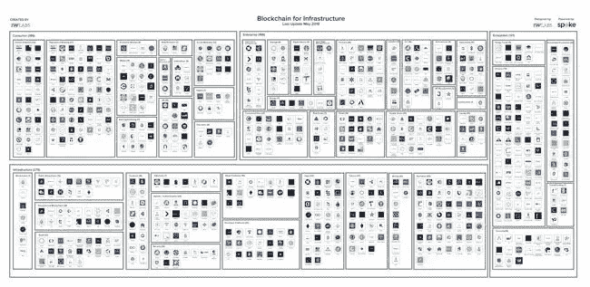

# 美国能源部试验区块链/2021 年区块链标准/ DApps 宇宙扩张

> 原文：<https://medium.datadriveninvestor.com/us-energy-dept-trials-blockchain-blockchain-standards-by-2021-dapps-universe-expanding-3260deb5f6cb?source=collection_archive---------11----------------------->

Photo by [NASA](https://unsplash.com/@nasa?utm_source=unsplash&utm_medium=referral&utm_content=creditCopyText) on [Unsplash](https://unsplash.com/search/photos/energy?utm_source=unsplash&utm_medium=referral&utm_content=creditCopyText)

2019 年 9 月 11 日

本周的版本充满了上周的事件、教育以及区块链、DLT 和 DApps 的动向。 ***美国能源部*** *正在试验区块链，而* **荷兰皇家壳牌**和**麦格理集团** *正在扩大他们在该行业的参与。对话* ***区块链标准*** *开始升温展望 2021 年。* ***区块链智能手机*** *在这里，你关于区块链的前 40 个问题得到了回答，*和*大量研究以及对基础设施、DApps、比特币、DAO/LAOs、经济学和 Stablecoins 的见解。为了了解更多信息，让你跟上时代的步伐，这里有一张本周业内热门新闻的快照。*

## 📖[美国能源部资助 Factom 区块链试验以保护电网](https://www.coindesk.com/us-energy-department-funds-trial-of-factom-blockchain-to-secure-power-grid)

Factom 是最早向企业推介区块链的公司之一，它正在参与一项由美国政府资助的保护国家电网技术的试验。该项目得到了美国能源部(DOE)近 20 万美元的资助，旨在提高数百万台此类设备的安全性。 [TFA 实验室](https://medium.com/u/e908afa1977b?source=post_page-----3260deb5f6cb--------------------------------)，一家物联网(IoT)安全初创公司，正在寻求使用 Factom 的协议来验证网格上的设备不受恶意软件的影响…r [阅读更多](https://www.coindesk.com/us-energy-department-funds-trial-of-factom-blockchain-to-secure-power-grid)

 [## 2019 年十大区块链课程|数据驱动的投资者

### 渴望在区块链发展吗？你想知道区块链是如何工作的，但不知道在哪里？或者就是太多了…

www.datadriveninvestor.com](https://www.datadriveninvestor.com/2019/03/08/top-10-blockchain-courses/) 

## 📖[区块链技术将于 2021 年实现标准化](https://cointelegraph.com/news/research-blockchain-technology-to-be-standardized-by-2021)

据美国商业和金融服务公司穆迪称，区块链技术将在 2021 年实现标准化。本月初发表的报告指出，这些标准将转化为若干优势。该计划主要由国际标准化组织推动，根据发布的公告… [阅读更多信息](https://cointelegraph.com/news/research-blockchain-technology-to-be-standardized-by-2021)

 [## 2019 年十大区块链课程|数据驱动的投资者

### 渴望在区块链发展吗？你想知道区块链是如何工作的，但不知道在哪里？或者就是太多了…

www.datadriveninvestor.com](https://www.datadriveninvestor.com/2019/03/08/top-10-blockchain-courses/) 

## 📖[全球首款区块链智能手机将在孟加拉推出](https://www.thedailystar.net/bytes/world-first-blockchain-smartphone-be-launched-in-bangladesh-1797703)

据报道，世界上第一款支持区块链的智能手机 Finney 将于今年 10 月在孟加拉国发布，由 Sirin Labs 设计和制造。这款区块链智能手机被认为是与三星 Galaxy S10 和苹果 iPhone XS 一起在全球销售的最昂贵的智能手机之一。… [阅读更多](https://www.thedailystar.net/bytes/world-first-blockchain-smartphone-be-launched-in-bangladesh-1797703)

## 📖[中化集团与壳牌、麦格理讨论区块链平台:消息来源](https://www.reuters.com/article/us-china-sinochem-blockchain-idUSKCN1VQ16N)

中化能源技术有限公司是国有石油和化工公司中化集团的子公司，正在与荷兰皇家壳牌公司和麦格理集团进行谈判，以建立一个能源区块链平台。壳牌和麦格理在 7 月份签署了一份谅解备忘录，探讨建立一个区块链原油平台，这是中化集团旗下具有增长潜力的孵化器项目之一。根据谅解备忘录，公司还同意研究投资公司本身的可能性……[阅读更多](https://www.reuters.com/article/us-china-sinochem-blockchain-idUSKCN1VQ16N)

## 📖 [Tether 在以太坊区块链上推出中国人民币钉住稳定币](https://www.coindesk.com/tether-launches-chinese-yuan-pegged-stablecoin-on-the-ethereum-blockchain)

Tether 宣布将离岸人民币(CNH)加入他们支持的货币篮子，并推出新的稳定货币 CNH₮.CNH 代表着 [Tether 的](https://tether.to)功能在促进传统货币的数字使用方面的进一步扩展，如美元(USDT)和欧元(欧元)。CNH₮与 CNH 挂钩，最初将仅在区块链以太坊作为 ERC-20 代币出售……[阅读更多信息](https://www.coindesk.com/tether-launches-chinese-yuan-pegged-stablecoin-on-the-ethereum-blockchain)

## 📖[这些创业公司展示了区块链在各个行业的潜力](https://www.forbes.com/sites/joresablount/2019/09/05/these-startups-show-blockchains-potential-in-various-industries/#5629470b6e0b)

根据 ABI 研究，随着分散网络解决许多行业的问题，区块链公司在未来几年的收入将达到 100 亿美元并不奇怪。据国际数据公司称，2018 年至 2023 年间，该技术的 5 年复合年增长率(CAGR)将达到 76%……[阅读更多信息](https://www.forbes.com/sites/joresablount/2019/09/05/these-startups-show-blockchains-potential-in-various-industries/#5629470b6e0b)

> *👉查看* [*区块链基础设施景观*](http://click1.m.readwritelabs.com/qhsryffgnhmtrybjtvpqhtdjyctwvwvshjshrqwfgsss_yfqbfcmslnskglmckvqv.html?source=post_page---------------------------)

## 📖[基于移动的加密货币受到区块链共同发明人的称赞](https://cointelegraph.com/news/mobile-based-cryptocurrency-praised-by-coinventor-of-blockchain)

在回顾旨在通过允许在没有银行账户的情况下通过智能手机发送和接收资金来开创数字支付新时代的 Electroneum 时，全球知名科学家和密码学家 Scott Stornetta 表示，他对该公司为最终用户提供价值的驱动力印象深刻——这一动机在加密货币项目中并不像人们想象的那样常见……[阅读更多](https://cointelegraph.com/news/mobile-based-cryptocurrency-praised-by-coinventor-of-blockchain)

## 📖[区块链计算的层次(不是时代)](https://jessewalden.com/layers-not-eras-of-blockchain-computing/)

接下来——区块链计算的“服务器”和“云”时代——不太可能杀死以太坊，而是扩展相邻的可能性，并托管一组利用其独特功能的不同应用… [阅读更多内容](https://jessewalden.com/layers-not-eras-of-blockchain-computing/)并确保查看更多由[杰西·瓦尔登](https://jessewalden.com/)撰写的文章

## 📖[老挝:一个以营利为目的的有限责任自治组织](https://medium.com/openlawofficial/the-lao-a-for-profit-limited-liability-autonomous-organization-9eae89c9669c)

自 2013 年[首次提出以来，分散自治组织(Dao)的概念已经激活了区块链开发者的梦想。对许多人来说，这些互联网本地组织代表着社会和经济协调发展的下一步，区块链技术和智能合同简化了投票、决策和数字资产的分配……](https://letstalkbitcoin.com/is-bitcoin-overpaying-for-false-security)[阅读更多](https://medium.com/openlawofficial/the-lao-a-for-profit-limited-liability-autonomous-organization-9eae89c9669c)并确保通过[OpenLaw](https://medium.com/u/1e3a3c20a3c9?source=post_page-----3260deb5f6cb--------------------------------)&[The LAO](https://medium.com/u/61217eadf32d?source=post_page-----3260deb5f6cb--------------------------------)查看更多信息

## 📖[区块链 40 个最常见问题的答案](https://media.consensys.net/answers-to-the-40-most-asked-questions-about-blockchain-2b69d1191801)

ConsenSys 团队收集了关于区块链的 40 个最常被问到的问题(根据谷歌)，并在一个方便的地方回答了所有问题。您可以查看 [ConsenSys 知识库常见问题解答](https://consensys.net/knowledge-base/blockchain-super-faq/)中的所有答案，或者在闲暇时阅读下面的内容。该列表涉及区块链基本面、比特币、以太坊、采矿和发展路线图。… [阅读更多](https://media.consensys.net/answers-to-the-40-most-asked-questions-about-blockchain-2b69d1191801)并确保查看更多 [ConsenSys](https://medium.com/u/6c7078bf7b01?source=post_page-----3260deb5f6cb--------------------------------)

# 分散式应用程序手表

## 📖 [Telegram 终于发布了价值 17 亿美元的区块链代码](https://www.coindesk.com/telegram-finally-releases-code-for-its-1-7-billion-ton-blockchain)

基于云计算的即时通讯服务 [Telegram Messenger](https://medium.com/u/dca24e3a130c?source=post_page-----3260deb5f6cb--------------------------------) 发布了在测试网络门户上运行区块链节点的代码。吨区块链设计作为一个证据的利害关系协议，支持多个 shardchains。现在，区块链感兴趣的社区成员和开发者可以开始尝试完整节点、验证器节点和区块链浏览器……[阅读更多](https://www.coindesk.com/telegram-finally-releases-code-for-its-1-7-billion-ton-blockchain)

## 📖[经济破坏:从管道到平台，再到 dapp](https://medium.com/@liquidapps/economic-disruption-from-pipelines-to-platforms-to-blockchain-4bdfc7ee82f0)

*随着* [*第四次工业革命*](https://en.wikipedia.org/wiki/Fourth_Industrial_Revolution) *加速发展，* ***分散化*** *平台正迅速成为协调经济活动的有力手段，开启价值创造和交换的新模式。DAPP 网络正在通过为一套强大的开发者服务创造一个市场来推动平台革命:分散存储、RAM 兼容内存、跨区块链可操作性等等*……[阅读更多](https://medium.com/@liquidapps/economic-disruption-from-pipelines-to-platforms-to-blockchain-4bdfc7ee82f0)并确保通过[liquid PPS](https://medium.com/u/111b26bf40a9?source=post_page-----3260deb5f6cb--------------------------------)查看更多

## 📖[dApps 宇宙正在膨胀，第一站:三星星系](https://beincrypto.com/the-dapps-universe-is-expanding-first-stop-samsung-galaxy/)

智能手机巨头三星和新加坡开发公司 TrustVerse 合作开发了三星 Galaxy S10，其内置的 dapp 商店支持 TrustVerse 的一些行星灵感应用程序，并承诺将推出更多应用程序。截至今天，只有两个 dApps 目前列在区块链密钥库中，而 [TrustVerse](https://medium.com/u/d862869ebb1c?source=post_page-----3260deb5f6cb--------------------------------) 拥有一个完整的家族……[阅读更多](https://beincrypto.com/the-dapps-universe-is-expanding-first-stop-samsung-galaxy/)

## 📖[蒂姆·德雷珀加入总部位于 EOS 的 DApp 公司董事会](https://cointelegraph.com/news/tim-draper-joins-board-of-directors-at-eos-based-dapp-firm)

美国风险投资家和比特币牛市[蒂姆·德雷珀](https://twitter.com/TimDraper)加入了位于 EOS 的分散应用(DApp)公司 MakeSense Labs 的董事会。他是使用 EOS 网络的分散式消息应用 [Sense Chat](https://www.sense.chat/) Labs 的早期投资者。蒂姆·德雷珀的估计加密资产净值在 3.5 亿至 5 亿美元之间……[阅读更多](https://cointelegraph.com/news/tim-draper-joins-board-of-directors-at-eos-based-dapp-firm)

# 🎧我在摇什么:

本周，我在听布洛克与 Paxos 的首席执行官兼联合创始人查尔斯·卡斯卡瑞拉的对话。 *Paxos 在区块链生态系统中身兼多职。它提供了一种更著名的稳定硬币，PAX。运营一个加密货币交易所，这是 itBit，该公司提供产品，帮助大公司使用区块链来改善他们的结算系统。但是 Paxos 的核心(据首席执行官 Charles Cascarilla 所说)是将金融系统转移到区块链——他说这是一个可以防止像 2008 年那样的金融灾难的举动。在本期独家新闻中，卡斯卡瑞拉谈到了稳定硬币的发展，以及为什么稳定硬币是商人更好的选择。*

 [## The Scoop 与 Paxos 首席执行官兼联合创始人查尔斯·卡斯卡利拉的对话

### 编辑描述

扩音器. link](https://megaphone.link/BLOCK4614612130) 

👉[下载](http://click1.m.readwritelabs.com/qhsryffgnhmtrybjtvpqhtdjyctwvwvshjshrqwfgsss_yfqbfcmslnskglmckvqv.html?source=post_page---------------------------)基础设施领域的完整区块链

The Blockchain Landscape — Q2 2019 Edition

不想等到下周，[现在就订阅](http://click1.m.readwritelabs.com/xsdqkbbrgsdtqkmntpjlstcnkytvpvphsnhsqlvbrhhd_yfqbfcmslnskglmckvqv.html?source=post_page---------------------------)📥有关区块链、DApps 等的实时行业见解！