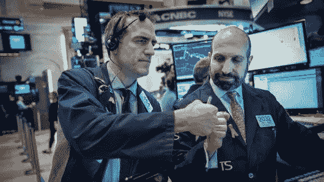

# 美国股市反弹抹去周四下跌

> 原文：<https://medium.datadriveninvestor.com/us-stocks-bounce-back-erasing-thursday-falls-cdbba96b756c?source=collection_archive---------18----------------------->

随着一系列积极消息缓解了对全球经济和利率的担忧，华尔街卷土重来，抹去了前一天的所有损失。

标准普尔 500 股价上涨 3.43%，至 2531.94 点。道琼斯指数上涨 3.29%，至 23433.16 点。纳斯达克指数上涨 4.26%，至 6738.86 点。中国提到贸易谈判将持续到下周，美联储主席杰罗姆·鲍威尔表示，央行将对利率持开放态度。

苹果股价上涨 4.27%，至 148.26 美元。在今天之前，苹果已经从 10 月份的最高点下跌了 39%。标准普尔 500 的科技股表现最好，上涨了 4%。主要科技公司推动了上涨，亚马逊上涨 5.01%，至 1575.39 点，微软上涨 4.65%，至 101.93 点，谷歌上涨 5.38%，至 1070.71 点，网飞上涨 9.72%，至 297.57 点。自平安夜以来，网飞已经上涨了 27%。

## 货币

欧元上涨 0.01%，至 1 欧元兑 1.1395 美元

日元兑美元汇率上涨 0.77%，至 108.51

英镑上涨 0.75%，至每磅 1.2723 美元

韩元兑美元下跌 0.3%，至 1124.45 韩元