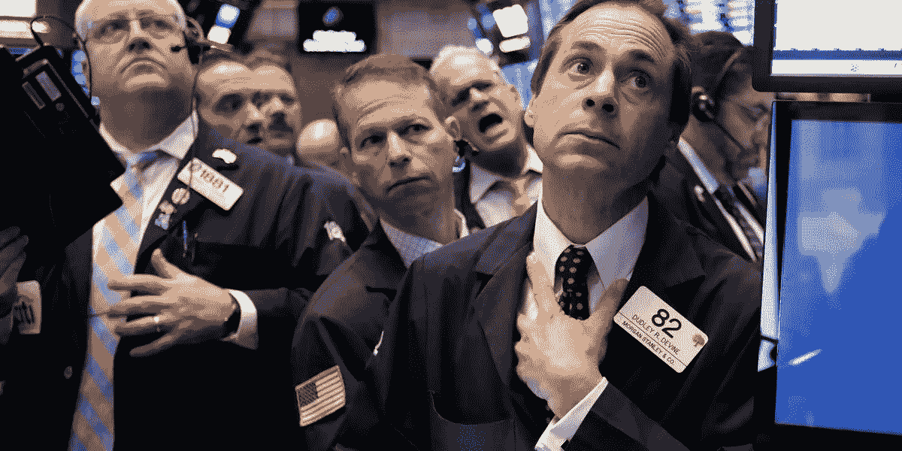

# 美国股市下跌，因为经济形势紧张

> 原文：<https://medium.datadriveninvestor.com/us-stocks-fall-as-there-is-tension-in-the-economy-cb60e54a1ab6?source=collection_archive---------35----------------------->

据彭博称，由于投资者继续对贸易、政治动荡和经济增长感到紧张，美国股市连续第五天下跌。据报道，原油停止了最长的连跌。

标准普尔 500 指数跌至两周以来的最低水平，此前民主党人对修改北美自由贸易协定协议和出售苹果公司的想法提出了质疑。这重新引发了对科技巨头收益已经见顶的担忧。

思科股价周三在盘后交易中上涨超过 4%，此前该公司公布每股收益 0.75 美元，超过分析师预期的 0.72 美元。该公司的收入也超过了预期，达到 130.7 亿美元，而预期为 128.7 亿美元。

在伯克希尔哈撒韦公司上个季度增持超过 3500 万股摩根大通股票的消息传出后，摩根大通股价上涨超过 1.5%。

在伯克希尔·哈撒韦公司宣布持有甲骨文公司 4140 万股股份后，甲骨文公司的股价飙升了 3%。伯克希尔报告称，它持有约 21.3 亿美元的甲骨文股票。

**股票**

标准普尔 500 收盘时下跌 0.76%。

纳斯达克指数下跌了 0.9%。

**货币**

欧元兑美元上涨不到 0.1%，至 1.1285 美元。

英镑下跌 0.5%，至 1.291 美元。

日元上涨 0.1%，至 1 美元兑 113.65 日元。

**债券**

10 年期美国国债收益率下降 3 个基点，至 3.11%。

德国 10 年期国债收益率下跌不到一个基点，至 0.41%。

英国 10 年期国债收益率下跌两个基点，至 1.501%。

**商品**

西德克萨斯中质原油上涨 1%，至每桶 56.26 美元，这是近三周以来的首次上涨，也是六周以来的最大涨幅。黄金期货上涨 0.8%，至每盎司 1211.40 美元。

天然气期货飙升 17%。

