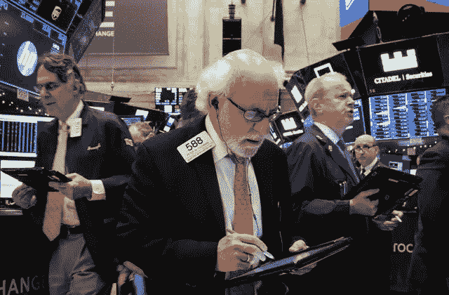
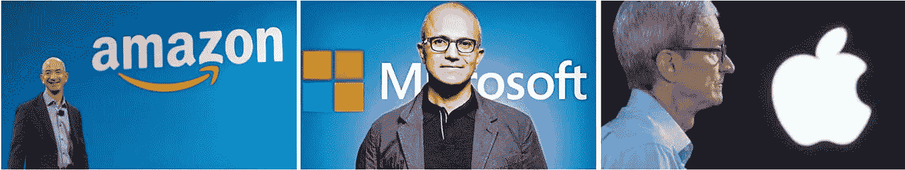

# 美国股市因乐观情绪和成为最有价值公司的努力而上涨

> 原文：<https://medium.datadriveninvestor.com/us-stocks-rally-with-optimism-and-the-fight-to-be-the-most-valuable-company-96c03a28cb04?source=collection_archive---------32----------------------->

道琼斯工业平均指数上涨 1.13%，至 25，826.43 点，标准普尔 500 上涨 1.09%，至 2，790.37 点。纳斯达克综合指数上涨 1.51%，至 7441.51 点。上周，标准普尔 500 上涨了 4.8%，因为投资者将美联储的声明视为美国利率可能不那么激进的迹象。该指数在批准今年第二次 10%的修正后反弹，今年以来上涨了 4.4%。

波音和卡特彼勒这两家被称为全球经济指标的工业公司的股票分别上涨了 3.8%和 2.4%。在油价从最近的下跌中反弹后，能源股上涨了 2.3%。在葛兰素史克公司同意以 51 亿美元收购这家美国癌症专家后，Tesaro 股价上涨 58.5%，突破了上限。

苹果股价上涨 3.49%，亚马逊股价上涨 4.86%，微软上涨 1.08%。

这三家公司正在激烈争夺全球最有价值公司的头衔。“三巨头”在过去的几个交易日里一直在争夺这个头衔，每家公司的资本都超过了 8600 亿美元。周一收盘时，苹果以 8770 亿美元的市场资本领先。亚马逊以 8660 亿美元略落后，微软为 8600 亿美元。