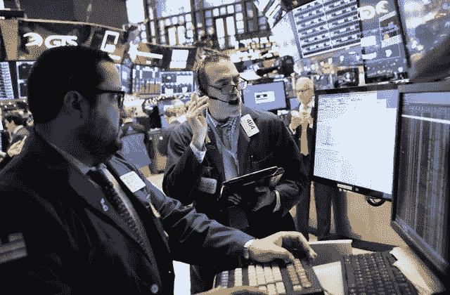
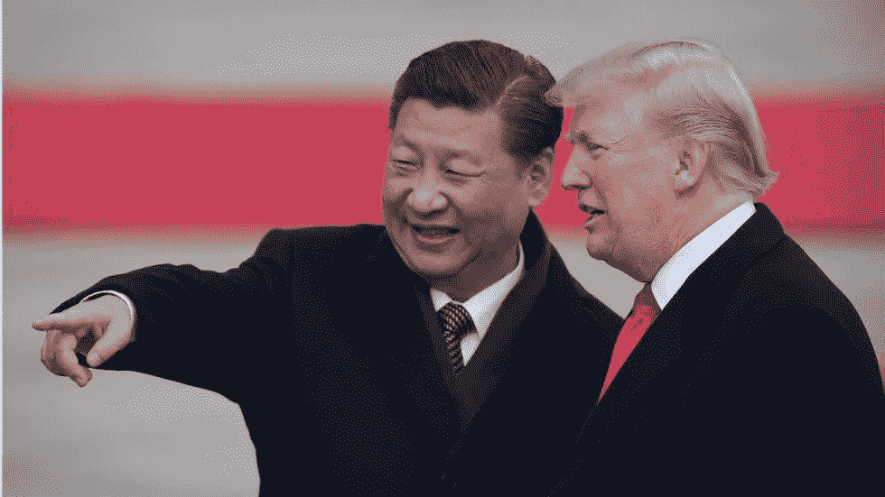

# US stocks rise as investors wait for the presidents of the two economic superpowers to meet

> 原文：<https://medium.datadriveninvestor.com/us-stocks-rise-as-investor-wait-for-the-presidents-of-the-two-economic-super-powers-to-meet-c09ffb2a2470?source=collection_archive---------21----------------------->

All three major indexes rose. S&P 500 rose 0.82% to 2,760.17 as of market closed. The Dow peaked 0.79% to 25,538.46 and the Nasdaq rose 0.79% to 7,330.54.

US President Donald Trump and Chinese President Xi Jinping are planned to have on Saturday and are expecting a discussion on trade issues between the two economic superpowers. Many investors are looking forward to this meeting and are hoping that they would come to a compromise and ease the trade war between the two countries.

Shares of Caterpillar and Boeing increased 4.2 percent and 1.2 percent. These stocks are known as indicators for global trade because of their high exposure to foreign markets.

CNBC has reported that Microsoft surpasses Apple as market ended on Friday. Microsoft had an evaluation of $851.5 billion dollars at the end of the session on Friday. Overcoming Apple’s valuation of $847.4 billion. Shares of Apple fell 0.54 percent to 178.58 per share, and Microsoft rose 0.64 percent to 110.89 per share.

Marriott International reported on Friday that hackers had links to the Starwood guest reservation database from 2014 and it is possible that the personal information of 500 million guests could have been exposed. Shares of Marriott plummeted 5.59percent to 115.03 per share.