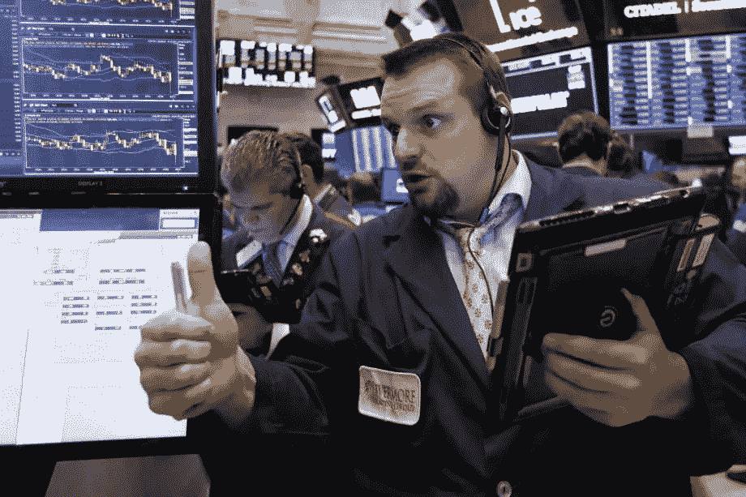

# 美国股市上涨，投资者等待美中贸易进展

> 原文：<https://medium.datadriveninvestor.com/us-stocks-rise-as-investors-wait-for-us-china-trade-progress-f731fa9fa39b?source=collection_archive---------35----------------------->

美国股市周一上涨，许多人在等待中美贸易谈判北京会议取得积极进展的迹象。

标准普尔 500 股市上涨 0.7%，至 2549.69 点。道琼斯工业平均指数上涨 0.42%，收于 23531.35 点。纳斯达克指数上涨 1.26%，收于 6，823.47 点。

亚马逊和网飞推动了华尔街的又一次上涨。S&P 11 个主要板块中有 9 个上涨。非必需消费品的涨幅最大，为 2.36%，领先亚马逊的 3.44%。亚马逊以 7970 亿美元的市值超过微软，成为华尔街最有价值的公司。

投资者正在等待两国之间的结果。这次会议为期两天，定于周二在北京结束。最大经济体之间的贸易战消耗了大量资本。中国央行显示，2018 年外汇储备三降。2018 年，外汇储备减少 672.4 亿美元，至 3.073 万亿美元，而 2017 年增加了 1294 亿美元。

## 货币

欧元下跌 0.18%，至 1 欧元兑 1.1453 美元

日元下跌 0.15%，至 1 美元兑 108.56 日元

英镑下跌 0.05%，至每磅 1.277 美元

韩元兑美元汇率上涨 0.17%，至 1，121.43