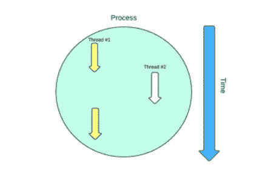
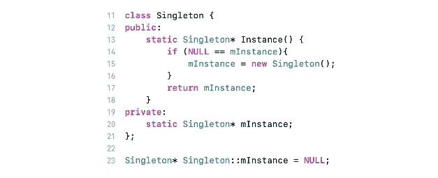
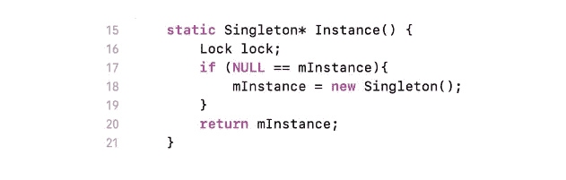
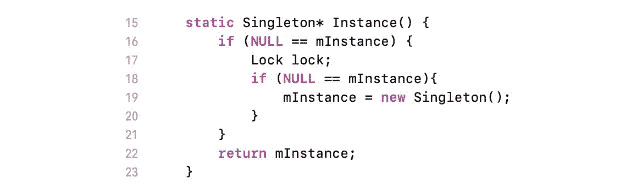
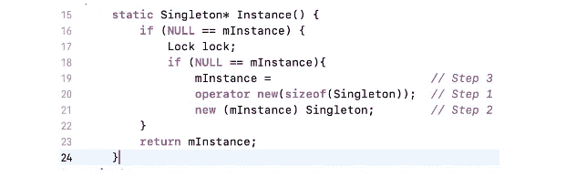

# 单一模式在多线程应用程序中的使用

> 原文：<https://medium.datadriveninvestor.com/usage-of-singleton-pattern-in-multithreaded-applications-ec0cc4c8805e?source=collection_archive---------0----------------------->

在本文中，我们想提出一个关于企业解决方案中代码安全的讨论，这些解决方案必须在零停机和崩溃的情况下全天候工作。有许多关于如何安全地编写代码的最佳实践，但现在我们想谈谈另一件可能给多线程解决方案带来浮动问题的事情。显然，所有软件开发人员都知道什么是单例模式，并且经常在他们的解决方案中使用它。但是并不是每个人都知道 singleton 会给多线程应用程序带来哪些潜在的问题。单例的传统实现是基于第一次请求对象时创建一个指向该对象的指针。

在单线程应用程序中，它通常工作得很好。但是这个世界并非没有不完美之处，当我们致力于真正的生产解决方案时，由于各种原因，我们不能使用单线程应用程序。当我们使用多线程的时候，对单例实例的访问可以从不同的线程中执行，这在构造单例实例的时候可能是一个问题。如果你在 *Singleton::Instance()* 中收到一个中断，从另一个线程调用 *Singleton::Instance()* ，你可以看到你是如何陷入困境的。

假设线程 A 进入实例函数，通过第 14 行执行，然后被挂起。在它被挂起的时候，它刚刚确定 *mInstance* 为空，这意味着 Singleton 对象还没有被创建。线程 B 现在进入实例函数并执行第 14 行。它发现 *mInstance* 为空，所以它前进到第 15 行并创建一个 Singleton 让 *mInstance* 指向。然后，它将*minstace*返回给实例的调用者。稍后，线程 A 被允许继续运行，它做的第一件事是移动到第 15 行，在那里它创建了另一个 Singleton 对象，并使*min instance*指向它。很明显，这违反了单例的含义，因为现在有两个单例对象，其中一个是应用程序的漏洞。

让经典的单例实现线程安全似乎很容易。我们可以在测试*minstace*之前获取锁。

看起来又好又安全。但是，这样的实现似乎是昂贵的。这是因为每次调用 *Singleton::Instance* 都需要获取锁，但实际上，在构造 Singleton 实例时只需要一次。如果我们确切地知道实际上只需要一次锁，我们为什么要为其他锁购买付费呢？

这个问题还有另一个解决方案，叫做双重检查锁定模式(DCLP)。

使用这种方法，我们在锁定之前和获得锁定之后，对*min state*的 NULL 值进行双重检查。只有当 *mInstance* 尚未初始化时，才会获取锁，之后，再次执行测试以确保 *mInstance* 仍然为空。第二次测试是必要的，如上所述，我们可能会遇到另一个线程试图在第一次测试到另一个线程之间初始化*minstate*的情况。定义 DCLP 的论文讨论了一些实现问题(例如，限定单例指针的易失性的重要性，以及多处理器系统上独立缓存的影响，这两个问题我们将在另一篇文章中讨论；以及确保某些读和写的原子性的需要，这在本文中没有讨论)，但是它们没有考虑一个更基本的问题，即确保在 DCLP 期间执行的机器指令以可接受的顺序执行。我们在这里关注的正是这个根本问题。

让我们看看在创建任何类的实例时会发生什么:

这种说法导致了三件必须发生的事情:

*   分配内存来保存单例对象
*   在分配的内存中构造单例对象
*   使 mInstance 指针指向分配的内存

至关重要的一点是，编译器不必按照这个顺序执行这些步骤！特别是，编译器有时被允许交换步骤 2 和 3。他们为什么想这么做，这是我们一会儿要解决的问题。现在，让我们关注一下如果他们这样做了会发生什么。考虑下面的代码，其中我们将 pInstance 的初始化行扩展为上面提到的三个组成任务，并将步骤 1(内存分配)和步骤 3(min instance 分配)合并为一个位于步骤 2(单体构造)之前的语句。这个想法不是人类会写这个代码。相反，编译器可能会生成与此等价的代码，以响应人类编写的传统 DCLP 源代码(如前所示)。

一般来说，这不是原始 DCLP 源代码的有效翻译，因为步骤 2 中调用的 Singleton 构造函数可能会抛出异常，如果抛出异常，重要的是 mInstance 尚未被修改。这就是为什么，一般来说，编译器不能把第 3 步移到第 2 步之上。然而，在某些情况下，这种转变是合法的。也许最简单的条件是编译器可以证明单例构造函数不能抛出(例如，通过后内联流分析)，但这不是唯一的条件。一些抛出的构造函数也可以将它们的指令重新排序，这样就会出现这个问题。鉴于上述翻译，考虑以下事件序列:

*   线程 A 进入方法，执行 mInstance 的第一个测试，获取锁，并执行由步骤 1 和 3 组成的语句。然后它被挂起。此时，mInstance 为非空，但在 mInstance 指向的内存中尚未构造任何单例对象。
*   线程 B 进入方法，确定 min instance 为非空，并将其返回给实例的调用方。然后调用者解引用指针来访问还没有被构造的单例。

只有在执行第 3 步之前完成第 1 步和第 2 步，DCLP 才会起作用，但在 C 或 C++中没有办法表达这种约束。

正如我们所看到的——有各种各样的场景会给像单例模式这样明显的东西带来问题。大多数场景在现实生活中可能不是问题，但在您的解决方案中有可能发生。当它可能发生时，很难发现问题，因为它很少发生或者取决于硬件配置等。为了防止多线程应用程序上的单例初始化，可能可以使用的一种解决方法是在创建任何线程之前，在应用程序 *Main()* 函数中调用 *Singleton::Instance()* 。

*撰稿* [*德米特里·格里察*](https://www.linkedin.com/in/dmitry-gritsay-b6b8327/) *校对* [*伊戈尔·科罗塔奇*](https://www.linkedin.com/in/igor-korotach-806435154)