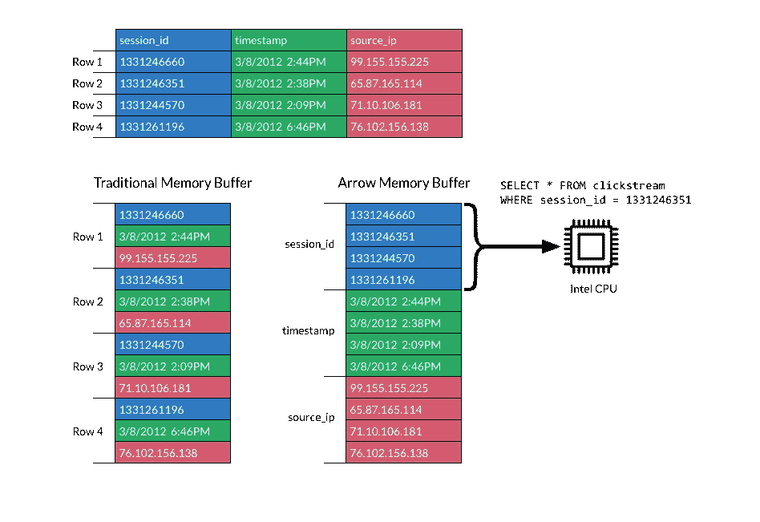
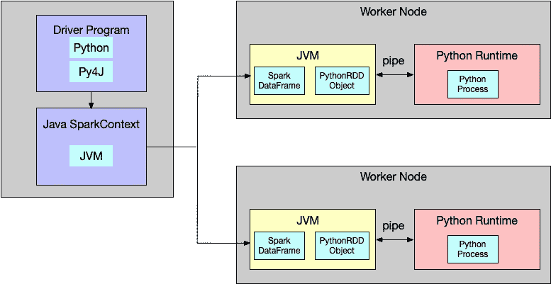

# 使用 Apache Arrow 辅助 PySpark 进行数据处理

> 原文：<https://medium.datadriveninvestor.com/use-apache-arrow-to-assist-pyspark-in-data-processing-6c1cce134306?source=collection_archive---------0----------------------->

[Apache Arrow](https://arrow.apache.org/?spm=a2c41.13497263.0.0) 在 Spark 2.3 中引入。通过列存储和零拷贝提供的技术， [JVM](https://www.javaworld.com/article/3272244/what-is-the-jvm-introducing-the-java-virtual-machine.html?spm=a2c41.13497263.0.0) 和 [Python](https://www.python.org/?spm=a2c41.13497263.0.0) 之间的数据传输效率得到了显著提高。

本文研究了如何使用 Apache Arrow 来帮助 PySark 进行数据处理操作，还讨论了 Apache Arrow 及其在 Spark 中的一般用法，以及如何通过列存储和零复制来提高数据传输的效率。

[](https://www.datadriveninvestor.com/2019/02/21/best-coding-languages-to-learn-in-2019/) [## 2019 年最值得学习的编码语言|数据驱动的投资者

### 在我读大学的那几年，我跳过了很多次夜游去学习 Java，希望有一天它能帮助我在…

www.datadriveninvestor.com](https://www.datadriveninvestor.com/2019/02/21/best-coding-languages-to-learn-in-2019/) 

# 什么是列存储

在我们研究如何在 Spark 中使用 Apache Arrow 之前，让我们先简要了解一下 Apache Arrow 和第一列存储。

要理解列存储，首先需要知道在大数据时代之前，大部分存储引擎都是使用行存储的。很多早期的系统，比如交易系统、ERP 系统，每次都是通过增加、删除、修改、查询来处理一个实体的所有信息。使用行存储，可以快速定位和处理单个实体。但是对于列存储，对一个实体的不同属性的操作需要多次随机读取和写入，这可能非常低效。

但是，随着大数据时代的到来，特别是鉴于数据分析的不断发展，一个任务不需要一次性读取一个实体的所有属性，而是一个任务只关注特定的属性，对这些属性进行复杂的操作，比如聚合。考虑到这一点，需要为行存储读取额外的数据，这反过来会导致系统出现瓶颈。但是，对于新开发的列存储，读取额外数据的过程可以大大减少，相同属性的数据也可以压缩，大大加快了处理速度。

下面是行存储和列存储的比较。摘自阿帕奇箭官网。上部是一个二维表，由三个属性组成:session_id、timestamp 和 source_ip。左边是内存中行存储的表示。数据按行顺序存储，每行按列顺序存储。右边是存储在内存中的列的表示。每个列都是单独存储的，一次写入的列的簇大小是根据属性(如批处理大小)来控制的。因此，当查询语句只涉及几列时(如图中的 SQL 查询)，只需要过滤 session_id 列，以避免读取所有数据列，从而减少大量 I/O 损失。同时，考虑到 CPU 流水线和 CPU SIMD 技术的使用，查询速度将大大提高。



# 那么什么是阿帕奇箭

在大数据领域，Column Store 受到谷歌 2010 年发表的 [Dremel 论文](http://static.googleusercontent.com/media/research.google.com/zh-CN/pubs/archive/36632.pdf?spm=a2c41.13497263.0.0&file=36632.pdf)的启发。Dremel 论文讨论了一种支持嵌套结构的存储格式，并使用列存储来提高查询性能。它还描述了 Google 如何使用这种存储格式来实现并行查询。这篇论文影响了 Hadoop 生态系统的发展。Apache Parquet 和 Apache ORC 已经被 Hadoop 生态系统用作列存储格式，比如 Spark、Hive 和 Impala。

但是阿帕奇箭到底是什么？嗯，按照官网的定义，Apache Arrow 是一种跨语言、跨平台的内存数据结构。从这个定义，我们可以看出阿帕奇箭，和阿帕奇拼花，以及阿帕奇兽人的区别。Parquet 和 ORC 被设计为通过使用基于列存储的高效压缩算法来压缩磁盘数据。例如，Snappy、Gzip 和 Zlib 等算法用于压缩列数据。因此，在大多数情况下，读取数据时会先进行解压缩，这会消耗一些 CPU。对于 Arrow，不支持压缩内存中的数据(支持压缩写入磁盘的数据)。Arrow 通过字典编码模式执行类似的索引操作。

除了列存储，Arrow 在跨语言的数据传输方面也非常强大。Arrow 的跨语言特性显示在 Arrow 规范中。该规范的作者指定了不同数据类型的布局，包括不同原始数据类型在内存中占用的位数、数组数据的组成以及空值的表示。基于这些定义，如果 Arrow 用在不同的平台，不同的语言，采用完全相同的内存结构。

因此，遵循这一点，可以在不同平台和语言之间高效地传输数据。在 Arrow 之前，必须使用序列化和反序列化技术来传输不同语言的数据，这消耗了大量的 CPU 资源和时间。但是，根据规范，Arrow 在内存中具有相同的数据结构，因此 Arrow 内存结构可以通过共享内存和内存映射文件等技术共享，从而消除了序列化和反序列化过程。

# 火花和阿帕奇箭

现在我们已经看了 Arrow，让我们看看 Apache Spark 如何使用 Arrow 来加速 PySpark 处理。长期以来，使用 PySpark 的客户一直抱怨 Python 效率低下。在此之后，许多用户也将他们的开发工作流程转向 Scala。Spark 是用 Scala 语言开发的，JVM 是在底层启动的，而 PySpark 是由 Scala 中的 PythonRDD 对象启动的 Python 子进程。Py4J 用于 Python 和 JVM 之间的通信，JVM 中的 Java 对象可以使用 Linux 管道通过 Py4J Python 动态访问。RDD 需要在底层 JVM 中序列化，在 Python 中反序列化。当处理大数据量时，这将远不如直接使用 Scala 高效。该过程如下图所示。



很多数据科学家和分析师习惯使用 Python 处理数据，尤其是使用 Pandas 和 Numpy 库进行后续数据处理。对于 Spark 2.3 及以后的版本，Arrow 可以大大提高这个效率。从代码上看，在 Spark 2.4 的 dataframe.py 代码中，toPandas 的实现是:

```
if use_arrow:
                try:
                    from pyspark.sql.types import _check_dataframe_convert_date, \
                        _check_dataframe_localize_timestamps
                    import pyarrow
                    batches = self._collectAsArrow()
                    if len(batches) > 0:
                        table = pyarrow.Table.from_batches(batches)
                        pdf = table.to_pandas()
                        pdf = _check_dataframe_convert_date(pdf, self.schema)
                        return _check_dataframe_localize_timestamps(pdf, timezone)
                    else:
                        return pd.DataFrame.from_records([], columns=self.columns)
                except Exception as e:
                    # We might have to allow fallback here as well but multiple Spark jobs can
                    # be executed. So, simply fail in this case for now.
                    msg = (
                        "toPandas attempted Arrow optimization because "
                        "'spark.sql.execution.arrow.enabled' is set to true, but has reached "
                        "the error below and can not continue. Note that "
                        "'spark.sql.execution.arrow.fallback.enabled' does not have an effect "
                        "on failures in the middle of computation.\n  %s" % _exception_message(e))
                    warnings.warn(msg)
                    raise
```

如果使用 Arrow(默认使用 Spark 2.4)，重要的一行是`_collectAsArrow()`。并且，`_collectAsArrow()`实现为:

```
def _collectAsArrow(self):
        """
        Returns all records as a list of ArrowRecordBatches, pyarrow must be installed
        and available on driver and worker Python environments. .. note:: Experimental.
        """
        with SCCallSiteSync(self._sc) as css:
            sock_info = self._jdf.collectAsArrowToPython()
        return list(_load_from_socket(sock_info, ArrowStreamSerializer()))
```

`ArrowStreamSerializer()`被使用。`ArrowStreamSerializer`定义为:

```
class ArrowStreamSerializer(Serializer):
    """
    Serializes Arrow record batches as a stream.
    """ def dump_stream(self, iterator, stream):
        import pyarrow as pa
        writer = None
        try:
            for batch in iterator:
                if writer is None:
                    writer = pa.RecordBatchStreamWriter(stream, batch.schema)
                writer.write_batch(batch)
        finally:
            if writer is not None:
                writer.close() def load_stream(self, stream):
        import pyarrow as pa
        reader = pa.open_stream(stream)
        for batch in reader:
            yield batch def __repr__(self):
        return "ArrowStreamSerializer"
```

可以看出，JVM 将按照 Arrow 规范设置的内存数据结构转换为基于列的结构后，Python 层不需要任何逆序过程，而是直接读取数据，这也是 Arrow 高效的原因之一。

作为比较，如果不使用箭头方法，则:

```
def collect(self):
        """Returns all the records as a list of :class:`Row`. >>> df.collect()
        [Row(age=2, name=u'Alice'), Row(age=5, name=u'Bob')]
        """
        with SCCallSiteSync(self._sc) as css:
            sock_info = self._jdf.collectToPython()
        return list(_load_from_socket(sock_info, BatchedSerializer(PickleSerializer())))
```

序列化方法是 PickleSerializer。每条数据都需要使用 PickleSerializer 进行反序列化。

那么，我们如何利用这个特性进行开发呢？Spark 提供熊猫 UDF，即矢量化 UDF。熊猫 UDF 通过 Arrow 将 JVM 中的 Spark 数据帧传递给 Python，生成熊猫数据帧，并执行 UDF 进行定义。目前，有两种类型可用:标量贴图和分组贴图。

在这里，将对标量 Python UDFs 的使用和可能的场景进行简要介绍。标量 Python UDFs 可以在`select`和`withColumn`方法中使用。输入参数为`pandas.Series`类型，输出参数为相同长度的`pandas.Series`。Spark 通过 Arrow 根据批量大小获取数据后，在内部将列数据批量转换为`pandas.Series`类型，并在每批中执行 UDF。最后将不同批次的结果进行整合，得到最终的数据结果。

以下是官网上的一个例子:

```
import pandas as pdfrom pyspark.sql.functions import col, pandas_udf
from pyspark.sql.types import LongType# Declare the function and create the UDF
def multiply_func(a, b):
    return a * bmultiply = pandas_udf(multiply_func, returnType=LongType())# The function for a pandas_udf should be able to execute with local Pandas data
x = pd.Series([1, 2, 3])
print(multiply_func(x, x))
# 0    1
# 1    4
# 2    9
# dtype: int64# Create a Spark DataFrame, 'spark' is an existing SparkSession
df = spark.createDataFrame(pd.DataFrame(x, columns=["x"]))# Execute function as a Spark vectorized UDF
df.select(multiply(col("x"), col("x"))).show()
# +-------------------+
# |multiply_func(x, x)|
# +-------------------+
# |                  1|
# |                  4|
# |                  9|
# +-------------------+
```

首先定义`udf`和`multiply_func`。主要功能是将 a 列和 b 列对应的行的数据相乘得到结果。然后，熊猫 UDF 通过`pandas_udf`装饰器生成。最后，使用`df.select`方法调用熊猫 UDF 获得结果。这里需要注意的是，`pandas_udf`的输入输出数据是矢量化数据，包含多行，可以根据`spark.sql.execution.arrow.maxRecordsPerBatch`设置。

可以看出，熊猫 UDF 使用起来非常简单，只需要进行定义。通过熊猫 UDF，我们可以轻松地将深度学习框架与 Spark 集成。例如，如果我们使用一些深度学习框架，如 UDF 的 scikit-learn，我们可以分批单独训练数据。下面是一个用熊猫 UDF 进行训练的简单例子:

```
# Load necessary libraries
from pyspark.sql.functions import pandas_udf, PandasUDFType
from pyspark.sql.types import *
import pandas as pd
from scipy.optimize import leastsq
import numpy as np# Create the schema for the resulting data frame
schema = StructType([StructField('ID', LongType(), True),
                     StructField('p0', DoubleType(), True),
                     StructField('p1', DoubleType(), True)])
# Define the UDF, input and outputs are Pandas DFs
@pandas_udf(schema, PandasUDFType.GROUPED_MAP)
def analyze_player(sample_pd):
    # return empty params in not enough data
    if (len(sample_pd.shots) <= 1):
        return pd.DataFrame({'ID': [sample_pd.player_id[0]], 
                                   'p0': [ 0 ], 'p1': [ 0 ]})

    # Perform curve fitting     
    result = leastsq(fit, [1, 0], args=(sample_pd.shots, 
                                  sample_pd.hits))
    # Return the parameters as a Pandas DF 
    return pd.DataFrame({'ID': [sample_pd.player_id[0]], 
                       'p0': [result[0][0]], 'p1': [result[0][1]]})
# perform the UDF and show the results 
player_df = df.groupby('player_id').apply(analyze_player)
display(player_df)
```

此外，TensorFlow 和 MXNet 也可用于与 Spark 集成。阿里云 EMR 数据科学集群将在不久的将来推出相应的功能，整合 EMR Spark 和深度学习框架之间的调度和数据交换功能。

# 原始资料

[](https://www.alibabacloud.com/blog/use-apache-arrow-to-assist-pyspark-in-data-processing_595299?spm=a2c41.13497263.0.0) [## 使用 Apache Arrow 辅助 PySpark 进行数据处理

### 阿里巴巴 EMR 2019 年 8 月 28 日 742 阿帕奇箭在 Spark 2.3 中推出。之间数据传输的效率…

www.alibabacloud.com](https://www.alibabacloud.com/blog/use-apache-arrow-to-assist-pyspark-in-data-processing_595299?spm=a2c41.13497263.0.0)