# 使用 Python 将 Google 电子表格作为您的数据库

> 原文：<https://medium.datadriveninvestor.com/use-google-sheets-as-your-database-using-python-77d40009860f?source=collection_archive---------0----------------------->

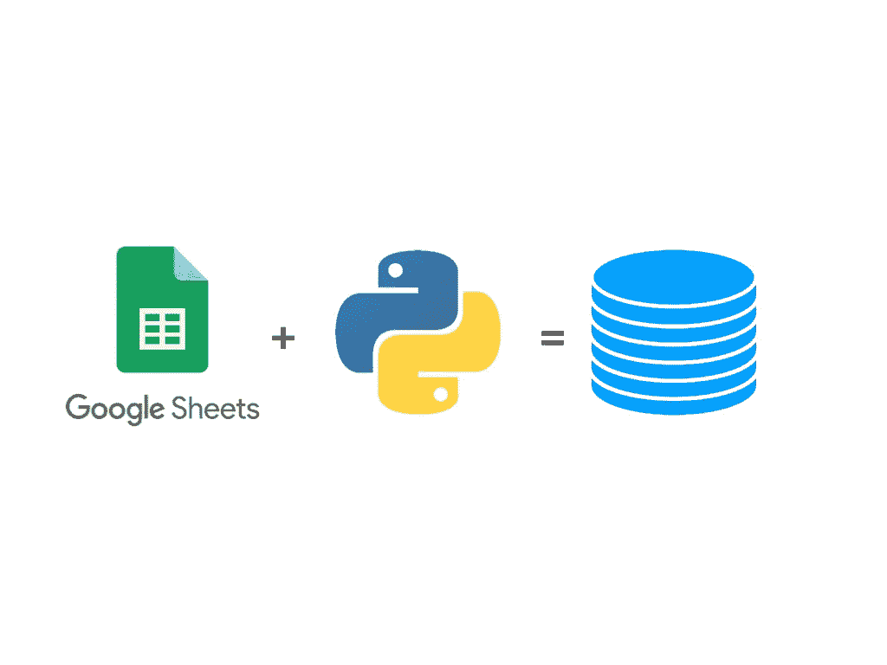

今天，我们将看看如何使用谷歌电子表格作为我们的数据库，就像如果你正在创建一些内部应用程序，而你认为你可能需要一个数据库，那么你错了。

*你需要的只是谷歌电子表格和 Python。*

1.  转到[谷歌 API 管理器](https://console.cloud.google.com/apis/dashboard)并创建一个项目。

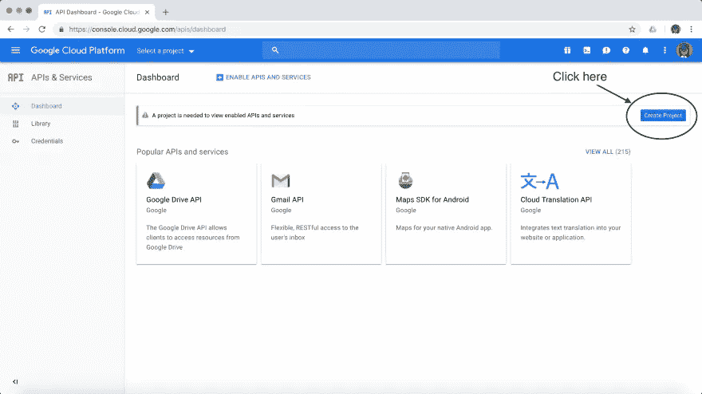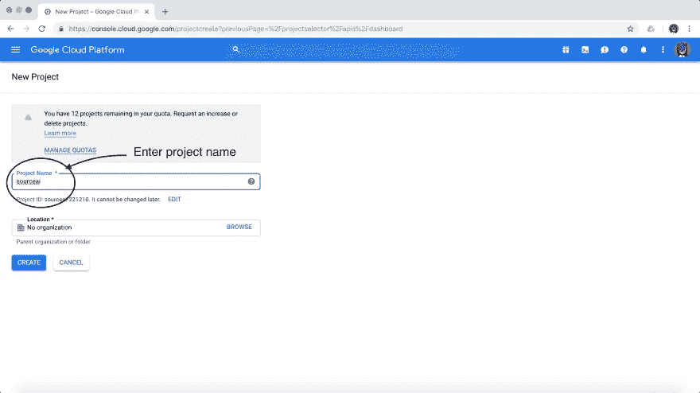

这是我们的[电子表格](https://docs.google.com/spreadsheets/d/1fnOhXNT2vyuguQzGN1YSe-vsxFcDXIgFPIw_PbHaox0/edit?usp=sharing)，我们将使用它作为我们的数据库。

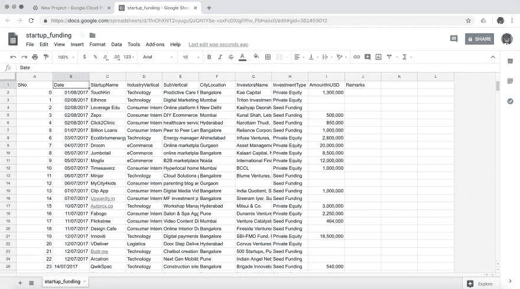

2.将 google drive API 添加到项目中，这将允许我们访问 google sheets 帐户中的电子表格。

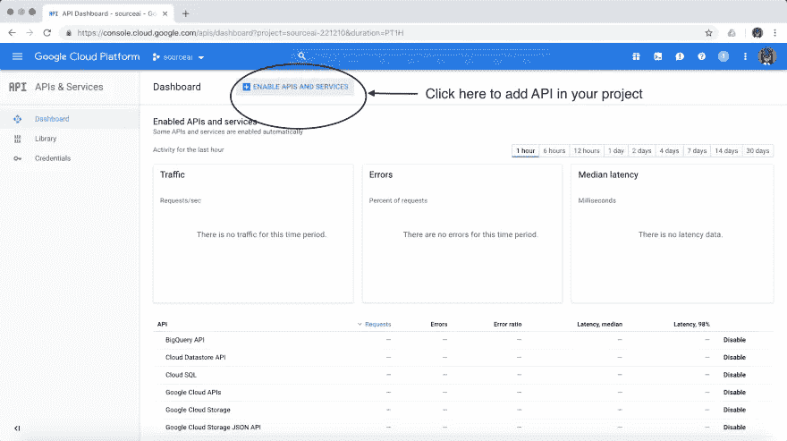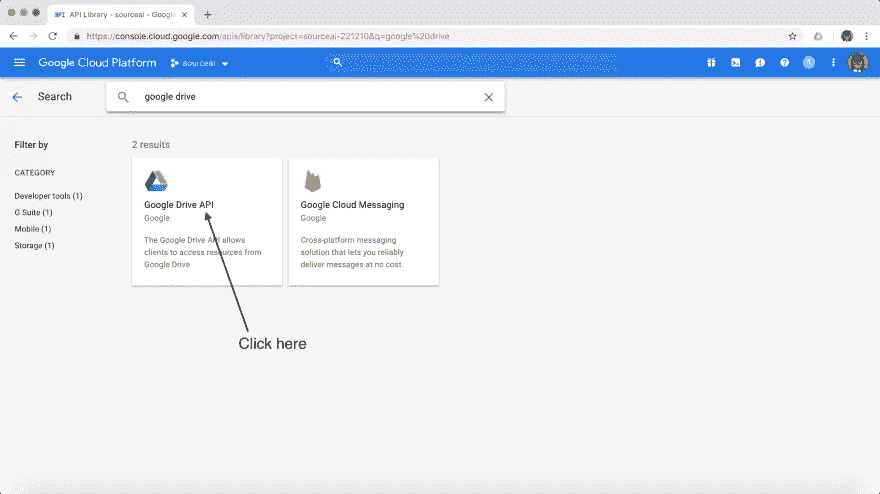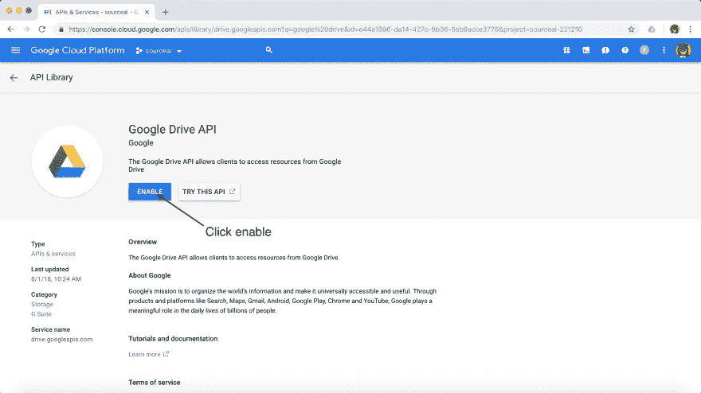

3.添加后，我们需要创建一些凭证。

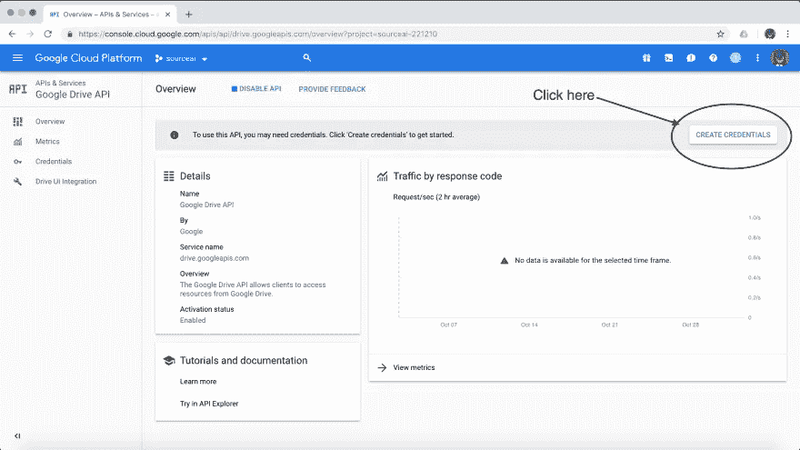

由于我们是从 web 服务器上执行此操作，因此我们将添加“web 服务器”选项，并授予它访问应用程序数据的权限。

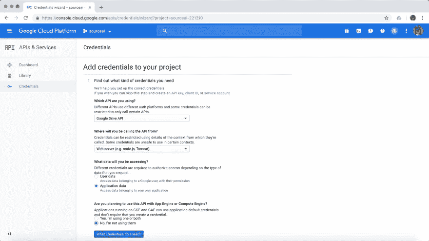

填写选项后，单击“我需要什么凭证”。

4.接下来，我们将创建一个服务帐户，并允许角色“项目编辑者”访问和编辑 API 中的数据。

5.单击 continue，它将生成一个 JSON 文件，我将重命名该文件并将其添加到项目中，命名为“statup_funding.json”。

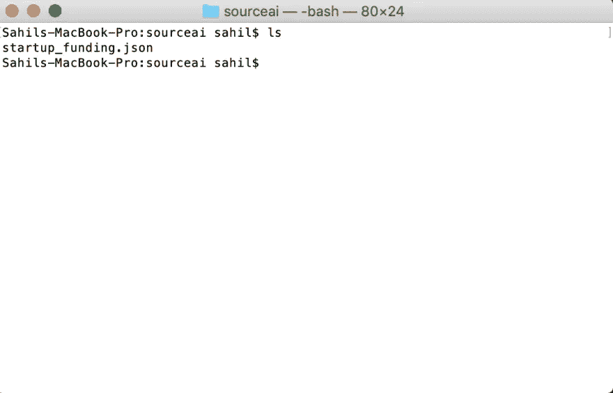

6.在文本编辑器中打开该文件，然后我们将在一个名为“client_email”的属性中找到一个电子邮件地址。

7.复制它，并将其放在电子表格上，我们可以将电子表格共享到该电子邮件地址，以便从 API 访问电子表格。

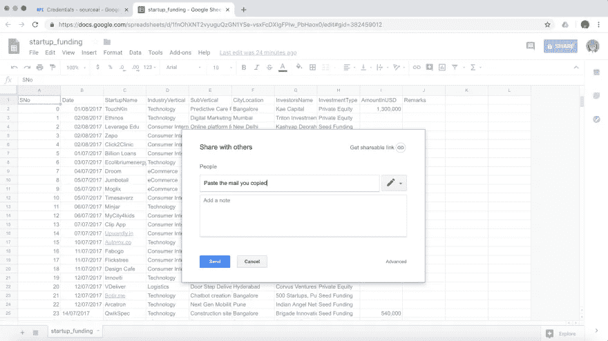

8.使用 pip 安装 gspread 和 oauth2client 包。

```
$ pip install gspread oauth2client
```

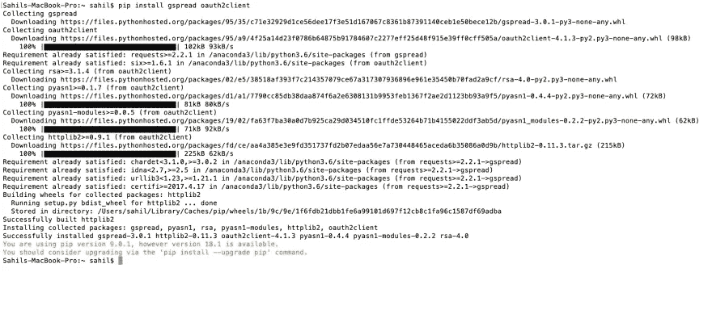

9.然后，我们将创建一个文件“tutorial.py ”,在其中编写代码，并使用 google sheets 作为我们的数据库。

# Python 程序

```
#import library
import gspread
#Service client credential from oauth2client
from oauth2client.service_account import ServiceAccountCredentials
# Print nicely
import pprint
#Create scope
scope = ['https://spreadsheets.google.com/feeds']
#create some credential using that scope and content of startup_funding.json
creds = ServiceAccountCredentials.from_json_keyfile_name('startup_funding.json',scope)
#create gspread authorize using that credential
client = gspread.authorize(creds)
#Now will can access our google sheets we call client.open on StartupName
sheet = client.open('StartupName').sheet1
pp = pprint.PrettyPrinter()
#Access all of the record inside that
result = sheet.get_all_record()
```

我们可以做更多事情，比如访问特定行/列/单元格中的数据。

```
result = sheet.row_values(5) #See individual row
# result = sheet.col.values(5) #See individual column
#result = sheet.cell(5,2) # See particular cell
pp = pprint.PrettyPrinter()
```

更新一个特定的单元格和更多

```
#update values
sheet.update_cell(2,9,'500000')  #Change value at cell(2,9) in the sheet
result = sheet.cell(2,9)
pp.pprint(result)
```