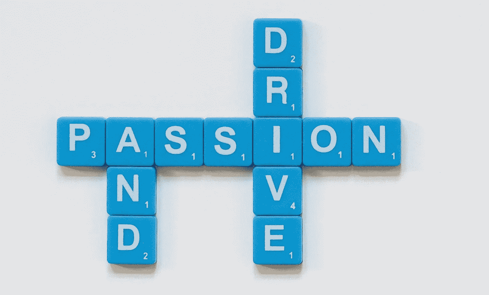

# 把“不”作为学习的机会

> 原文：<https://medium.datadriveninvestor.com/use-no-as-an-opportunity-to-learn-ac6c6c661d95?source=collection_archive---------2----------------------->

## 性别、同理心、直觉、信念都是销售成功的因素

W 无论是保险、标识还是营销，你都是在向潜在客户销售产品或服务。更重要的是，你在推销自己。人们需要相信你，才会为你提供的东西买单。

这是销售的简单秘诀之一，是帮助提高销售的聪明商业策略的一部分。

“销售就是为某人提供解决问题的方案，”时尚营销公司的销售和营销顾问金·弗雷德里希说。她专业地讲述了如何管理销售电话，创建销售线索漏斗，以及为什么将潜在客户转化为客户是一门艺术和科学。

要想做成一笔交易，人们需要对你这个人感到舒服，你也需要对自己感到舒服。这种安慰始于交谈，从人们那里引出他们希望你解决的问题，用“我是来帮助你的”来安慰他们。

如果你是女性，传递这样一个感同身受的信息会有所帮助。老套，没错，但却是事实。女性通常是顶尖的生产者，因为她们更有直觉，更善于建立关系，更善于问正确的问题和获得正确的信息，而且没有男性那么咄咄逼人。

弗雷德里克解释说，女性“花时间去了解她们的顾客真正需要什么，而不必问。”

 [## 科技行业的女性令人惊叹，但要让她们看到钱

### 技术在带来不同视角方面发挥着重要作用

medium.com](https://medium.com/datadriveninvestor/women-in-tech-amazing-but-show-them-the-money-704b975a821) 

然而，男人并没有失去一切。弗雷德里克给我们比女人更有竞争力的分数，依靠事实、数字和数据来证明我们的观点；并且开门见山。差不多就是这样。在日常生活中，男人购物，拿到想要的东西就走。女人浏览。在沃尔玛购物的人被称为迎宾员。

# 谈论清晰

这位顾问说，尽管男女各有优缺点，但销售的关键是交谈。向天生沉默寡言的男人推销时，女人应该问他们:“你怎么看？”

相反，男人应该花时间去了解他们的女性对象，了解什么对他们来说是重要的。正如弗雷德里克所说，“确保你理解他们的问题。”

不管性别如何，她提供的这些建议不仅适用于销售，也适用于一般的谈话:

*   如果你是一个打断者，那就努力倾听。
*   如果你说话轻声细语，就增加一点音量。
*   如果你是一个超级分享者，根据你的前景调整你的产出。
*   如果你过分关注细节，相应地调整。

 [## 在暴风雨中，保持冷静，倾听

### 最佳媒体实践拯救混乱中的企业

medium.com](https://medium.com/datadriveninvestor/caught-in-a-storm-stay-calm-and-listen-2e088e6998aa) 

正如其他谈话一样，销售成功取决于倾听，然后提出创造价值的问题。理解人们问题的主要方法是问正确的问题，或者正如商业培训师杰弗里·吉托梅尔所说，“问错误的问题，得到错误的答案。”

弗雷德里克说，最好的问题是那些让潜在客户思考的问题。其中包括以此开头的问题:

*   是什么让你选择…
*   你想改进的一件事是什么…
*   您的客户对…有什么反应
*   你打算如何…

具体来说，一名注册会计师说，他会问潜在客户:“我能为你做什么，而你目前的注册会计师做不到的？”注册会计师狡猾而自信地说，“不管那个人说什么，我都会回答，‘我能做到’，因为我全都做到了。”

# 大声说，不要谈生意

最困难的部分——同样，在典型的谈话和销售中——是保持安静。“要求你想要的。那就保持安静，”弗雷德里克说。关门时，第一个发言的人输了。

即使是“不”也可以在以后变成“是”。“当你听到‘不’的时候，把它当作一个学习的机会，”咨询师说。“目前可能只有一个否定的答案。一个“不”会造成各种各样的债务，这也是请求推荐、请求跟进、请求添加到你的电子邮件列表、请求推荐演讲或社交机会的绝佳时机。”

 [## 人情味助推优秀品牌走向巅峰

### 消费者的购买行为与情绪息息相关

medium.com](https://medium.com/datadriveninvestor/human-touch-boosts-outstanding-brands-to-the-top-5b71cd610e73) 

建立联系后，跟进就开始了。这适用于潜在客户，也适用于你已经有的客户。正如 Fredrich 指出的，“获得新客户的成本要比保持现有客户的成本高得多。无论他们是谁，确保你与人交往。要公开透明。”

最终，潜在客户会变成客户——如果他们得到足够多的接触。通过电子邮件、电话、会议和面对面会议的结合，这个神奇的数字可以在任何地方，从[7 到 13 次触摸](https://www.onlinemarketinginstitute.org/blog/2013/10/why-it-takes-7-to-13-touches-to-deliver-a-qualified-sales-lead-part1/)。

最后，你可能会有一个客户或熟人。只是不要强迫这个问题。

“知道什么时候走开，继续前进，”弗雷德里克说。“有些人不想说不或者说[他们为什么说不](https://medium.com/@JKatzaman/just-say-no-if-only-if-it-was-that-easy-3191b2fc4893)。告诉自己，如果你不是我的顾客，没关系。”

**关于作者**

吉姆·卡扎曼是拉戈金融服务公司的经理，曾在空军和联邦政府的公共事务部门工作。你可以在[推特](https://twitter.com/JKatzaman)、[脸书](https://www.facebook.com/jim.katzaman)和[领英](https://www.linkedin.com/in/jim-katzaman-33641b21/)上和他联系。