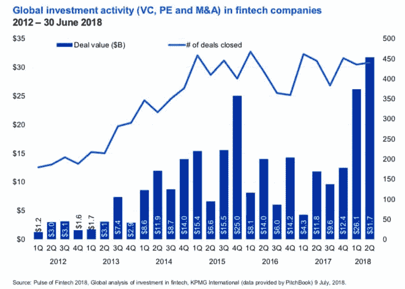
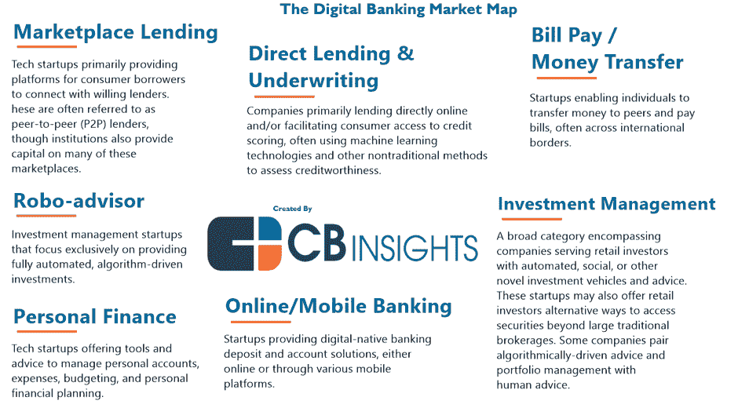

# 人工智能和机器学习在金融服务中的应用

> 原文：<https://medium.datadriveninvestor.com/use-of-artificial-intelligence-and-machine-learning-in-financial-services-fc8474e208d8?source=collection_archive---------4----------------------->

**(Image credit:** Photo by [Jonas Leupe](https://unsplash.com/photos/0IVop5v4MMU?utm_source=unsplash&utm_medium=referral&utm_content=creditCopyText) on [Unsplash](https://unsplash.com/search/photos/fintech?utm_source=unsplash&utm_medium=referral&utm_content=creditCopyText))

这些天，关于人工智能有太多的噪音。在所有这些当中，人工智能的重要性以及它如何成为大多数行业的关键特征很容易被埋没。是的，它几乎每隔一天就在新闻中出现。但在像金融领域这样敏感的行业，它有什么用呢？

假设每个人都真正知道人工智能是什么是不安全的。所以在这一点上快速定义是必要的。

你会在网上找到很多定义。一个特别的例子将[人工智能](https://www.techopedia.com/definition/190/artificial-intelligence-ai)描述为计算机科学的一个分支，旨在创造智能机器。换句话说，AI 是软件/算法，可以执行智能的任务，执行几乎不需要人工干预的任务。机器学习是人工智能的一个子集，也是使用人工智能解决问题的最常见方式。机器学习使用大量数据，并创建可用于预测、优化或分类挑战的算法。

2018 年，人工智能在各行业的实际应用有所增加，其中之一是金融业。有许多应用—市场和客户分析、信用评分、基于使用的保险、数据驱动的交易、欺诈检测等等。各种子行业，如银行、保险公司、信用卡和支付处理公司、资产和财富管理公司、贷款机构等。领导了金融服务领域对人工智能的重大投资，仅在 2018 年就达到近[90 亿美元，预计未来三年的 CAGR 增长率约为 17%。](https://www.openpr.com/news/1481753/Big-Data-in-the-Financial-Services-Industry-2018-2030-Opportunities-Challenges-Strategies-Forecasts.html)

金融服务中采用人工智能和机器学习的驱动因素:

有各种各样的因素促使人工智能和机器学习在金融领域的使用越来越多。其中一些是 a .更快的处理器速度，b .更低的硬件成本和 c .轻松访问计算(在云上)。这意味着增加基础设施的可用性，既可以分析数据，也可以提取见解和开发建模能力。其他因素是人工智能和机器学习工具的可用性。另一个因素是来自多个来源的数字格式数据的激增，如在线搜索趋势、收视率模式和包含市场和消费者金融信息的社交媒体。

AI/机器学习在金融领域是如何使用的？

人工智能/机器学习在金融服务领域变得有价值的一些场景是自动化日常流程，如应用程序/案例接收和使用聊天机器人接听客户电话。其他改进的机会包括风险管理分析、生产率提高、增强决策能力以及解决非常复杂的问题。大多数金融机构也发现，越来越有必要跟上竞争对手对人工智能和机器学习的采用，以及提高作为金融科技初创公司的估值。

(人工智能在金融服务中的应用，来源:CBInsights)

以下是一些深入的使用案例:

1.  欺诈检测:

金融机构有责任保护他们的客户，在机器学习的帮助下，这成为可能。给定客户的金融交易历史，金额、位置、交易时间、向其付款的商家/供应商构成了大量的历史数据。机器学习算法可以根据它能够分析和分类的历史交易来分类当前交易是否是欺诈性的。一个很好的例子是 [FICO 的认知欺诈分析](https://www.fico.com/en/latest-thinking/product-sheet/fico-falcon-platform-cognitive-fraud-analytics-fraud-focused-machine-learning)。

2.个性化客户服务:

金融部门总是面临着为客户提供个性化服务的挑战。对于一家拥有 1000 多万客户的银行来说，为每个客户提供定制服务几乎是不可能的。

但随着人工智能的引入，现在已经成为可能。

金融机构现在使用人工智能来帮助他们的客户提供个性化的体验。如今，提供的消费者金融服务是在机器学习算法的帮助下定制的，这些算法研究客户的金融数据、金融习惯、消费风格、储蓄，并准确预测客户喜欢的产品。因此，顾客现在可以挑选适合自己的产品。这通常是通过语音聊天机器人来完成的，这些聊天机器人由使用 NLP 的机器学习程序提供支持(自然语言处理是人工智能的一个子领域，程序可以使用客户理解的语言与客户交流)。例如，[富国银行的聊天机器人](https://stories.wf.com/helpful-banking-assistanton-facebook/)提供“即时信息”

来源:富国银行

3.承销:

无论是信用卡/银行组织的核保还是保险机构的精算服务，基本流程都是了解潜在客户的金融交易历史、信用评分和支付交易，以确定贷款决策并降低风险。机器学习可以通过考虑非结构化数据的细节来加快这一过程，如社交媒体分析、电话使用和公共事业的即时支付。此外，它还可以通过查找替代数据源来确定一个人的信用档案是否可靠(我最近从新加坡搬来的朋友就是一个例子)。信用评分不能转移到美国，但她是低风险客户)。例如，[新贵](https://www.upstart.com/for-lenders)利用机器学习为金融机构提供了独特的承销引擎。

4.管理保险单:

在保险业中采用人工智能和机器学习已经导致保险科技组织在其承保流程中使用机器学习，对大量数据集进行排序，以识别风险更高的案例，从而可能减少索赔并提高盈利能力。他们还使用机器学习来改善保险产品的定价或营销，方法是纳入实时、高度非结构化的数据，如在线购物行为或物联网遥测(联网设备中的传感器，如汽车里程表)。他们还在索赔处理中使用机器学习来确定事故造成的车辆损坏和成本。他们越来越多地研究互连物联网(使用物联网技术的传感器信息)和人工智能/机器学习，以在事件发生之前确定预测事件，如化学品泄漏、车祸甚至地下室洪水。一个这样的例子是 daisy intelligence，它使用机器学习来帮助保险公司提供实时运营建议

5.合规性:

受监管机构越来越多地使用人工智能和机器学习来实现监管合规性。RegTech 是 FinTech 的一个子集，专注于比当前的行业标准更高效和有效地促进监管合规性。

到 2020 年，RegTech 市场总额预计将达到 64.5 亿美元。RegTech 使用机器学习来满足复杂的监管标准，从而降低风险并提高合规性。了解客户的身份(“了解你的客户”或 KYC)是大多数金融机构常见的第一步。这一过程成本高、劳动强度大且高度重复。机器学习用于事先执行身份和背景检查。它以两种方式使用:(1)算法评估图像以识别文档是否相互匹配，以及(2)计算风险并标记那些需要额外审查的文档。机器学习程序也公开可用的数据和其他数据源，如警察登记册/司法案件和社交媒体账户。

6.机器人顾问:

机器人顾问越来越多地提供自动化投资建议以及经纪和投资服务。他们还提供类似散户投资者的其他投资服务。其中一些甚至提供零佣金交易。这使得任何收入水平的客户都可以管理他们的个人财务。机器人顾问使用机器学习算法来确定和管理交易所交易基金(ETF)。这有助于客户根据自己的需求进行多元化、低风险的投资组合。这方面的一个例子是 [Weathfront](https://www.wealthfront.com/) ，它帮助投资自动化，并提供一体化的自动化解决方案。

结论

人工智能是金融领域的新亮点。对上述关键趋势和用例的观察提供了充足的证据，表明人工智能现已成为金融服务市场不可或缺的一部分，它只会在 2019 年和未来几年获得发展势头。