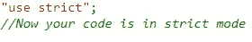
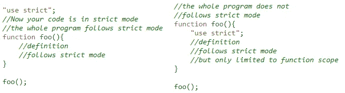
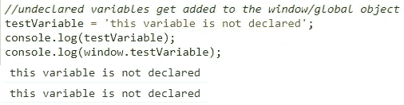
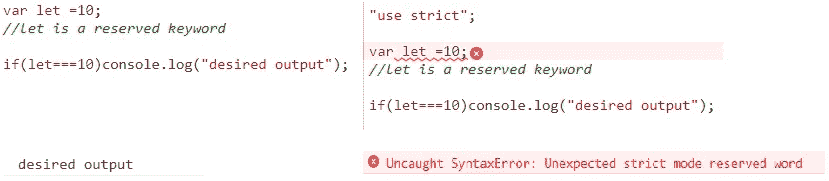
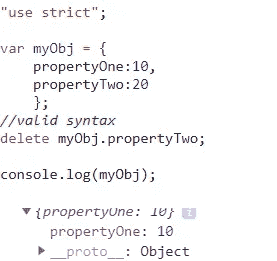
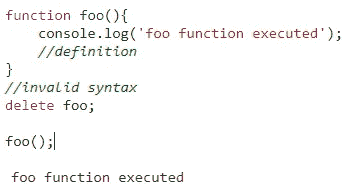
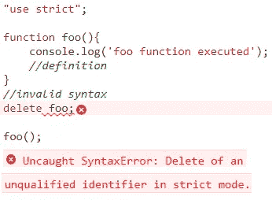
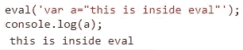
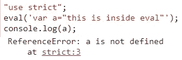

# JavaScript 中的“使用严格”

> 原文：<https://medium.datadriveninvestor.com/use-strict-in-javascript-39c2a6e34b0d?source=collection_archive---------0----------------------->

如果你是 JavaScript 新手，你很可能不知道 JavaScript 提供了一种叫做*严格模式*的东西。

实现严格模式是为了使您的程序或函数遵循严格的操作上下文。这意味着，被编译器忽略的错误现在将抛出异常消息。

那么我们如何将自己的模式从马虎(非严格模式)转变为严格呢？这比你想象的要简单，只要在程序或函数的顶部加上字符串“**使用严格的**”，瞧，你就处于严格模式了。

It's that easy

*注意:永远记住“**使用严格**”不能直接写成*使用严格*。它是一个字符串，编译器解释它来改变操作上下文。

*有趣的事实:当" **use strict** "第一次被引入时，很多老版本的浏览器都不支持它。如果直接使用' *use strict'* ,就会抛出异常。为了避免这种情况，它的调用被声明为字符串。如果浏览器不支持该特性，它会将其作为字符串忽略。

在使用**时定义范围，使用严格的**也很重要。因为严格模式带来了新的操作环境，所以一直使用它可能不是最好的决定。最终，这完全取决于代码需求。

Defining the scope

让我们看看不同的场景，这个简单的改变可以帮助你。

> 如果变量没有声明，它不会被添加到全局/窗口对象中。

默认情况下，如果定义了未声明的变量，它会被添加到全局/窗口对象中。这可能会产生错误，甚至很难发现。

Undeclared variable gets added to global object

为了避免这种情况，我们可以声明 use strict。严格模式不允许使用未声明的变量。

Undeclared variables do not get added to global object

> 不能声明可能用作未来保留字的变量。

Reserve Word Exception

正如我们在上面的例子中看到的，在左边我们可以声明一个变量，并将其命名为 *let* ，这是一个 *ES6 保留关键字*。从技术上讲，这应该抛出一个异常，但是被编译器忽略了。

此外，我们可以在右侧看到，通过更改为严格的操作上下文，我们得到了一个语法错误。我们应该选择严格模式，以避免对变量名使用保留关键字。

> 它阻止用户删除函数、变量和函数参数:

*delete* 操作符本身用于删除对象的属性。

Deleting a property valid syntax

*删除*操作符不能用于删除函数、变量或参数。

delete can only remove properties

在严格模式下，它将抛出一个类型错误异常。发生这种情况是因为我们试图删除属性而不是值本身。

Type Error Exception

> eval 的使用受到限制:

在 JS 中， *eval* 函数用于运行字符串格式的 JavaScript 表达式。

using eval

让我们尝试在严格模式下实现相同的代码:

the eval expression is not executed

在严格模式下，不执行 eval，因此会给我们一个引用错误。使用 *eval* 从来没有真正被建议过，因为使用 *eval* 有太多的缺点。为了更好地理解 *eval、*的用法，你可以浏览一下 [Mozilla 文档](https://developer.mozilla.org/en-US/docs/Web/JavaScript/Reference/Global_Objects/eval)。

我希望这让您对使用 JavaScript 提供的" **use strict** "特性有了更好的理解。