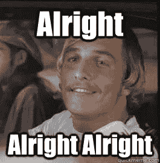
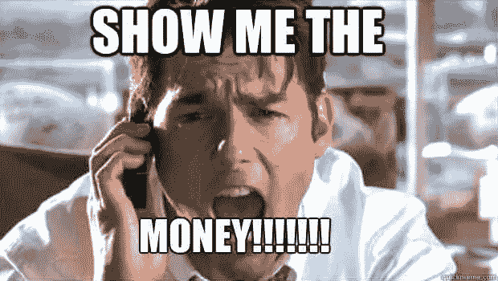

# 使用对你有利的波动性，不要害怕它(第 1 部分)

> 原文：<https://medium.datadriveninvestor.com/use-volatility-in-your-favor-dont-be-scared-of-it-part-1-31091797de1d?source=collection_archive---------2----------------------->

[iTunes](https://itunes.apple.com/us/podcast/bit-better-have-my-money/id1374764732)[Stitcher](http://stitcher.com/s?fid=183129&refid=stpr)Google Play

组合-[https://cointracking.info/portfolio/bitbetterhavemymoney](https://cointracking.info/portfolio/bitbetterhavemymoney)\

5865 美元，在我写这篇文章的时候，一天左右上涨了 4%。没什么可抱怨的。

在 DBC(7 天内上涨了 101%)和 GRS(7 天内上涨了 112%)。地狱丫。在一切都不景气之后，很高兴看到事情又好转了。有很长的路要走，但方向是正确的。

另外，两周前，我和一个朋友谈到了投资 DBC 的事情。不幸的是，我们没有完成，现在我感觉很糟糕。嘘，但是谁知道呢。我的运气会下降而不是上升。

**他看这些，所以我的坏本哈哈哈。**

看看投资组合，几乎所有东西都在 7 天趋势中上涨。这太棒了。但我仍然不确定事情会持续下去。这可能是一个多头陷阱，底部很快就会出来。我想我们会看到的。

现在谈谈波动性。

加密市场是不稳定的，但是不要让这个吓到你。随着波动而来的是获利的机会。

如果你知道市场是什么样的，你就可以拥抱它，并利用它成为你的优势。人们似乎忘记了，当他们可以获利时，他们也不获利。

例如，**我投资了 DBC BTC 533 号。它超过了 BTC 3300 号。**那只是一个混账的疯狂回归。你们这些数学天才可以算出回报率，我数学很烂。但这种情况并不总是发生。

当他们的硬币像这样上涨时，有些人不会卖掉他们的股票。我不像那些人。

你说我会这样卖吗？我不会一次卖掉所有的硬币，而是一点一点地卖。我想要我的利润，我拿走了。

不卖的人担心价格会继续上涨，他们会错过更多的利润。嗯，我拿了我的利润，他们的还只是想象。

这就是波动性的来源。我在 12 月 30 日以 533 价格购买了 DBC。3 月 30 日，我以 529 的价格重新买入。

是的，宝贝汤姆，我是认真的。(我给他起名叫汤姆，因为我在取笑一个朋友)。

**波动，让它为你工作。**三个月前的一天，我能够以比最初买入时更低的价格买入。我有我的利润和更好的价格。

我喜欢为这部分找照片…

*原载于*【bitbetterhavemymoney.com】