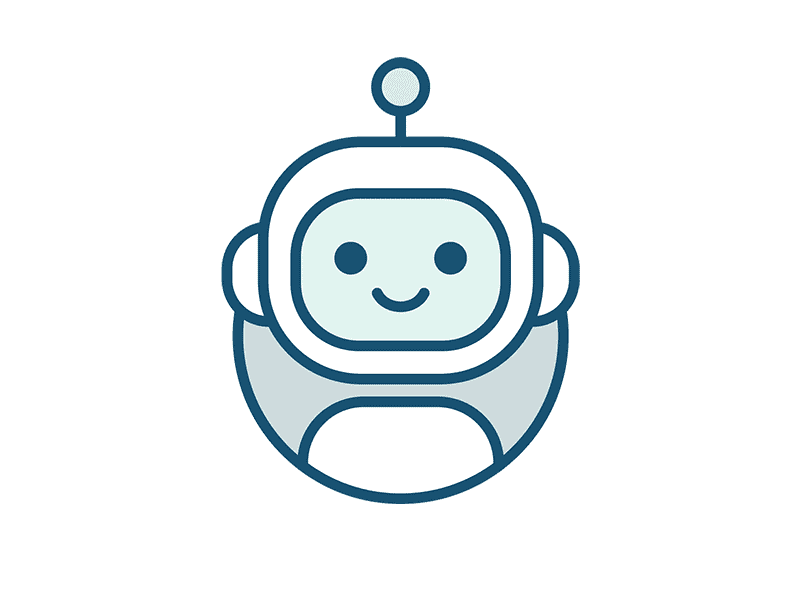
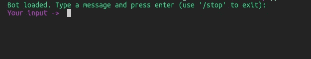
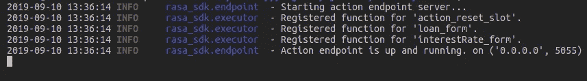
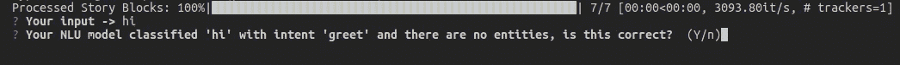
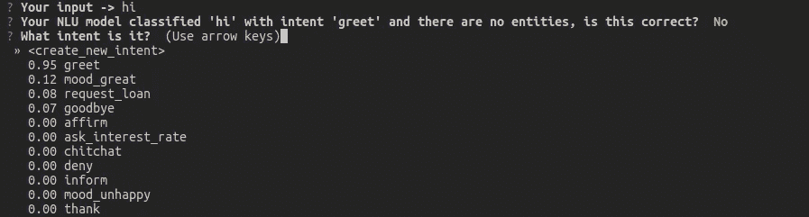
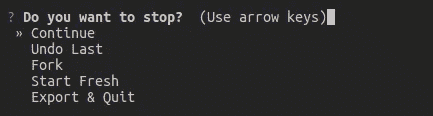
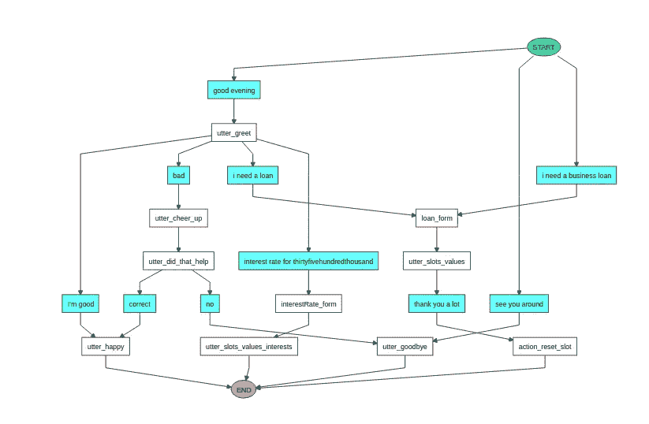

# RASA 堆栈中您需要了解的有用信息

> 原文：<https://medium.datadriveninvestor.com/useful-things-you-need-to-know-in-rasa-stack-9fab1e13dbdc?source=collection_archive---------3----------------------->

在我之前的[博客](https://medium.com/datadriveninvestor/how-to-build-a-simple-chatbot-2a51394de7f5)中，我写了如何使用 RASA 栈构建一个简单的机器人。在这篇博文中，我给你带来了一些你在构建 RASA 机器人时需要知道的基本知识。

## 如何训练你的 RASA bot？

在添加实体、意图、动作和故事之后，您需要运行您的机器人，看看它是否工作。但是当你添加一些新数据时，你不能只是运行你的机器人并看到结果。在您向 endpoints.yml、nlu.md 或 stories.md 文件添加任何内容后，您需要为新添加的数据训练您的 bot。你可以通过输入`rasa train`来训练你的机器人，你的与你的机器人相关的模型将被训练。

 [## 对话式人工智能的兴起将如何影响世界|数据驱动的投资者

### 从不同的专业服务，保险，教育，金融，旅游，电信，到建筑，银行，和…

www.datadriveninvestor.com](https://www.datadriveninvestor.com/2019/02/07/how-the-rise-of-conversational-ai-will-impact-the-world/) 

新创建的模型/新训练的模型将被保存在项目内的`models`文件夹中。

## 如何运行你的 RASA bot？

现在你已经训练了你的机器人，你可以运行你的机器人，你可以和它进行一次很好的对话。

`rasa shell`命令运行你的机器人并提示一个窗口与你的机器人聊天。

window appearing when running RASA bot

在您运行您的 bot 之后，您可以通过键入`/stop`命令作为您的 bot 输入来停止它。

## 如何运行自定义操作？

在 RASA 堆栈中，你可以在`actions.py`中编写自定义动作。编写完自定义动作后，如果不启动 actions webhook，就不能在故事中使用它们。当然，你可以使用那些动作，但是它不会像你预期的那样工作，因为你还没有启动你的 webhook。您可以通过这个命令简单地启动/运行您的 webhook。

`rasa run actions`

Snippet when RASA action server is up and running

## 如何以交互形式运行你的 bot？

什么是交互形式？

> 在互动学习模式中，你在和机器人说话的同时向它提供反馈。这是探索你的机器人能做什么的一种强有力的方法，也是修复它犯的任何错误的最简单的方法。基于机器学习的对话的一个优势是，当你的机器人还不知道如何做某事时，你可以教它！

简单地说，交互模式让我们根据输入来教机器人。简单来说就是这样工作的。

首先，你问一个问题。然后，机器人将理解你的问题，并提供给定问题的意图和实体。

如果给定的意图和实体是正确的，您可以简单地键入“Y”并继续。但是，如果机器人识别的意图和实体不正确，您可以说“n”并简单地更改它。下面给出的是当机器人给出的意图或实体不正确时交互模式的截图。如你所见，你可以简单地通过上下移动箭头键并输入你的答案来改变意图和实体。

RASA bot interactive mode snippet

在您以交互模式训练您的模型之后，您可以将它们保存在您的模型中并使用 bot。(您可以通过键入 ctrl+c 来停止交互表单)

Interactive learning quit message in rasa

## 如何可视化你的机器人的故事路径？

您可以通过键入以下命令来简单地查看机器人的故事路径。

`rasa visualize`

在你输入之后，你的浏览器将会显示你的故事路径的树形图，如下所示。

Tree diagram of the bot’s stories

当你建造一个堆栈机器人时，这些是你需要知道的一些事情。