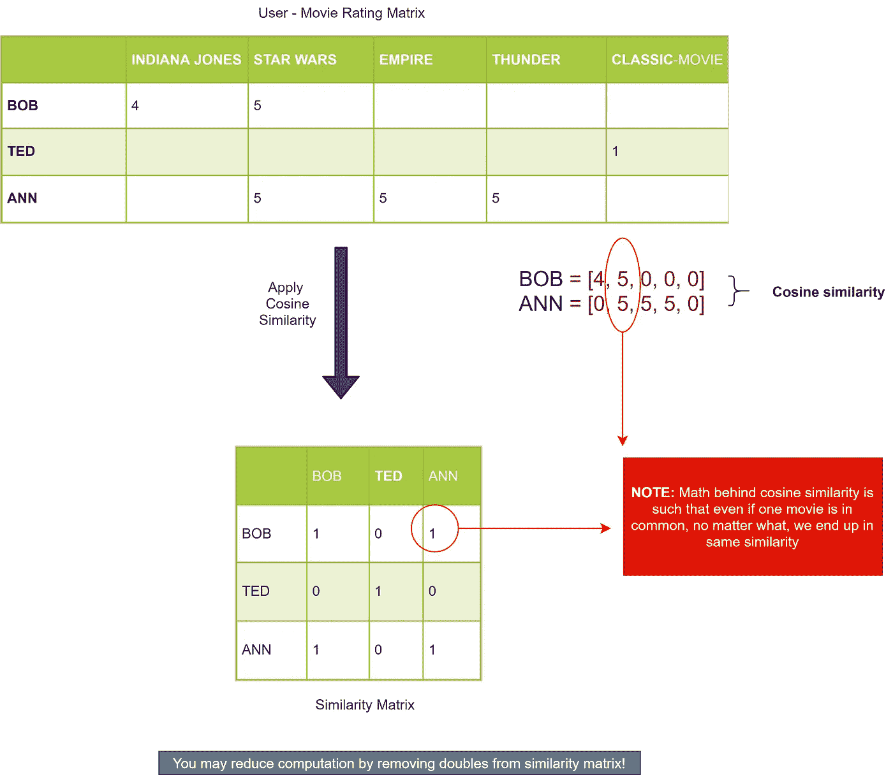
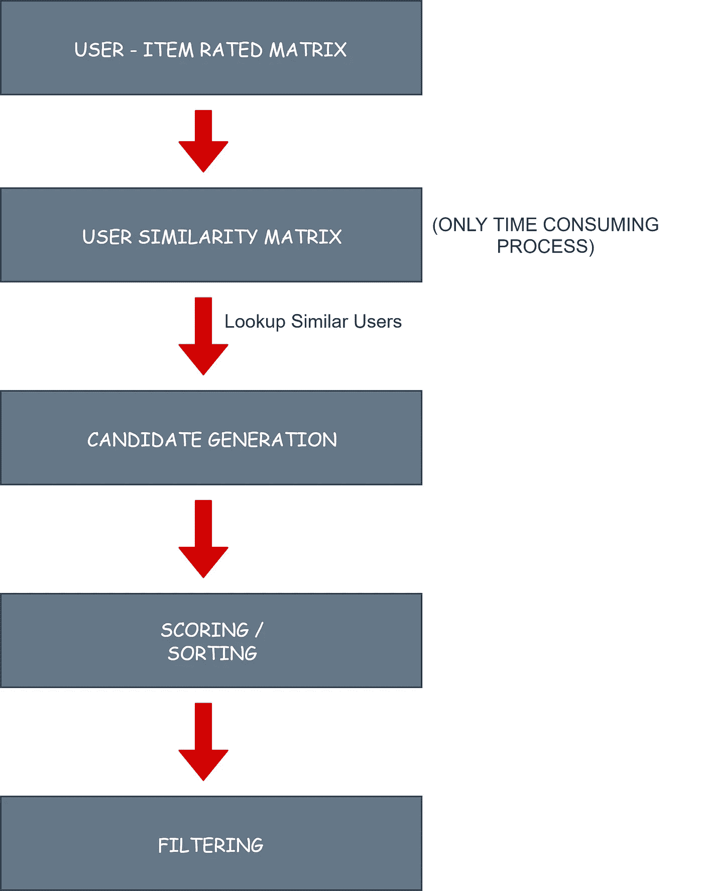
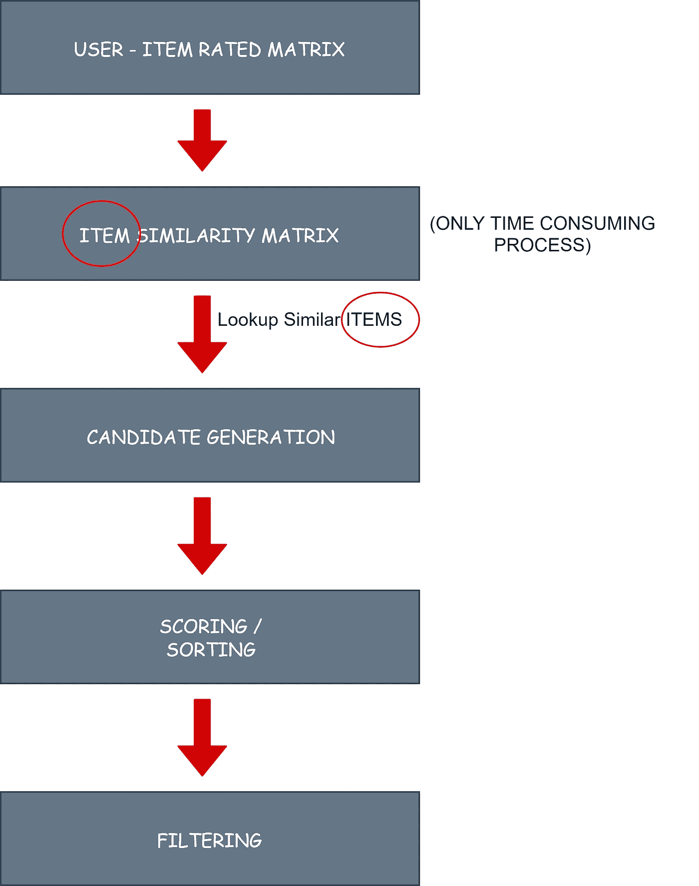

# 基于用户和基于项目的协同过滤—第 5 部分

> 原文：<https://medium.datadriveninvestor.com/user-based-and-item-based-collaborative-filtering-part-5-bbabd08315b3?source=collection_archive---------4----------------------->

# 目录:

1.  介绍和建议框架
2.  评估推荐系统
3.  基于内容的推荐
4.  基于邻域的协同过滤
5.  基于用户和项目的协同过滤
6.  KNN 建议
7.  矩阵分解
8.  深度学习—简介
9.  受限玻尔兹曼机器
10.  AutoRecs
11.  亚马逊 DSSTNE 和鼠尾草制造商
12.  现实世界的挑战和解决方案

# 1.基于用户的协同过滤

正如我们已经看到的基于邻域的协同过滤是什么；理解基于用户的协同过滤的机制是相当容易的。

 [## DDI 编辑推荐:5 本让你从新手变成专家的机器学习书籍|数据驱动…

### 机器学习行业的蓬勃发展重新引起了人们对人工智能的兴趣

www.datadriveninvestor.com](https://www.datadriveninvestor.com/2019/03/03/editors-pick-5-machine-learning-books/) 

*   **KNN** —使用 K 近邻算法。

> **注意:**余弦相似性背后的数学是这样的，即使一部电影是相同的，无论如何，我们最终都是 100%相似的！

即使鲍勃喜欢星球大战，安讨厌它，在**稀疏数据的情况下，**两者 100%相似！！！

*   稀疏数据通常会导致协同过滤的问题
*   避免奇怪的东西，设置阈值，甚至预处理数据

# 整理

在这一步中，我们试图选择和安排具有最佳预测的建议

*   给你的推荐打分
*   考虑评级——这是个不错的主意！
*   推荐他们喜欢的类似的东西。不是他们讨厌的类似的东西。所以，最好正常化！
*   如果“物品”出现在不止一个邻居中，加强关系

# 过滤

这一步骤涉及诸如移除已经看过的项目或令人不快的项目的过程。

这个过程中涉及的所有步骤都可以通过下面所示的框图来解释

USER BASED COLLABORATIVE FILTERING

> **注意:**基于用户的协同过滤严格用于生成前 N 个推荐。
> 我们从未尝试预测用户评分(为此，请使用 KNN)。因此，我们基于 surpriselib 的框架围绕评级预测展开。但是我们仍然可以使用命中率。

# 协同过滤的主要特征

*   不推荐用于**稀疏数据**！
*   数据的质量和数量都很重要
*   耗时更少(与奇异值分解或随机算法相比)
*   高效率
*   仅适用于前 N 名推荐
*   不用于用户评级预测(但是如果想要的话可以)
*   这也是拥有海量数据的亚马逊使用这种方法的原因

> **注:** **即使 10 万收视率也算比较稀疏！**(但是在我们的实验中，与基于内容的推荐相比，表现出了更好的性能)

# 2.基于项目的协同过滤

> 程序同上，但使用**项目相似度矩阵**代替用户相似度矩阵

ITEM BASED COLLABORATIVE FILTERING

即使在这里，也使用 K 最近邻[**KNN**算法。有趣的是,“项目”之间的相似性有时会比“用户”之间的相似性更好**！下面讨论一些原因。**

*   **物品是永恒的，而人会随着时间而改变**
*   **需要处理的项目数量更少。这导致较小的相似性矩阵。亚马逊和网飞使用它！**
*   **对新用户来说更好:
    —他只选择一个项目就可以让我们提供推荐
    —但是对于基于用户的，新用户必须等到下一次构建相似性矩阵(这是框架中唯一的计算部分)**

## **要记住的要点——基于项目**

*   **在“基于项目”的协同过滤中，我们有比“基于用户”更多的推荐。**有意思！****
*   **实际上，我们推荐了 1990 年代的所有电影，因为给定的数据存在偏差——需要谨慎！**
*   **在真人身上测试一下— **A/B 测试****
*   **即使算法上的微小变化也会影响推荐**
*   **在评估过程中，请注意
    — 0.055(或 5.5%)非常好(命中率)
    — 0.005(或 0.5%)非常差，但如果不处理有偏见的数据，这很讽刺**
*   ****带走:**难以离线评估数据集。尤其是对于历史数据集和较小的数据集**

## **下一个>>>**