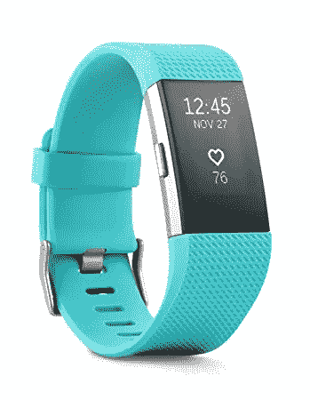

# 以用户为中心的设计师:加迪·阿米特

> 原文：<https://medium.datadriveninvestor.com/user-centered-designer-gadi-amit-4ad76fb7af70?source=collection_archive---------12----------------------->

Subrina Pumford

Gadi Amit

**介绍选择的设计师及选择原因**

Gadi Amit 是来自以色列的旧金山设计师，因设计 Fitbit 而闻名。他的工作重点是可穿戴设备，包括监测婴儿的 Sproutling 和狗的健康追踪器 Whistle。他的设计公司 NewDealDesign 处理战略技术设计和消费技术。他之所以被选为以用户为中心的设计师，是因为他对可穿戴技术的关注，可穿戴技术是为了适应人体，与身体过程合作，向用户传达信息，这些都是高度以用户为中心的功能。

FitBit

**描述一个他们实践以用户为中心设计的项目**

Amit 实践以用户为中心的设计的一个设计项目是他在非常成功的 Fitbit 健身追踪器上的工作。该设备跟踪穿着者的活动、锻炼、食物重量和睡眠，“以帮助你找到合适的状态，保持动力，并看看小步骤如何产生大影响”。根据购买者的预算、所需功能、所需应用和个人目标，有许多定制选项。该产品的设计不仅考虑了一般用户的需求，而且还承认个人的独特性，并为不同的需求提供了选择。

**设计师运用了哪些以用户为中心的设计原则和方法？**

在采访了 Fitbit 的用户 Ken Pumford 之后，Amit 似乎在他的 Fitbit 设计中使用了几个可用性质量组件(MEELS)。普姆福德同意存在记忆性，因为在一段时间没有使用之后回到 Fitbit 是不言自明的。他还说效率是存在的，因为“一旦技术被学习，它很快就会被使用和理解”。*错误*被认为是因为设备已经被简化到在使用中很难出错的程度。他唯一担心的是“有时应用程序同步很慢”，但他说错误通常会很快得到解决。*可学性*可能是一个弱点，因为，正如受访者曾经回忆的那样，他年迈的父亲第一次尝试 Fitbit，并对他为什么早上没有获得任何睡眠结果感到困惑。原来他把它穿反了。最后，普姆福德说他体验到了满足感。关于他为什么喜欢这个产品，他说“我喜欢我的 Fitbit 帮助我跟踪我是否达到了我的健身目标。虽然它的主要焦点是健身，但我喜欢它告诉我关于我的睡眠”。说到满足感，似乎很多其他人也能感受到，从追踪者的成功、收视率和受欢迎程度就能清楚地看到这一点。

**设计师的目标受众是谁？他们的性别、世代、文化和职业是什么？**

设计师的目标受众——也是当前的消费群体——由年轻人组成，通常在 18 岁到 34 岁之间。根据 Fitbit 网站上的造型和产品选项，它面向男性和女性。目标受众通常是中上阶层社会经济地位的年轻专业人士，以及那些生活方式活跃或希望这款设备能帮助他们变得更加活跃的人。

实践以用户为中心的设计如何从整体上增加项目的价值？

Amit 在设计 Fitbit 时对用户的考虑为该项目增加了价值，因为这有助于该设备的成功。甚至该网站还提供了一份简短的调查问卷，旨在寻找“适合你的产品”，考虑到用户需要找到一款为购物者的生活方式定制的设备。当用户觉得他们的个人愿望在产品中得到考虑时，他们会觉得对所有人都更包容，这增加了价值。

**这项任务有什么关键的收获？**

以用户为中心的设计就是一个产品火不火的区别！确保考虑到目标受众的需求对于工业设计的有效性至关重要。

**来源**

[https://the current innovators . com/2018/02/gadi-Amit-designing-human-led-wearables-evoke-connections/](https://thecurrentinnovators.com/2018/02/gadi-amit-designing-human-led-wearables-evoke-connections/)

[http://fortune . com/2014/02/28/会见 fitbit 背后的设计师/](http://fortune.com/2014/02/28/meet-the-designer-behind-the-fitbit/)

[https://www.newdealdesign.com](https://www.newdealdesign.com/)

[http://fitbit.com/](http://fitbit.com/)

[https://www.hitwise.com/blog/2017/02/fitbit/](https://www.hitwise.com/blog/2017/02/fitbit/)

肯·普姆福德访谈