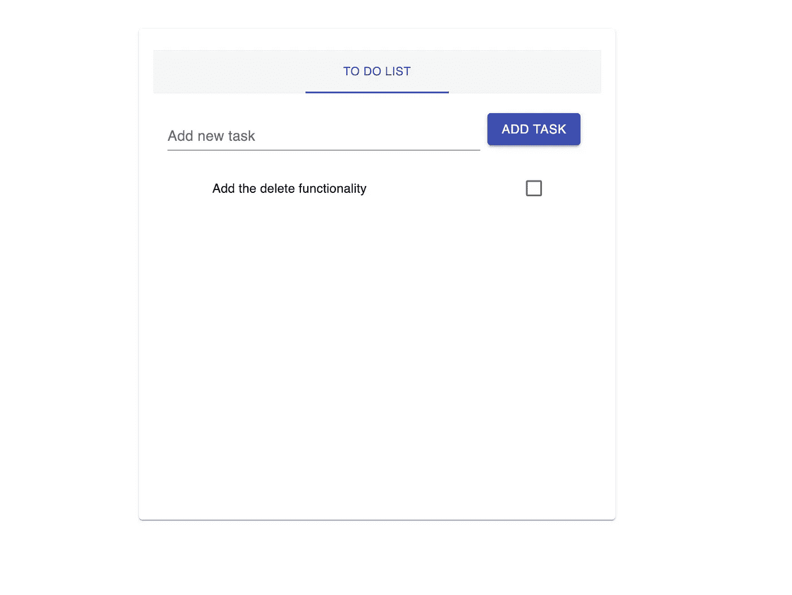

# react js-带有 useReducer 挂钩的上下文 API

> 原文：<https://medium.datadriveninvestor.com/usereducer-hook-in-reactjs-1225aecd7d43?source=collection_archive---------0----------------------->


如果您正在使用 ReactJS，您应该听说过 Redux。很长一段时间，React 和 Redux 被认为是天作之合，但现在情况开始发生变化。

## *那么这个 Redux 是什么？*

简单来说，Redux 是一个库，用于*维护/处理全局状态*。因此，维护和处理所有这些 react 组件中的所有数据变得更加容易，因为您只有一个主要的交互源。当您在商店中进行任何更改时，所有组件都会感受到这些更改。

[](https://www.datadriveninvestor.com/2019/02/25/6-alternatives-to-the-yahoo-finance-api/) [## 雅虎财经 API |数据驱动投资者的 6 种替代方案

### 长期以来，雅虎金融 API 一直是许多数据驱动型投资者的可靠工具。许多人依赖于他们的…

www.datadriveninvestor.com](https://www.datadriveninvestor.com/2019/02/25/6-alternatives-to-the-yahoo-finance-api/) 

不过，使用 Redux 时需要考虑一点学习曲线，比如你必须知道什么是 reducers、dispatchers、action creators，如果你要使用 API，那么你还必须添加一个像 Redux-Thunk 这样的中间件。这并不容易，就像在 Angular 中创建一个服务一样。

React 试图用他们在版本 16 和更高版本中引入的上下文 API 来取代这种依赖性。但是它仍然不是一个可以在企业级实现的解决方案。

但是现在，在引入 hooks 并使用了一段时间之后，我想他们已经让我和我的同事们开始用我们项目的上下文 Api 替换 redux 了。

所以让我们创建一个简单的 TodoList 来检查我们如何实现它，你可以在我的 [git 库](https://github.com/devAbhimanyu/React_useReducer_Hook)中找到最终的代码。

* *注:我使用自己的样板文件(* [***文章***](https://medium.com/datadriveninvestor/react-boilerplate-adc97f608251)*/*[***代码***](https://github.com/devAbhimanyu/react-webpack-boilerplate) *)来创建我的个人项目，如果你愿意，可以使用 create-react-app。*

> **创建我们的商店:**

创建一个名为 Store 的功能组件。Store 组件将充当一个 HOC(高阶组件)，我们将在其中包装我们的主要应用程序组件。

```
const App = () => {
return (
  <Store>
    <ToDoList></ToDoList>
  </Store>
  );
}
```

从 React.createContext API 创建一个上下文变量，该变量将用于创建提供者组件。提供者组件包含**值**属性，用于绑定将被**消费**的数据。

```
import React from "react";
export const **Context** = React.createContext();export const Store = props => {
return (
      <**Context.Provider** **value**={}>
          {props.children}
      </**Context.Provider**>
    );
};
```

上下文 API 为我们提供了一种替代的方式来传递组件树中的数据，而不使用传统方法中的*道具。*

因此，上下文 API 分为两个主要部分:

*   提供者是定义要传递的数据的地方。
*   消费者:是我们消费在提供者中传递的数据的地方。

我们将不研究消费者部分，因为我们将使用钩子来获取或者更确切地说是消费数据

> 创建我们的减速器和初始状态:

如果你来自 redux，你知道这两个值是什么。对于刚开始反应甚至是还原的人来说，初始状态是我们商店全局状态的蓝图。

所以 initialState 将是一个带有属性列表的对象，这是一个对象列表。由于 initialState 是一个对象，所以可以根据需要添加新的属性。

```
const **initialState** = {
list: [
  {
   itemId: 1,
   task: "Add the delete functionality",
   completed: false
  }
]};
```

现在是 Reducer，它是一个方法，接受两个参数状态和动作。状态指向初始状态，动作是我们定义动作类型和用于更新和返回更新状态的有效载荷的地方。

```
const **reducer** = (state, action) => {
  const { **payload** } = action;
  switch (**action.type**) {
    case "ADD_ITEM":
     return addNewItem(state, payload.todoItem);
    default:
     return state;
}};
function addNewItem(state, task) {
  const list = [...state.list];
  const newItem = {
    itemId: list.length + 1,
    task: task,
    completed: false
  };
  return {
    list: [...state.list, newItem]
  };
}
```

* *注意:* ***case*** *参数将是动作类型，命名约定总是全部大写，用下划线隔开。*

> 使用 **useReducer** 绑定我们的减速器和初始状态:

useReducer 是 React 引入的臭名昭著的挂钩的一部分。useReducer 方法接受 Reducer 和 initialState，并返回一个数组，第一个值是状态，第二个值是 dispatcher 函数。

**注:* ***调度员*** *功能是用来与* ***减速器*** *交互的功能。*

```
//using array destructuring
const [globalState, dispatch] = **React.useReducer(reducer, initialState)**;
```

globalState 和 dispatch 函数将被传递给上下文中的 value prop。提供者组件。

最终的输出将如下所示:

```
export const Store = props => {
const [globalState, dispatch] = React.useReducer(reducer, initialState);
return (
  <Context.Provider value={{ **globalState, dispatch** }}>
    {props.children}
  </Context.Provider>
);};
```

> 消耗/注入还原剂的时间

创建一个新组件，并添加时间来导入我们在存储文件中创建的上下文变量。

```
import React from "react";
import { Context } from "../../store/Store";
```

消费数据是最简单的部分，我们将使用另一个名为 useContext 的钩子。

它将我们导入的**上下文**作为参数，并返回我们在定义提供的的**时在**值属性**中传递的数据。**

```
//using object destructuring
const { globalState, dispatch } = React.useContext(Context);
```

现在我们剩下的就是使用全局状态并将其绑定到我们的其他组件。

```
//example not final code
globalState.list.map(item => {
const listItemText = item.completed ? (
<ListItemText id={labelId} primary={item.task} className={classes.strike}/>) : 
(<ListItemText id={labelId} primary={item.task} />);}
```

请检查最终版本的存储库，最终输出如下所示:



Final App

## 我对 useReducer 与 Redux 的看法:

尽管这是使用全局状态的一种更简单的方式，但是有一些应用程序是使用 Redux 构建的，对于它们来说，迁移似乎不是正确的选择。Plus Redux 是一个久经考验的库，所以解决方案和技术架构师总是更喜欢它，而不是使用钩子。与使用 use state 钩子函数组件相比，使用组件状态仍然是更好的选择。
但这并不意味着钩子永远不会被整合到企业级应用中，只是需要一些时间。对于中小型应用程序，使用 Context for me 看起来比实现 Redux 更快更好。
让我知道你对钩子的想法，如果有任何问题，就把它们添加到评论区。