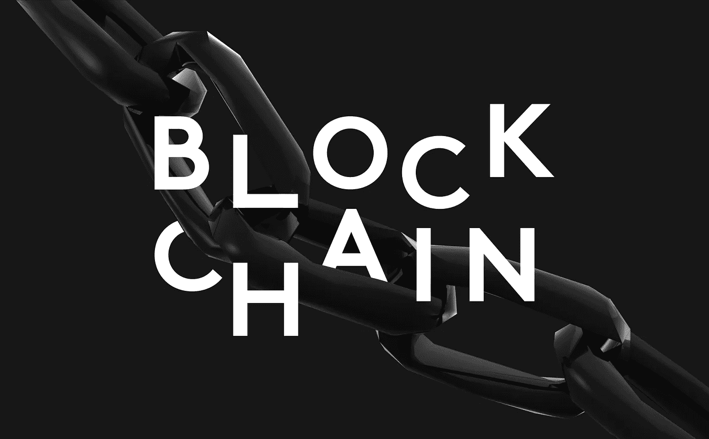

# 区块链在发展中国家的用途

> 原文：<https://medium.datadriveninvestor.com/uses-for-blockchains-in-the-developing-world-27326ac1a003?source=collection_archive---------11----------------------->

在我的文章[区块链简介](https://medium.com/@derekkopke/an-intro-to-blockchain-5ce66cfc57d5) *，*中，我为之前没有听说过的人讨论了区块链技术的基础知识。本文将对此进行扩展，并提供区块链技术潜在用途的具体例子，主要关注它们对发展中国家的影响。

您应该还记得，我将区块链定义为廉洁的点对点公共数据库，它可以用来永久记录交易，使交易完全可供公众查看，同时在交易的发起者和接收者周围保持极高的私人安全级别。这些系统是通过强有力的激励计划来维护的，任何人都有兴趣成为永久公共记录保存流程的一部分。从本质上说，通过数据库的分散化，您可以提高数据的安全性，因为您不必将数据全部集中在一个地方，也不必依赖某一方来保护数据，以免被那些为了个人利益而试图访问数据的人窃取。

 [## 正在改变行业的 5 个真实世界区块链应用——数据驱动的投资者

### 除非你一直生活在岩石下，否则我相信你现在已经听说过区块链了。而区块链…

www.datadriveninvestor.com](https://www.datadriveninvestor.com/2019/02/13/5-real-world-blockchain-applications/) 

以下具体例子展示了区块链技术如何直接影响发展中国家的人民。

ѻ今天，世界上有近 20 亿人没有银行账户。这些人中的大多数没有银行账户，因为他们没有足够的财富来存储，或者拥有银行账户的成本太高，会消耗大量的收入，而增加的收益很少。此外，银行通常不希望这些人成为客户，因为将他们作为客户的成本高于他们给银行带来的收入。区块链技术允许一个价值创造和点对点交换的系统，提供一个在安全环境中存储资金、支付或购买、众包投资或全球转移资金(即使是小额支付增量)的系统。

ѻ:互联网让许多人认识到成为共享经济一部分的能力。不幸的是，最初使网上购物可行的几层产生信任的中间人首先出现了。这个中间层会给任何网上购物增加很大的成本。它包括支付处理商、信用卡公司和银行(它们会介入每一笔网上交易)，通常在购买后的几天内都不会完全解决交易。它还包括在市场发展中赚取更大份额的聚合商。想一想 AirBnB 或优步，它们对每笔交易收取 25%的费用，为使用或共享住所或交通工具提供便利。基于区块链的系统不仅可以确保在 10 分钟内完成支付，还可以通过消除中间层来显著降低成本，同时仍然确保网络的可靠性。想象一个点对点的共享经济，你拥有的每一项资产(车辆、住所、工具、能力等等..)可以提供给你周围的每一个人，而不必在基于信任的系统中与中间层分享你收入的很大一部分。你会知道，如果你提供服务，你会收到你的资金，整个系统将是基于声誉的，这意味着提供糟糕服务的人将获得糟糕的声誉分数，最终实际上不会被潜在的客户所要求。该体系的构建将确保增加价值最多的人将获得最佳回报，每个人都将实现收入最大化，并削减许多中间层。

ѻ2010 年地震夷平海地后，红十字会筹集了超过 5 亿美元用于救援工作，并声称其中大部分将用于新的基础设施(住房等)..).虽然他们声称已经为超过 130，000 人提供了住房，但据报道(www.npr.org 和其他人)红十字会建造的房屋实际上总共只有 6 栋。在一个所有基础设施都被毁坏的国家，很多问题在于土地所有权记录非常糟糕。如果你不知道谁拥有土地，建造房屋可能会很困难。区块链技术可以提供全球土地所有权的永久和不可变记录。通过这样的系统，出售土地所有权可以很容易地进行登记，并允许红十字会这样的组织很容易地确定他们正在建设谁的土地，而不必处理数英里的繁文缛节和缺失的文书工作。

ѻ同类登记系统可用于出生证、死亡证、结婚证和健康记录。在发达国家，有些人因为无法联系到他们的家庭医生向急诊室医生提供医疗记录而死亡。问题是为什么一个医生应该拥有他们病人的记录？为什么病人不应该拥有自己的医疗记录，并能够与他们想要的任何人分享？如果所有病历都存储在区块链类型的分布式应用程序中，那么当病历对当前治疗至关重要时，这些信息就可以及时共享。同样的理论也适用于发展中国家。疫苗接种或治疗证明对于村庄被摧毁的难民或来自偏远村庄的难民来说至关重要。随时获取所有医疗信息的能力可以拯救全球数百万人的生命，其可用性将通过快速虹膜扫描或基于指纹的识别系统来实现。

发展中国家(以及许多发达国家)的ѻ选举因不能准确代表人民的愿望或实际投票而臭名昭著。一个基于区块链的每人一票的系统被输入到一个不可改变的系统中，选举结束后立即自动计算并提供结果，这可以大大增加选民的参与度，并且肯定可以验证，即使没有将任何特定的投票与任何特定的选民联系起来。

在本文中，我只提到了区块链技术的一些可能的应用，但是，即使有了这些，您也可以判断这项技术将会产生什么样的影响。这是非常令人兴奋的见证，未来几年将为我们所有人带来一个更私人但更可信的去中心化连接系统。

Derek Kopke 是一名高级业务发展主管和顾问。他到过超过 65 个国家，在全球超过 80 个国家谈判并达成销售。他的教育学学士学位和国际商务 MBA 学位，以及他独特的世界观和全球文化经验，为他用来造福有意在海外发展的公司提供了基础。德里克现居加拿大蒙特利尔，与妻子和两个十几岁的孩子一起生活。