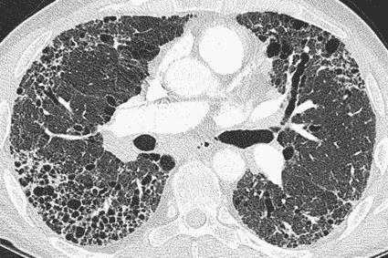
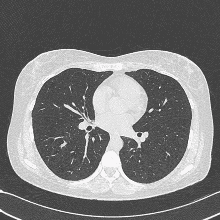
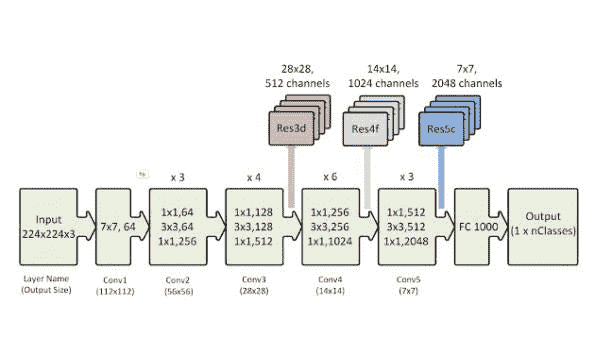
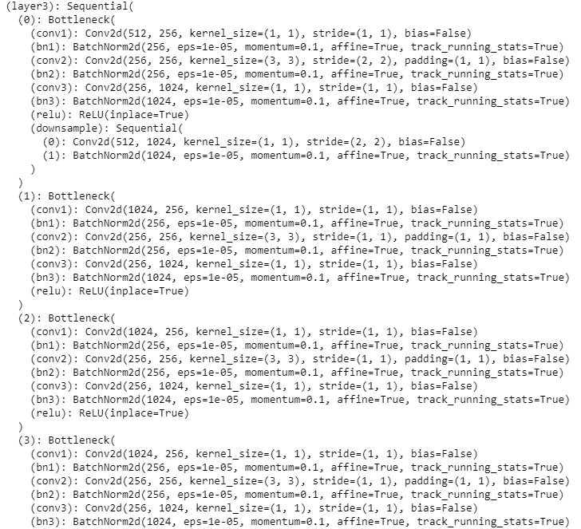
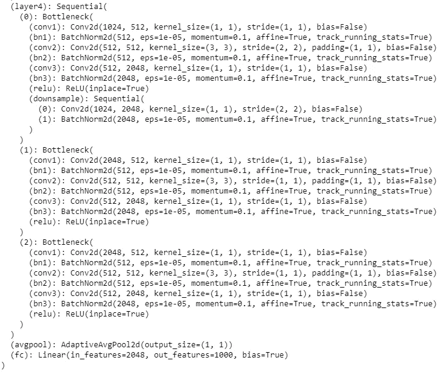
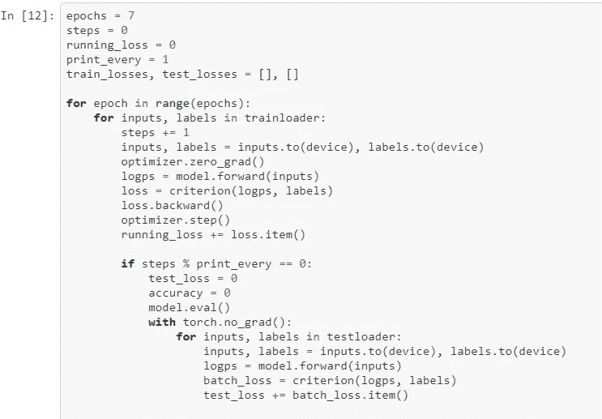
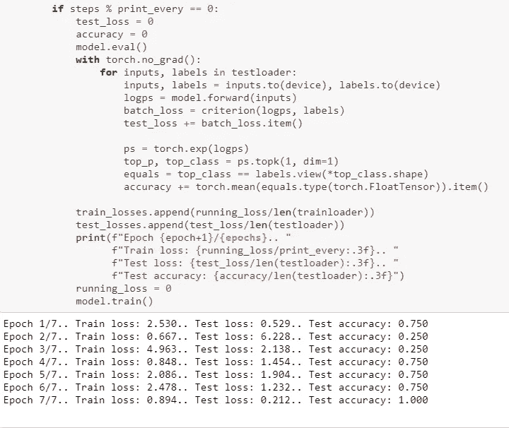
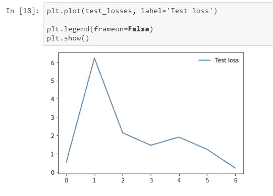

# 利用神经网络对特发性肺纤维化的 CT 扫描图像进行分类

> 原文：<https://medium.datadriveninvestor.com/using-a-convulational-neural-network-to-classify-ct-scan-images-of-idiopathic-pulmonary-fibrosis-e0fb1ad4032b?source=collection_archive---------4----------------------->

特发性肺纤维化(IPF)是最常见的间质性肺病。它大约影响。美国有 10 万到 20 万人。美国每年有 30，000 到 40，000 个新病例。临床表现通常为老年男性，表现为呼吸急促和血氧饱和度低(低氧血症)。体格检查经常发现肺部听诊有细微的噼啪声，也称为“Velcro”噼啪声。肺部 CT 扫描的特征是胸膜下囊肿、牵拉性支气管扩张和肺部蜂蜜样外观，尤其是在周围区域。尽管最近出现了像吡非尼酮这样的药物，但治疗选择仍然有限，并且诊断后的预期寿命通常限制在 5 年以内。

CT scan from a patient with IPF showing honeycombing, subpleural cysts and traction bronchiectasis

Ct scan of normal lung

在这个初步实验中，我们的目的是使用一个卷积神经网络将 CT 扫描图像分类为 IPF 或正常。由于这是一个初步实验，并且这不是一种非常常见的疾病，我们的图像数据集包括来自不同患者的 14 个 IPF 的 CT 扫描图像(具有 IPF 的特征)，以及来自不同患者的 9 个正常肺的 CT 图像。对 IPF 患者的 CT 扫描图像进行注释，以突出显示胸膜下囊肿、蜂巢等异常区域。使用了带有 Nvidia GPU 和 64GB RAM 的 Google Colab Python 3.6 环境。

我们使用 Pytorch 的 torch 库将数据集随机分成 80/20 比例的训练和测试数据集。采用 Torch 视觉库对图像进行变换和预处理。

 [## 深度学习用 7 个步骤解释-更新|数据驱动的投资者

### 在深度学习的帮助下，自动驾驶汽车、Alexa、医学成像-小工具正在我们周围变得超级智能…

www.datadriveninvestor.com](https://www.datadriveninvestor.com/2019/01/23/deep-learning-explained-in-7-steps/) 

我们在这个实验中使用 ResNet-50 卷积神经网络(CNN)进行图像识别和分类的深度学习。模型层如下所示。我们使用 optimizer= 'Adam '。

ResNet-50 CNN Model

Details of the layers of ResNet CNN used in this experiment

ResNet-50 模型在训练图像数据集上被训练，并在测试图像数据集上被验证，最初从 3 个时期开始，这些时期被增加以实现最大测试准确度和测试损失的阈值，在该阈值之上，由于模型的过度拟合，测试损失开始增加。在调整模型参数时发现的理想时期数是 7。

如上图所示，在第 7 个时期达到了 100%的测试准确度。在第 7 代以上，发现测试精度下降。

使用 matplotlib 库绘制每个时期后的试验损失，如下图所示。

总之，在这项使用 ResNet-50 神经网络的初步研究中，我们能够实现 100%的测试准确性，从正常的肺部 CT 图像中识别 IPF 患者的 CT 扫描图像。在这个项目的下一阶段，我们正在收集更多 IPF 患者的 CT 扫描数据。我们还从 IPF 患者的肺活检中收集了组织病理学数据，并计划使用相同的方法使用 CNN 进行图像分类。