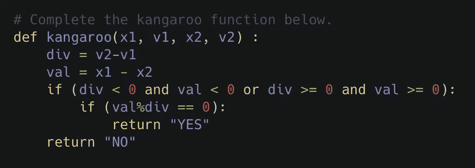

# 使用重构方法编写漂亮的代码

> 原文：<https://medium.datadriveninvestor.com/using-a-refactor-approach-for-writing-beautiful-code-a1aee9de569c?source=collection_archive---------5----------------------->

Photo by [Tookapic](https://www.pexels.com/@tookapic?utm_content=attributionCopyText&utm_medium=referral&utm_source=pexels) from [Pexels](https://www.pexels.com/photo/close-up-photography-of-person-s-eye-74472/?utm_content=attributionCopyText&utm_medium=referral&utm_source=pexels)

你是否曾经看着一段代码，不管是你的还是别人的，只是茫然地盯着它，完全不知所措？在我们的开发职业生涯中，我们都将或者已经经历过这种情况。

在我们作为学生和专业人员的生活中，我们与各种团队一起工作，无论是小型还是大型代码库。这要求我们看并理解不同人写的代码，也要求我们的代码被不同的人看并理解。编写漂亮的代码可以在我们的队友之间建立这种信任，因为我们通过遵循他们来推广最佳实践。

 [## 数据科学和软件工程哪个更有前途？-数据驱动型投资者

### 大约一个月前，当我坐在咖啡馆里为一个客户开发网站时，我发现了这个女人…

www.datadriveninvestor.com](https://www.datadriveninvestor.com/2019/01/23/which-is-more-promising-data-science-or-software-engineering/) 

为了让我们未来的自己和我们的队友的生活变得容易，并且有一个额外的强大资产向我们的招聘人员展示，编写漂亮的代码是必不可少的！

## 什么是美丽的代码？

美丽的代码是一段任何人，以及你未来的自己，无需任何口头解释或外界参考就能看懂的代码。但你会问，怎么做呢？

这是一份清单。如果你能对所有这些问题都做出肯定的回答，那么你就拥有了一段漂亮的代码:

*   你的代码有没有**简短注释**来解释每个函数的*功能*？
*   你的代码有没有**简短注释**来解释任何*复杂的*或者*棘手的*代码？(例如。面向数学的解决方案，或者很长的一行程序)
*   你的变量和函数名**就它们所代表的内容而言是否简短但具有描述性**？
*   所有的名字都遵循相同的风格惯例吗？例如，要么全部是骆驼肠衣，要么全部是蛇肠衣。
*   你的函数是否被分解(或重构)在*更小的*帮助函数中，这样**没有重复的代码**并且你的**函数不会太长**(最多 8-10 行是理想的)。
*   你为你的助手函数和程序编写了好的测试吗？一个好的测试除了简单的情况之外，还包括各种各样的边缘情况。
*   你的程序通过所有的测试了吗？
*   所有不必要的打印语句、注释代码或未使用的代码都从程序文件中删除了吗？

啊…这么多东西！通常，当我们兴奋而勤奋地致力于实现一个解决方案或想法时，我们无法跟踪所有这些。但是，不要担心，通过使用**重构方法，您仍然可以拥有漂亮的代码。**

## 什么是重构？

> 代码重构是指**重组现有计算机代码的过程——改变**分解——而不改变其外部行为。重构改进了软件的非功能属性。~ [维基](https://en.wikipedia.org/wiki/Code_refactoring)

上面的定义给出了重构的大致概念，但是边做边学无疑是理解这个过程的好方法。让我们重构下面这段代码，它解决了这个[黑客排名挑战](https://www.hackerrank.com/challenges/kangaroo/problem):

这段代码的风格有什么问题？仔细检查我们的清单，哪些点没有通过？在进一步阅读之前记下它！

以下是我发现的问题:

*   没有注释解释这个函数是做什么的。这个功能到底是为了什么？？？
*   **没有解释长“if”语句的注释。为什么它返回 Yes 或 No？**
*   **变量需要注释来描述它们代表什么！**
*   **没有测试！**
*   **if 语句太长！助手功能？？**

让我们解决这个问题。下面是经过美化的代码:

浏览上面改进的代码，并按照我们的清单运行它。通过了吗？就代码的作用和做出某些决定的原因而言，代码对任何人来说都是可理解的吗？这是测试代码吗？

这里是另一个[美丽代码](https://github.com/Anisha7/CS1.3-Core-Data-Structures/blob/master/sets.py)及其[测试](https://github.com/Anisha7/CS1.3-Core-Data-Structures/blob/master/sets_test.py)的例子。

恭喜，现在你知道如何编写漂亮的代码了！现在还不算太糟，是吗？回顾一下:我们生成了一个清单，强调注释、命名约定、助手函数和测试的重要性。

如果你想了解为什么编码风格很重要，这里有一个[资源](https://www.smashingmagazine.com/2012/10/why-coding-style-matters/)。