# 在您的 Android 应用中使用 AutoML Vision

> 原文：<https://medium.datadriveninvestor.com/using-automl-vision-in-your-android-app-1d68316c3495?source=collection_archive---------11----------------------->

[](http://www.track.datadriveninvestor.com/1B9E)

[https://tinyurl.com/y8bndbm3](https://tinyurl.com/y8bndbm3)

[机器学习](https://en.wikipedia.org/wiki/Machine_learning)是近来我们在开发社区和其他地方经常听到的一个术语。有许多工具可以让没有 T4 机器学习或人工智能学位的人更容易获得 T2 机器学习。AutoML 就是这些工具之一。

# 什么是 AutoML？

AutoML 是谷歌云平台上的一个工具，它允许任何没有[机器学习](https://en.wikipedia.org/wiki/Machine_learning)经验的人创建定制模型，而无需编写任何代码。这听起来很棒，对吧？你可能会问自己，我什么时候需要使用这个工具？

嗯，有许多预先训练好的模型可以预测最基本的项目，从水果到常见的植物和不同类型的动物。但是，如果你试图对这些预先训练的模型都不能为你预测的东西进行分类，该怎么办呢？AutoML 也许能帮上忙。

# 入门指南

由于 AutoML 运行在 Google Cloud 上，您需要在 [Google Cloud 控制台](https://console.cloud.google.com)中创建一个项目。

创建完成后，您可以前往 [AutoML 页面](https://cloud.google.com/automl/)，此时您将看到 3 种不同的 AutoML 产品，分别是:

1.  自动视觉
2.  自动自然语言
3.  自动翻译

本文中我们将重点介绍的产品是 AutoML Vision。

**注意:该产品处于测试阶段，将来可能会有变化。**

要访问 AutoML 仪表板，我们需要单击 AutoML Vision 链接。

一旦我们进入并选择了我们的 Google Cloud 项目，我们需要做两件事，然后才能看到仪表盘。

*   启用计费
*   启用所需的 API 并授予权限

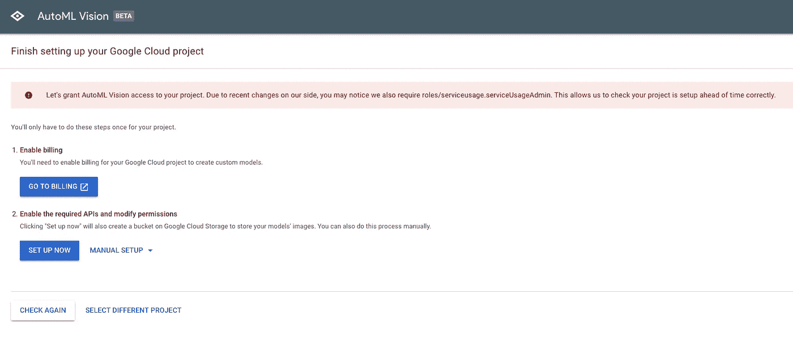

当我第一次启用 API 并授予权限时，我使用了手动设置，它为您提供了命令行指令。事实证明，这种方法效果更好，因为“立即设置”按钮对我不起作用。最近它似乎工作得很好，为你自动设置了一切。

完成所有设置后，您将看到 AutoML Vision 仪表盘。这是我们所有数据集的所在地，也是我们创建新数据集的地方。

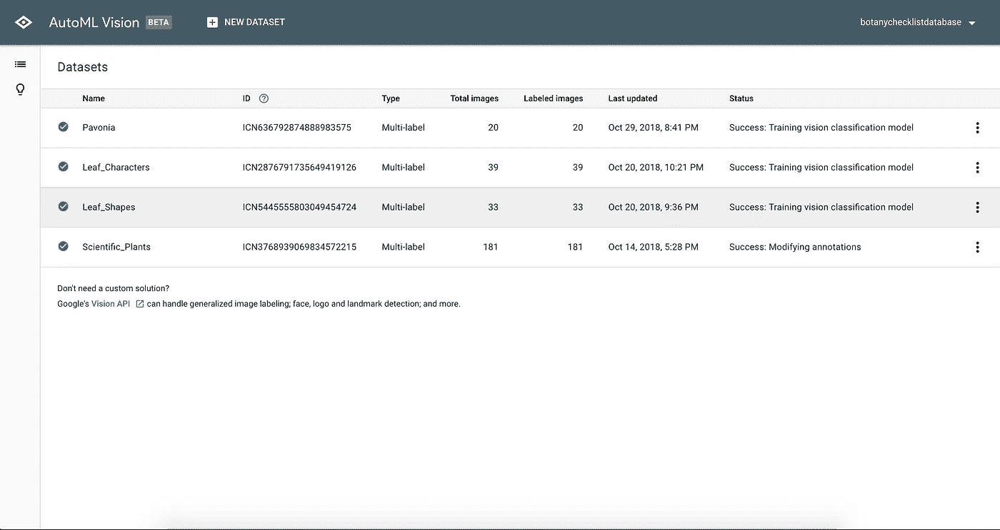

我们将单击“新建数据集”按钮，创建一个新的数据集。我们会给它一个名字，我们可以从我们的电脑上传我们的图像，在谷歌存储 CSV 文件或在稍后阶段导入它们。

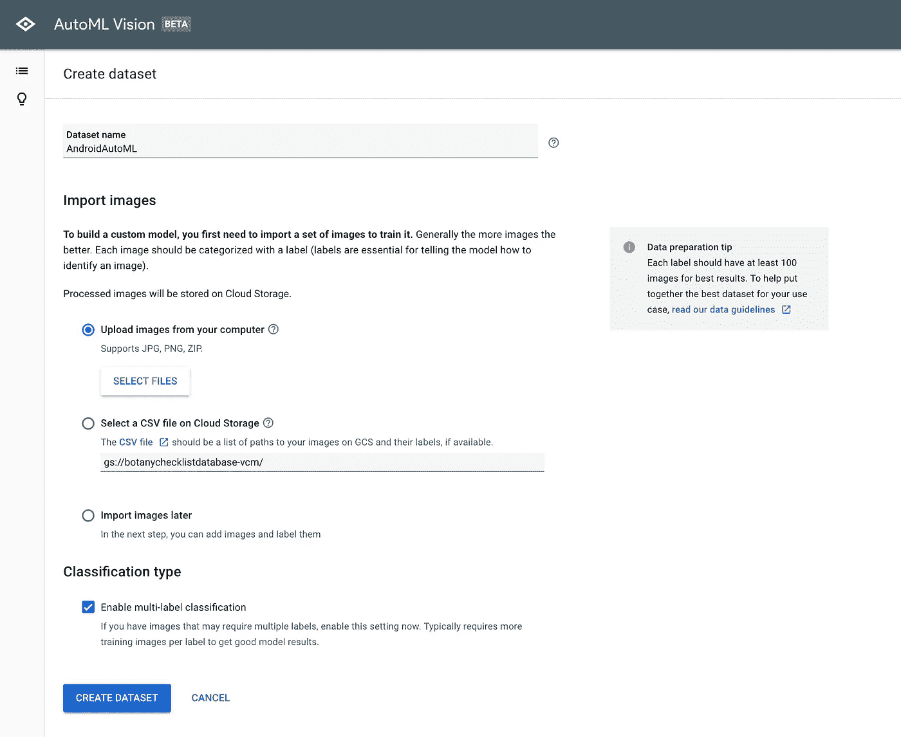

**注意:如果您想跳过手动添加标签到您的图像，当上传图像时，如果您将它放在特定的文件夹结构中，这将自动添加标签到该文件夹中的图像。**

我们还可以选择将分类类型更改为多标签分类。这允许我们为每个图像提供多个标签，而不是每个图像只有一个标签。此时，我们可以创建数据集了。

我们将进入数据集的控制面板，如果我们导入了任何图像，就会看到这些图像出现在这里。此时，我们将看到 4 个选项卡。

1.  形象
2.  火车
3.  评价
4.  预测

Images 选项卡是我们在数据集中看到图像的地方，如果需要，这也是我们标记图像的地方。关于图像的标记，在我们可以训练我们的模型之前，我们需要每个标记至少有 10 个图像，否则我们将无法训练我们的模型。建议使用大约 100 张图片，以获得更准确的结果。

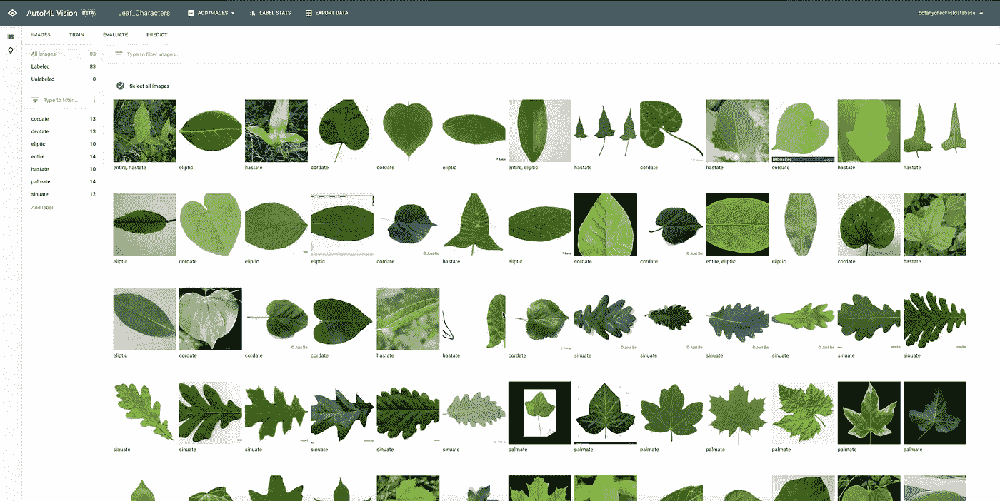

在 Train 选项卡中，我们将看到 train a new model 按钮，以及以前版本的模型所在的位置。我们获得了一些关于有多少图像和标签是训练模型的数据集的一部分的信息，以及关于精度和召回的统计数据。

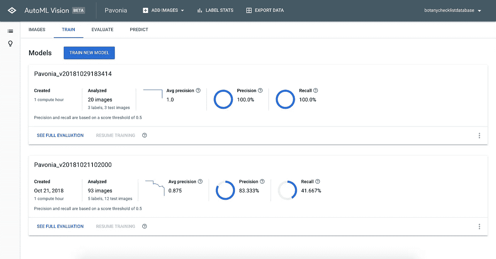

“评估”选项卡是我们训练模型后显示结果的地方，它为我们提供了有关标签本身的更多详细信息，以及模型对特定标签的预测能力。

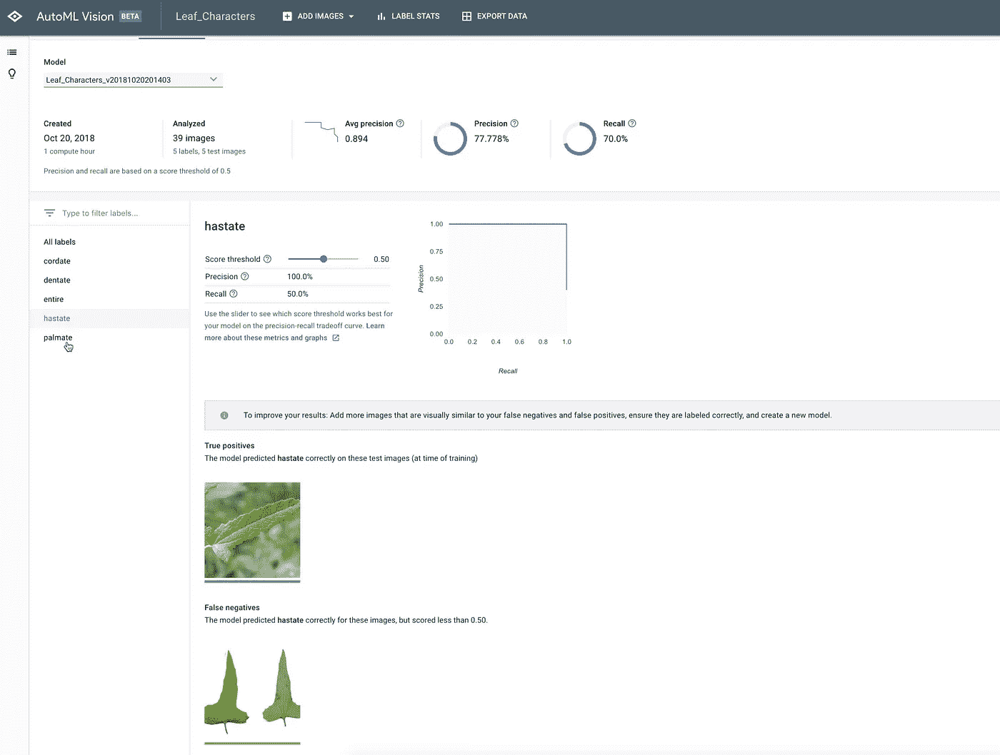

Predict 选项卡为我们提供了一个很好的 web 界面，让我们用图像来测试我们的模型，并在这个 web UI 中显示结果。在这个选项卡中，我们还将详细了解如何使用 python 中的模型以及为我们训练的每个模型创建的 REST API。

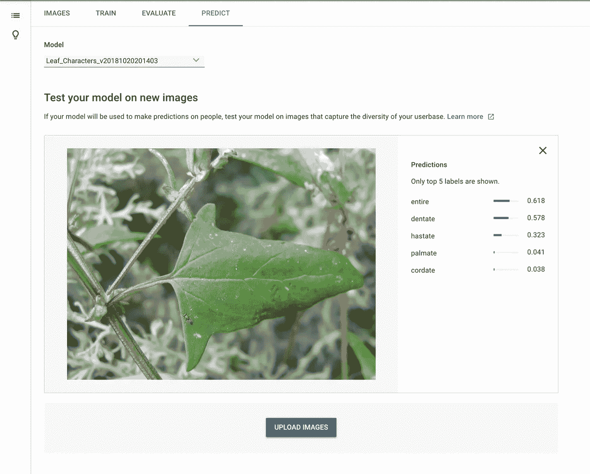

我们现在可以确保我们的数据集已准备好进行训练，然后我们可以点击“训练新模型”按钮。我们将看到一个对话框，询问我们希望为我们的模型命名什么，以及我们的定价预算是多少。开始付费前，我们有 1 小时的免费培训。根据你的数据集有多大，1 小时的计算能力对于小的实验模型来说绰绰有余。然后我们点击开始训练。

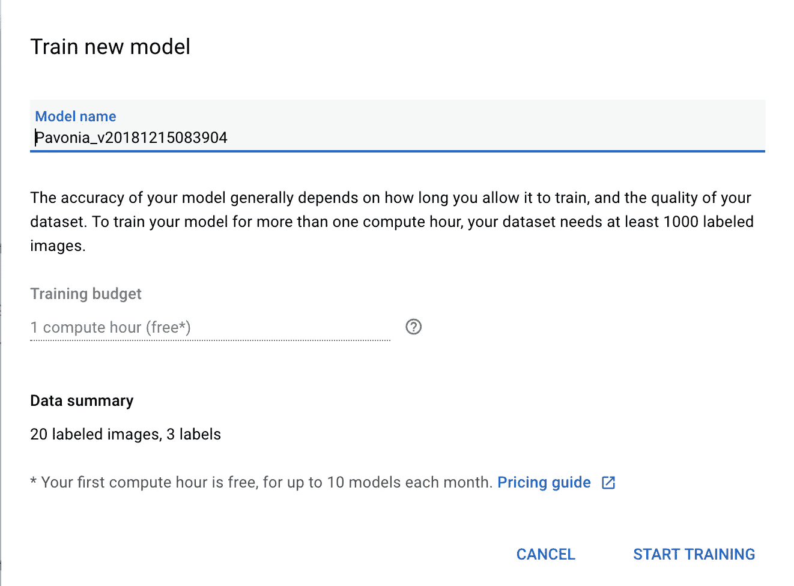

这可能需要一些时间，所以在这一点上抓住一些咖啡。

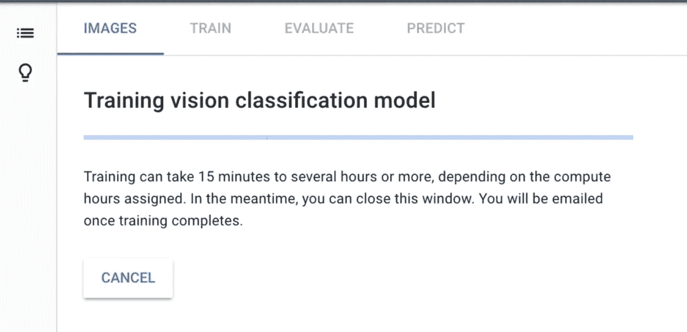

一旦我们的模型完成，我们会收到电子邮件通知。我们可以返回控制面板，单击我们的评估选项卡，查看我们全新定制模型的结果。这是查看您的训练数据有多好以及每个标签的训练数据中是否有任何假阳性或假阴性的好地方。最后，我们想要基于训练数据的真正正面的标签。

现在你在想，但是我如何在我的 Android 应用程序中使用它呢？我们终于到了那一步。我们有自己的模型和生成的 REST API，让我们把它们放在一起。

对于每个模型生成的每个 API，在我们的 URL 中有 3 件事情可以改变。

1.  项目——谷歌云项目正在进行
2.  位置—您的项目所在的地区，例如美国中部 1
3.  模型 ID-每次重新训练模型时生成的模型 ID。

这个 API 调用是一个 POST，我们需要一个授权头。我们需要在这个头中传递的令牌是[服务帐户](https://cloud.google.com/iam/docs/creating-managing-service-accounts)令牌。您可以使用下面的命令获得这个令牌。

```
$(gcloud auth application-default print-access-token)
```

**注意:我们需要确保我们正确地设置了我们的** [**服务帐户**](https://cloud.google.com/iam/docs/creating-managing-service-accounts) **令牌，否则当我们使用这个令牌试图访问 API 时会被拒绝。** [**服务帐户**](https://cloud.google.com/iam/docs/creating-managing-service-accounts) **令牌的文档确实很好，但在特定点上可能会令人困惑。**

我们的帖子将有一个有效载荷，我们将通过我们的图像作为一个字节数组。

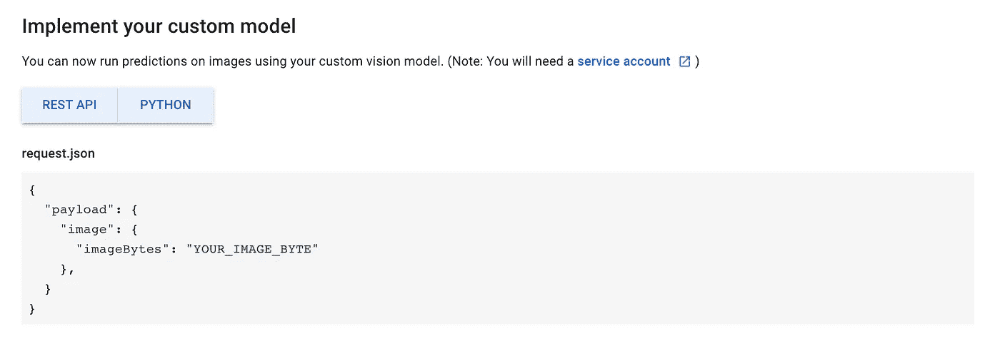

# 让我们打开 Android Studio，构建我们的应用程序

我们的应用程序将会很简单；我们将打开我们的图库，在那里存储我们要预测的测试图像，并将其传递给 API 进行预测并显示结果。

我们将使用 Retrofit 和 OkHttp 做一个简单的 API 调用。我们将创建 OkHttp 客户端对象，这是我们将添加授权头的地方。

此时，我们将创建一个函数来创建我们的改造对象。

我们现在需要创建端点来访问我们的 API。

此时，我们需要编写一些代码来打开图库，从我们的测试数据中选择一个图像，并调用我们的自定义模型 API 来获得我们的图像的预测结果。

我们将使用 Android 构建的 API 来打开图库，并从设备中获取图像。然后，我们将获取该图像，并将其转换为字节数组，因为这是我们在有效载荷中需要的。

现在是时候调用我们的 API 并显示结果了。

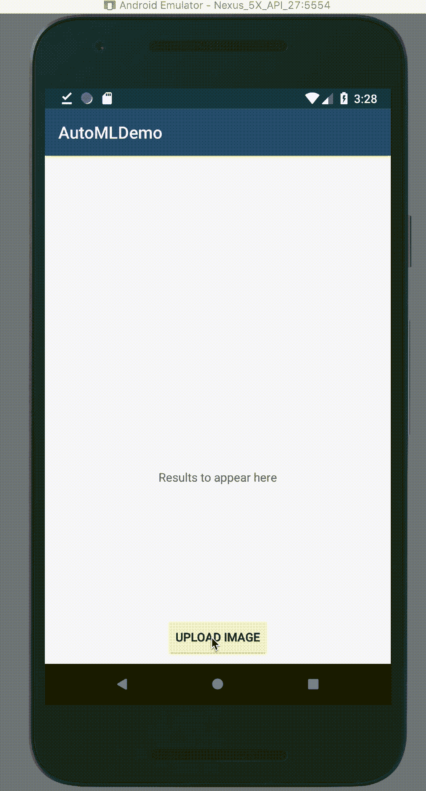

现在，我们已经在 Android 应用程序中成功调用了我们在 AutoML 平台上创建的定制模型。

**注意:第一次调用 API 时，模型通常会预热，因此可能需要几秒钟才能响应。**

去试试吧，让我知道你的想法。这是一个不需要任何编码就可以创建定制模型的非常棒的工具，并且它有一个简单的方法将这些模型集成到客户端应用程序中。

你可以在这里找到一个更完整的安卓应用[的例子。](https://github.com/pjwelcome/Android_AutoMLDemo)

取得联系！

[](https://twitter.com/pjapplez) [## 彼得-约翰(@pjapplez) |推特

### 彼得-约翰的最新推文(@pjapplez)。移动应用开发者、技术探索者、摄影师、联合创始人…

twitter.com](https://twitter.com/pjapplez) 

[**彼得约翰欢迎—谷歌+**](https://plus.google.com/u/0/+PeterJohnWelcome)

感谢 [Ashton Welcome](https://plus.google.com/111778165757216259863) 审阅这篇文章。