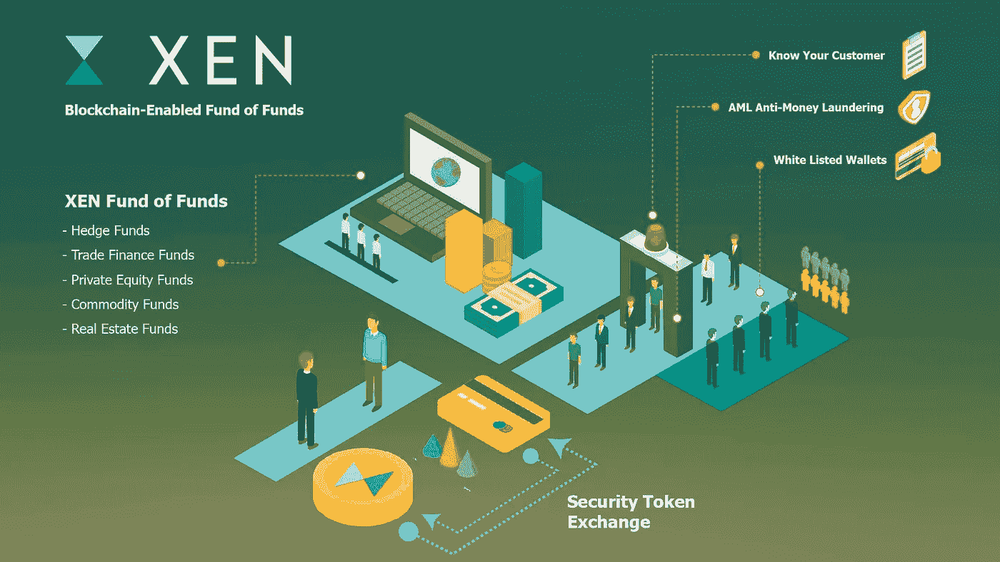
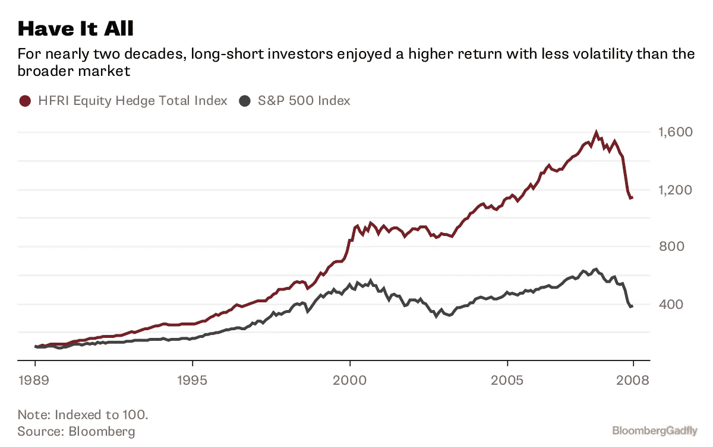

# 利用区块链投资对冲基金

> 原文：<https://medium.datadriveninvestor.com/using-blockchain-to-invest-in-hedge-funds-f011052be54e?source=collection_archive---------13----------------------->

Xen Technologies 的联合创始人 Katrina Cokeng & Manish Sansi

**安度波动风暴**

贸易战。利率。石油价格。如果你在动荡的股票市场中抓耳挠腮，不知道该把钱投到哪里，那就加入这个俱乐部吧。今年，波动性卷土重来，一改过去几年的平静态势。股市的大规模抛售，加上全球贸易战造成的不确定性，让投资者陷入恐慌。

现在，多样化比以往任何时候都更加重要。牛市不会永远持续。标准普尔 500 指数在过去 5 年里上涨了 50%以上，但不可避免的调整——正常或极端——就在拐角处等着。随着潜在的熊市逼近，我们都可以利用一些对冲基金。

如果我们只暴露于市场的多头，那么股市暴跌会对我们的净值产生灾难性的影响。当股市下跌时，几乎所有长期偏好的资产类别——股票、债券、房地产——都有很高的相关性，价值也相应下降。任何只投资于这些相关资产类别的人都享受不到真正的多元化。

在高波动性或熊市期间，对冲基金是为数不多的能够存活下来(有时甚至兴旺发展)的投资管理类别之一。对冲基金只是众多另类投资机会中的一种，可以为投资者带来潜在的高回报(但也有风险)。

另类资产的回报非常可观，根据 Fidante Partners 月份的一份报告，截至 2018 年，“私募股权、直接房地产投资(即不包括 REITs)、基础设施和私人债务等私人市场投资在 3 年和 5 年内的表现超过了除股票以外的所有投资，在 10 年以上的表现也超过了所有投资”。这些诱人的回报吸引了大量资产流入该领域，因此到 2020 年，全球另类投资资产将达到 18.1 万亿美元。

**限制进入对冲基金**

但是对冲基金如此有价值的同时也让散户投资者难以接近。有充分的理由。

新加坡银行提倡将 14%的资产配置给另类投资，但这一空间仅限于高净值个人和大型机构。亚洲只有一小部分财富进入了财富管理行业，富裕的投资者几乎没有机会获得另类投资的高于市场的回报和表现。

由于不成熟投资的下行风险如此之高，监管机构将这些工具的准入限制为只有超高净值投资者和机构投资者，因为他们可以获得专家建议和足够的资本来抵御波动。

根据 Preqin 的数据，机构投资者已经向对冲基金分配了超过 2 万亿美元，占目前该行业投资资本的 58%。鉴于机构投资者的长期投资视野和“粘性”资本，表现优异的对冲基金强烈偏好机构投资者资本。这使得作为个人投资者，即使是作为超高净值投资者，也很难获得投资机会。

这对我们其他人意味着什么？到目前为止，富裕的投资者还没有办法直接投资表现出色的对冲基金。最重要的是，流动性几乎是不可能的，因为有很长的锁定期。

亚洲富裕投资者(到 2020 年资产价值 43.3 万亿美元)如今在人工智能、机器人顾问和区块链等开创性技术环境下对财富管理的投资不足。

**利用区块链和智能合约带来流动性和替代产品**

区块链技术和智能合约提供了一个解决方案。区块链将数据存储在安全、去中心化的账本中；智能合约是在特定条件下自动执行的底层代码。将这一技术应用于对冲基金投资(更不用说更广泛的另类投资)让富裕的投资者能够获得资金和流动性。

投资者可以在对冲基金中拥有一个证券令牌，它代表了所有权的数字证书，就像公司的股票一样。通过证券代币交易所，投资者可以自由交易这些代币以获得即时流动性。这使得富裕的投资者可以对表现出色的对冲基金进行少量投资，并在需要时退出，而不必受制于大多数顶级对冲基金通常长达数年的锁定期。

安全令牌协议和交换开始出现还不到一年，我们还没有看到相关许可证或跟踪记录的真实用例。然而，空间移动得非常快。

为了推动这一领域的发展，我们作为财富管理技术提供商需要与监管机构携手合作。需要通过与基金管理许可证相结合的监管沙盒许可证，对另类投资基金中的安全令牌提供监管。

这将为富裕的投资者提供另类投资基金的渠道和流动性，如对冲基金、商品基金和私募股权基金。这一发展大部分正在与监管机构进行高级讨论，最早可能在 2018 年底出现。

这将是迎来下一代财富管理的一大步，这一代财富管理由区块链和符号化驱动，旨在实现最大的透明度、流动性和资本回报率。

**关于 Xen**

Xen 是首款财富管理平台，使富裕的投资者能够获得另类投资，以实现积极回报。Xen 由前投资银行家、交易员和金融科技资深人士组成的强大管理团队于 2018 年成立，设想未来的财富管理由区块链和令牌化驱动，以实现最大的透明度、流动性和成本效率。[https://www.xen.net](https://www.xen.net)