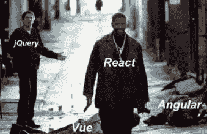
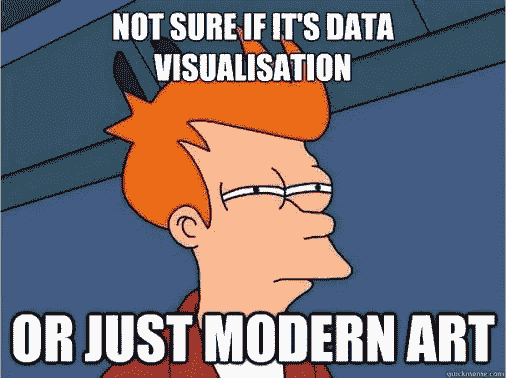
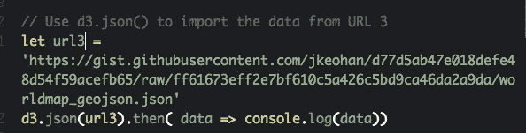
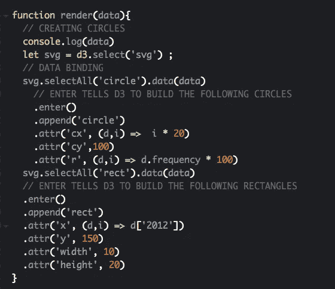
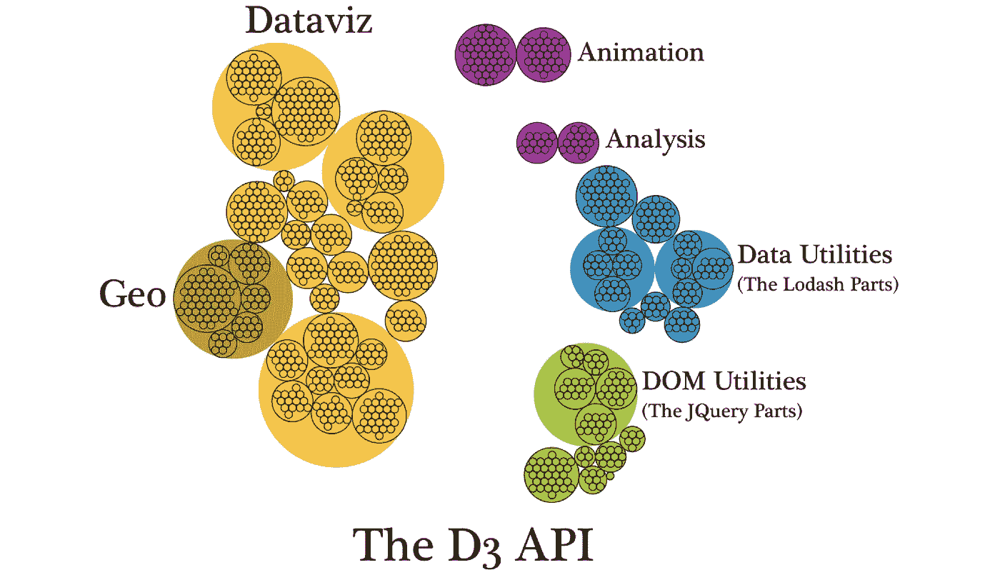

# 在 React 应用中使用 D3:需要知道的 3 件事

> 原文：<https://medium.datadriveninvestor.com/using-d3-in-your-react-app-3-things-to-know-a2026c17e677?source=collection_archive---------4----------------------->

如果你从事 web 开发，你应该已经知道由脸书创建的 React 是目前最热门的用于构建用户界面的 JavaScript 库之一。使用 React 的一些最大优势是它能够创建可重用的代码块，称为组件，使用虚拟 DOM，以及一个调试系统，它可以快速告诉您是否有任何错误以及它们在哪个组件中。

越来越多的公司使用 React 来创建他们的用户界面，随着大数据成为创新和业务敏捷性的更大趋势，D3 将非常有助于让您的 React 应用程序获得优势。

# D3 是什么？

D3，也称为 D3.js 或数据驱动文档，是一个开源的 Javascript 库，它可以通过利用 DOM 元素、HTML、CSS 和 SVG 来创建强大的讲述数据可视化。D3 可用于创建交互式图形以及可视信息仪表板，供用户消化数据集。

通过可视化的故事讲述，D3 为开发者提供了一种方式，允许他们的用户与数据集进行交互，并为他们提供更具消费性的体验。如果你想学习 D3，并在你的下一个 React 应用中使用这个库，我建议按照下面的步骤操作。

# 1)从小处着手

当你第一次开始潜入 D3 的世界时，很容易迷失在视觉效果中，并想从 [GeoJSON](https://d3indepth.com/geographic/) ，地图投影和地理路径生成器开始，但是不要！**关键是从小处着手。**

当第一次在 React 应用程序中使用 D3 时，您会希望在终端的 create-react-app 文件夹中运行`npm install d3`。您还需要使用 **import** * **作为** d3 **从**“D3”导入 D3 到必要的组件中。

一旦安装了 D3 并创建了 D3 组件，我强烈建议开始练习通过 URL、API 或硬编码数据集导入数据，并使用 console.log 确保数据的数组或对象出现在开发人员工具中。

接下来，您可以从小处着手，在一个函数中创建一些 SVG 圆形或矩形来呈现数据，比如 renderChart()。在这里，您将创建 SVG，将其绑定到数据集，并创建具有特定属性的元素。

一旦你掌握了 D3 的基础知识，你就可以继续学习更大的数据集和更具交互性的图形，但是记住要从基础知识开始。

# 2)了解您的 React 生命周期方法

在 React 类组件中，有多个生命周期组件可用于根据用户界面的当前状态操作 React 应用程序。您可能需要生命周期方法的一些原因是为了绑定事件侦听器、异步请求和提高应用程序的性能。

对于 React 中的 D3，您将希望使用生命周期方法将数据挂载和更新到 DOM。例如，您将需要使用方法`componentDidMount(),`，该方法调用一次，并将在组件呈现在 DOM 中后立即挂载您的数据。

如果您的数据是动态的，并且在某个事件(如用户输入或点击事件)后会改变状态，那么生命周期方法`componentDidUpdate(),`对于确保您将新数据重新呈现到 DOM 上将非常重要。您也可以在这个函数中调用 setState()，但是它需要包装在一个条件中，这样您就不会返回一个无限循环。如果没有这些重要的方法，您的数据将无法在 React 应用程序中正确呈现和更新。

# 3)上一堂课，一头扎进去！

如果你想学习 D3，那就投资于你的技能，报名参加 D3 课程，这样你就可以真正开始发展核心基础了。我上了[乔·基奥汉](https://generalassemb.ly/instructors/joe-keohan/7866)的一堂很棒的 [D3 总装](https://generalassemb.ly/education/data-visualization-and-intro-to-d3js-remote-online/new-york-city/61035)课，我们能够在三个小时的课程中学习 D3 的基础知识。课堂环境允许您获得用 D3 编码的实践经验，并真正理解数据可视化背后的概念。

我还建议观看一些在线视频以及 Scrimba 上的 Harald Borgen 初级 D3 教程。Scrimba 是一个很好的资源，可以让你观看视频和代码，这样你就可以习惯 D3 和 React 语法。

在我自己在 React 应用程序中使用 D3 的实践中，我发现从小处着手，使用生命周期方法，并参加一个课程是深入数据可视化世界的一个很好的方式。我在我的第一个 React 应用程序中使用了简单的条形图，这是一个从 Teleport 公共 API 获取的生活质量 React 应用程序。总的来说，D3 是一个了不起的 JavaScript 库，可以添加到您的编码清单中，因此您可以使用可视化的故事讲述，并为您的 React 应用程序提供优势，所以不要等待学习 D3！