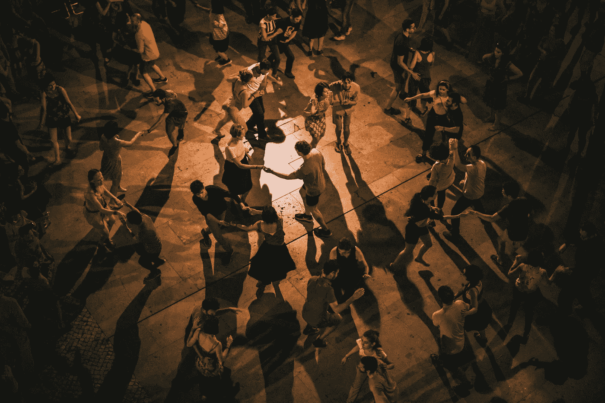

# 利用数据尽你所能做到最好

> 原文：<https://medium.datadriveninvestor.com/using-data-to-become-the-best-you-can-be-d233473f04b?source=collection_archive---------14----------------------->

对许多人来说，时间管理是一件困难的事情。

沃伦·巴菲特、史蒂夫·乔布斯和许多其他人都说，他们经历的成功的关键不是他们经历的机会。相反，正是这种对一切说不的能力推动他们走到了今天。

通常，我们渴望安抚他人，为他们做一些我们无法独自完成的事情。

 [## 面向 Noobs |数据驱动型投资者的数字身份

### 聪明人如何在增强现实中创造身份价值？我最近刚满 40 岁。作为一个生物…

www.datadriveninvestor.com](https://www.datadriveninvestor.com/2019/02/28/digital-identity-for-noobs/) 

但是，这些事情让我们筋疲力尽。

我们必须知道我们的能量来自哪里。

我从音乐、学习和创作中获得能量。

大多数时候，这些对我来说都是个人活动。

我不怎么和别人一起看书，我在自己的时间里看书。

这些文章通常是在我的办公桌上写的。

我经常在办公桌前听音乐，有时也在创作或开车的时候。

这只是关于知道我们是谁和理解上帝创造我们的方式。

有些人喜欢在聚会或聚会上与人分享，并从中获得能量。但对我来说，我可以没有那种东西，我会去一点点，但仅此而已。

我的表弟上周末在芝加哥结婚了。

我喜欢婚礼。它发生在芝加哥市中心一座美丽的教堂里。

之后，我们都前往欢乐时光，然后在当地一家酒店的招待会。

那也很好，但是晚餐来的时候，已经快 10 点了(美国东部时间 11 点)。

我在早上 6:00 离开我在佛罗里达的家飞往那里。

不用说，我累了。人们开始跳舞，但不是我。我几乎看到了舞池里的每个人，但没有看到我。

我非常高兴和满足地享受着餐桌上的音乐，撰写书籍文章，寻找工作机会。这让我恢复了一些精力。

我不像我表兄的新娘，她渴望在每个人中间跳舞。我完全满足于花时间看其他人跳舞，享受他们的时光。

## 但是，我不得不拒绝了大约 10 次。

> "哈里森，来跳舞吧！"
> 
> “哈里森，你想和我们一起跳舞吗？”
> 
> "哈里森，你应该去跳会儿舞。"

但是，不用了，谢谢，我很好。我非常乐意独自一人提神醒脑——尽管在那种情况下进行一些交谈也未尝不可。

你知道你的能量从哪里来，你管理得怎么样吗？

