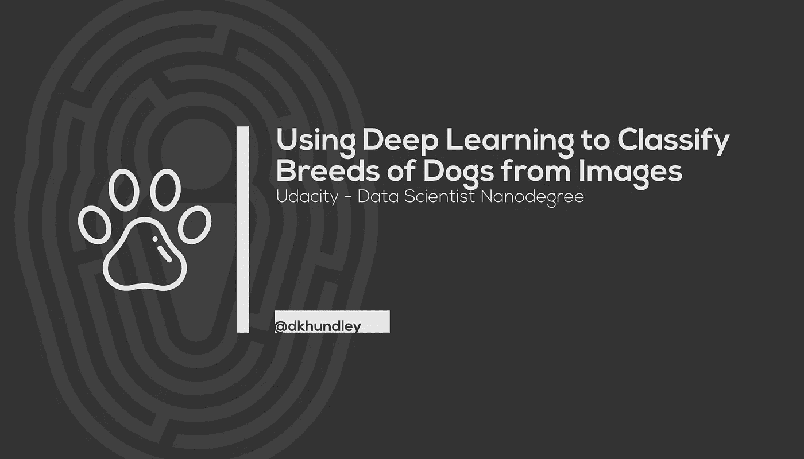
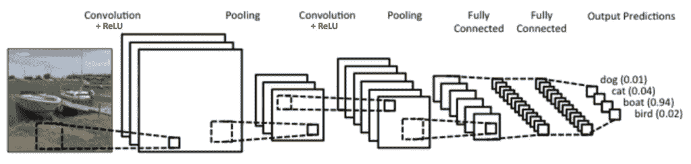
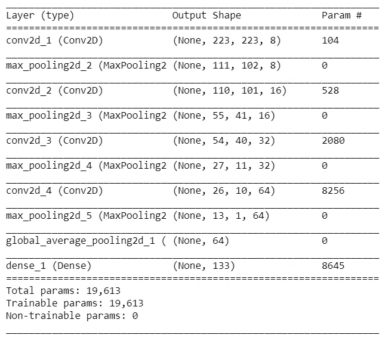
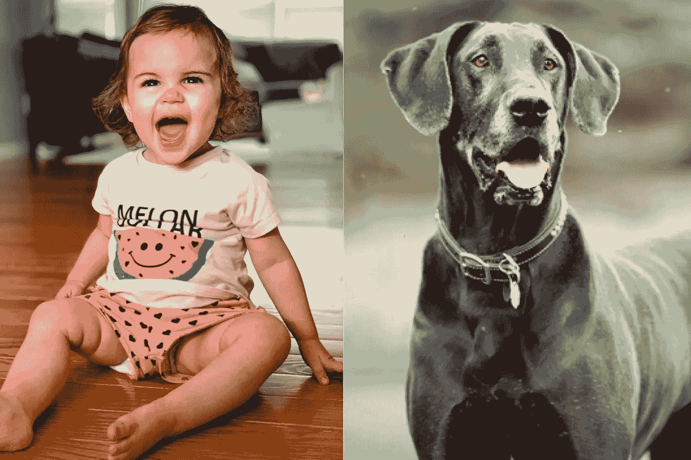
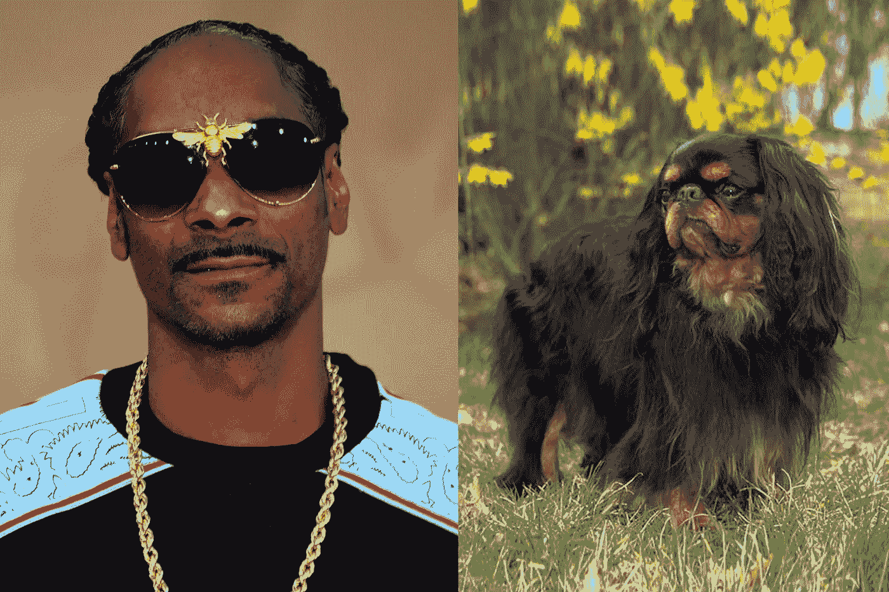

# 使用深度学习从图像中分类狗的品种

> 原文：<https://medium.datadriveninvestor.com/using-deep-learning-to-classify-breeds-of-dogs-from-images-2b026ea03436?source=collection_archive---------4----------------------->

嘿，伙计们！还记得几个月前我有一篇 [*关于星巴克奖励计划*](https://medium.com/@dkhundley/starbucks-reward-program-project-cfdad91d4779) *的古怪长文吗？你可能记得那是为了 Udacity 机器学习纳米学位，我在这篇文章中再次为我的* [*Udacity 数据科学家纳米学位*](https://www.udacity.com/course/data-scientist-nanodegree--nd025) *用深度学习技术对 puppers 进行分类。如果你不喜欢我的常规帖子，请随意跳过，但如果你想了解更多关于深度学习的知识，请留下来！如果你想看我为这个项目做的所有工作，* [*在 GitHub 上查看我的回购*](https://github.com/dkhundley/dog-breed-classifier) *。*

## 介绍

我有两个小女孩(1 岁和 2 岁)，我喜欢通过测试大姐姐的物体识别能力来逗她开心。例如，如果我们开车经过杰森熟食店——我们镇上的一家当地餐馆——我会问她那栋建筑是什么，她会高兴地大喊:“杰森熟食店！！!"我总是从中得到乐趣，尤其是当她的答案不是 100%正确的时候。比如她仍然只把停车标志称为“八边形”，这在技术上是正确的，也是可爱的，但不是我希望她说的。

 [## 2019 年深度学习的终极学习路径及更多...数据驱动的投资者

### 又一个美好的一周，一些好的教育内容将会到来。我最喜欢的&最受欢迎的帖子之一…

www.datadriveninvestor.com](https://www.datadriveninvestor.com/2019/01/07/the-ultimate-learning-path-for-deep-learning-in-2019-more/) 

有趣的是，一个不会开车、不会系鞋带、也不知道 2+2=4 的人仍然能认出餐馆、玩具和爸爸当时正在吃的任何食物。(然后要求咬一口所说的食物。)反过来，计算机也有相反的问题。几十年来，我们已经拥有了能够处理惊人的计算数学问题的计算机，但直到最近，我们才能够为计算机提供图像之类的东西，并让它告诉我们图像中有什么。即使这样，电脑也常常不如我两岁的孩子玩得好。

那么这一切是如何运作的呢？这就是这个项目要探索的。在这个项目中，我们将应用一个被称为**深度学习**的概念来创建一个被称为**卷积神经网络(CNN)** 的东西，以便能够从狗的图像中区分 100 多个狗的品种。因为这篇文章从技术上来说是我正在追求的 Udacity 数据科学家 nanodegree 提交的，我们将深入探讨你可能不关心的事情。如果你只是对高水平的深度学习感兴趣，我建议查看以下部分:

*   什么是深度学习？
*   分析结果
*   结论

事不宜迟，我们进入项目吧！

## 项目概述

这个项目的完成是为了满足 Udacity 数据科学家 nanodegree 的要求。他们为我的顶点项目提供了许多不同的选择，鉴于我已经为我的机器学习纳米学位做了星巴克的选择，我认为接受这个项目会很有趣，因为它涉及深度学习。

正如简介中所提到的，这个项目旨在实现一个深度学习模型，以便从狗的标签图像中对狗的品种进行分类。如果一切顺利，那么我们应该能够使用这个训练过的模型来从未标记的狗的图像中预测狗的品种。

我个人在这方面的经验相当有限，但我之前利用深度学习完成了 Udacity 数据科学家 nanodegree 的另一个项目。在那个项目中，我们使用完全连接的神经网络将花的图像分类成它们各自的类型。(你可以在这个 GitHub 库中找到作品[。)这个项目会有一点不同，因为这次我们将利用卷积神经网络，但我相信，根据我以前项目的经验和纳米学位的课堂学习，我们能够很好地对这些蛹进行分类。](https://github.com/dkhundley/flower-image-classifier)

**问题陈述**

在这个项目中，我们提供了真实世界的狗的图像以及描述图像中显示的狗的品种的标签。我们希望创建一个解决方案，在这些标记的狗图像上训练，用于未标记的狗图像，并且仍然能够确定图像中显示的狗的类型。

**数据集/输入**

该项目将使用 Scikit-Learn 包中专门用于狗图像的数据。作为该项目的一小部分，Udacity 还让我评估人脸，他们也友好地提供了访问这些图像的方法。

除了图像，我们还将使用不同的深度学习架构作为实现迁移学习的手段，我们将在下面进一步讨论。Udacity 已经很好地打包了所有这些架构供我们使用，我们将只使用其中的一个:Inception 架构。

最后，Udacity 为这个项目提供了一个 Jupyter 笔记本模板。其中一些已经预先填写好了(例如导入人脸的代码)，但实际构建我们深度学习模型的大部分代码是由我使用 Keras 构建的。

**评估指标**

对于这个特定的项目，我们将只关注准确性分数。我们在这里要做的目标很简单:我们想看看我们在狗的品种分类方面做得有多好。准确性将能够以简单易懂的方式告诉我们，我们的深度学习模型在这方面的表现如何。

## 什么是深度学习？

在我们开始将深度学习应用到这个项目之前，了解什么是深度学习以及我们将如何具体应用它将是有帮助的。在最高水平上，请记住，所有人工智能(AI)都依赖于数学计算的极端版本。人工智能分支到许多不同的应用，为了不在这里花太多时间，我推荐你[看看我的朋友 Raj Ramesh 博士的视频](https://youtu.be/2ePf9rue1Ao)。

人工智能的这些主要实现之一被称为机器学习(ML)，顾名思义，ML 试图通过自动调整计算机算法来优化它们，以最佳地适应新数据的到来。深度学习只是机器学习的一个计算密集型版本，通常以神经网络的形式表现出来。(不要担心——我们一会儿会回来讨论神经网络。)

回到 ML 整体，通过我们正在做的项目的一个例子，很容易从概念上理解它。我们输入学习算法的数据(也就是狗的图片)越多，它就越能围绕新数据做出解释性预测(也就是预测狗的品种)。当然，这说起来容易做起来难，科学家们已经花了几十年时间试图破解计算学习的代码。虽然我们距离拥有全功能的人工通用智能(AGI)还有一段路要走，但科学家已经能够以非常功能化的方式模拟学习。让我们探索一下我们将在这个项目中使用的一个主要实现:卷积神经网络。

**神经网络**

Animated Illustration of Neurons in the Brain (from GIPHY)

在我们进入什么是卷积神经网络(CNN)之前，让我们花一分钟了解一下神经网络的一般情况。神经网络因其试图模拟大脑功能而得名，大脑细胞被称为神经元。人脑中的神经元基本上是通过根据来自传入细胞的电信号在相互连接的细胞层之间产生突触来工作的。当然，这是一种过于简单化的理解，但它有助于说明神经网络本质上是如何工作的。

神经网络由多层互连的节点组成，这些节点相互作用，在数据中寻找不断增加的模式，最终在输出层进行计算预测。下面这张 GIF 图片最好地说明了这一点，图片来自于 3Blue1Brown 在 YouTube 上关于神经网络的精彩系列。随着信息在神经网络的每一层中前进，新的模式出现，帮助即将到来的层形成更强的模式来实现我们实际寻求的输出。

GIF of Neural Network as explained by 3Blue1Brown

在上面的 GIF 中，神经网络试图对手写数字中的数字进行分类。输入层只是接受图像中所有像素的展平矢量，每个后续层(称为隐藏层)都基于这些像素值构建图案。第一个隐藏层可能只是在图像中寻找非常基本的曲线，第二个隐藏层可能会分析这些曲线如何拼凑起来形成一个整体形状，在这种情况下是一个数字。在数据通过这些隐藏层之后，我们最终到达输出层，该层为我们提供了神经网络认为图像是多少的概率。所有这些都是在一些非常复杂的演算的帮助下得到支持和计算的。我们不会在这里深入探讨，但如果你想了解更多，我鼓励你查看 3Blue1Brown 的频道。

**卷积神经网络**

在我们上面对神经网络的解释中，我们使用了一种称为全连接神经网络的神经网络的例子。GIF 很容易说明这一点，它显示一层的所有节点都完全连接到下一层的节点。这对于这个用例来说是没问题的，因为它涉及非常小的灰度图像，但是当您开始使用复杂得多的大彩色图像时会发生什么呢？试图为这些用例实现完全连接的神经网络在计算上变得非常低效。

也就是说，计算机科学家已经开发了我们将要实现的神经网络的另一种变体，称为卷积神经网络(CNN)。在彩色图像的情况下，它不是查看图像的每个像素如何与其邻居相关，而是理解像素值的分组足以很好地理解图像分类的目的。看看下面的 GIF。如您所见，CNN 的卷积层对稀疏连接组中的数据进行处理，以产生上面称为卷积特征的输出。

How an image is processed in a CNN (from GIPHY)

就像完全连接的神经网络一样，这些数据通过多个隐藏层来不断完善数据中的模式，最终达到我们可以分类任何我们想要分类的东西的程度。(在我们的项目中，这将意味着通过处理狗的图像来确定图片中给出的狗的品种。)然而，这仅仅解释了 CNN 的卷积层。下图为我们提供了一个很好的图像分类 CNN 的例子。

CNN Image Classifier Example (Credit: [Ujjwalkarn](https://ujjwalkarn.me/2016/08/11/intuitive-explanation-convnets/))

我们已经讨论了卷积层，并注意到全连接层往往出现在 CNN 的末尾。这是因为数据最终会变得足够精确，从而在计算上变得高效，并且更适合使用完全连接的层来最终输出我们的预测。

我们还没有讨论的一部分是那些池层。对于我们的卷积层，我们经常看到产生大量的维度，因此试图将输出从一个卷积层传递到另一个卷积层在计算上变得低效。也就是说，卷积层之间的这些池层只是寻求降低前一个卷积层输出的维数，以便随着数据继续被即将到来的层处理，它在计算上变得更加高效。

朋友们，简而言之，这就是 CNN！对这种实现的概念性理解并不太难理解，而且专门的软件包已经使得实现这些概念供我们自己使用变得相当容易。在我们开始实际应用这些概念之前，重要的是谈谈我们将在这个项目中利用的另一个概念:迁移学习。

**迁移学习**

假设你在一家特许快餐店工作。经过几个月的工作，你会非常熟悉企业的运作，无论是烧烤，操作准备站，还是接受订单。如果你被调到镇上另一个地方的另一家特许经营店，学习曲线会很短。你已经知道了公司的所有运作；你只需要学习像收银机这样的东西的新位置。

这是理解迁移学习概念的一种过于简单化的方式。迁移学习是一种越来越流行的方法，尤其是在图像分类方面。人们已经能够采用预先训练好的架构(例如 ResNet、Inception ),并且能够对它们进行细微的调整，以在与架构被训练的原始环境完全不同的环境中工作。

随着我们对项目的深入研究，您将会看到这一点的重要性。从头开始创建架构是可行的，但会带来许多挑战。迁移学习有助于加速解决一个人希望做什么，你会看到如何使用迁移学习有助于显着改善我们的狗品种分类器。

## 创建我们的深度学习模型

现代技术使得我们能够非常容易地创建这些高度复杂的 CNN。对于这个项目，我们将主要利用 Keras 作为构建 CNN 的库。Keras 是一个基于 Python 的开源库，运行在流行的机器学习框架 TensorFlow 之上。如上所述，我们将使用的数据来自 Scikit-Learn 库，当然，所有这些工作都是在 Jupyter 笔记本中完成的。

**数据预处理**

在我们通过深度学习模型推送数据之前，我们必须对其进行预处理，以使其符合我们需要的格式。因为我们使用的是 TensorFlow 支持的 Keras CNN，这意味着我们需要将适当的数据转换成 4D 数组(或 4D 张量)。这个数组的四个元素包括图像数、行数、列数和通道数。在一些函数的帮助下，这很容易做到，这些函数是由 Udacity 好心地提供给我们的。

**实施:CNN 白手起家**

在这个项目中，我在 Keras 的帮助下从头开始创建了一个 CNN。应用从上面得到的概念，下面是我为第一轮建立的模型架构:

Scratch-made model architecture

正如上下文部分的示例图所示，您可以看到这种架构包括几个交替的卷积池层，最后是一个完全连接的“密集”层。

而且……这个模型表现很差。考虑到我们通过它的图像很少，这并不太令人惊讶。我达到的测试精度大约是 2.75%，如果我们为了生产的目的把它打包，这将是糟糕的。在我们的下一小节中，我们将应用迁移学习来使用一个已经建立的架构，希望能够带来我们的结果。

**提炼:使用迁移学习构建的 CNN**

由于从头开始创建 CNN 并没有做得太好，我们将利用 Udacity 为我们精心打包的架构之一。鉴于 VGG-19、ResNet-50、InceptionV3 和 Xception 之间的选项，我选择了《盗梦空间》架构，因为它让我想起了同名的优秀克里斯托弗·诺兰电影。

对于这种架构，我做了一些修改，添加了一个全局平均池(GAP)层、下降层和全连接密集层作为输出层。

在使用与之前相同的训练集训练该模型，然后使用相同的测试集对其进行测试之后，我们获得了显著改善的结果！然而我的临时模型却成功地

## 分析结果

现在，我们已经使用迁移学习创建了一个模型架构，我们将在一些狗和其他随机图像上测试我们的模型，看看它的表现如何。我只选择几个例子，但是如果你想看更多，你可以去我的 GitHub 库的 Jupyter 笔记本里查看。

**评估&验证**

就度量而言，我们已经在上面提到过，scratch 制作的狗品种分类器的准确率大约为 3%,而我们的架构在 Inception 中的准确率接近 80%。上面没有提到，该项目还创造了二进制检测器来判断图像是人脸还是狗脸。人脸检测器正确地分析了 100%的人，但也检测到 11%的狗有人脸。狗脸检测器评估 0%的人是狗，评估 100%的狗是狗，所以很高兴看到。

让我们进入项目的核心部分:从图像中对狗的品种进行分类！带着我们的模型，我通过它运行了一些测试图像——包括人和狗——以了解它的表现，它得出了一些有趣的结果。就狗而言，它每次都正确地知道它是一只狗，而且它还恰当地匹配了狗的品种。(你可以在 Jupyter 笔记本上看到这些结果。唯一的例外是史酷比的动画形象，它既不是狗也不是人。

当我们开始测试人类图像时…事情开始变得有趣起来。分类器确实正确地预测了我测试的每个人的图像都是人的图像，但是它猜测的人的犬种类型产生了一些有趣的结果。这里只是它猜测的一些事情，我只是为了好玩，在人类旁边附上了预测的狗品种的样本图像。

My older daughter, Emma, predicted as Chinese Crested dog

My younger daughter, Elena, predicted as a Great Dane

Snoop Dogg predicted as an English Toy Spaniel

**正当理由**

我们在上面提到，临时制作的 CNN 性能如此之差的原因是，相对于其他预训练的架构，如我们最终使用的 Inception，它几乎没有任何训练数据。[看看这篇关于初始架构的帖子，特别是](https://www.analyticsvidhya.com/blog/2018/10/understanding-inception-network-from-scratch/)，很明显这个架构仅仅是看它的层的组成就有多健壮。Inception 架构有 27 层之深，这还没有考虑到我在我的项目中应用这个架构时添加的一些额外的层。我那小小的抓痕制作的 CNN 只有 10 层。

除了架构本身的复杂性之外，Inception 架构还在比我训练的 scratch-made 架构更多的图像上进行训练。我找不到确切的数字，但上面的帖子提到了用 CIFAR-10 数据集中的 60，000 张图像进行训练。这远远超过了我们训练的大约 8000 张图片。如果我们能够访问更大的数据集，那么这个临时制作的模型可能会比它表现得更好。

## 结论

唷！我们在这个项目上已经取得了很大进展！当我们打算结束这篇文章时，让我们以一个简短的反思和我们可能改进这个项目的方法来结束。

**改进**

这个项目采用了一种相对简单的方法来创建 CNN，但是我们有很多方法可以改进这项工作。在这个过程中，我们可以改变三件事:

1.  **更多的训练数据**:相对来说，我们在数量非常少的图像上训练我们的模型。这些高度复杂的架构中的大多数都是在比我们的训练数据集多得多的图像上训练的，因此额外的训练数据几乎肯定会有助于加强我们预期的结果。
2.  **改变 CNN 的架构**:这个更难知道，但是考虑到这里使用的像 VGG 或盗梦空间这样的架构包含许多层，增加更多层/调整现有层会产生更好的输出是可行的。这超出了我个人的技能范围，所以我们在这里为这个项目保留了相当基本的内容。
3.  **调整迁移学习架构**:对于这个项目，我任意选择 Inception 作为我们迁移学习的架构。我没有尝试过像 Xception 这样的其他算法，它们可能更适合我们的算法。

**倒影**

我在上面已经说过了，但是显然迁移学习是一种选择。它帮助我们的模型执行得更好，并且计算效率更高。我并不想就此发表演说，但计算效率正开始成为环境友好的一个关键因素。[像这样的文章](https://www.newscientist.com/article/2205779-creating-an-ai-can-be-five-times-worse-for-the-planet-than-a-car/)指出，运行这些深度学习模型所需的能量高得惊人。如果我们都试图从头开始创建深度学习模型，我们就会助长这个问题。迁移学习通过分享知识和减少能源消耗，有助于减少这些环境问题。

总之，这是一个有趣的项目！我希望你们都在这里学到了一些东西，我很高兴我的 Udacity 数据科学家纳米学位终于要结束了。能够在现实世界的项目中应用这些技能真是太好了，我期待在不久的将来将它们应用到其他地方！