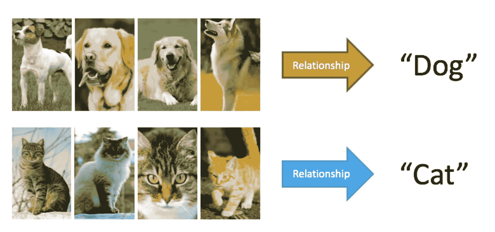
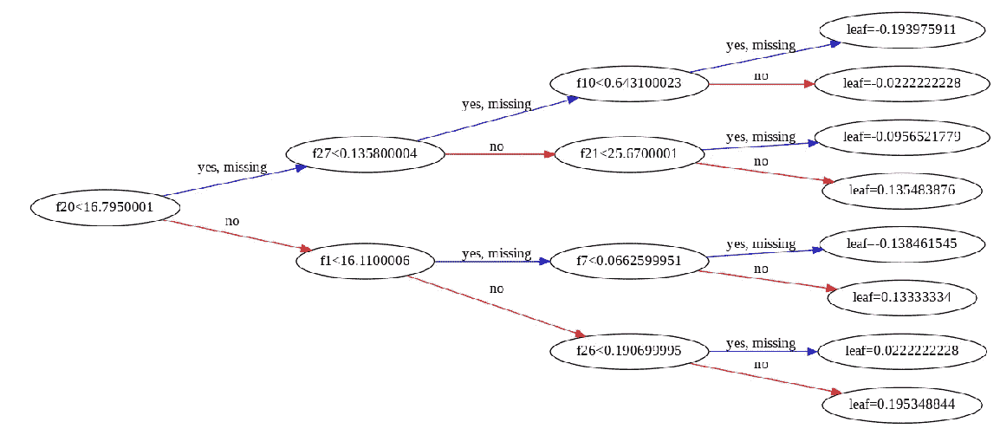

# 在机器学习分类问题中使用极端梯度提升树

> 原文：<https://medium.datadriveninvestor.com/using-extreme-gradient-boosted-trees-in-machine-learning-classification-problems-a7bb04be759?source=collection_archive---------2----------------------->

[](http://www.track.datadriveninvestor.com/1B9E)

上个月，我申请了一个数据科学家的职位，几天后，我收到了一封拒绝邮件，告诉我我的技能不符合要求。他们需要一个在 ML 项目中有经验的人，使用带有 **XGBoost** 和 **LightGB** 的梯度增强树。

老实说，我不能责怪他们，我对这些概念有点陌生，但我毫不犹豫地开始在互联网上挖掘更多信息并了解这些库，因为这是这个领域需要做的，学习新工具并跟上技术趋势，同样的道理。每个公司都有自己的工具，不同的框架、库和云服务。

我还发现 XGBoost 是 Kaggle 竞赛中最受欢迎的库之一。原因是什么？快速和高性能。

我做的第一件事是参加课程:在**数据营:**用-XGBoost 进行极限梯度推进

[](https://www.datacamp.com/courses/extreme-gradient-boosting-with-xgboost) [## 使用 XGBoost 实现极端梯度增强

### 学习梯度推进的基础知识，并使用 XGBoost 构建最先进的机器学习模型来解决…

www.datacamp.com](https://www.datacamp.com/courses/extreme-gradient-boosting-with-xgboost) 

为了熟悉 XGBoost，我们需要了解监督学习。

# 监督学习

如果你对机器学习感兴趣，你可能非常了解这个概念，这是一种可以用 XGBoost 解决的问题，监督学习使用标记数据。监督学习有两种问题:**分类**和**回归**。下面重点说一下分类。

# 分类问题是什么？

这些问题预测二元或多类结果。(二元举例:图中是猫还是狗？多类举例:图中是什么花)。



# XGBoost 是什么？


XGBoost 代表极端梯度增强。这是一个梯度增强决策树的实现，旨在提高速度和性能。它也是监督机器学习中最热门的用于回归和分类等问题的库，在像 Kaggle 这样的机器学习竞赛中有很大的接受度。它有不同编程语言的 API。其中之一是 Python，我将在这里使用这种语言来举例说明这种算法。

XGBoost 很容易与 GPU 集成，以便用大型数据集训练模型。

下面是开始使用 XGBoost 所需的基本代码:

```
[1] import xgboost as xgb
[2] import pandas as pd
[3] import numpy as np
[4] from sklearn.model_selection import train_test_split
[5] class_data=pd.read_csv("classification_data.csv")
[6] X, y=class_data.iloc[:,:-1], class_data[:, -1]
[7] X_train, X_test, y_train, y_test= (X, y, test_size=0.2,      random_state=123)
[8] xg_cl=xgb.XGBClassifier(objective= ''binary:logistic', n_estimator=10, seed=123)
[9] xg_cl.fit(X_train, y_train)
[10] preds=xg_cl.predict(X_test)
[11] accuracy = float(np.sum(preds==y_test))/ y_test.shape[0]
[12] print("accuracy: %f" (accuracy)
```

在前 4 行中，我导入了我们将要使用的库，比如 pandas、numpy、xgboost 和 train_test_split。最后一个是建立我们的机器学习模型所需要的。

在第 5 行和第 6 行，我们加载我们的数据，并将整个数据集按照特征分割成一个样本矩阵，称为 **X** 和一个目标值向量，称为 **y** 。

在第 7 行中，我们将数据集分为训练集和测试集，为测试集保留 20%的数据。

在第 8 行，我们通过一个实例调用 XGBoost 分类器，并分配一些参数:Objective、n_estimation 和 seed。

在第 9 行和第 10 行，我们使用 scikit-learn 兼容的 API，在训练集上拟合/预测我们的算法模式，然后通过使用测试集生成预测并将我们的预测与测试集上的实际目标标签进行比较来评估它。

在第 11 行和第 12 行，我们在测试集上评估模型的准确性，并以百分比打印结果。

# 利用 XGBoost 文库预测乳腺癌

我决定使用 Kaggle 的*乳腺癌威斯康星(诊断)数据集*用 XGBoost 库实验极端梯度增强树。

该数据集可在以下位置找到:

[](https://www.kaggle.com/uciml/breast-cancer-wisconsin-data) [## 乳腺癌威斯康星州(诊断)数据集

### 预测癌症是良性还是恶性

www.kaggle.com](https://www.kaggle.com/uciml/breast-cancer-wisconsin-data) 

该模型将预测癌症是恶性还是良性。

# 检查数据

让我们先导入我们需要的库:

```
import numpy as np
import pandas as pd
from xgboost import XGBClassifier
from sklearn.model_selection import train_test_split
from sklearn.metrics import accuracy_score
```

如您所见，我还从 XGBoost 导入了 XGBClassifier，以使用默认参数来解决我的分类问题。

数据集包含以下列:

id '，'诊断'，'半径 _ 平均值'，'纹理 _ 平均值'，'周长 _ 平均值'，'面积 _ 平均值'，'平滑度 _ 平均值'，'紧密度 _ 平均值'，'凹点 _ 平均值'，'对称度 _ 平均值'，'分形 _ 维数 _ 平均值'，'半径 _se '，'面积 _se '，'平滑度 _se '，'紧密度 _se '，'凹度 _se '，'凹点 _se '，'分形 _ 维数 _se '，'半径 _ 最差'，'纹理 _ 最差'，'周长 _ 最差'，'面积 _ 最差'，'平滑度 _ 最差'，'凹点 _ 最差'，'凹点最差'，'对称 _ 最差

“id”和“Unnamed:32”包含不太有用的信息，因此我们需要删除这些字段，为训练步骤准备数据:

```
data.drop(['id', 'Unnamed: 32'], axis = 1, inplace = True)
data.head(5)
```

按照特征将数据集分割成样本矩阵，称为 **x** 和目标值向量，称为 **y** :

```
data = data.values
x = data[ : , 1:]
y = data[ : , 0]
print(x.shape, y.shape)
```

将训练集和测试集中的数据分别拆分为 85%和 15%:

```
x_train_val, x_test_val, y_train_val, y_test_val = train_test_split(x_train, y_train, test_size = 0.15, shuffle = True)
print(x_train_val.shape,
     y_train_val.shape,
     x_test_val.shape,
     y_test_val.shape)
```

调用 XGBoost 分类器的实例:

```
clf = XGBClassifier()
```

适合/训练我们的模型:

```
clf.fit(x_train_val, y_train_val)
```

**结果:**

XGBClassifier(base_score=0.5，booster='gbtree '，colsample_bylevel=1，colsample_bytree=1，gamma=0，learning_rate=0.1，max_delta_step=0，max_depth=3，min_child_weight=1，missing=None，n_estimators=100，n_jobs=1，nthread=None，objective='binary:logistic '，random_state=0，reg_alpha=0，reg_lambda=1，scale_pos_weight=1，seed =

上面，您可以看到默认参数，这发生在您从 XGBoost 导入 XGBClassifier 时。

通过使用测试集生成预测并将我们的预测与测试集上的实际目标标签进行比较来评估模型:

```
pred = clf.predict(x_test_val)
print(pred, y_test_val, sep = '\n')
```

**结果:**

[' M ' ' M ' ' B ' ' B ' ' B ' ' B ' ' B ' ' B ' ' B ' ' B ' ' B ' ' B ' ' M ' ' B ' ' B ' ' B ' ' B ' ' M ' ' M ' ' B ' ' B ' ' B ' ' B ' ' B ' ' M ' ' B ' ' B ' ' B ' ' B ' ' M ' ' B ' ' B ' ' B ' ' B ' ' M ' ' B ' ' B ' ' B ' ' B ' ' B ' ' B ' ' B ' ' B ' ' B ' ' M ' ' B ' ' B ' ' B ' ' B ' ' B ' ' B ' ' B ' ' B ' ' B ' ' B ' ' B ' ' B ' ' B ' ' B ' ' M ' ' B ' ' B ' ' B ' ' B ' ' B ' ' B ' ' B ' ' B ' ' B ' ' B ' ' B ' ' B ' ' B ' ' B ' ' B ' ' B ' ' B ' ' B ' ' B ' ' B ' ' B [' M ' ' M ' ' B ' ' B ' ' B ' ' B ' ' B ' ' B ' ' B ' ' B ' ' B ' ' B ' ' M ' ' B ' ' B ' ' B ' ' M ' ' B ' ' B ' ' B ' ' M ' ' B ' ' B ' ' B ' ' M ' ' B ' ' B ' ' B ' ' B ' ' M ' ' B ' ' B ' ' B ' ' B ' ' M ' ' B ' ' B ' ' B ' ' B ' ' B ' ' B ' ' B ' ' B ' ' B ' ' B ' ' B ' ' B ' ' M ' ' B ' ' B ' ' B ' ' B ' ' B ' ' B ' ' B ' ' B ' ' B ' ' B ' ' B ' ' B ' ' B ' ' B ' ' B ' ' B ' ' M ' ' B ' ' B ' ' B ' ' B ' ' B ' ' B ' ' B ' ' B ' ' B ' ' B ' ' B ' ' B ' ' B ' ' B ' ' B ' ' B

打印我们模型的准确性:

```
print("Accuracy of model is: ", accuracy_score(y_test_val, pred))
```

**结果:**

**这个模型的精度是:**0 . 46860 . 68686868661

## 这是一个伟大的准确性！

# 用 XGBoost 可视化梯度推进决策树

您还可以使用以下库来可视化决策树:

```
from xgboost import plot_tree
import matplotlib.pyplot as plt 
```

我们用这些线条创建图形:

```
plot_tree(clf)
plt.show()
```



开始学习这些有用的库还不错。

# 参考

请访问官方网站获取更多文档:

 [## XGBoost 文档- xgboost 0.81 文档

### XGBoost 是一个优化的分布式梯度增强库，旨在高效、灵活和可移植…

xgboost.readthedocs.io](https://xgboost.readthedocs.io/en/latest/index.html) 

**你可以在这里查看官方回购:**

[](https://github.com/dmlc/xgboost) [## dmlc/xgboost

### 可扩展、可移植和分布式梯度增强(GBDT、GBRT 或 GBM)库，适用于 Python、R、Java、Scala、C++和…

github.com](https://github.com/dmlc/xgboost)