# 使用面部识别

> 原文：<https://medium.datadriveninvestor.com/using-facial-recognition-9ea369da596e?source=collection_archive---------11----------------------->

[](http://www.track.datadriveninvestor.com/DDI-Infograph-11-16)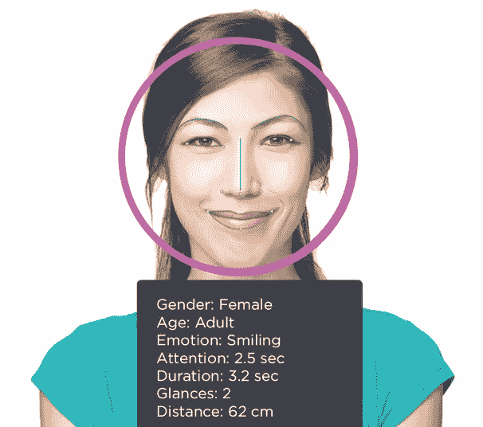

Image from [https://www.axis.com/files/success_stories/ss_ret_rajalla_pagransen_70423_en_1704_lo.pdf](https://www.axis.com/files/success_stories/ss_ret_rajalla_pagransen_70423_en_1704_lo.pdf)

我的 objectif 正在制作一个程序，使用人脸识别库从 Python 中识别人脸。这项工作是我在葡萄牙大学的硕士工作的一系列实验的一部分，这些实验旨在研究对人和物体进行检测、识别和分类的技术。这项工作可以在 [Github](https://github.com/MRobalinho/Facial-Recognition) 上查阅，在那里我有 Jupyter 笔记本的例子，来自我的作品集的图片和一些结果的输出视频。

# 面部识别，一些关于

## 它是如何工作的？

尽管人与人之间存在差异，但人脸具有不变的基本组成，应用程序将其视为共同点，这些共同点根据系统的复杂性而变化。

通过使用对数和软件将这种模式映射到人，有可能只记录面部或所有动作，并在最多样化的功能中使用它们。所有这些都有相同的原理:检测一张几何和对数形状的脸，然后像拼图一样把它装上去。

人脸识别系统包括三个基本阶段:

单面跟踪，

2-面部特征的提取和选择，

3-还有人脸识别。

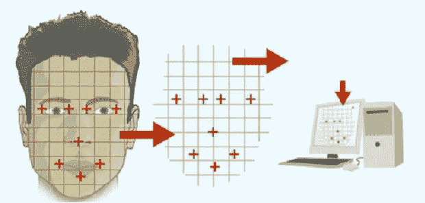

Obtain points from facial geometry to save the characteristics of the person in the computer, to a future identification. [Source](http://www.facerecognitionsolution.com): [http://www.facerecognitionsolution.com/](http://www.facerecognitionsolution.com/)

第一步，告知眉、眼、鼻、嘴人脸特征点的坐标。

现在，第二步是存储面部和 ID(如果您喜欢的话，也可以是名字),以便以后进行身份验证。在我的 Face-recognition_4 示例中，我使用了一个包含照片名称和人名的 excel 文件。在人脸识别 5 和 6 的例子中，我使用了已经以人名命名的文件名。

第一步是通过相机(数码相机、网络摄像头、手机等)识别所有或一些共同点，如两只眼睛及其之间的距离、鼻子及其长度、嘴巴、脸颊和下巴，从而限制脸部的形状及其所占的空间。

在我们的算法中(**人脸识别**)系统找到这些点:
下巴
左 _ 眉
右 _ 眉
鼻梁
鼻尖
左眼
右眼
上 _ 唇
下 _ 唇

这些点以算法的格式写入并存储在数据库中，数据库通过计算来识别它们。这听起来很容易，但要达到我们今天看到的效率需要一些时间。

第一个应用也是最简单的:检测人脸和其中的微小变化，以提高人像质量。如今，几乎每个相机都有一个微笑检测系统，当照片中的一个元素微笑时，即当它相对于相机上记录的内容改变嘴形时，它会自动拍摄。一些附加信息[在这里](https://www.tecmundo.com.br/camera-digital/10347-como-funcionam-os-sistemas-de-reconhecimento-facial.htm)。

## 要求

Python 3.3+或 Python 2.7

## 要安装的文档

> pip3 安装人脸识别

> pip 安装 dlib

人脸识别 Github:【https://github.com/ageitgey/face_recognition 

> pip 安装 cmake

需要安装 CMAKE 来安装 requirements.txt 文件。为此，请以管理员身份在命令行中输入:

CMD.exe(作为行政长官)

> pip 安装-r 要求. txt —无色

需要安装以下软件包(软件包在文件 requirements.txt 中)

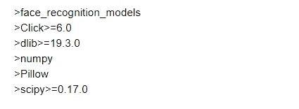

你可以在这里下载 CMake for Windows:【http://www.cmake.org/cmake/resources/software.html 

## 我的定义

我有一个文件夹，里面有我训练用的图片，文件夹图片。在示例(Face-recognition_6)中，我使用名称文件提取人名。所有的图像都有人名和一个“-”来表示。例(manuel-1.jpg)我在文件名中找到了'-'，并提取相关的位置以获得人名。在示例 Face-recognition_5 和 Face-recognition_4(可以从 Github 获得)中，我使用了一个 excel 文件来建立照片名和人名之间的关系。

第一步，我们需要声明包:

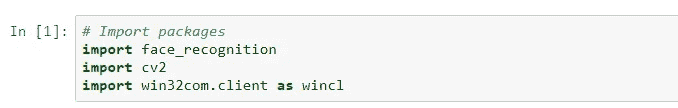

人脸识别不需要 win32com。我曾经对这个名字所创立的机器 speek 做过一些测试。我从 GitHub 上描述的来自[Skuldur](https://github.com/Skuldur)/[face net-face-recognition](https://github.com/Skuldur/facenet-face-recognition)的作品中获得了灵感。

下一步，我将文件夹 images 中的名字 fotos 读入一个 python 列表。

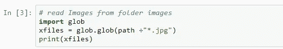

正如我所说的，当算法的结果与相机图像匹配时，我将从图像名称中获取人名。我的图像有以下名称:

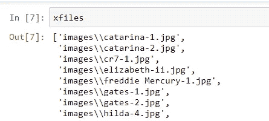

为了获得几何点，我创建了一个函数，在读取和学习文件夹上的图像的过程中会调用这个函数。要建立一个识别系统，我们并不需要它们，但解释一下坏照片(提交给系统学习的尺寸很小的照片，或质量很差的照片)出现的一些检测错误是有用的。

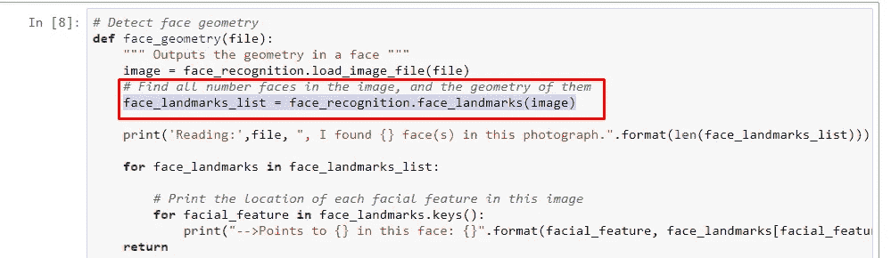

该函数证明并解释了在面几何中获得的点。例如，对于我的照片，几何图形是:

```
**Reading: images\manuel-1.jpg** , I found 1 face(s) in this photograph.
-->***Points to chin*** in this face: [(62, 139), (63, 153), (64, 168), (68, 184), (73, 199), (82, 212), (94, 223), (108, 232), (126, 234), (144, 230), (159, 221), (173, 209), (183, 195), (189, 178), (190, 160), (189, 143), (188, 126)]
-->***Points to left_eyebrow*** in this face: [(66, 130), (71, 118), (81, 112), (94, 110), (106, 113)]
-->***Points to right_eyebrow*** in this face: [(121, 111), (132, 104), (146, 102), (159, 105), (170, 114)]
-->***Points to nose_bridge*** in this face: [(113, 125), (113, 135), (113, 145), (113, 155)]
-->***Points to nose_tip*** in this face: [(102, 165), (109, 167), (117, 168), (125, 164), (133, 161)]
-->***Points to left_eye*** in this face: [(77, 135), (83, 131), (90, 130), (99, 132), (91, 134), (84, 135)]
-->***Points to right_eye*** in this face: [(134, 127), (141, 123), (149, 122), (156, 124), (149, 126), (142, 127)]
-->***Points to top_lip*** in this face: [(89, 185), (100, 182), (111, 180), (119, 180), (128, 178), (141, 176), (155, 176), (152, 178), (128, 181), (120, 184), (111, 184), (93, 185)]
-->***Points to bottom_lip*** in this face: [(155, 176), (144, 191), (131, 198), (122, 201), (113, 201), (102, 197), (89, 185), (93, 185), (112, 194), (121, 195), (130, 192), (152, 178)]
```

下一步，从图像文件夹中读取图像，并获得所有的面部几何点。系统在面上查找并获得几何点后。

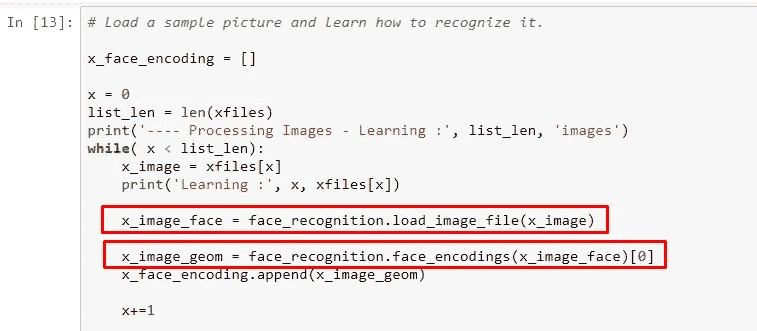

它保存一个包含所有几何图形的数组(x_face_encoding)。我做了一个特定的循环来打印为每张图像计算的面部几何图形，这可能有助于以后验证一些检测错误。

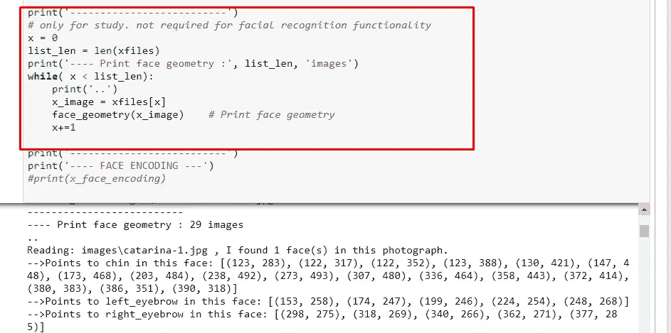

现在，我们需要激活摄像机来获取我们提交给相同的面部系统几何图形的图像，并与从图像文件夹创建的图像坐标进行比较。

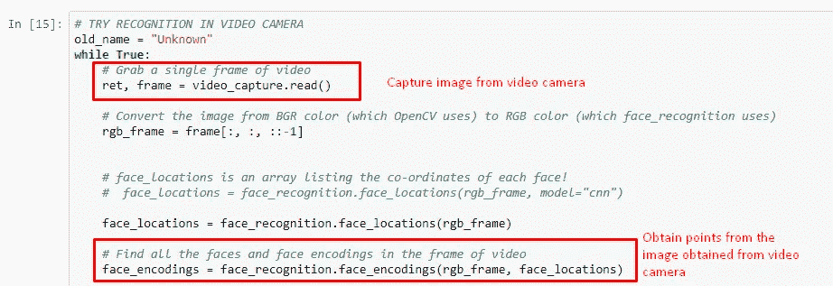

现在，我们验证是否将摄像机中的图像与从图像文件夹中学习到的一些几何图形相匹配。

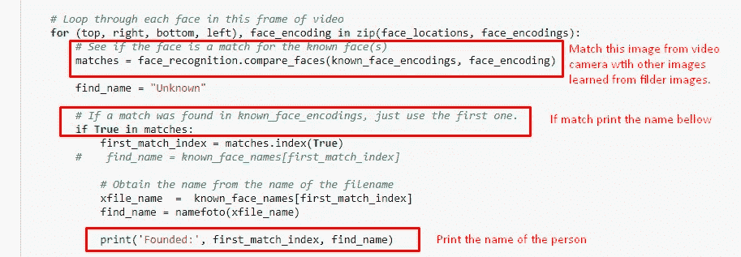

我放了一个视频编写者系统来保存和记录所有的检测过程，制作一个视频。一些视频可以在下面的链接中观看。

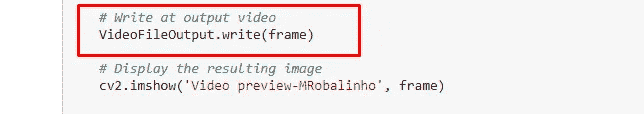

参考资料:

[https://www . tecmundo . com . br/camera-digital/10347-como-funcionam-OS-sistemas-de-reconhecemento-face . htm](https://www.tecmundo.com.br/camera-digital/10347-como-funcionam-os-sistemas-de-reconhecimento-facial.htm)

[](https://github.com/ageitgey/face_recognition) [## 年龄/面部识别

### 世界上最简单的用于 Python 和命令行的面部识别 API——ageitgey/face _ recognition

github.com](https://github.com/ageitgey/face_recognition) [](http://www.track.datadriveninvestor.com/DDI-Infograph-11-16B)