# 使用 FastAI 分析 Yelp 评论并预测用户评级(极性)

> 原文：<https://medium.datadriveninvestor.com/using-fastai-to-analyze-yelp-reviews-and-predict-user-ratings-polarity-4e4e89df358e?source=collection_archive---------1----------------------->

[](http://www.track.datadriveninvestor.com/1B9E)

## 迁移学习在自然语言处理中的应用实例

在这篇文章中，我将向你展示如何将迁移学习的力量应用到分类任务中。

我们的目标是通过在过去的 Yelp 评论上训练一个算法，来看看我们能把一个新的 Yelp 评论分类得有多好。FastAI 使这个问题变得更加容易解决。

你可以跟随这个 [GitHub 回购代码](https://github.com/shoreason/yelp-review-polarity)。

# 为什么是 FastAI，它是什么？

FastAI 是由[](https://twitter.com/jeremyphoward)**[**瑞秋托马斯**](https://twitter.com/math_rachel) 和其余在 [fast.ai](https://www.fast.ai/) 的好乡亲们搭建的库。其当前版本建立在 PyTorch 之上，py torch 是一个由脸书开源的快速崛起的深度学习框架。**

**[](https://www.datadriveninvestor.com/2019/03/06/top-4-artificial-intelligence-stocks-to-buy-and-why/) [## 值得购买的 4 大人工智能股票及其原因——数据驱动型投资者

### 人工智能(AI)在 2019 年继续进入大众意识。通过应用程序…

www.datadriveninvestor.com](https://www.datadriveninvestor.com/2019/03/06/top-4-artificial-intelligence-stocks-to-buy-and-why/) 

它非常符合 Keras 或 TensorFlow 的模式，但在我看来，它更具冲击力。

FastAI 抽象了 TensorFlow 需要您处理的许多底层细节和控制。与 Keras 不同，它允许您专注于手头的任务，而不是处理这么多参数。

通过这种方式，你可以更专注于科学，而不是深度学习的实际艺术。

FastAI 还允许您利用许多来自新研究的尖端 ML 技术。这包括应用学习率探测器和利用迁移学习。顺便问一下，那是什么？

# 迁移学习


Photo Credit: [HOerwin56](https://pixabay.com/users/HOerwin56-2108907/)

骑过自行车吗？

学习平衡是一项相当艰巨的任务，但是一旦你确定下来，在踏板车上学习平衡就变得容易多了。

摩托车呢？

虽然它们在很多方面都不同，但如果你曾经骑过踏板车，你的学习曲线在摩托车上就不会那么陡峭。你基本上把以前学到的东西转移到新的经历中。

同样，迁移学习允许您利用预先训练的模型或深度学习架构来加快特定问题领域内的学习。

通常，深度学习架构从猜测开始——随机地——将哪些权重或偏见应用于你的参数。随着时间的推移，它越来越擅长猜测，因为它试图最小化自己的错误(或损失)。

这有点像试图击中靶心，同时调整每次如何投掷飞镖。

在这种情况下，使用迁移学习就像有一个教练在你开始投掷之前给你提示。

在实践中，如果你的任务是区分一只狗和一只猫的图像，你可以应用像 [ResNet-50](https://www.mathworks.com/help/deeplearning/ref/resnet50.html) 这样的架构(50 层深度，并在 ImageNet 数据库的一百万张图像上进行训练)。

ResNet-50 在如此多的图片上进行了训练，使你的神经网络的早期层非常擅长检测基本特征，如边缘和形状。而你的最后几层可以专注于你的关键领域，区分狗和猫。

类似地，在对评论进行分类时，有一个预先训练的模型有助于加快训练速度和提高准确性，该模型理解我们训练数据之外的一些语言语义。

> **WikiText** 语言建模数据集是从维基百科上一组经过验证的[好的](https://en.wikipedia.org/wiki/Wikipedia:Good_articles)和[精选的](https://en.wikipedia.org/wiki/Wikipedia:Featured_articles)文章中提取的超过 1 亿个标记的集合……与预处理版本的 Penn Treebank (PTB)相比， **WikiText-2** 大了 2 倍多， **WikiText-103** 大了 110 倍多— [Stephen Merity](https://blog.einstein.ai/author/stephen/)

就像 ResNet 一样，WikiText 为我们提供了 NLP 挑战所需的迁移学习优势。

数据越多越好。

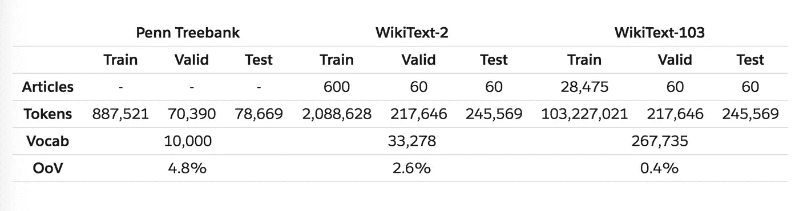

Source: [Stephen Merity](https://blog.einstein.ai/author/stephen/)

# 我们的问题领域

那么，我们的数据看起来像什么，我们到底希望完成什么？

我们的数据集由 Yelp 评论组成，分为负面和正面。根据`readme.txt`

```
The Yelp reviews polarity dataset is constructed by considering stars 1 and 2 negative, and 3 and 4 positive. For each polarity 280,000 training samples and 19,000 testing samples are take randomly. In total there are 560,000 trainig samples and 38,000 testing samples. Negative polarity is class 1, and positive class 2.
```

作为一项监督学习任务，评论将作为输入，而我们期待预测的极性将作为结果。

在训练期间，极性将是我们标记的数据(在这种情况下是靶心),我们通过它建立一个微调的模型，应用于全新的用户评论。

正如你在下面看到的，FastAI 有一个数据集的集合，包括针对 NLP 相关问题的 Yelp 评论。

你可以通过[这里的](https://course.fast.ai/datasets)获得该数据的副本。

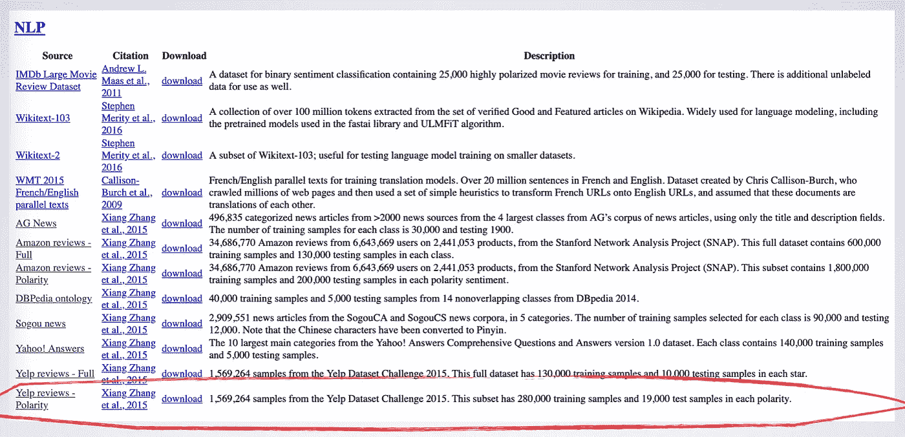

如果使用该数据集进行研究，引用原始[论文](https://arxiv.org/pdf/1509.01626.pdf)的作者是很重要的。非常感谢他们为我们提供了如此有用的数据集。

> *张翔，赵军波，杨乐存。用于文本分类的字符级卷积网络。神经信息处理系统进展 28 (NIPS 2015)。*

下载该数据集后，您可以选择使用何种工具来执行分析。可以用 Jupyter 这样的 Python 笔记本，也可以用 PyCharm 或者微软 VisualCode 这样的开发编辑器。

由于数据集的大小，我选择使用 [JupyterLab](https://jupyterlab.readthedocs.io/en/stable/) 在 [GCP](https://cloud.google.com/marketplace/) 上运行。我在带有 FastAI 映像的计算引擎虚拟机上运行这个。

要了解如何设置 FastAI 镜像虚拟机，您可以查看这里的。其余的说明假设了这个设置，尽管你并不需要这样做。

# 获取和预览数据

下面是 JupyterLab 的样子。您可以在 Jupyter 笔记本或命令行中运行类似的命令。

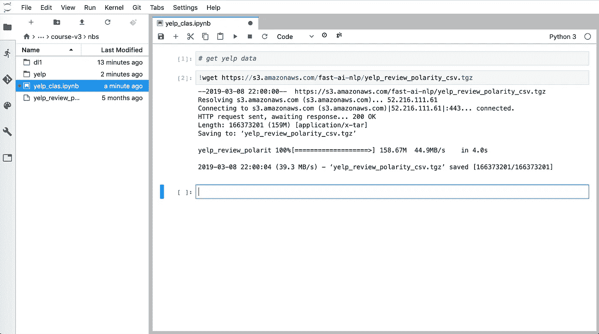

我运行下面的命令来获取 yelp 数据

```
!wget [https://s3.amazonaws.com/fast-ai-nlp/yelp_review_polarity_csv.tgz](https://s3.amazonaws.com/fast-ai-nlp/yelp_review_polarity_csv.tgz)
```

**‘！’** before wget 允许我像在命令行上一样运行操作。

现在，我打开。tgz 文件来查看数据内部。我运行这个命令来做到这一点

```
!tar -xvzf yelp_review_polarity_csv.tgz
```

这就是我们得到的。如你所见，有训练数据和测试数据。

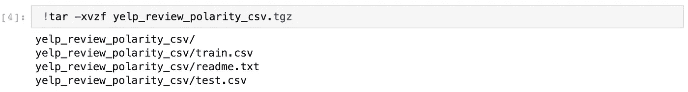

接下来，我们导入 fastAI 库和依赖项，并设置保存文件的文件夹的路径。这条路便于以后参考。

```
**from fastai import** * 
**from fastai.text import** * 
**from fastai.core import** *path = Path('yelp_review_polarity_csv')
```

现在，我们可以使用 Python 包 [Pandas](https://pandas.pydata.org/) 来检查数据集。下面它被赋予了别名`pd`。

```
train_csv = path/'train.csv'
train = pd.read_csv(train_csv, header=None) 
train.head()
```

我们使用`read_csv`方法创建一个数据帧，我们称之为 *train* 。`head()`方法给出了数据帧中前五条记录的预览。

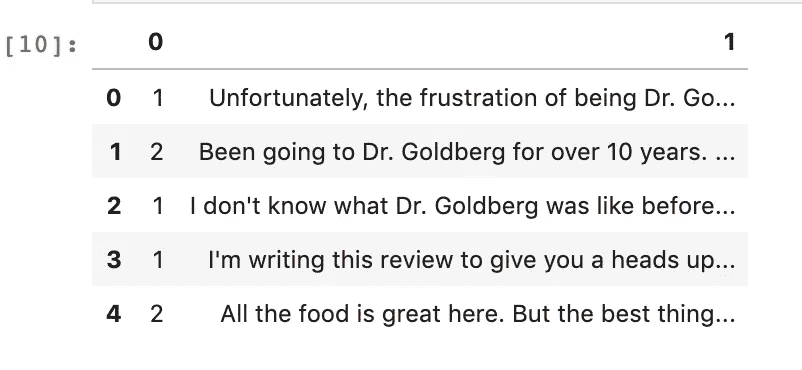

第一列(0)显示了极性。第二列是实际回顾。

这很简洁，但是让我们仔细看看其中的一篇评论。我们来看第二张唱片。

```
train.iloc[0][1]
```

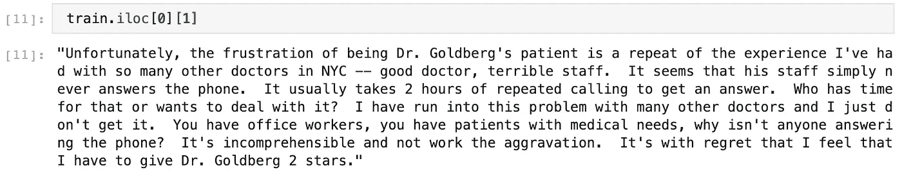

哎呀！戈德堡博士两星。

您可以尝试对测试数据执行类似的步骤。

```
valid_csv = path/'test.csv'
valid = pd.read_csv(valid_csv, header=None) 
valid.head()
```

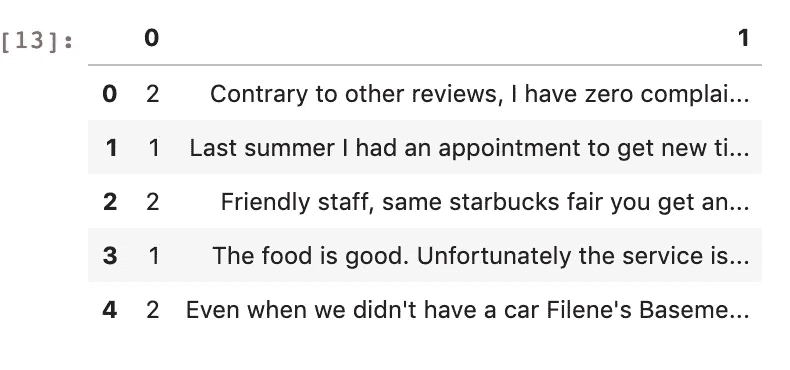

我们还可以使用`valid[0].unique()`来确认标签有多少类。我们只期望极性得分为 1(对于-ve)和 2(+ve)。

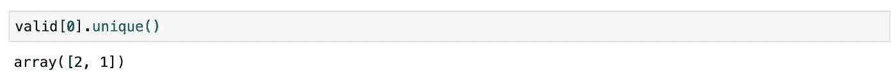

好了，我们已经加载了训练和测试数据集。据我们所知，数据是干净的，每个评论都有一个极性，反之亦然。

# 从数据群发开始

我们需要一种方法将数据集传递到我们的神经网络中。我们还想高效地装载它们，也许是分批装载。这就是 DataBunch 对象派上用场的地方。

神经网络计算涉及大量的数字运算。然而，我们的数据主要是文本。所以，我们需要一种方法来将单词数字化。

我们还需要一种方法将正文分解成单个的单词，因为它是有意义信息的最小单位。

最后，为了加快我们的学习，我们还想优先考虑哪些单词是最有用的。实现这一点需要一个叫做*记号化*的过程。

我说过法斯泰来一拳，对吗？

DataBunch 对象允许我们一次性完成所有这些工作。

```
data_lm = TextLMDataBunch.from_csv(path, 'test.csv')
data_clas = TextClasDataBunch.from_csv(path, 'test.csv', vocab=data_lm.train_ds.vocab)
```

以上两个步骤的输出是一个语言模型和分类器。每个都有一个数据总线。

现在我们可以看一下输出是什么样子

```
data_lm.show_batch()
```

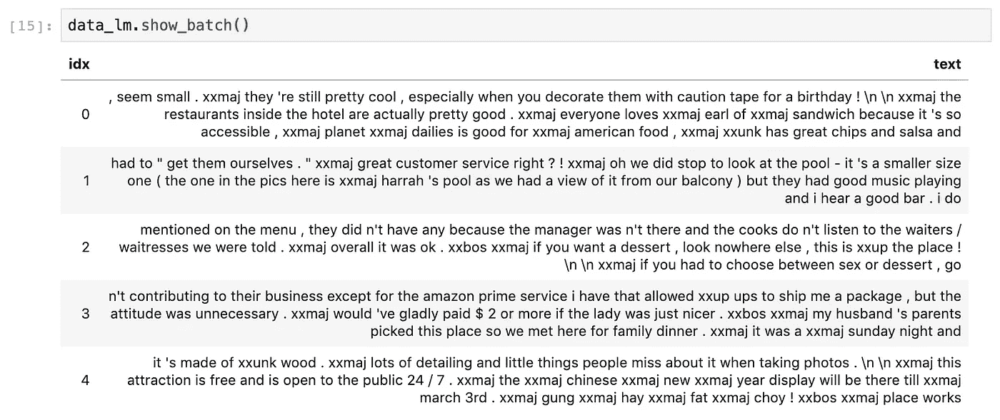

特殊标记用于语料库中很少出现的单词。你可以把这些看作是未知单词，它们是以“xx”开头的标记。

我们也可以为分类器查看这个。

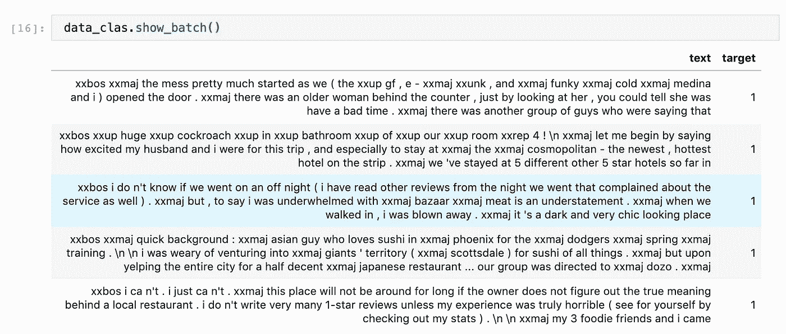

我们可以仔细看看这些代币。

```
data_clas.vocab.itos[:10]
```

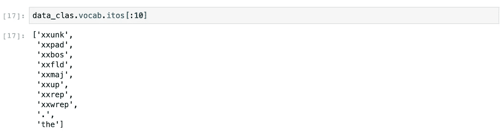

# 迁移学习的维基数据

现在我们开始谈正事。但是，在我们创建语言模型之前，我们需要引入预先训练好的维基数据。

我们创建一个文件夹来存储模型，然后我们下载并存储模型。

```
model_path = path/'models'
model_path.mkdir(exist_ok=True)
url = '[http://files.fast.ai/models/wt103_v1/'](http://files.fast.ai/models/wt103_v1/') 
download_url(f'{url}lstm_wt103.pth', model_path/'lstm_wt103.pth') 
download_url(f'{url}itos_wt103.pkl', model_path/'itos_wt103.pkl')
```

# 创建语言模型

现在我们需要创建一个语言模型。

我们为什么需要这个，语言模型到底是什么？

有了语言模型，我们开始理解文本的意义。单词的结构和组织的语义也开始融合在一起。使用维基数据可以让我们加快这个过程。

```
learn = language_model_learner(data_lm, AWD_LSTM, pretrained_fnames=['lstm_wt103', 'itos_wt103'], drop_mult=0.5)
```

证明我们有一个好的语言模型的方法是能够根据一组给定的单词预测下一个单词序列。

下面的命令提供了 5 个单词，并尝试预测接下来的 50 个单词。

```
learn.predict('This was such a great ', 50, temperature=1.1, min_p=0.001)
```

这是没有任何调整的模型给出的结果。

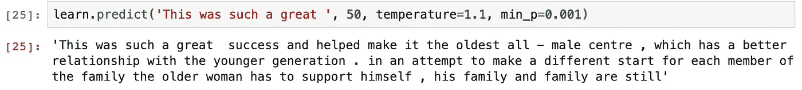

这不是一个连贯的句子，但我们看到逗号、句号和一些合理的句子结构的使用，这非常令人惊讶。

# 微调模型

我们现在需要微调这个模型，这涉及到一些培训。然而，从历史上看，选择学习率是一种艺术。

FastAI 通过利用 2015 年[论文](http://arxiv.org/abs/1506.01186)中指定的循环学习率概念，使这变得非常容易。在这种方法中，学习率增加，直到损失停止下降。

所以，我们运行这两个命令。

```
learn.lr_find()
learn.recorder.plot()
```

这是我们根据学习率绘制的损失图。

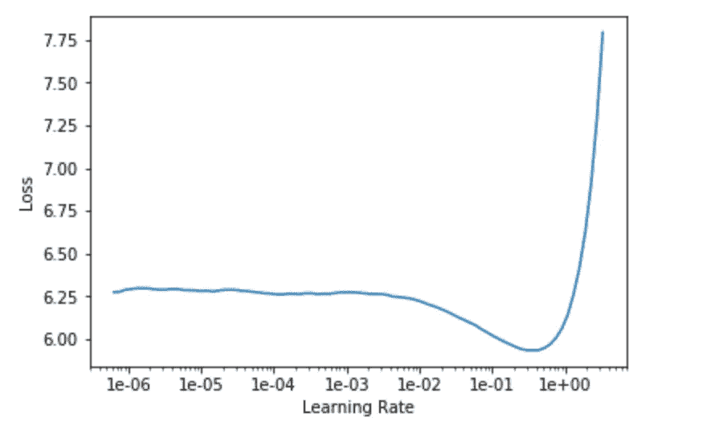

我们可以看到，损耗在 1e-1 附近停止下降，因此我们将在此之前开始一个步骤。

我们的第一个结果不是很好，需要一些微调。28.6%的准确率意味着它在序列中正确猜测下一个预测单词的次数超过 1/4。

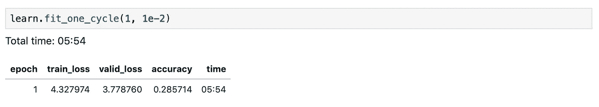

接下来就是解冻，用更低的学习率重新训练。初始训练有一个“冻结”层，它没有被训练或更新。

这个 unfreeze()命令解冻所有层，帮助我们进一步微调。

```
learn.unfreeze()
learn.fit_one_cycle(10, 1e-3,moms=(0.8,0.7))
```

这是一个微小的进步。这仅仅是训练过程的三分之一，猜对的时间是三分之一。

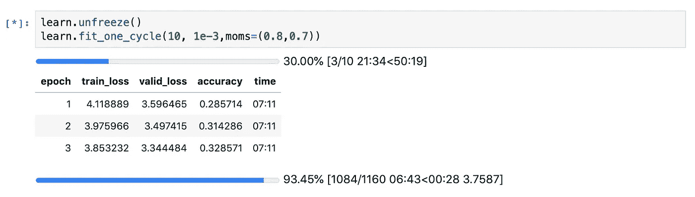

经过 10 次迭代后，它的准确率接近 37%

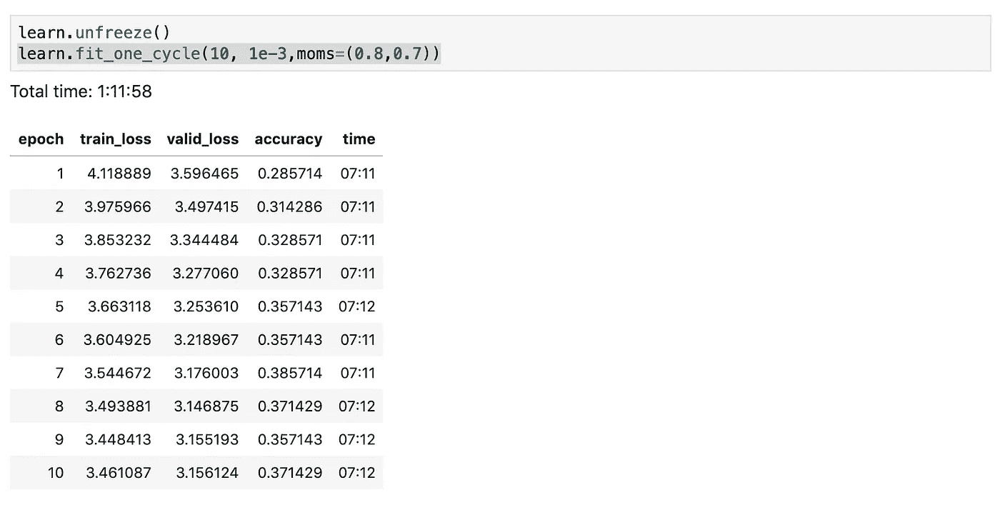

我们可以保存这个微调过的模型。这对我们来说已经足够好了。我们不需要它在预测下一个单词时变得超级聪明。

```
learn.save_encoder('ft_enc')
```

有趣的是，让我们看看这个模型在给定 3 个单词的情况下，预测接下来的 50 个单词有多准确。

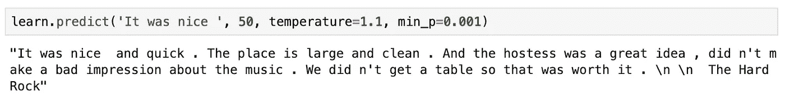

给定前 4 个单词，预测接下来的 25 个单词怎么样？

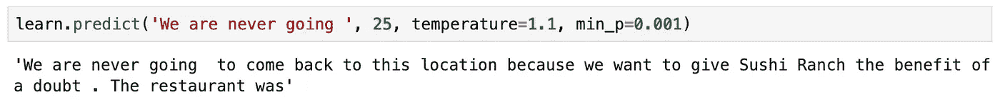

很好。

记住，它是通过提供一些种子词来组成句子的其余部分。

# 开始培训和分类

请记住，我们在这里的目的是能够用+ve 或-ve 极性对评论进行分类。所以我们用训练好的模型建立一个分类器。

首先，我们实例化文本分类器学习器，而不是语言模型学习器。

```
learn = text_classifier_learner(data_clas, AWD_LSTM, drop_mult=0.5)
```

你可以阅读更多关于 LSTM AWD 的信息。它本质上是一个帮助规范和优化语言模型的架构。

然后，我们加载训练好的模型并训练分类器。

```
learn.load_encoder('ft_enc')
learn.fit_one_cycle(1, 1e-2)
```

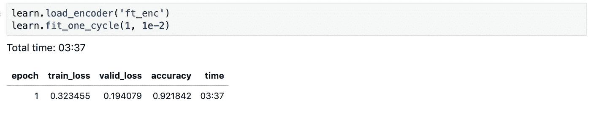

在一次运行和不到 4 分钟的训练后，我们看到预测评论极性的准确率接近 **92%的准确率**。很好，但远远谈不上伟大。

2015 年论文时的技术水平导致了 4.36%的错误率。这意味着准确率为 95.64%。我们能赢吗？

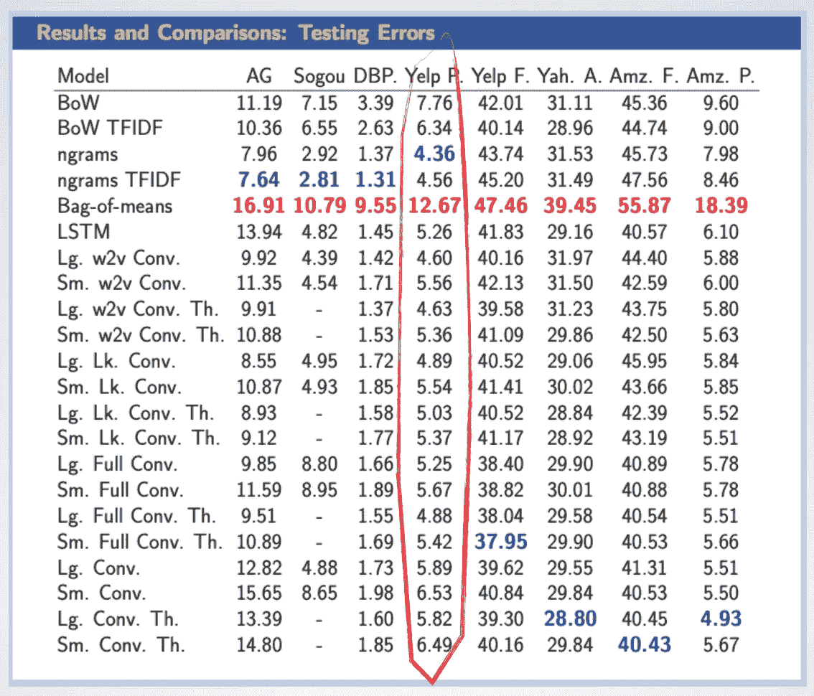

*Xiang Zhang, Junbo Zhao, Yann LeCun. Character-level Convolutional Networks for Text Classification. Advances in Neural Information Processing Systems 28 (NIPS 2015)*

我们可以尝试冻结模型的所有层，除了最后两层。让我们试试那个。

```
learn.freeze_to(-2)
learn.fit_one_cycle(1, slice(1e-2/(2.6**4),1e-2), moms=(0.8,0.7))
```

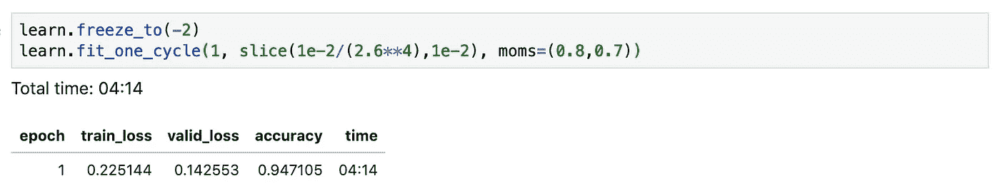

94.7%越来越接近最先进水平。所有这些都在不到 40 分钟内完成。此外，验证损失小于训练损失，这意味着我们没有过度拟合。

你可能注意到了 2.6 到 4 分的学习率。我不会用细节来烦你，所有这些都与不同的学习率有关。

本质上，当我们一层一层地前进时，我们降低了多少学习速度。 [**杰瑞米·霍华德**](https://twitter.com/jeremyphoward) 认为对于 NLP RNNs 来说，这是一个神奇的数字。

如果你真的想深入研究，我建议你参加 FastAI 提供的[程序员实用深度学习](http://course.fast.ai/)课程。

在我们的情况下，如果你愿意，你可以继续下去，一次解冻一层。我的笔记本开始出现一些内存问题，所以我就讲到这里。

保存模型，这样您就不必再次重新训练并加载回调整后的模型来继续。

```
learn.save('second')
learn.load('second')
```

# 预测时间—测试我们的模型

我们的`text_classifier_learner`有一个`predict`函数，现在允许我们通过一个评论进行分类。根据[文档](https://docs.fast.ai/basic_train.html#Learner.predict)，输出生成一个元组。

> 元组的前两个元素分别是预测的类和标签。这里的 Label 本质上是每个类的内部表示，因为类名是一个字符串，不能在计算中使用。

你马上就会看到这是什么样子。

我们可以通过运行`learn.data.classes`来检查每个标签对应什么，正如你所看到的，有两个类。


因此，在索引 0 处是 *1* ，这意味着-ve 极性标签。在索引 1 处是 *2* ，这意味着+ve 极性标签。

现在，让我们看看我们是否能预测一个虚构的评论的结果。让我们从简单明了的事情开始。记住，标签 1(索引 0)的结果是-ve 极性，而标签 2(索引 1)是+ve 极性。

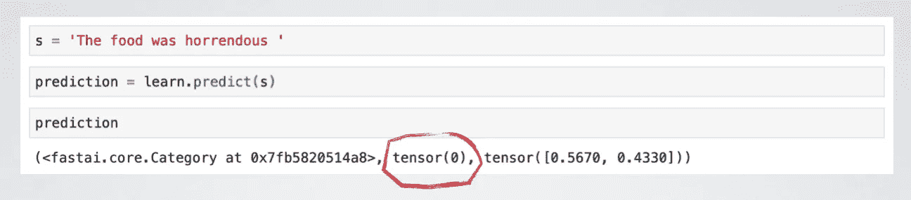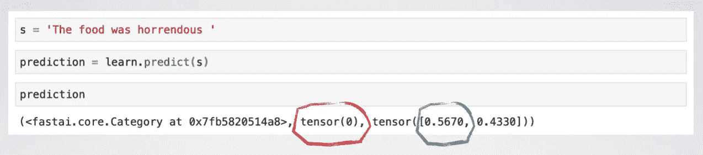

元组中的第二个元素是`tensor(0)`。这是对等级指数 1 的引用，这意味着它将这篇评论归类为具有-ve 极性。

[文件](https://docs.fast.ai/basic_train.html#Learner.predict)阐明

> 元组中的最后一个元素是预测概率。

因此，有 56.7%的可能性是-ve 极性，43.3%的可能性是+ve 极性。前者胜出。

让我们试试更乐观的东西。

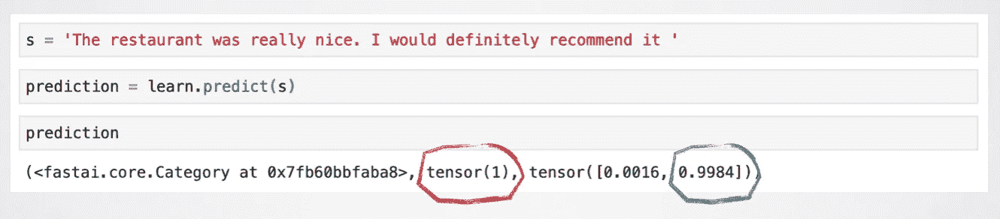

在这种情况下，元组中的第二个元素是`tensor(1)`。这是对等级指数 2 的引用，意味着它将这篇评论归类为具有+ve 极性。99.8%的概率感觉挺清楚的。

完全正确！

真正的 Yelp 评论呢？

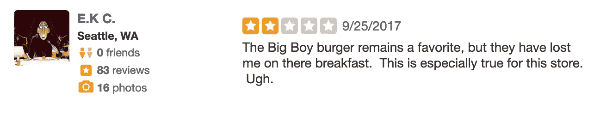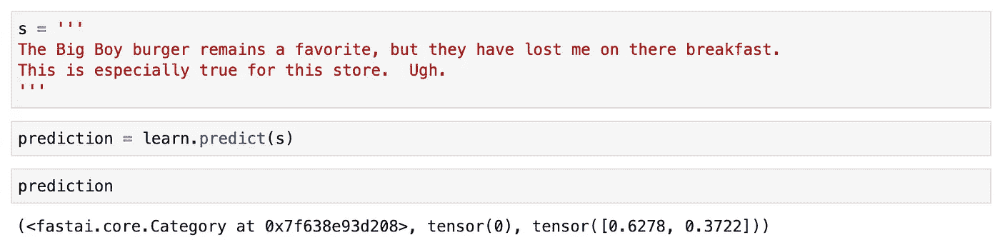

`tensor(0)`，负极性。有 62.8%的概率猜对了。

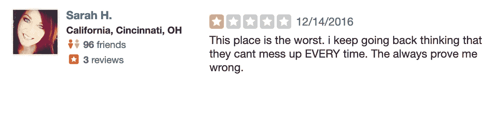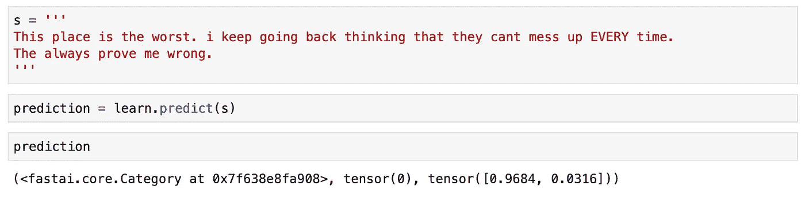

另一个负极性符合等级 1。概率，在这种情况下，真的高达 96.8%。

那是两个中的两个。

让我们寻找应该有正极性的东西。

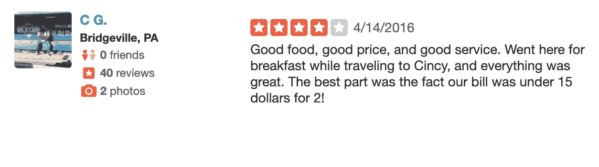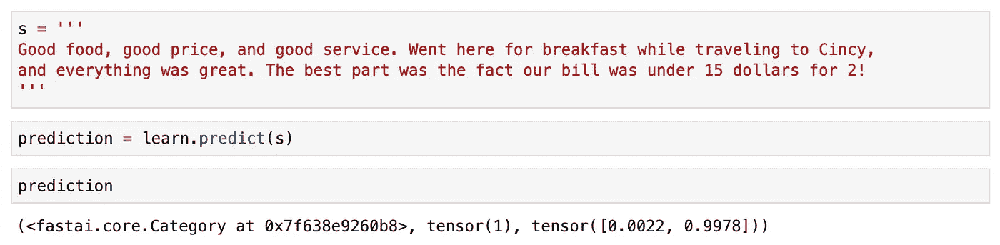

三对三。

99.8%的概率这个评论有+ve 极性。符合 4 星评级。

# 摘要

在这篇文章中，我们涉及了很多内容。

我首先描述了什么是迁移学习，以及它是如何帮助我们完成自然语言处理任务的。对于我们的用例，WikiText 给了我们所需要的推动力。

你应该很好地理解如何获取这些数据，建立一个语言模型，训练一个分类器，并预测任何给定 yelp 评论的极性。

您可以通过以下方式进一步了解这一点

*   在一个完全不同的语料库上尝试这个，不仅仅是餐馆评论
*   探索如何预测准确的评级，而不仅仅是极性
*   更好的方法是将模型部署为应用程序，以预测作为输入传入的一组评论

王菽一的[帖子](https://medium.com/datadriveninvestor/deep-learning-with-python-and-fast-ai-part-2-nlp-classification-with-transfer-learning-e7aaf7514e04)在一个类似的话题上给了我灵感。

在这个领域有很多东西需要学习，我希望这也能启发你。

如果你想了解 FastAI 如何帮助你解决实际问题，请查看他们的机器学习[课程](https://www.fast.ai/)。

最美好的祝愿！**