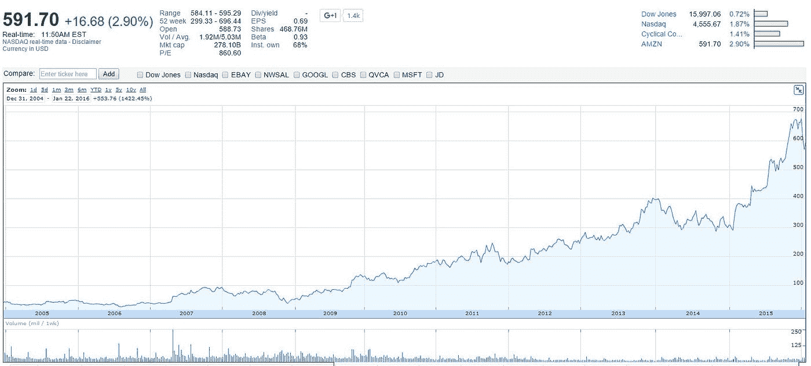
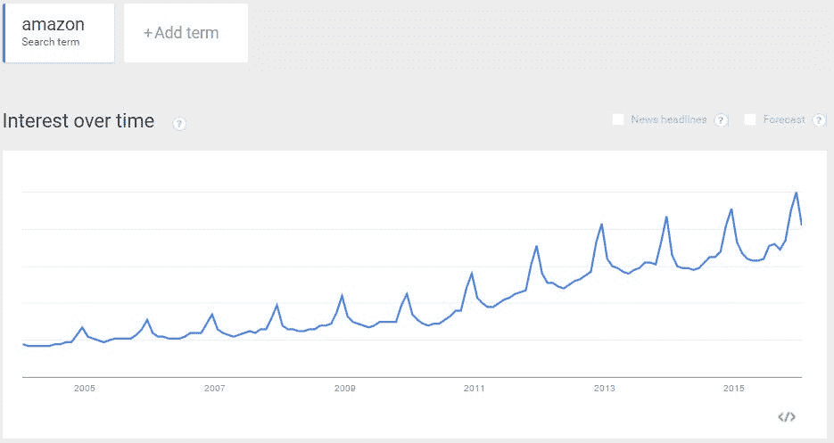
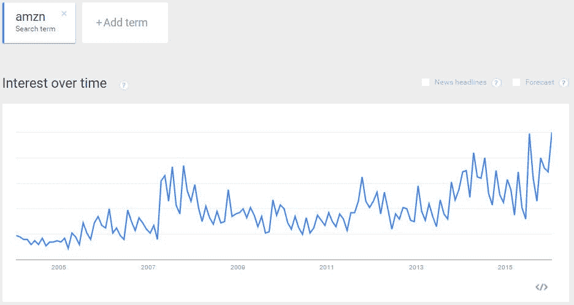
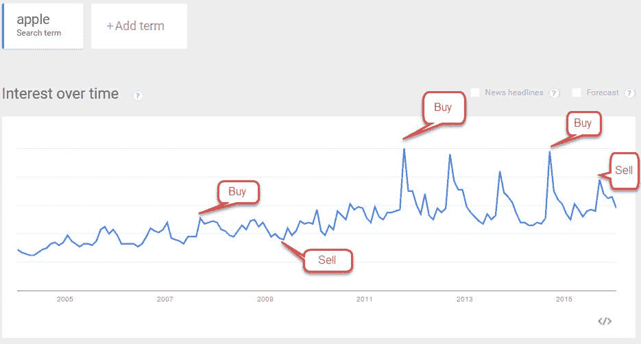
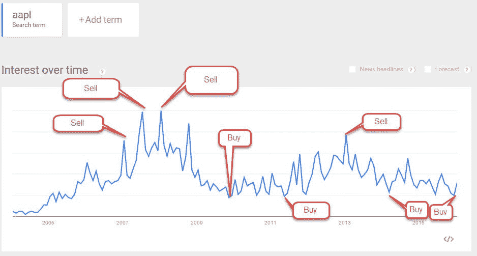
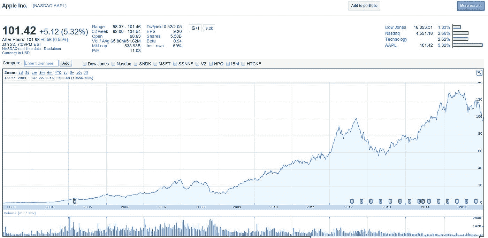

# 使用谷歌趋势作为投资工具

> 原文：<https://medium.datadriveninvestor.com/using-google-trends-as-an-investing-tool-bd66d27d6c38?source=collection_archive---------5----------------------->

(本文最初于 2016 年 1 月 26 日[发表在 LinkedIn](https://www.linkedin.com/pulse/google-trends-how-use-investor-jon-thralow/) 上，你可以看到当时的预测是正确的)

如果你看了我的前两篇文章，你可能会认为我不爱谷歌，但是，我爱[谷歌趋势](https://www.google.com/trends/)。谷歌趋势于 2006 年在 T4 推出，从那时起，我每周至少使用一次谷歌趋势。我用这个工具来理解人们感兴趣的宏观景观。这篇文章解释了我是如何利用谷歌趋势在股市中发现利润的。

1:什么是谷歌趋势
2:利用谷歌趋势进行投资
3:谷歌趋势和上市公司搜索
4:谷歌趋势和股票代码搜索
5:苹果的例子

什么是 Google Trends:
Google Trends 是一个图表，显示一个特定单词或一串单词被搜索的次数。您还可以使用该工具一次比较几个术语。上图显示了人们在谷歌搜索中输入“露营”和“雪”的次数。你可以看到，当人们对雪感兴趣时，他们对野营不感兴趣。

使用谷歌趋势进行投资:
我不是投资顾问，但我是一个一直在寻找优势的个人投资者。像沃伦·巴菲特这样的伟大投资者说过“当别人贪婪时要恐惧，当别人恐惧时要贪婪”，我们可以使用谷歌趋势找到人们恐惧和贪婪的时间，并将这些信息与股票的相对价值进行对比。我再次强调，仅仅因为我做了某件事并不意味着它会 100%有效，但接下来是我赚钱的方式，不总是在一个月内，而是通常在一年内。

这是一张结合品牌搜索和股票代码的图表，它讲述了亚马逊如何达到每股 591 美元的故事。

这是 2004 年以来股票价值的图表。如果你把三张图放在一起看，这个故事讲得最好。

这张图表显示了人们搜索亚马逊这个词的次数。大多数人在想从该公司买东西时会搜索“亚马逊”这个词。当对该品牌的搜索量上升时，该公司的股票价值应该上升，但很多时候并没有上升。

这张图表显示了人们搜索亚马逊股票代码的次数。当人们想购买公司的股票时，通常会搜索这个词。如果你看看图表中的股票价格，你会发现人们搜索股票代码的次数越多，股票价格就越高。它与实际品牌名称的搜索次数所给出的品牌内在价值几乎没有关联。通过找出两者之间的差距，我们可以找到利润。

苹果的例子:
这是苹果、苹果公司和股票价格的图表。我想在明天苹果公司的收益报告之前完成这篇文章，这样我就可以展示一个实时预测。根据目前的谷歌趋势图，我估计苹果是“持有”。

这就是为什么我认为苹果是一个持有，而不是买或卖。你可以看到对该产品的搜索减少了。根据这个图表寻找苹果产品的人越来越少。我还添加了我的买入点和卖出点的触发点。我目前有一个基于苹果产品搜索量的销售。

现在我们来找找 aapl，看看股市对该公司的看法。我们也看到很少有人想买苹果的股票，这表明“买入”是基于市场对苹果股票并不贪婪。我是这样标注这个图表的。

所以我有一个基于想买苹果产品的人的卖出和基于想买苹果股票的投资者的买入。这意味着明天的股票走势没有明确的方向，如果我持有苹果股票，我会简单地持有它，如果我不持有苹果股票，我会选择不买。

我在许多投资和营销可视化项目中使用谷歌趋势，我发现自己在 google.com/trends T2 的次数比其他任何资源都多。让我们看看明天 2016 年 1 月 27 日市场对 aapl 的反应，看看我的预测是否正确。