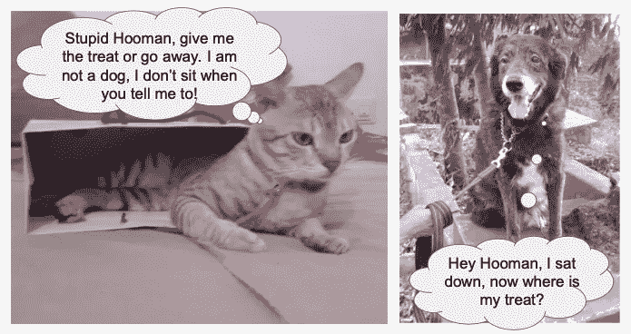
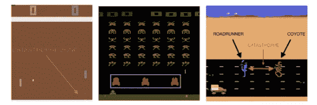
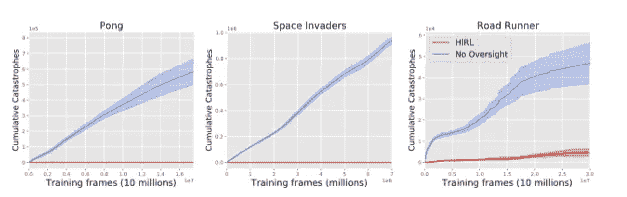

# 使用人为干预实现更安全的 RL

> 原文：<https://medium.datadriveninvestor.com/using-human-intervention-for-safer-rl-6192877b7909?source=collection_archive---------8----------------------->

## 威廉·桑德斯等人的论文摘要。艾尔。，标题为“没有错误的试验”

想象一下，通过让自动驾驶汽车在我们的物理世界中行驶，通过强化学习来训练它们。回答“哎呀，对不起，撞上你了，女士，但是我们只需要开车撞上另外 999 个行人，这样我们的车就可以学着比人类司机更安全了！”？我相信你会响亮地回答“不！”。巧合的是，这篇论文中提出的观点与我正在为 TUM 的硕士论文撰写的[论文惊人地相似。对这个主题的熟悉让我写下了这篇文章。](http://ceur-ws.org/Vol-2301/paper_12.pdf)

## **等等，强化学习到底是什么？**

Meet my pets, Snuggles (left) and Scruffy (right), while I try to reinforce good behavior in them.

在家里和宠物一起长大，我发现 RL 最直观的例子就是训练一只狗。当你的狗做各种动作的时候，重复“坐下”这个词，但是当它最终坐下的时候，这个动作会被奖励来加强。这个过程一直重复，直到狗学会对“坐下”这个词做出恰当的反应来接受款待。

Diagram depicting the working of an RL agent through interaction with its environment

用你想训练的代理人代替狗。给定环境的某个配置或状态，代理执行导致新状态的各种动作，同时用正面或负面的奖励来加强这些动作(如图 2 所示)。一种分类法将 RL 算法分类为基于模型的或无模型的。顾名思义，这是基于 RL 算法是否可以访问它与之交互的环境的模型，例如围棋游戏的规则，或者环境是否遵守的物理定律。

 [## 今年值得关注的 5 大人工智能趋势|数据驱动的投资者

### 预计 2019 年人工智能将取得广泛的重大进展。从谷歌搜索到处理复杂的工作，如…

www.datadriveninvestor.com](https://www.datadriveninvestor.com/2019/02/19/artificial-intelligence-trends-to-watch-this-year/) 

## **RL 听起来很棒，那还有什么问题呢？**

尽管上面描绘了一幅美好的画面，RL 算法并不完全像它们被描述的那样，它们仍然受到一系列问题的困扰。本文的重点是**无模型算法通过试错**来学习，即它们需要多次尝试许多不同的动作来学习最佳的动作过程。虽然理论上试错法似乎是一个好策略，但它可能会导致代理采取 ***【灾难性行动】*** ，作者将其定义为在相同情况下人类会认为不可接受的行动。

Video by [Wayve.ai](https://wayve.ai), where they attempt to train a car to drive using Reinforcement Learning under the supervision of a Safety Driver to abort potentially catastrophic actions

回到前面介绍的自动驾驶汽车的例子，目前，确保汽车不执行灾难性行动的任务由人类监督员处理，称为 ***【安全驾驶员】*** ，正如在上面由 [Wayve.ai](https://wayve.ai) 制作的视频中可以看到的那样(细节在此描述)。但是，当看到像 Waymo 这样的公司用大型车队驾驶数百万英里的规模时，安全司机的存在很快变得昂贵和不可持续。这个方面在这篇论文和我的硕士论文中都有涉及。

## 好吧，我明白了，那你的想法是什么？

桑德斯等人。艾尔。建议 ***用神经网络*** 代替系统中的人类监工，被称为*【拦截器】*，任务是模仿人类监工的行为。为实现这一目标，他们建议采取以下步骤

1.  **人为监督阶段。RL 代理与环境交互，而人类监督者识别并阻止灾难性的行为。这些交互被记录为一个元组(状态，动作，“是灾难”)，指示环境的当前状态，由 RL 代理做出的动作决策，以及指示该动作是否会导致当前状态中的灾难的标签。**
2.  **拦网训练。**监督学习用于在游戏暂停时，使用从人类监督者与环境的交互中收集的数据来训练阻断神经网络。
3.  **拦截器监督阶段。RL 代理继续与环境交互，拦截器模仿人类监督者。**

作者关注的是*“局部可避免的”*的灾难，也就是说，当危险迫在眉睫时，可以通过调整行动过程来避免灾难，因此不需要专家级的技能或长期战略规划。

## 有意思，那么作者是如何验证这个想法的呢？

本文中的实验设置使用 A3C 和双 DQN 算法，应用于雅达利学习环境中 Pong、Space Invaders 和 Road Runner 的 [OpenAI Gym](https://gym.openai.com) 实现，这些实现被调整为允许人类干预。由于 Atari 自然不包括灾难性场景，作者用以下定义构建了一个玩具示例(如下图所示)

Image from the original paper, indicating the catastrophic zone defined by the authors in Pong (left), Space Invaders (middle) and Road Runner (right).

*   *乓:*桨移动到屏幕底部是灾难性的
*   *太空入侵者:*特工射击自己的安全屏障是灾难性的。
*   *跑路者:*在 1 级死亡是灾难性的。

拦截器被建模为一个***【CNN】***卷积神经网络，它在人工监督阶段 的 4.5 小时内收集的 ***数据上接受训练。CNN 输入是表示状态的 Atari 图像，最后一层与 RL 代理的动作连接在一起，作为一个热编码，通过线性层处理，将状态-动作对标记为“安全”或“不安全”。***

Plot observed by the authors indicating cumulative catastrophes encountered over time in each of the three games. Here, HIRL agent is the one with the CNN-based Blocker, while No Oversight represents a plain RL agent with no intervention applied.

从上面的图中可以看出，考虑到 4.5 小时的人为疏忽，阻断程序在避免灾难的目标上表现良好，在 Pong 和 Space Invaders 中表现最成功，没有出现灾难。尽管 Road Runner 无法实现零灾难(在下一节讨论)，但它确实大幅降低了每帧的死亡率。

## 但是这种设置的潜在问题是什么？

本文的分析使我思考以下几点

1.拦截者和人类监督者一样优秀。 RL 代理人因找到可以“黑掉”目标的动作序列而臭名昭著(查看由 [Victoria Krakovna](https://vkrakovna.wordpress.com) 维护的[主列表](https://docs.google.com/spreadsheets/d/e/2PACX-1vRPiprOaC3HsCf5Tuum8bRfzYUiKLRqJmbOoC-32JorNdfyTiRRsR7Ea5eWtvsWzuxo8bjOxCG84dAg/pubhtml)，允许他们游戏系统以积累最大奖励，如 [OpenAI 的赛船视频](https://youtu.be/tlOIHko8ySg)所示(在这里阅读)。然而，由于建议的方法仅在初始阶段使用人工监督，阻止这种行为出现的机会非常低。事实上，这甚至在 Road Runner 环境中也观察到了，在该环境中，代理找到了一个黑客来获得最大的奖励，但它涉及到在 1 级死亡，这被作者定义为一场灾难。然而，由于该动作与拦截器在训练数据中看到的动作如此不同，它未能阻止代理执行灾难性的动作。

2.**应对变化的世界。**简单的监督学习模型建立在假设执行数据，即现实世界中遇到的数据与训练数据相似的基础上。在 Pong 这样的简单游戏环境中，这是一个合理的假设。然而，现实世界是复杂且不断变化的，拦截器将不再与环境相关。这在上文详述的 Road Runner 环境中变得可见，其中新动作导致状态-动作对输入与训练数据非常不同，从而导致拦截器失败。

3.**处理不好的演员。**考虑到欺骗神经网络生成高置信度的错误标签是多么容易，[对抗性攻击](https://openai.com/blog/adversarial-example-research/)是深度学习社区非常关注的问题，也理所当然如此。这里的拦截器也容易受到这种攻击。这在低赌注的游戏环境中可能不太相关，然而，这种攻击在安全关键的环境中可能是灾难性的，例如自动驾驶汽车

4.在什么情况下我们可以信任拦截者？。随着在公路跑步者环境中发现的复杂性的增加，拦截器无法成功避免 100%的灾难。因此，对于真实世界的例子，如自动驾驶汽车，什么指标可以帮助我们确定系统是否足够好，可以在野外部署。

## 那么这是个死胡同吗？

我当然不这么认为！本文是对这一方法的初步研究，可以进一步发展。事实上，在论文的第 5 部分，作者概述了一些有前景的技术来扩展这项工作，即，使用数据高效的阻塞器，使用数据高效的 RL 算法，寻找潜在的灾难性情况，主动学习以允许人类标记代理不确定的状态-动作对，用更多细节扩充训练数据，而不仅仅是“安全”/“不安全”标记，使用基于模型的 RL。

这篇论文读起来很有趣，并且为思考与人工智能安全相关的问题提供了一个容易和可访问的入口。

希望你喜欢这篇文章，留下一些掌声来表达你的爱！ ❤️

## 参考资料:

这一部分是博客文章中使用的所有链接的列表(按照它们出现的顺序)。

1.  没有错误的审判。艾尔。:【https://arxiv.org/pdf/1707.05173.pdf 
2.  使用碰撞预测网络监控自动驾驶汽车的安全性(我正在为我的硕士论文进行的实现的总体思路):[http://ceur-ws.org/Vol-2301/paper_12.pdf](http://ceur-ws.org/Vol-2301/paper_12.pdf)
3.  RL 算法分类，by open ai:[https://spinning up . open ai . com/en/latest/spinning up/RL _ intro 2 . html](https://spinningup.openai.com/en/latest/spinningup/rl_intro2.html)
4.  深度强化学习还不起作用，亚历克斯·欧文:[https://www.alexirpan.com/2018/02/14/rl-hard.html](https://www.alexirpan.com/2018/02/14/rl-hard.html)
5.  视频显示使用 RL 在物理环境中训练汽车，作者:way ve . ai:[https://youtu.be/eRwTbRtnT1I](https://youtu.be/eRwTbRtnT1I)
6.  一天学会开车。艾尔。https://arxiv.org/pdf/1807.00412.pdf
7.  “自 2009 年以来，Waymo 已在真实道路上行驶了超过 1000 万英里”，Waymo 安全报告:[https://waymo.com/safety/](https://waymo.com/safety/)
8.  奥鹏健身馆:[https://gym.openai.com](https://gym.openai.com)
9.  人工智能中规范游戏的主要例子，作者维多利亚·克拉科夫纳:[https://bit.ly/2NaKbFa](https://bit.ly/2NaKbFa)
10.  追踪人工智能安全进展的博客，作者维多利亚·克拉科夫纳:[https://vkrakovna.wordpress.com](https://vkrakovna.wordpress.com)
11.  描述 RL 代理展示的意外行为的赛艇游戏视频，由 OpenAI 制作:【https://youtu.be/tlOIHko8ySg 
12.  《荒野中的错误奖励函数》(一篇解释赛艇游戏中 RL 代理行为的博文)，作者 open ai:【https://openai.com/blog/faulty-reward-functions/