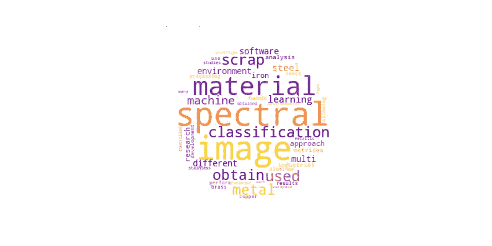
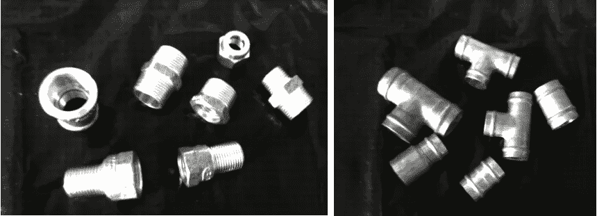
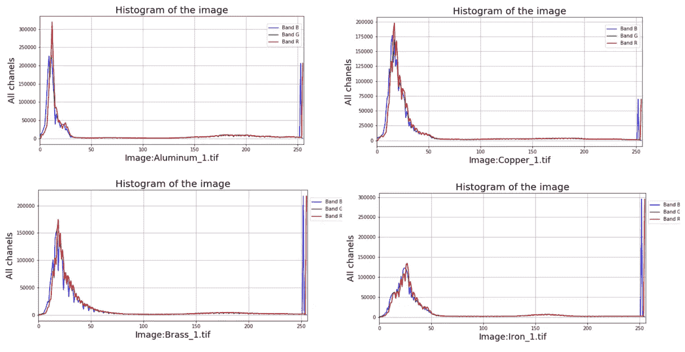
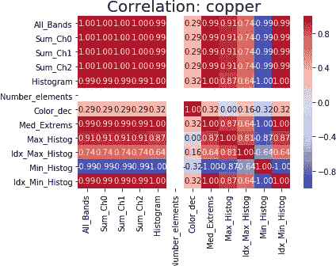

# 利用机器学习对废金属进行分类

> 原文：<https://medium.datadriveninvestor.com/using-machine-learning-to-scrap-metal-classification-5458eb6ddfc9?source=collection_archive---------1----------------------->

Image obtained using Python to make a graph with the most common work of the text (images from the author)

钢是世界上最重要的工程和建筑材料。它被用于我们生活的方方面面。有 3500 多种不同等级的钢，具有许多不同的物理、化学和环境特性。欧洲原材料环境倡议(理事会、欧洲议会和，2003 年)最近推动了金属合金的再循环和回收工作。我使用废钢的光谱图像，利用机器学习技术进行了有效的分类。

所使用的材料是铝、黄铜、铜、铁、不锈钢和涂漆的铁材料，以获得多光谱图像。使用的设备是多光谱机，ADC Lite。安装 ANACONDA 框架是为了在 Python 编程中使用 Jupyter。图像波段的探索集中在图像矩阵的分析上，以便获得不同材料的分类参数。

Some multi-spectral images from material brass and copper (images from the author)

对社会和工业领域来说，废金属的分类是一项非常经济的任务。虽然废品是一种社会或工业领域的废物，却是一种有价值的产品。我们还有金属产品报废后的固体废物管理问题，这是所有公民的目标，对一些欧洲项目有具体的激励措施。

 [## DDI 编辑推荐:5 本机器学习书籍，让你从新手变成数据驱动专家…

### 机器学习行业的蓬勃发展重新引起了人们对人工智能的兴趣

www.datadriveninvestor.com](https://www.datadriveninvestor.com/2019/03/03/editors-pick-5-machine-learning-books/) 

对钢铁工业来说，用废钢生产钢的成本比用初级原料(铁矿石)生产钢要低得多。这些公司使用废料作为增加产量、降低
固定成本甚至可变成本的替代方案，因为一般来说，废料是一种经济上有利的金属来源，特别是在能源成本非常高的地区，例如美国和欧洲。

将图像的 RGB 波段转换为矩阵和列表允许使用机器学习的方法，并且可以从数学上利用不同材料的光谱波段之间的差异。可用于图像处理的几个库允许在图像的代表性矩阵的水平上探索，其颜色和暴露于光入射的反射率。

Some graphs that use the multi-spectral image information of the scrap metal (images from the author)

安装 ANACONDA 框架是为了让 Jupyter 使用 Python 编程。图像波段的探索集中在图像的分析上，以便获得不同材料的分类参数。其他方法可以使用 Google Collaboratory，它在云中提供了一个虚拟机 Python，并且已经集成了一个带有 GPU 的环境。对于应用技术，需要安装 Python 库，如:PILLOW、OPENCV、OPENPYXL、COLORMATH、WEBCOLORS、NUMPY 和 MATPLOTLIB。这些库提供了一套工具，允许我们分析不同的问题，并针对每个问题开发特定的方法。

An example, correlation graph about some characteristics of copper, obtained using Python. (images from the author)

## 结论:

如上所述，可以使用 ML 技术对金属进行分类。其他技术问题，如正确的废料查看；有防雨设施的环境；和适于捕捉图像的光。在工业环境中，我们有服务程序密集和高速设备。高水平的灰尘、噪声和振动在这些环境中很常见，需要在未来的原型应用中加以考虑。

## **参考文献**

研究由作者完成。为一份立场文件编写的工作，大学硕士论文。

欧洲议会 2012 年 12 月 25 日第 2012/29/UE 号决定。(2003).WEEE 指令 2002/96/EC。Eionet —报告义务数据库。来源: [http://ec.europa.eu](http://ec.europa.eu)

TETRACAM。ADC Lite。来源:www.tetracam.com