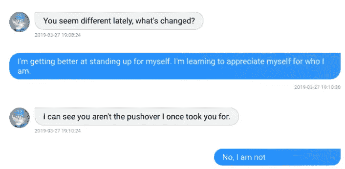
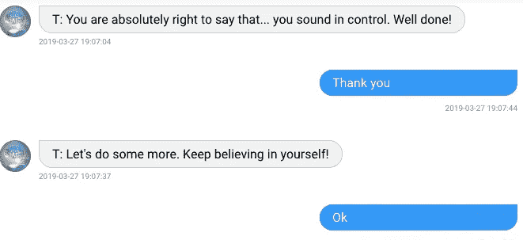
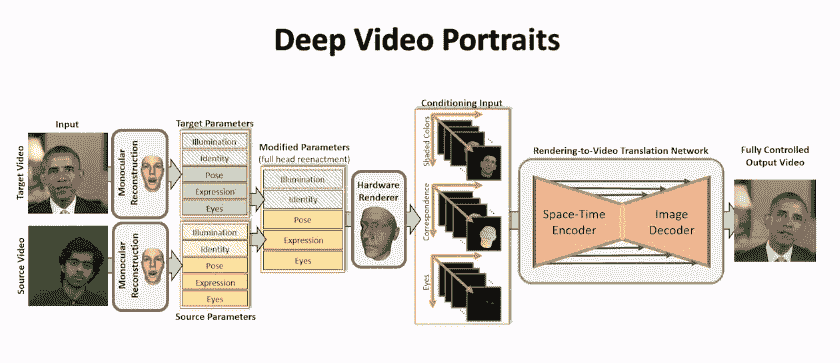

# 使用自然语言处理治疗精神分裂症

> 原文：<https://medium.datadriveninvestor.com/using-nlp-for-schizophrenia-therapy-144018f24470?source=collection_archive---------2----------------------->

## 聊天机器人+深度视频人像，用于数字化化身治疗

人工智能已经被用来彻底改变医疗保健系统的游戏。特别是诊断中的计算机视觉和处理大量数据的人工神经网络。

但是，不经常出现在头条新闻中的是自然语言处理(一切与机器和语言有关)**将在医学方面产生的**影响。****

一个具体的例子是对精神分裂症患者的治疗，通过增加新的治疗方法来扩大规模。精神分裂症是一个巨大的问题，这就是为什么我写了一篇关于它和化身疗法的文章，所以你可以[在这里查看。](https://medium.com/datadriveninvestor/why-schizophrenia-is-such-a-big-problem-and-how-ai-can-help-472029614e2b)

总结一下这个想法，**头像处理方法可以使用聊天机器人一样的结构以可扩展和实用的方式复制，并通过深度视频人像来增强它。**

在这篇文章中，我将深入解释*什么是自然语言处理，特别是对话式人工智能*，*假货如何工作*以及*这两者的交叉如何能够创造出超级有影响力的东西*。

 [## 大笔资金和尖端技术:人工智能/人工智能投资将如何革新医疗保健…

### 在过去几年人工智能(AI)和机器学习(ML)的显著发展中…

www.datadriveninvestor.com](https://www.datadriveninvestor.com/2018/03/22/big-money-and-cutting-edge-technology-how-investment-in-ai-ml-will-revolutionize-the-healthcare-industry/) 

# 让我们聊聊吧

在我们深入讨论机器学习和 NLP 之前，我们先从一个更熟悉的概念开始。

现在，许多网站和商业商店在页面底部都有一个小的语音气泡，如果你有任何问题，可以小声点击它。这个按钮召唤了一个精灵，它会回答你的每一个问题，不管是什么时候——帮助你真正满足深夜的电子商务狂欢。

开玩笑的。但是聊天气泡确实召唤了与聊天机器人的对话，聊天机器人可以或多或少地回答你的大多数一般性问题，并且在其他时间不需要人类

聊天机器人是一种模仿人类对话的计算机程序——口语、书面语或两者兼有。有两种类型的聊天机器人:标准的基于规则的机器人，根据关键词执行脚本操作；人工智能驱动的聊天机器人，使用机器学习来更自然地交谈。

因为前者只对指定的命令作出反应，所以它只显示固定水平的智能。给这种机器人一个它不理解的命令，它不知道该做什么，也不会因为更多的交互或信息而变得更聪明。

Siri 就是一个典型的例子。你说“嘿 Siri，我饿了”，你得到的回应是“在网上搜索 10 美分班卓琴茶的结果…好的，下面是最佳答案”

第二种聊天机器人使用人工智能，理解语言的能力(而不仅仅是命令)，以及学习的能力。这项技术导致了智能聊天机器人，它们可以发现新的模式，并在遇到更多情况时变得更聪明。

> 简单地说，聊天机器人的工作是接收输入数据，解释它，并将其转化为相关的输出值。在接收到输入数据后，它必须进行分析和上下文分析，以便对收到的任何提示做出适当的“反应”。

# 那么人工智能到底在做什么？

**AI 通过 NLP，ML 和 DL 帮助聊天机器人通过寻找和分析数据中的模式来“学习”。**他们可以*将*这些模式应用到稍微不同的问题上——基本上拥有解决问题和完成任务的智能，无需人工干预

## 机器学习

使用 ML，系统通过接触大量的例子(而不是给出更多的规则)来学习，然后从它所拥有的交互中学习更多。
机器学习使用算法，基本上是告诉计算机做什么的指令序列。

算法可以以复杂的方式组合和排序**。当聊天机器人接收到输入时，它必须对其进行分析并形成上下文，以便它可以确定所需的输出**。由于聊天机器人是通过输入数据来训练的，因此它会搜索模式，并将其保存以供参考。这就是“学习”的过程。

## 深度学习

深度学习是一种机器学习，它使用称为人工神经网络的分层算法。神经元之间的连接由先前的学习模式和事件加权。**算法在大量数据中发现模式，并从这些模式中推断如何对新数据做出响应。**这种方法用于基于人工智能的聊天机器人，其中预定义的一组响应没有用。

> 因此，可以将数据视为一组示例，这些示例为大量给定的输入指定了正确的输出。机器的工作是从数据中提取并存储模式。聊天机器人继续“学习”，即提取和保存模式，每次输入数据。

## 自然语言处理

NLP 是聊天机器人智能的第三个组成部分，指的是它对人类语言的分析和合成。NLP 利用预测分析，这是一种统计、数据挖掘和数据建模技术的组合，旨在主动生成信息，而不必等待人类的提示

自然语言处理赋予聊天机器人学习和模仿人类对话风格和模式的能力。但是，NLP 面临挑战，例如使聊天机器人能够推断人类用户的感受，这是一种称为情绪分析的功能，采用语言分析。

自然语言处理也分为两部分:自然语言理解(NLU)和自然语言生成(NLG)。

*   *自然语言理解*是将人类语言输入转化为机器可理解形式的复杂过程。
*   *自然语言生成*是相反的过程:将计算机生成的输出转化为人类用户可以理解的形式。

> 聊天机器人的智能水平是其在几个相互关联的领域中的表现的总称。智能聊天机器人通常能够“学习”并利用其经验来提高性能。如果机器人能够识别出想要的结果(一项具有挑战性的任务)，计划一个多步骤的过程来实现这些结果，然后自主地工作来实现这些结果，那么为较窄功能创建的机器人就是智能的。这一系列活动被称为“感觉-思考-行动”过程。

**此外，机器人需要知道如何提问，这将使它们能够收集采取所有步骤所需的信息。智能聊天机器人也明白用户想要什么，并准备好满足用户的要求。如果对话机器人能够轻松处理不同风格和话题的对话，那么它们就是智能的。**

**智能聊天机器人需要理解意图——动作背后的含义**，高效清晰，并提供相关信息作为回报。

# 这一切是如何结合在一起的

好吧有道理。但是它究竟如何能帮助精神分裂症患者呢？？？？

嗯，我有点建议阅读[另一篇文章](https://medium.com/datadriveninvestor/why-schizophrenia-is-such-a-big-problem-and-how-ai-can-help-472029614e2b)，但我还是在这里总结一下。

> TLDR，化身治疗显示出与普通精神分裂症治疗相同的结果，但时间缩短了一半(12 周而不是 24 周)。当精神分裂症患者在任何精神或身体疾病中需要第二长的病人车(它占用的床位数)时，这是非常重要的。

在化身治疗中，精神分裂症患者**与治疗师合作，创造了他们最想影响的声音**的计算机模拟(化身)——包括声音说了什么，听起来如何，以及看起来如何。**治疗包括患者、治疗师和化身之间的三方对话，治疗师以他们自己的身份说话，同时也为化身发声。**

The bot gradually becomes more open to accepting the patient to mimic real life situations

在每个疗程中，患者花 10-15 分钟与化身面对面交谈，练习对抗它，纠正它对他们的任何误解，并控制对话，这样权力就从化身转移到了患者身上。化身来到 r **认识到病人的优点和良好品质**，以及病人在关系中更大的控制力和权力。

The 3 parts: The perpatrator (top most), the patient (blue) and the therapist (bottom, with t:)

**在我们的精神分裂症机器人的例子中，我们基本上数字化了三方对话。嗯，有两部分。机器人被训练成犯罪者和治疗师的声音/想法。**这里最重要的部分实际上是治疗师，因为这可以扩展到任何医学专业人士，而不仅仅是几个专业医生。

这可以在病人直接与聊天机器人交互的情况下工作，也可以在医生打字/使用自然语言处理语音到文本的情况下工作。
犯罪者会说些什么- >患者会回应- >这些信息会被记录下来，并用作后续互动的数据- >治疗师会用鼓励或支持的话语来回应。

The therapist offers kind words in response to assertiveness.

随着时间的推移，通过会话，声音会变得更加顺从。这其中的一个关键部分是使用情绪分析来确定患者的反应是否良好，并根据反应的类型来确定治疗师的建议是否更加自信。

**目前，我正在使用的数据由一些现有的虚拟化身治疗记录和其他视频中的手写对话组成。这远远不足以支持超级有效的对话和治疗。然而，随着更多数据的发布和一个基础水平的来源，它仍然是功能。**

# 奖金🎉

所以现在我们对对话式人工智能及其应用有了基本的了解，我们也可以快速概述一下深层假动作，这是这个想法的额外部分。

Deepfakes 实际上是将一个人的脸变形，以模仿其他人的特征，并保留原始的面部表情。此处遵循的程序为。如果使用得当，这种技术可以以低廉的成本制作出非常逼真的视频。**理想的组合是深度视频人像，这将允许更平滑的流程和实时性。你可以在** **这里查看他们** [**的一段酷炫视频解说。**](https://youtu.be/qc5P2bvfl44?t=15)

A basic overview of how deep video portraits would work

与目前使用的稍微卡通化的头像相比，这将被用作一种更容易和更可定制的替代方法。与标准的嘴部运动相比，深度视频肖像将允许医生做出期望的面部表情。这无疑有助于更准确地模拟现实——这也是化身疗法首先成功的原因之一。

These definitely could benefit from a little enhancement

# 那么这一切意味着什么呢？

总的来说，这还远非完美或可部署的。正如我上面提到的，数据和技术现在还处于起步阶段。然而，通过正确的努力和开发，它有可能影响成千上万的人。

*感谢您的阅读！如果你喜欢这篇文章，请留下一些掌声，关注我的媒体* [*LinkedIn*](https://www.linkedin.com/in/mishaal-l-1b0222168/) *或者查看我的个人网站，了解我在人工智能方面的进展。*