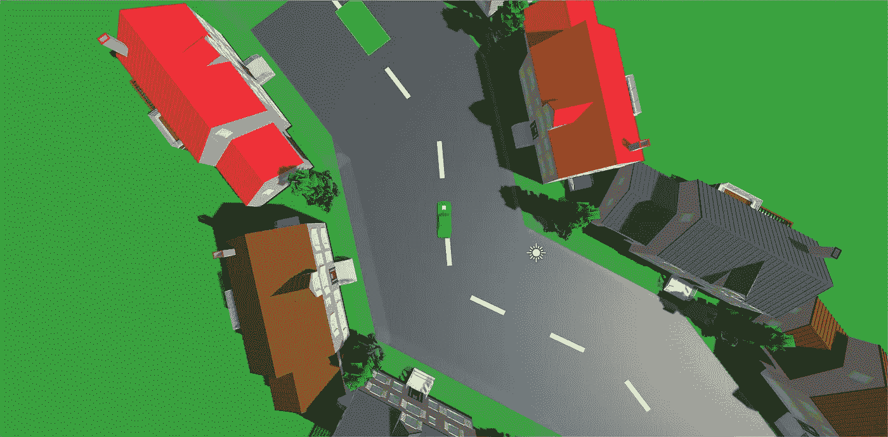
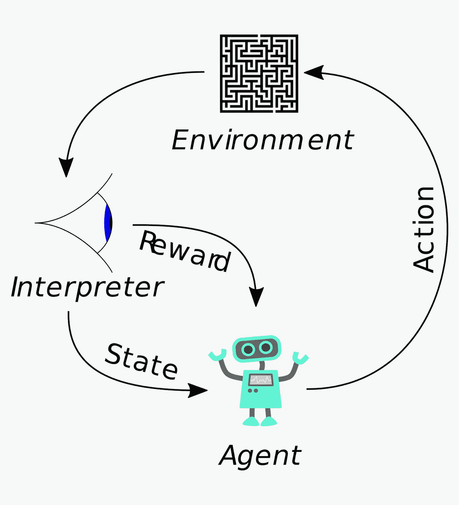

# 使用强化学习训练机器人

> 原文：<https://medium.datadriveninvestor.com/using-reinforcement-learning-to-train-robots-c7297f6917d2?source=collection_archive---------9----------------------->

如今，大多数机器人只能完成特定的任务，比如在精确的时间将零件放在模型上，而且它们的单价已经高达数千美元。

如果你有很多东西要包装，你需要各种各样的机器人。但是，有更好的方法。被称为**强化学习**的**机器学习**的子集可以处理这个问题。

 [## 模式和机器人:复杂的现实|数据驱动的投资者

### 哈耶克的名著《复杂现象理论》(哈耶克，1964)深入探讨了复杂性的话题，并断言…

www.datadriveninvestor.com](https://www.datadriveninvestor.com/2019/03/04/patterns-and-robotics-a-complex-reality/) 

机器学习是**人工智能**的一个子集，其中人工智能根据给它的信息计算出如何**完成某事。强化学习就是基于这个想法。**

# **什么是强化学习？**

强化学习不同于普通的机器学习，因为强化学习 AI 正在控制放置在虚拟环境中的**代理，并找出如何在虚拟环境中完成任务。**

这与普通机器学习的想法类似，只是强化学习人工智能是从其环境中获取信息。但是，你无法标记每个动作是好是坏。

所以你可以**给人工智能一个正奖励**如果它更接近它的目标，给一个负奖励**如果它更远。这些**奖励可以帮助它学习**回到工厂机器人，碰撞物体是不好的，但是举个例子，举起它们是好的。**

**代理的动作被发送到环境**，而**解释这是一个好的动作还是一个坏的动作**，并返回奖励和一个**状态**，这实质上是**代理与之交互后环境的新状态**。

# 这怎么能解决我们的问题呢？

我们可以**用强化学习解决训练自主机器人**的问题。

回到装配线类比，使用**计算机视觉**机器人可以**检测生产线上的物品种类**，并使用强化学习，**计算出如何确定自己的方向**以拾取该物品。

我们也可以用它来解决更高级的问题。强化学习理论上可以实现的一个疯狂的想法是为你切菜做饭。

你可以创建一个**模拟**，通过切蔬菜、将蔬菜放入锅中并烹饪它们来获得积极的奖励。在**几十万代(运行)**之后，它将学会如何切蔬菜和烹饪蔬菜！

这说明了强化学习的广泛用途！

# 我的项目

我决定磨练我的人工智能技能，并创建自己的强化学习模拟。我对**的 AVs(自动驾驶汽车)**很感兴趣，所以我创建了一个汽车的**模拟，它的目标是**通过一条道路自己停车**。**奖励**(奖励，记住！)我给它的奖励包括对驶离道路的负面奖励，以及对靠近、触碰或停在绿色停车位内的正面奖励。令人惊奇的是，仅仅经过 2500 代**(训练时间超过 30 分钟)，它已经学会了如何在 90%的时间里**完成任务**！

# 外卖:

*   强化学习是机器学习的一个子集
*   强化学习是不同的，因为它从环境给出的数据中学习
*   它使用奖励、状态和动作来帮助人工智能代理学习
*   这对于训练机器人很有用，因为它是在环境中学习，而不是从简单的数据中学习
*   中等难度奖励已经训练得相当快和准确

如果你喜欢阅读这篇文章，或者有任何建议或问题，请鼓掌或评论让我知道。你可以在[*LinkedIn*](https://www.linkedin.com/in/ronit-taleti-7558b4193/)*上找到我了解我的最新动态，或者在我的* [*网站*](http://ronittaleti.ca/) *上查看我的最新项目。在我的* [*简讯*](http://eepurl.com/gHgg-H) *上看看我在忙什么。感谢阅读！*