# 使用 Route53 实现最佳故障转移效率和用户体验

> 原文：<https://medium.datadriveninvestor.com/using-route53-for-optimal-failover-efficiency-user-experience-5c9031a08300?source=collection_archive---------4----------------------->

## 使用 AWS 的 Route53 DNS 服务，有很多方法可以剥下高可用性猫的皮。以下是我在尽可能接近即时区域故障转移的过程中得到的一些测试结果。

过去几周，我一直在思考 Route53 从一个区域故障转移到另一个区域的速度有多快，以及用户在故障转移期间看到的“page not found”类型的错误窗口有多窄。我关心这一点，因为在过去的几年中，我已经设计、构建、启动并运行了跨三个区域的 SSO 部署。它在功能上是一个构建在 AWS 和 COTS 身份软件(PingFederate)上的 IDaaS 服务。以下是我在 2019 年 Identiverse 大会上关于该服务的演示，以了解更多细节。

涉及 Route53 和我对优化故障转移的渴望的突出之处源于以下几点:

 [## 信息图:云之旅|数据驱动的投资者

### 聪明的企业领导者了解利用云的价值。随着数据存储需求的增长，他们已经…

www.datadriveninvestor.com](https://www.datadriveninvestor.com/2018/09/22/infographic-journey-to-the-clouds/) 

1.  与某些 IDaaS 提供者不同，会话由全局集群中的每个节点生成和处理。尽管全局超级集群由位于阿默斯、EMEA 和 ASPAC 区域的区域子集群组成，但是所有节点都尊重由所有其他节点/子集群生成的所有会话。
2.  对于某些只读事务，每个区域子集群可以通过节点间的共识来验证状态。因此，为了获得最佳的用户体验，我们希望将用户路由到离他们最近的区域集群，以便可以在区域子集群中验证那些只读事务，而不必等待全局集群就状态达成一致。
3.  如果一个区域丢失，会话状态可以在其他区域的剩余节点中重新分配。这种故障转移的用户体验是我希望通过这次测试完全理解的。

## 测试设置

我在三个地区设置了 apache 服务器，US-East-1、EU-West-1 和 AP-Southeast-1，并将它们配置为显示一个简单的主页，其中显示了它们的地区名称。

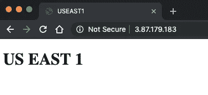

然后，我将每一个都放在一个负载均衡器后面，以便有一个一致的 DNS 名称路由到我的测试，因为我不想麻烦设置 VPC 和子网，在三个区域有公共可访问的 DNS 名称。我将使用这些 DNS 名称来跨各种 Route53 路由策略映射一个虚拟 URL sso.redbeardidentity.com。这样，当我取下这三个节点中的每一个时，我可以很容易地看到这三个节点中的哪一个服务于页面。

sso.redbeardidentity.com hosted from USEAST1

sso.redbeardidentity.com hosted from EUWEST1

sso.redbeardidentity.com hosted from APSOUTHEAST1

我还构建了一个简单的 bash 脚本，它将每 1 秒钟卷曲一次 sso.redbeardidentity.com，然后 grep 并显示标题。这让我不需要刷新匿名浏览器就可以观察故障转移。然后我构建了一些 Route53 策略，并开始开关 apache 服务器。

## 健康检查、TTL 和 ALBs 对 NLBs

一开始，有几个非常重要的项目可以进行调整以提高故障转移性能，而无需使用任何 Route53 体系结构，主要是 TTL 和运行状况检查频率。TTL(生存时间)决定了在进行下一次查询之前，DNS 解析器应该将 DNS 查询缓存多长时间。默认情况下，AWS Route53 记录集的 TTL 为 300s，这对于大多数用途来说可能是合适的。然而，当你盯着秒表等待剧本从“美国东部 1”切换到“欧盟西部 1”时，那 300 秒感觉像是永恒。在初步测试中，故障转移的速度与缩短的 TTL 相关。对于我所有的测试，我把 TTL 调到 1 秒。老实说，除了每次调用服务时都需要进行 DNS 查找之外，我不确定这意味着什么——但是因为目标是确保尽可能快地进行故障转移，并且更大的 TTL 值会减缓这些故障转移，所以我得出结论，这种折衷是值得的。

影响故障转移性能的下一个主要因素是每次运行状况检查的次数和间隔 53。在配置运行状况检查时，可以在高级配置选项下找到这些选项。

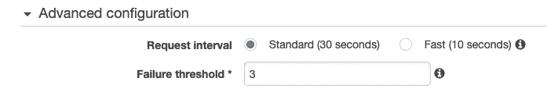

将失败阈值和请求间隔保留为默认值可以保证在任何基于健康检查的路由策略生效之前至少 90 秒。对于下面的测试，我将失败阈值调低到 1，请求间隔快 10 秒。

最后，在几天的测试后，最初让我的结果困惑的是应用程序负载平衡器和网络负载平衡器在故障转移性能上的差异。我将让 Amazon[来解释这种区别](https://aws.amazon.com/elasticloadbalancing/faqs/?nc=sn&loc=6)，但简单的答案是 ALB 在应用层(OSI 模型中的第 7 层)运行，NLB 在传输层(第 4 层)运行。事实证明，与 NLB 相比，在 apaches 之前设置 ALB 会显著影响故障转移性能，所以如果性能至上，请选择 NLB。

因此，让我们开始看看在 Route53 中我们可以使用什么样的策略，以及它们之间的比较。

## 延迟路由+嵌套故障转移

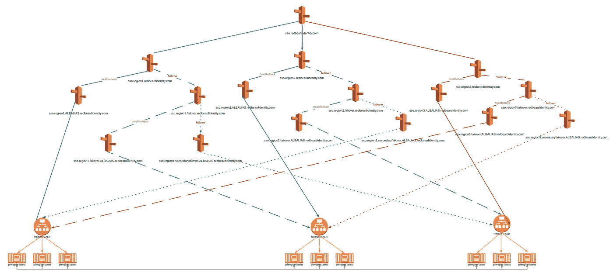

这种设计从延迟路由开始，将请求者指向性能最佳的区域，然后使用一系列级联主/辅助故障转移策略将请求者路由到端点。每个区域的主路由映射到该区域集群前面的 ALB 的 DNS。第一个故障路由到第二个 Route53 别名，然后第二个 route 53 别名映射到第二个主/辅助故障转移策略。该故障转移的主路由映射到第二个区域的 ALB 的 DNS，而其故障则映射到第三个区域的 ALB 的 DNS。因此，每个区域都有硬编码的第一、第二和第三路径到达集群，并且必须注意第二和第三路径是否基于您的设计所使用的区域。这可以根据需要扩展到任意多个区域，代价是大量的 Route53 对象。

我们可以在每个 ALB 上重复使用健康检查，用于路由策略中更高的决策点，因为决策最终是基于这些 ALB 后面的目标的健康状况。这里，我们构建了路由树的 AMERS 端，并将运行状况检查附加到主要故障转移路由别名以及所有三个延迟别名。

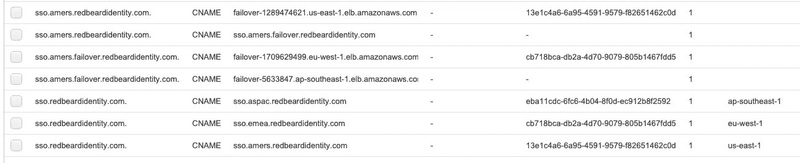

我们启动测试脚本并开始 grepping。不出所料，我们看到 sso.redbeardidentity.com 被美东 1 号服务了。一旦我们关闭它，我们会看到预期的“坏网关”错误，因为 ALB 响应没有有效的目标。

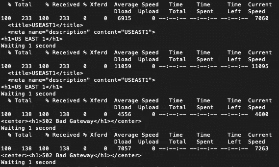

但是，“坏网关”并没有切换到 EU-西 1。相反，我们再也无法解决 sso.redbeardidentity.com 问题。

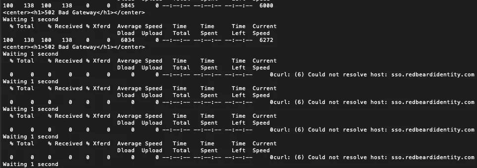

发生了什么事？嗯，它完全按照我们说的那样工作。当使用故障转移设计时，在延迟路由层应用健康检查破坏了在它下面应用的附加路由策略——或者说，它使它完全冗余。这是有意义的，因为 Route53 评估 sso.redbeardidentity.com-> sso.amers.redbeardidentity.com 分支的健康状况，发现它不健康，而是根据基于我的始发点的延迟将流量发送到下一个最佳别名，这看起来像是来自我的大西洋中部始发点的 EU-西 1。由于我没有费心在这个练习中构建 EMEA 路由树，所以当延迟层从 sso.amers.redbeardidentity.com 切换到 sso.emea.redbeardidentity.com 时，它没有切换到 EU-西 1。删除该层的健康检查允许评估 AMERS 路由树上的下一个分支。

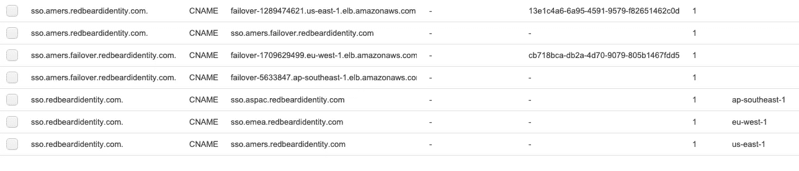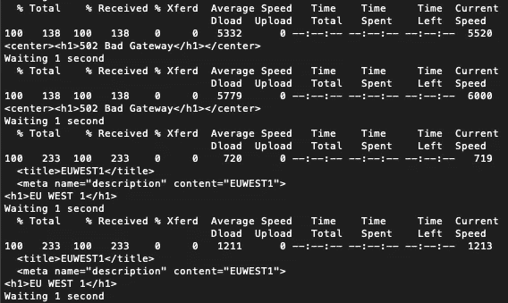

如果我们关闭 EU-西 1 号的 httpd，我们就可以切换到 AP-Southeast-1 号。

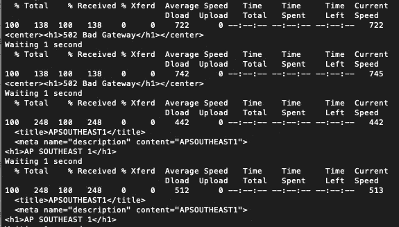

因此，让我们在 EMEA 和 ASPAC 地区构建其余的路由树，并测试我们的假设，即故障转移将按照我们的预期工作。在映射了所有的别名之后，下面是我在 Route53 中的内容:

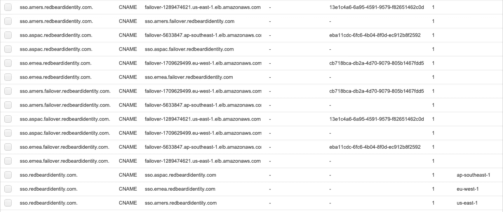

我在 sso.redbeardidentity.com-> sso.amers.redbeardidentity.com 延迟路由层添加了健康检查，以强制我无法到达 EMEA 路由树。

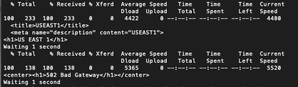

随着美国东-1 下降，我应该显示 sso.redbeardidentity.com 解决 EU-西-1-

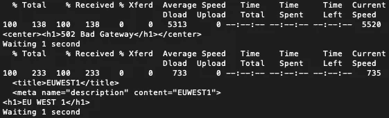

当我关闭 EU-西一号时，却无法启动东南一号。

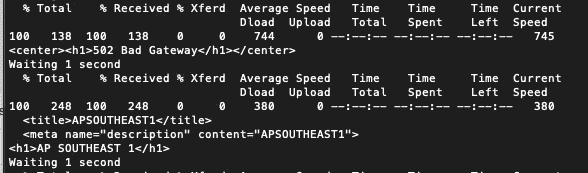

只要 US-East-1 延迟健康检查将我保持在 EU-West-1 路由树中，关闭 AP-Southeast-1 就会导致解析 sso.redbeardidentity.com 失败。

尽管这种设计很好地预测了主/次/第三路由可用的给定区域的故障，但延迟层的故障转移性能的可变性是一个巨大的缺点。在最好的情况下，以网络负载平衡器为端点，从美国到 EMEA 的故障耗时 25 秒，从 EMEA 到 ASPAC 的故障耗时 23 秒。使用 ALBs，从阿默斯到 EMEA 的故障转移耗时 50 秒，从 EMEA 到 ASPAC 的故障转移耗时 45 秒。然而，缺少使用这种配置所需的健康检查意味着您将受到 Route53 的下一次延迟计算的支配。对于每一个需要几秒钟进行故障转移的测试，都有另一个需要几分钟才能完成的测试，有些测试在故障转移之前持续了 10 多分钟。对我来说，这种可变性有点太大了，我认为这种延迟+嵌套故障转移是产品设计的重要竞争者。

## 延迟路由+加权路由

如果我们可以使用少得多的 Route53 对象实现与嵌套故障转移相同的结果，会怎么样？事实证明加权路由可以做到这一点。这恰好是我的 pingbleaf 的 [AWS 部署的开源分支中当前使用的配置。](https://github.com/thomsonreuters/tr-aws-pingfederate)

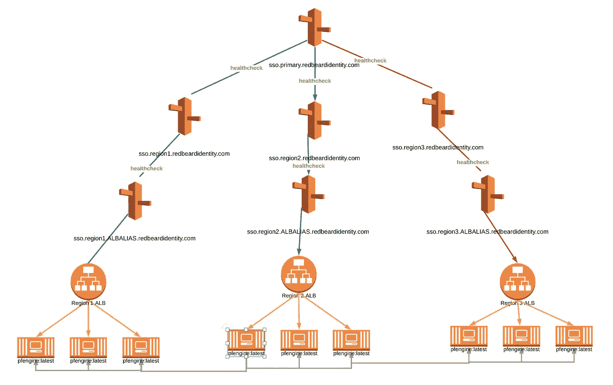

在传统的加权路由配置中，您为每个别名设置权重，请求将根据赋予每个别名的权重按比例发送。这不是百分比计算。例如，如果您有三个节点，您希望在 sso.redbeardidentity.com 之后提供流量服务，您将创建三个加权记录集，并将 sso.redbeardidentity.com 映射到它们的每个 DNS 名称。如果您为第一个节点分配权重 10，第二个节点分配权重 100，第三个节点分配权重 33，这意味着对于发往 sso.redbeardidentity.com 的 143 个请求(记录集的所有权重值的总和)，Route53 将对其进行路由，以便第一个节点处理 10/143，第二个节点处理 100/143，第三个节点处理 33/143。这意味着我们可以为 ALB 的一个记录集分配一个任意的权重，并安排 100%的流量到达那个加权的别名。将加权策略置于延迟策略之后，Route53 将返回到延迟路由层，以找到下一个能够满足请求的可用加权策略，这意味着我们有了一种更简单的多区域故障转移方法。

为此，我们使用别名将三个区域延迟路由指向其对应的区域加权路由

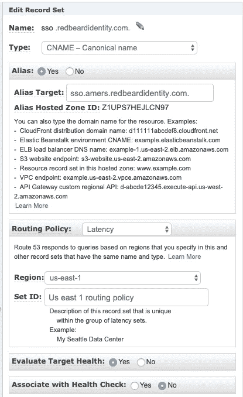

当你完成的时候它会看起来像这样。

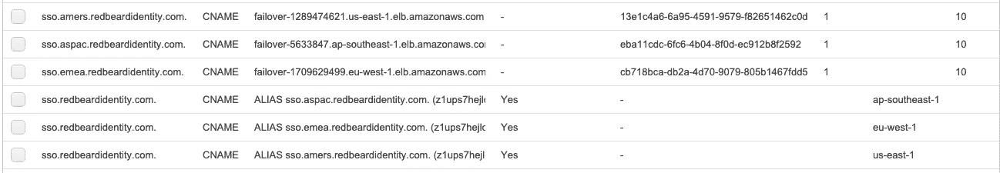

因此，我们再次开始点击 sso.redbeardidentity.com，看看哪个节点满足请求。我们从美国东部 1 号开始。鉴于我们的 1s TTL 和 10s/1-strike 健康检查，假设 EU-West-1 仍然是我的大西洋中部起点的下一个最佳延迟体验，我们应该在大约 15s 内跳跃到 EU-West-1。

Performance wasn’t what I expected.

50 秒的故障转移时间还不错，但不是我所希望的。在其他测试中，当在延迟策略上使用通用的“评估目标健康”选项时，我看到故障转移在 30 秒到 5 分钟之间变化，我怀疑这与故障转移和 Route53 重新评估其区域延迟的时间有关。我们不需要处理这种可变性，相反，我们可以对延迟策略应用我们在加权策略上使用的运行状况检查，以使故障转移时间范围更加可预测。

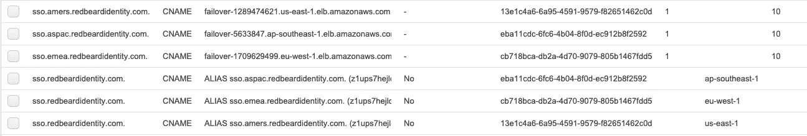

这种配置将时间缩短到了 30 秒。我认为这是因为我们在使用别名时失去了对 TTL 的控制。如果我们将配置切换到 CNAMEs，将 TTL 设置为 1s，并将其与具有单一故障阈值的 10s 健康检查配对-

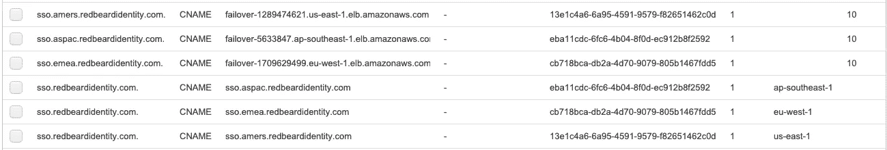

再做一次测试，一切都会好的，对吗？

What the hell.

这不是我所期望的，因为在 Route53 测试导致实际坐下来写出结果的日子里，我*已经*通过加权策略上的延迟策略，使用 10 秒的健康检查，将故障转移降低到 17-24 秒。我准备把这部分归因于使用短暂的多租户基础架构，即接受基于峰值使用、幕后维护和其他您无法控制的因素的性能变化。但我越想越觉得这像是一种逃避。

然后我想起来了——我在这些测试中使用了**应用**负载平衡器，当我看到较低的故障转移数时，我使用了**网络**负载平衡器。因此，让我们用 NLB 替换我们的 ALB，并按照上面的配置进行故障转移测试:

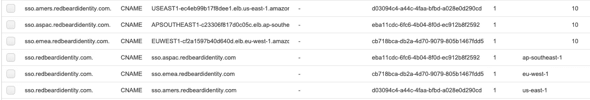

美国到 EMEA 的故障切换时间缩短到 30 秒，EMEA 到 ASPAC 的故障切换时间缩短到 25 秒。好点了，但是还有改进的空间吗？我减少了运行状况检查中运行状况检查器区域的数量，以查看这是否会减少延迟层的故障转移时间。

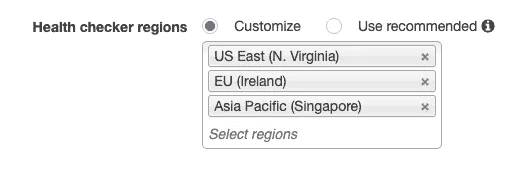

它没有。因此，如果区域延迟层是我的一些问题所在，也许我应该研究替代路由策略，如地理定位。

## 地理定位+嵌套故障转移

地理定位允许您将洲或国家流量指向给定的 DNS 别名。因为我已经被划分为 AMERS、EMEA 和 ASPAC，所以我将七大洲和默认的位置记录集划分为这些区域。

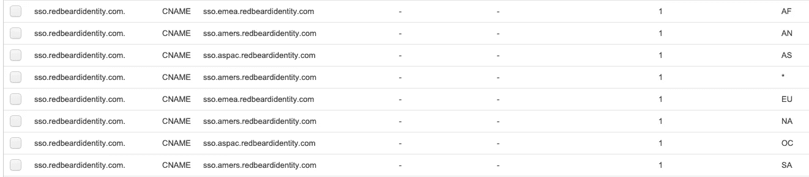

当一个区域丢失时，延迟+加权路由执行故障转移，我不确定地理定位路由是否会发生同样的情况。我为服务于每个地区的每个 NLB 附加了相应的健康检查，并进行了测试——它不会进行故障转移。看起来，为了使用地理定位，我们需要再次打开级联故障转移路由树，得到如下结果:

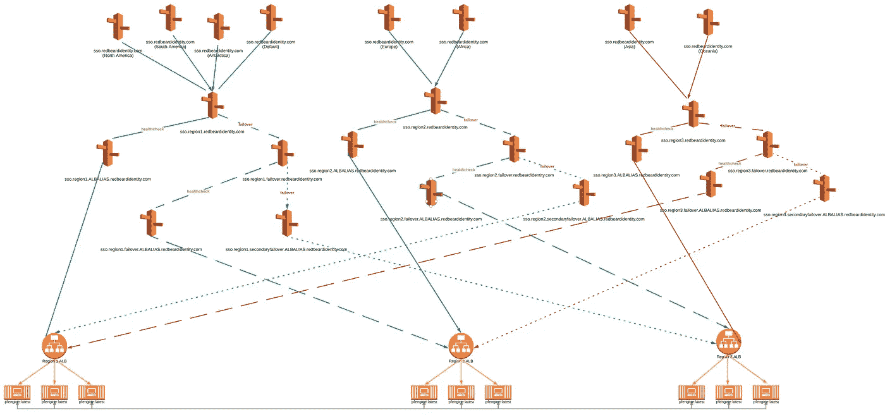

一个不平凡的 Route53 对象的计数之后，它被构建。

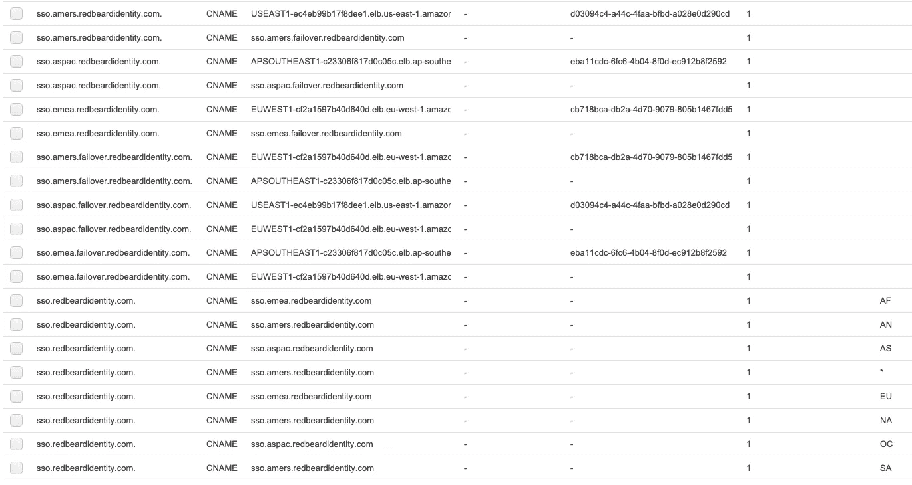

但是与更简单的安排相比，它有什么改进吗？使用网络负载平衡器，在这一点上，如果你重视性能，它已经证明自己是必不可少的，我得到了 17 秒的从美国到 EMEA 的故障转移和 23 秒的从 EMEA 到 ASPAC 的故障转移。

虽然这些不是我从一系列测试中获得的最好的数字(在 Route53 服务中似乎有一些可变性)，但它们代表了我从所有其他控制保持相同的测试中获得的最佳一致故障转移数字。因此，我不得不称这一个为赢家。

## 其他想法

在所有设计中，如果等待运行状况检查失败，每次都会引入至少 10 秒的延迟。我考虑过的另一个设计场景是使用网络负载平衡器指向分配给对等 VPC 中其他 NLB 的弹性 IP 地址。假设这是可能的，它将允许我们使用更严格的健康检查值来比 Route53 中可用的更快地添加或删除区域。我放弃了这个测试，因为以这种方式使用 NLB 不会让我们将流量限制在一个区域内，而这是我们的目标之一。将一个连接分布在不同的区域并不能从区域子集群中获得任何性能上的好处。因此，即使我让这种安排发挥作用，它也会使整个练习的要点短路。我花了有限的时间在控制台上尝试构建这样的东西，这让我觉得这不是一个选项，如果是，那么它不会只通过 EC2 和 Route53 中的功能来解决。

我认为这和我通过 Route53 得到的差不多，考虑到我们在区域故障转移期间观察到的 17–23 秒的短暂现象的场景是，如果给定区域中的所有节点都关闭了，我想我必须接受这已经“足够好了”这不是我所希望的令人满意的结论，但仍然是一次有趣的学习经历。