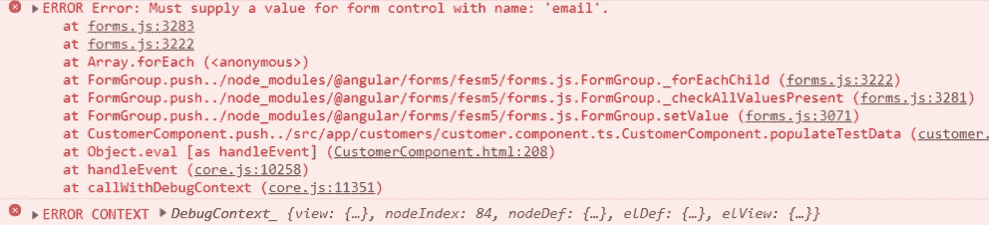

# 使用 setValue 和 patchValue

> 原文：<https://medium.datadriveninvestor.com/using-setvalue-and-patchvalue-4e332d4e0d96?source=collection_archive---------0----------------------->

在这篇博文中，我们将看到，在构建反应式表单时，如果我们需要从组件类中更新表单上的输入元素，我们将使用 **setValue** 和 **patchValue** 。

如果你是反应式表单的新手，我会推荐你阅读这篇文章:[反应式(模型驱动)表单](https://nishugoel.wordpress.com/2018/10/17/angular-model-driven-reactive-forms/)

我们使用 **setvalue** 来设置表单上每个控件的值。例如，在我们的表单模型中有三个表单控件。现在，因为我们想要更新其中每一个的值，我们使用 setValue。

然而，如果我们只想设置值的子集，那么我们使用 **patchValue** 。在本例中，我们只设置了三个值中的一个。

让我们现在就动手试试吧！

在组件模板中，让我们像这样用一个按钮来检查数据:

现在让我们在 component.ts 文件中使用这个方法。

现在，当我们在浏览器中选中此项时，它会将浏览器中的数据填充为:

> Value {"name": "Wilson "，" city": "Bangalore "，" email ":" wilsondcousta @ Gmail . com " }

在这种情况下，在 **checkData()** 方法中，我们不设置 name 和 email 的值，只为城市设置它，如下所示:

> this . my form . setvalue({
> city:' gur gaon '
> })

在这种情况下，控制台会抛出如下错误:

要解决这个，简单的解决方法！
我们使用 patchValue，因为我们只对表单元素的子集进行更改，而不是表单的所有元素。

我们将编写以下代码来代替上面的代码:

> this . my form . patch value({
> city:' gur gaon '
> })

然后，效果很好。