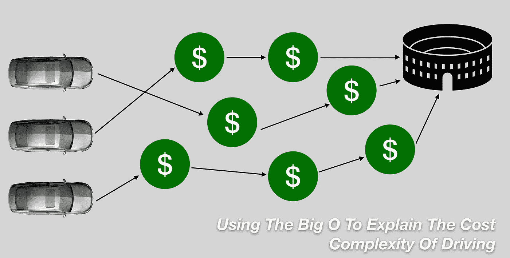
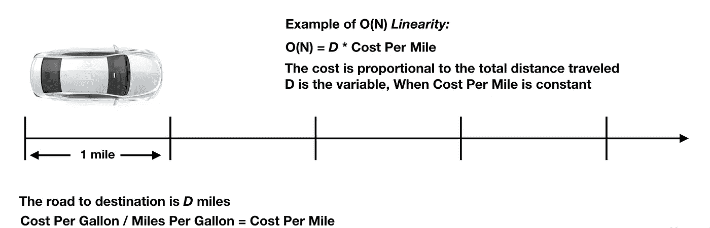
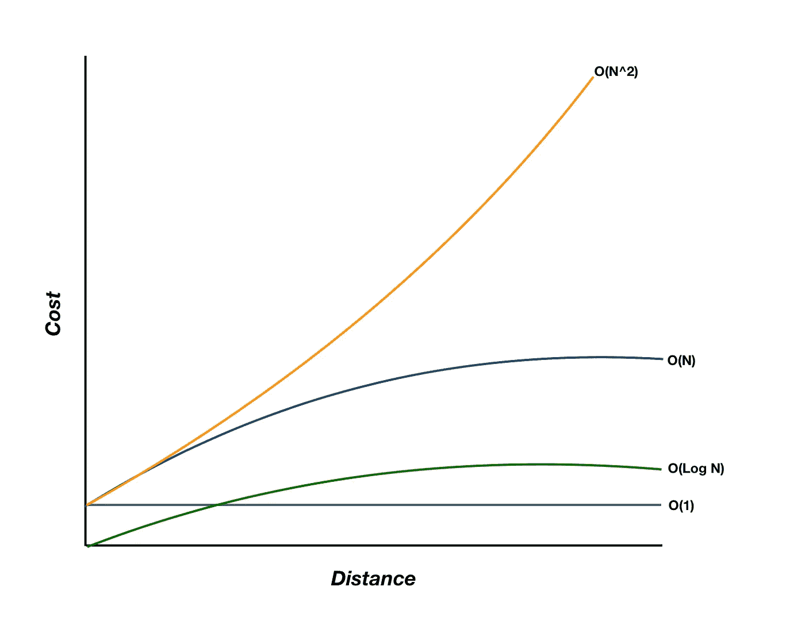

# 用大 O 来解释驾驶的成本复杂性

> 原文：<https://medium.datadriveninvestor.com/using-the-big-o-to-explain-the-cost-complexity-of-driving-f4269cf42e25?source=collection_archive---------21----------------------->

我们使用“大 O 符号”来确定基于运行时的算法或操作系统的效率。由此可见其复杂性和性能。当描述一个系统时，我们也可以用它来衡量成本的数量。基于我对大 O 的了解，我将解释与驾驶汽车相关的成本。在现实世界中，总是有与时间相关的成本。

An example of O(N) Linear Relationship

虽然大 O 被用来描述计算机系统，但我们将把同样的原理应用到汽车上。

> 确定成本复杂性的步骤:
> 
> 1.去掉不太重要的术语，找出增长最快的术语
> 
> 2.去掉常数，也称为系数

我将使用距离(D)作为输入，与我们的成本复杂性相关联，如图所示。

Cost and Distance with O notation graph

让我们来看看使用大 o 驾驶时的一些场景。

**O(1) *无论旅行多远，总有成本。*常数(“1 的阶”)**

无论数据大小或数组大小如何，O(1)都在相同的时间内执行。它只需要 1 次迭代就可以完成。1 可以是任何数字，它是一个常数。

T = N = c * 1 = O(1)

不管你旅行的距离 D 是多少，总会有一个与之相关的成本。让我们将这个场景用于汽车租赁。许多汽车租赁公司允许你每天以固定的价格租他们的车。不管你走了 10 英里还是 100 英里，甚至 1000 英里。假设租车费用仅为 60 美元/天，那么当天你可以行驶尽可能多的里程。固定费用不限里程。

**O(N) *成本取决于投入。**【N 阶】***

*O(N)是完成的时间是依赖于或正比于项目的数量。对于 N，元素的数量需要相同的迭代次数来完成。*

*T = aN + B = N = O(N)*

*假设我们从 A 镇旅行到 f 镇。*

*X = D * P/M*

*D =总和(A + …+ F)英里数 P =汽油价格 M =英里数*

*d 是 A 镇和 f 镇之间旅行总距离的总和，X 是旅行总成本，我们可以看到成本随着距离的增加而增加。你旅行越远，旅行费用越贵。这是因为 D 是一个变量，而 P/M 是一个常数或固定速率。汽油价格每天都在变化，每分钟，每小时等等。无论如何，这个例子显示了距离与成本的线性关系。如果你计划一次公路旅行或长途驾驶，费用与距离成正比。*

***(O N^x)和 O(N ) *最坏的情况。*指数和平方(“N 的平方阶”和“N 的 x 阶”)***

*时间是以 N 个元素的平方或指数来度量的。输入与时间的指数增长成正比。它本质上是二次的，意味着时间与元素的平方根成比例，或者当时间与元素的指数 x 成比例时是指数的。*

*T = n*(n+1)/2 = n + n/2 = O(N ) ->二次*

*这不是最有效的驾驶方式，因为你浪费了更多的汽油，从而增加了你的成本。我可以用两个例子来解释这一点。*

*首先是“错过退出”的情景。当你的目标设定后，你就有了相应的成本。如果你错过了正确的路线，它只会增加或增加一倍，三倍或四倍。假设你错过了高速公路的出口，到达目的地的距离增加了 n，那么你的汽油消耗量也增加了。这将需要更多的燃料成本，所以这更能说明驾驶效率有多低。*

*第二个场景是“迷路的司机”。无法找到正确的目的地，司机试图寻找使用暴力的方法。假设司机不记得他们在哪个商店有存货。司机决定走访所有 10 家可能有该商品的商店，期望找到它。但是，不能保证。在这个过程中，司机消耗更多的汽油，增加了沿途更多的燃料成本。*

*这两个例子成倍或指数地增加了时间复杂度。这不是驾驶的最佳情况。*

***O(Log N) *更高效的做事方式。*** **对数(“Log N 的阶”)***

*在对数时间范围内，输入数据集的大小加倍对其增长几乎没有影响。一次迭代只需要一半的输入数据，因此对于处理大型数据集更有效。*

*T = Log N = O(Log N)*

*如果到达目的地的距离可以减半或显著减少，这就是最高效或更高效的方式。在驾车前往目的地时，通过 GPS 使用捷径或优化路线可以更快地到达目的地。它还可以燃烧更少的气体，从而降低燃料成本和节省时间。*

*假设从 A 镇到 B 镇走最普通的路有 12 英里。问题是由于交通状况，到那里要花很长时间。您确实知道一条路线，按照 GPS 导航的建议，使用侧街到达 B 镇是一条更短的路线。有时，捷径实际上可能距离目的地更远。然而，它可能花费更少的时间到达那里，代价是更远的距离。这也不一定意味着更多的成本，因为你在车流中驾驶时会消耗更多的燃料。在其他情况下，虽然走高速公路可能需要更长的时间，但由于没有红绿灯，它燃烧燃料的效率更高，因此最终会节省更多的成本。这些是解决问题的方法。*

*对数基本上是指数的倒数。它使较大的值更加简化，从而更容易在计算中处理数据集。从复杂到简单，这使得 O(Log N)成为执行任务的理想方式。*

*这些解释可能会因其他观点而异。如果我错了，请纠正我，所以让我知道你对在驾驶中使用大 O 的看法。*