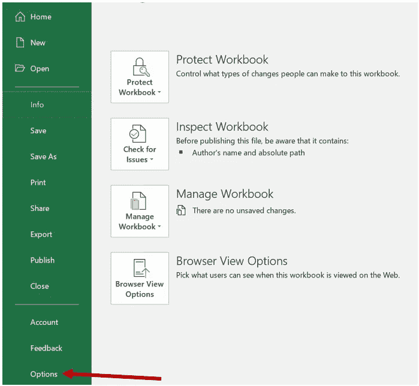
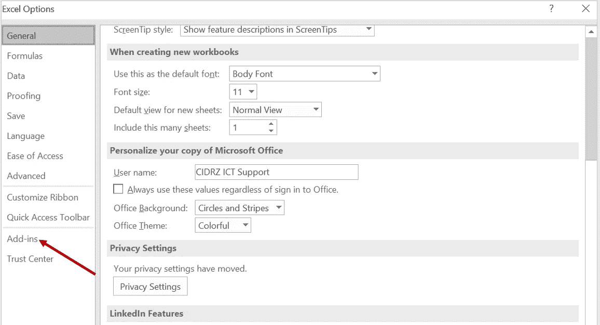
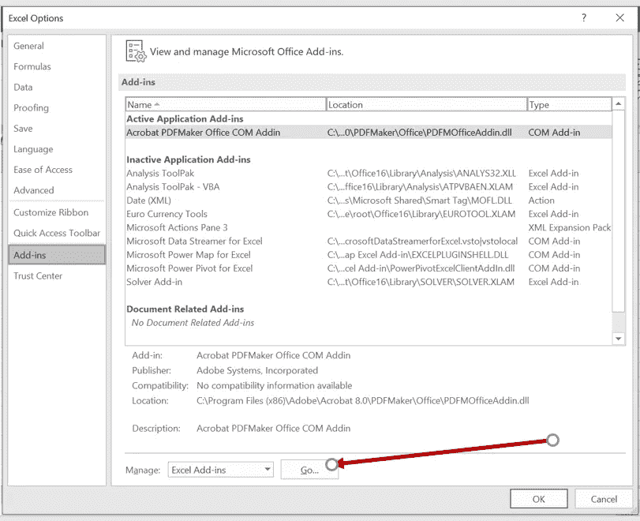
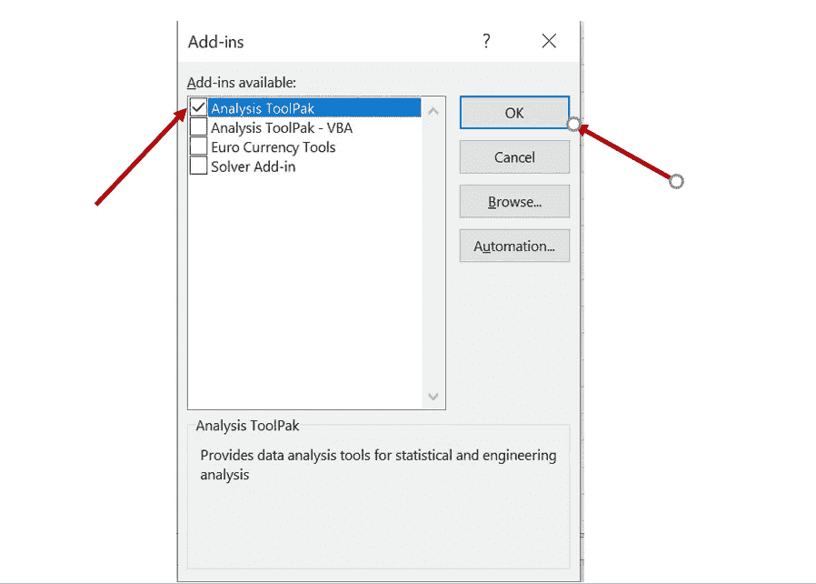
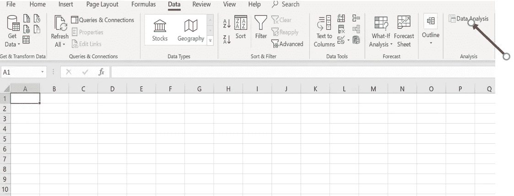

# 使用 Excel 中的数据分析按钮

> 原文：<https://medium.datadriveninvestor.com/using-the-data-analysis-button-in-excel-e50c7b4e4a9d?source=collection_archive---------1----------------------->

你经常用 Excel 分析数据吗？那么数据分析按钮将是一个非常有用的工具。

但是如何使用它呢？

如果**数据分析**命令在您的 Excel 版本中不可用，您需要加载分析工具库插件程序。这些说明适用于 Excel 2010、Excel 2013 和 Excel 2016。

 [## 数据科学和软件工程哪个更有前途？-数据驱动型投资者

### 大约一个月前，当我坐在咖啡馆里为一个客户开发网站时，我发现了这个女人…

www.datadriveninvestor.com](https://www.datadriveninvestor.com/2019/01/23/which-is-more-promising-data-science-or-software-engineering/) 

进入**文件**选项卡，点击**选项**

From File click on Options

然后点击**插件**类别。

Click on Add-ins

在**管理**框中，选择 **Excel 插件**，然后点击**转到**

Manage Excel Add-ins

在**可用附加模块**框中，选择**分析工具箱**复选框，然后点击**确定**

Analysis Tool Pack

你现在应该可以在数据选项卡下看到**数据分析**命令。

Data Analysis command

如何使用**数据分析**命令的示例